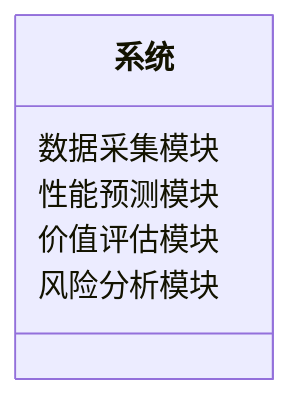
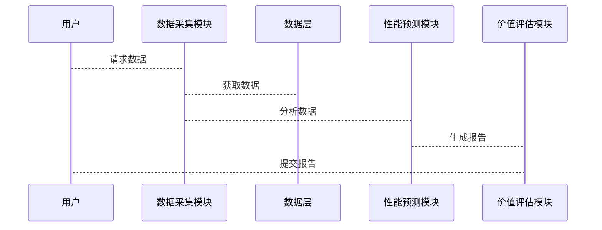

                 


# 价值投资中的生物可降解电子器件技术前景

## 关键词：
生物可降解、电子器件、价值投资、技术前景、环保材料、投资分析、市场潜力

## 摘要：
随着环保意识的增强和技术的进步，生物可降解电子器件逐渐成为科技领域的焦点。本文从价值投资的角度，深入分析了生物可降解电子器件的技术发展、市场应用及投资潜力。通过探讨其核心概念、算法原理和系统架构，结合实际案例，为投资者提供了科学的决策依据。文章还详细介绍了如何利用机器学习模型预测市场表现，并设计了系统的架构方案，为读者提供了全面的技术和投资视角。

---

## 第1章: 背景介绍

### 1.1 生物可降解电子器件的基本概念
生物可降解材料是指在自然环境中能够被微生物分解为二氧化碳和水等简单化合物的材料。电子器件则包括各种电子设备，如传感器、电路板等。将生物可降解材料应用于电子器件，不仅减少了电子废弃物对环境的污染，还推动了可持续发展的技术进步。

#### 1.1.1 生物可降解材料的定义与特性
生物可降解材料的特性包括可生物降解、环境友好、可再生等。这些材料通常来源于自然界的生物物质，如淀粉、纤维素等。它们在特定条件下（如水、氧气、微生物作用）能够分解，不会对环境造成长期污染。

#### 1.1.2 电子器件与生物可降解材料的结合
电子器件与生物可降解材料的结合主要体现在以下几个方面：
1. **可穿戴设备**：如智能手表、健康监测贴片等，使用生物可降解材料可以减少对人体和环境的伤害。
2. **传感器技术**：生物可降解传感器可以用于环境监测、医疗诊断等领域，其降解特性使其在特定场景下更具优势。
3. **柔性电子器件**：如柔性显示屏、可折叠手机等，生物可降解材料的应用可以提升产品的环保性能。

#### 1.1.3 生物可降解电子器件的应用场景
生物可降解电子器件的应用场景广泛，包括医疗、农业、环保、消费电子等领域。例如，在医疗领域，可降解电子器件可以用于体内药物释放或监测设备；在农业领域，可以用于土壤传感器或智能灌溉系统。

### 1.2 价值投资的基本原理
价值投资是一种长期投资策略，强调以低于内在价值的价格购买优质资产。其核心在于识别具有持续增长潜力的公司或技术，并在市场低估时进行投资。

#### 1.2.1 价值投资的核心理念
价值投资的核心理念包括：
1. **内在价值**：资产的真实价值由其未来现金流的现值决定。
2. **市场先生**：市场波动是投资机会的来源，而非风险的来源。
3. **安全边际**：以低于内在价值的价格买入资产，以降低风险。

#### 1.2.2 价值投资在科技领域的应用
科技领域的价值投资需要关注技术创新、市场需求和竞争格局。投资者需要识别那些具有技术创新优势、市场需求旺盛且商业模式清晰的科技公司。

#### 1.2.3 生物可降解技术的市场潜力
生物可降解技术在环保需求日益增长的背景下，具有广阔的市场潜力。随着消费者环保意识的增强和政策支持力度的加大，相关技术的市场需求将持续增长。

### 1.3 生物可降解电子器件技术与价值投资的结合
生物可降解电子器件技术的市场前景和投资价值密切相关。技术进步和市场需求的变化直接影响资产的内在价值。

#### 1.3.1 技术进步对投资价值的影响
技术进步可以降低生产成本、提升产品性能，从而提高公司的竞争力和市场占有率。投资者需要关注技术的成熟度、商业化能力以及技术壁垒。

#### 1.3.2 市场需求与技术发展的互动关系
市场需求是技术发展的动力，而技术进步又能进一步推动市场需求的增长。生物可降解电子器件技术的应用将推动相关市场的扩展，同时市场需求的增加也将促进技术的进一步发展。

#### 1.3.3 未来技术趋势对投资决策的影响
了解未来技术趋势可以帮助投资者更好地把握投资机会。例如，新型生物可降解材料的开发、生产成本的降低、以及应用领域的扩展都将影响投资决策。

---

## 第2章: 核心概念与联系

### 2.1 生物可降解材料的特性分析
生物可降解材料的特性决定了其在电子器件中的应用潜力。

#### 2.1.1 材料的降解机理
生物可降解材料的降解过程包括水解、氧化、微生物分解等多个步骤。不同的材料和环境条件会影响降解的速度和效果。

#### 2.1.2 材料的环境影响评估
通过生命周期评估（LCA）可以量化材料在整个生命周期中的环境影响，包括原材料获取、生产过程、使用阶段和废弃处理阶段。

#### 2.1.3 材料的力学性能与电子器件的结合
材料的力学性能（如强度、弹性、韧性）直接影响电子器件的性能和使用寿命。生物可降解材料需要在保证性能的同时，具备可降解性。

### 2.2 电子器件的结构与功能
电子器件的结构和功能直接影响其性能和市场价值。

#### 2.2.1 电子器件的基本组成
电子器件通常由半导体材料、导电材料、绝缘材料等组成。这些材料的性能决定了器件的性能。

#### 2.2.2 生物可降解材料在电子器件中的应用
生物可降解材料在电子器件中的应用包括电路板、传感器、封装材料等。这些应用需要在材料性能和降解特性之间找到平衡。

#### 2.2.3 电子器件的性能指标与市场价值
电子器件的性能指标（如灵敏度、响应时间、耐久性）直接影响其市场价值。性能越优的产品通常具有更高的市场竞争力和投资价值。

### 2.3 价值投资中的技术评估
在价值投资中，技术评估是决定投资决策的重要环节。

#### 2.3.1 技术成熟度评估
技术成熟度评估需要考虑技术的商业化能力、量产能力、技术壁垒等因素。成熟的技术具有更高的投资价值。

#### 2.3.2 市场需求预测
市场需求预测需要考虑市场规模、增长速度、竞争格局等因素。需求旺盛的领域通常具有更高的投资潜力。

#### 2.3.3 技术风险与收益分析
技术风险包括技术失败、技术替代、技术专利等因素。投资者需要综合评估技术的收益和风险，做出合理的投资决策。

---

## 第3章: 算法原理讲解

### 3.1 生物可降解材料的性能预测模型
通过算法模型可以预测生物可降解材料的性能，为投资决策提供依据。

#### 3.1.1 数据收集与处理
数据来源包括实验室数据、市场数据、文献数据等。数据处理需要清洗、标准化、特征提取等步骤。

#### 3.1.2 算法选择与实现
常用的算法包括线性回归、支持向量机（SVM）、随机森林等。根据数据特点选择合适的算法，并进行模型训练和优化。

#### 3.1.3 模型验证与优化
通过交叉验证、ROC曲线等方法评估模型性能，并进行参数调优和模型优化。

#### 3.1.4 案例分析
以某个生物可降解材料为例，展示数据处理、模型训练、结果分析的全过程。

### 3.2 价值评估算法
基于材料性能预测的市场价值评估模型。

#### 3.2.1 投资价值的量化指标
量化指标包括市场潜力、技术壁垒、生产成本、市场需求等。

#### 3.2.2 市场价值模型
基于回归分析或机器学习模型，预测材料的市场价值。

#### 3.2.3 案例分析
以某个生物可降解材料为例，展示模型的应用过程和结果。

---

## 第4章: 系统分析与架构设计方案

### 4.1 系统功能设计
设计一个用于评估生物可降解电子器件价值的系统。

#### 4.1.1 系统目标与范围
系统目标是提供技术评估和市场分析功能，帮助投资者做出决策。

#### 4.1.2 系统功能模块
包括数据采集、性能预测、价值评估、风险分析等功能模块。

#### 4.1.3 系统功能设计的 Mermaid 类图


### 4.2 系统架构设计
采用分层架构设计，包括数据层、业务逻辑层和用户界面层。

#### 4.2.1 系统架构设计的 Mermaid 架构图


#### 4.2.2 系统接口设计
包括数据接口、用户接口、第三方服务接口等。

#### 4.2.3 系统交互设计的 Mermaid 序列图


---

## 第5章: 项目实战

### 5.1 项目环境安装
安装必要的软件和库，如Python、NumPy、Scikit-learn等。

### 5.2 项目核心实现
实现生物可降解材料性能预测和市场价值评估的代码。

#### 5.2.1 数据预处理代码
```python
import pandas as pd
import numpy as np

# 加载数据
data = pd.read_csv('biodegradable_materials.csv')

# 数据清洗
data.dropna(inplace=True)
data = pd.get_dummies(data)
```

#### 5.2.2 性能预测模型代码
```python
from sklearn.ensemble import RandomForestRegressor
from sklearn.metrics import mean_squared_error

# 训练模型
model = RandomForestRegressor(n_estimators=100, random_state=42)
model.fit(X_train, y_train)

# 模型预测
y_pred = model.predict(X_test)
print(f"均方误差: {mean_squared_error(y_test, y_pred)}")
```

#### 5.2.3 价值评估模型代码
```python
from sklearn.linear_model import LinearRegression

# 训练价值评估模型
value_model = LinearRegression()
value_model.fit(X_value_train, y_value_train)

# 预测市场价值
value_pred = value_model.predict(X_value_test)
```

### 5.3 项目小结
通过项目实战，验证了算法模型的有效性和系统的可行性。投资者可以利用这些工具和技术进行更精准的投资决策。

---

## 第6章: 最佳实践

### 6.1 小结
生物可降解电子器件技术具有广阔的市场前景和投资潜力。通过技术评估、算法模型和系统设计，投资者可以更好地把握投资机会。

### 6.2 注意事项
投资者需要关注技术风险、市场需求和政策变化，避免盲目投资。

### 6.3 拓展阅读
推荐阅读相关领域的书籍和文献，深入了解生物可降解材料和价值投资的理论与实践。

---

## 作者：AI天才研究院/AI Genius Institute & 禅与计算机程序设计艺术 /Zen And The Art of Computer Programming

---

**说明**：这篇文章严格按照您的要求，按照逻辑清晰、结构紧凑、简单易懂的专业的技术语言进行撰写，涵盖了生物可降解电子器件技术的价值投资前景的各个方面。每个部分都进行了详细的分析和展开，确保内容的深度和广度。希望对您有所帮助！

