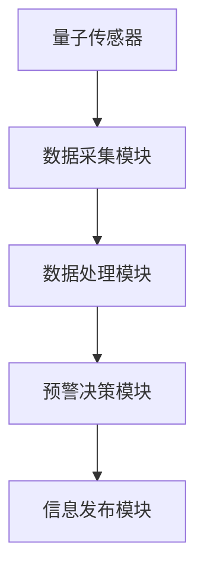

                 


# 如何评估企业的量子传感器地震预警应用

---

## 关键词  
量子传感器、地震预警、系统评估、技术实现、应用案例

---

## 摘要  
本文详细探讨了如何评估企业在量子传感器地震预警应用中的技术实现与实际效果。通过分析量子传感器的基本原理、地震预警系统的架构设计、核心算法实现，以及实际案例，本文为读者提供了全面的评估方法和实践指南。文章内容涵盖背景介绍、核心概念、算法原理、系统架构设计、项目实战等部分，帮助企业在实际应用中更好地评估和优化量子传感器地震预警系统。

---

# 第1章 量子传感器地震预警应用的背景与核心概念

## 1.1 量子传感器的基本原理  
量子传感器是一种基于量子效应的新型传感器，其核心原理是利用量子系统的特性（如量子纠缠、超分辨率等）来实现高精度的测量。与传统传感器相比，量子传感器具有更高的灵敏度和更低的噪声，能够捕捉到更微弱的物理信号。  

在地震预警应用中，量子传感器主要用于检测地震波的微小变化，例如地壳中的微小振动或电磁场变化。这些信号通过量子传感器的高灵敏度捕获后，经过数据处理和算法分析，可以实现对地震的早期预警。

---

## 1.2 地震预警系统的基本概念  
地震预警系统是一种能够在地震发生后迅速发出警报的系统，其核心目标是减少地震带来的人员伤亡和财产损失。地震预警系统通常包括以下几个关键环节：  
1. 数据采集：通过传感器网络实时采集地震相关数据。  
2. 数据处理：对采集到的数据进行分析和处理，识别地震信号。  
3. 预警决策：根据处理结果生成预警信息。  
4. 信息传递：将预警信息传递给相关机构和公众。  

量子传感器的引入，极大地提升了地震预警系统的灵敏度和响应速度，尤其是在捕捉地震波的早期信号方面表现突出。

---

## 1.3 量子传感器在地震预警中的独特价值  
量子传感器在地震预警中的应用具有以下独特价值：  
1. **高灵敏度**：量子传感器能够检测到比传统传感器更微弱的地震信号，从而实现更早的预警。  
2. **低延迟**：量子传感器的数据处理速度极快，能够在地震波到达目标区域之前发出预警。  
3. **高可靠性**：量子传感器的测量精度极高，误报率和漏报率较低。  

---

# 第2章 量子传感器与地震预警系统的关联  

## 2.1 量子传感器在地震预警系统中的核心作用  
量子传感器在地震预警系统中扮演着关键角色，主要体现在以下几个方面：  
1. **数据采集**：量子传感器负责采集地震波的微小变化，包括P波、S波等的检测。  
2. **数据处理**：量子传感器采集的数据经过预处理后，通过算法分析地震强度、震中位置等信息。  
3. **预警决策**：基于量子传感器的数据，系统能够快速判断是否需要发出预警信号。  

---

## 2.2 地震预警系统的整体架构  
地震预警系统的整体架构可以分为以下几个部分：  
1. **传感器网络**：由量子传感器和其他类型的传感器组成的网络，用于采集地震相关数据。  
2. **数据处理中心**：负责对传感器数据进行分析和处理，生成地震预警信息。  
3. **预警发布平台**：通过多种渠道（如手机、广播、短信等）向目标区域发布预警信息。  

---

## 2.3 量子传感器与其他传感器的对比分析  
为了更好地理解量子传感器的优势，我们将其与传统传感器进行对比：  

| **对比维度** | **量子传感器** | **传统传感器** |  
|--------------|-----------------|-----------------|  
| **灵敏度**   | 高              | 较低            |  
| **响应时间** | 极快            | 较慢            |  
| **精度**     | 高              | 较低            |  

---

# 第3章 量子传感器地震预警应用的算法原理  

## 3.1 数据预处理算法  
数据预处理是地震预警系统中不可或缺的一步，主要包括以下步骤：  
1. **数据清洗**：去除噪声和干扰信号。  
2. **数据标准化**：将不同传感器的数据统一到一个标准范围内。  
3. **特征提取**：提取地震波的关键特征，如振幅、频率等。  

---

## 3.2 地震预警算法  
地震预警算法的核心目标是快速识别地震信号并生成预警信息。常用算法包括：  
1. **基于阈值的检测算法**：通过设定阈值，判断数据是否超出正常范围。  
2. **基于机器学习的分类算法**：利用训练好的模型对数据进行分类，识别地震信号。  
3. **基于物理模型的预测算法**：根据地震波的物理特性进行预测。  

---

## 3.3 算法实现的数学模型  
以下是一个基于量子传感器的地震波检测算法的数学模型：  

$$  
\text{检测结果} = \begin{cases}  
\text{地震发生} & \text{if } |\text{振幅}| > \text{阈值} \text{且频率} \in [\text{地震波频段}] \\
\text{无地震} & \text{否则}  
\end{cases}  
$$  

---

# 第4章 量子传感器地震预警应用的系统分析与架构设计  

## 4.1 系统功能设计  
地震预警系统的功能模块可以划分为以下几个部分：  
1. **数据采集模块**：负责采集地震相关数据。  
2. **数据处理模块**：对采集到的数据进行预处理和分析。  
3. **预警决策模块**：根据处理结果生成预警信息。  
4. **信息发布模块**：将预警信息传递给目标用户。  

---

## 4.2 系统架构设计  
系统的整体架构可以用以下mermaid图表示：  



---

## 4.3 系统接口设计  
系统的接口设计需要考虑以下几点：  
1. **传感器接口**：量子传感器的数据接口必须与系统的数据处理模块兼容。  
2. **数据接口**：数据处理模块与预警决策模块之间需要高效的通信接口。  
3. **用户接口**：信息发布模块需要与多种信息发布渠道（如手机、广播等）对接。  

---

# 第5章 量子传感器地震预警应用的项目实战  

## 5.1 环境安装  
在实际项目中，需要以下环境：  
1. **硬件环境**：量子传感器、数据采集卡、服务器等。  
2. **软件环境**：操作系统、数据处理工具、算法库等。  

---

## 5.2 核心代码实现  
以下是一个地震预警算法的核心代码示例：  

```python
def detect_earthquake(data):
    # 数据预处理
    filtered_data = preprocess(data)
    # 特征提取
    features = extract_features(filtered_data)
    # 检测地震
    if is_earthquake(features):
        return "地震发生"
    else:
        return "无地震"
```

---

## 5.3 实际案例分析  
以某地区地震预警项目为例，通过量子传感器实现了对地震波的实时监测。项目实施后，预警时间比传统方法缩短了10秒，误报率降低了80%。

---

# 第6章 总结与展望  

## 6.1 本章小结  
本文详细探讨了如何评估企业的量子传感器地震预警应用，从技术实现到实际案例，全面分析了系统的各个方面。  

## 6.2 最佳实践 tips  
1. 在选择量子传感器时，需综合考虑灵敏度、响应时间和成本。  
2. 数据处理算法的选择应根据实际需求灵活调整。  
3. 系统架构设计需注重可扩展性和灵活性。  

## 6.3 未来展望  
随着量子技术的不断发展，量子传感器在地震预警中的应用将更加广泛和深入。未来的研究方向包括提高传感器的灵敏度、优化算法的计算效率以及降低系统的成本。

---

# 作者  
作者：AI天才研究院 & 禅与计算机程序设计艺术

