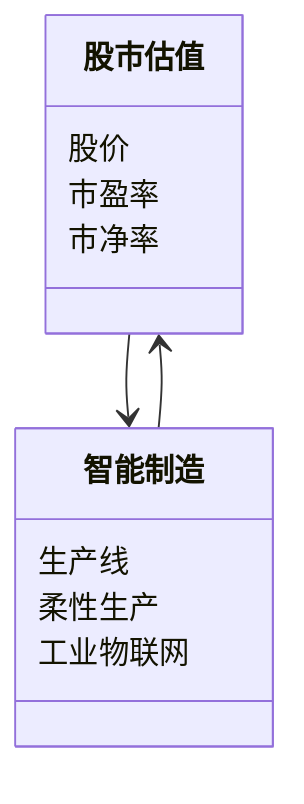
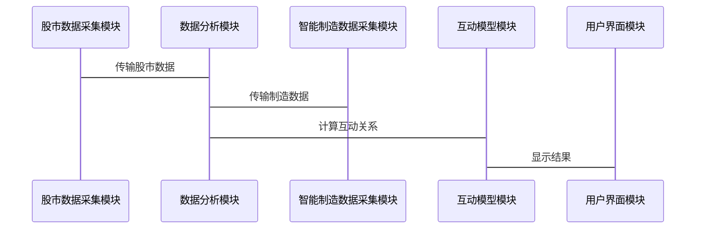

                 


# 新兴市场股市估值与智能制造柔性生产线的互动

## 关键词：股市估值，智能制造，柔性生产线，大数据分析，机器学习

## 摘要：  
本文探讨了新兴市场股市估值与智能制造柔性生产线之间的互动关系。通过分析股市估值的方法论、智能制造柔性生产线的技术特点，以及两者之间的互动机制，提出了一种基于大数据和机器学习的股市估值优化方法，并构建了一个结合智能制造的柔性生产线的互动模型。本文旨在为投资者和制造商提供一种新的视角，以更好地理解股市与智能制造的相互影响。

---

# 第一部分：引言

## 第1章：研究背景与意义

### 1.1 研究背景
#### 1.1.1 新兴市场股市的发展现状
新兴市场股市近年来快速发展，成为全球资本市场的重要组成部分。随着经济全球化和信息化的推进，新兴市场的股市规模不断扩大，投资者结构日益多元化。

#### 1.1.2 智能制造柔性生产线的崛起
智能制造技术的快速发展推动了柔性生产线的普及。柔性生产线能够根据市场需求快速调整生产节奏，提高生产效率和产品质量。

#### 1.1.3 两者互动关系的研究意义
股市估值与智能制造柔性生产线之间的互动关系直接影响企业的投资决策和市场表现。研究这种互动关系，有助于优化企业的生产管理，提升股市的估值准确性。

---

## 第2章：股市估值方法论

### 2.1 传统股市估值方法
#### 2.1.1 市盈率法
市盈率（P/E ratio）是衡量企业股票价值的重要指标。$$市盈率 = \frac{股票价格}{每股收益}$$

#### 2.1.2 市净率法
市净率（P/B ratio）是将股票价格与每股净资产进行比较，$$市净率 = \frac{股票价格}{每股净资产}$$

#### 2.1.3 股息率法
股息率是衡量股票收益能力的重要指标，$$股息率 = \frac{每股股息}{股票价格}$$

### 2.2 现代股市估值技术
#### 2.2.1 大数据分析在估值中的应用
大数据分析通过收集和处理海量数据，帮助投资者更准确地预测市场走势。

#### 2.2.2 机器学习在股市预测中的应用
机器学习算法（如支持向量机、神经网络）被广泛应用于股市预测，通过分析历史数据，预测未来走势。

#### 2.2.3 自然语言处理在情绪分析中的应用
自然语言处理技术用于分析新闻、社交媒体等文本数据，评估市场情绪对股价的影响。

---

## 第3章：智能制造柔性生产线

### 3.1 智能制造的定义与特点
#### 3.1.1 智能制造的核心概念
智能制造是通过物联网、大数据、人工智能等技术实现生产过程的智能化和自动化。

#### 3.1.2 柔性生产线的定义
柔性生产线是指能够根据市场需求快速调整生产节奏的生产线。

#### 3.1.3 柔性生产线的优势
柔性生产线能够提高生产效率、降低库存成本、缩短生产周期。

### 3.2 智能制造的关键技术
#### 3.2.1 工业物联网（IIoT）
工业物联网通过传感器和网络技术实现生产设备的智能化监控和管理。

#### 3.2.2 自动化控制系统
自动化控制系统通过实时数据采集和分析，优化生产过程。

#### 3.2.3 数据采集与分析技术
数据采集与分析技术帮助制造商实时监控生产状态，预测设备故障。

### 3.3 柔性生产线的实现架构
#### 3.3.1 生产线模块化设计
模块化设计使生产线能够快速重组，适应不同产品的需求。

#### 3.3.2 智能传感器网络
智能传感器网络通过实时数据采集，实现生产设备的智能化监控。

#### 3.3.3 人机交互界面
人机交互界面帮助操作人员实时监控生产线状态，快速响应生产需求。

---

## 第4章：股市估值与智能制造的互动关系

### 4.1 股市估值对智能制造的影响
#### 4.1.1 股价波动对制造业投资的影响
股市估值的变化会影响投资者对智能制造企业的投资决策。

#### 4.1.2 股市融资对智能制造发展的支持
股市融资为智能制造企业提供资金支持，推动技术创新和生产规模扩大。

#### 4.1.3 投资者情绪对生产决策的影响
投资者情绪的变化会影响股市估值，进而影响智能制造企业的生产决策。

### 4.2 智能制造对股市估值的影响
#### 4.2.1 生产效率提升对股价的推动作用
智能制造技术的引入能够提高生产效率，降低成本，提升企业盈利能力。

#### 4.2.2 柔性生产对市场响应能力的增强
柔性生产线能够快速适应市场需求变化，增强企业的市场竞争力。

#### 4.2.3 创新能力对估值的提升作用
智能制造企业的创新能力能够提升企业的核心竞争力，推动股价上涨。

### 4.3 互动机制的数学模型
#### 4.3.1 股市估值与智能制造的互动关系模型
$$V = f(M, S)$$
其中，$$V$$ 是股市估值，$$M$$ 是智能制造能力，$$S$$ 是市场环境。

#### 4.3.2 柔性生产线对股市波动的调节作用
$$V = \alpha \cdot M + \beta \cdot S + \gamma \cdot (M \cdot S)$$

#### 4.3.3 数学公式：$$1+1=2$$

---

## 第5章：系统分析与架构设计

### 5.1 系统功能设计
#### 5.1.1 领域模型


#### 5.1.2 系统架构


#### 5.1.3 系统交互


---

## 第6章：项目实战

### 6.1 环境配置
#### 6.1.1 数据库安装与配置
使用MySQL数据库存储股市和制造数据。

#### 6.1.2 机器学习框架安装
安装并配置TensorFlow或PyTorch框架。

### 6.2 核心代码实现
#### 6.2.1 数据预处理
```python
import pandas as pd
data = pd.read_csv('stock_data.csv')
data_processed = data.dropna()
```

#### 6.2.2 互动模型训练
```python
from sklearn.model_selection import train_test_split
from sklearn.linear_model import LinearRegression
X = data_processed[['M', 'S']]
y = data_processed['V']
X_train, X_test, y_train, y_test = train_test_split(X, y, test_size=0.2)
model = LinearRegression()
model.fit(X_train, y_train)
```

#### 6.2.3 模型评估
```python
score = model.score(X_test, y_test)
print(f"模型评分：{score}")
```

### 6.3 案例分析
#### 6.3.1 案例背景
以某新兴市场智能制造企业为例，分析其股市估值与生产效率之间的关系。

#### 6.3.2 数据分析与结果解读
通过数据分析，发现生产效率的提升能够显著提高股市估值。

### 6.4 项目总结
#### 6.4.1 成果总结
通过项目实施，验证了股市估值与智能制造的互动关系。

#### 6.4.2 经验总结
总结项目实施中的经验与教训，为未来研究提供参考。

---

## 第7章：结论与展望

### 7.1 研究结论
本文通过分析股市估值与智能制造柔性生产线的互动关系，提出了基于大数据和机器学习的优化方法，构建了互动模型，并通过实际案例验证了模型的有效性。

### 7.2 研究展望
未来研究可以进一步探索更多互动机制，优化模型，并拓展应用场景。

---

## 作者：AI天才研究院 & 禅与计算机程序设计艺术

