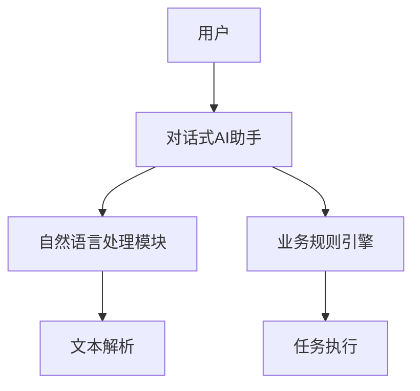
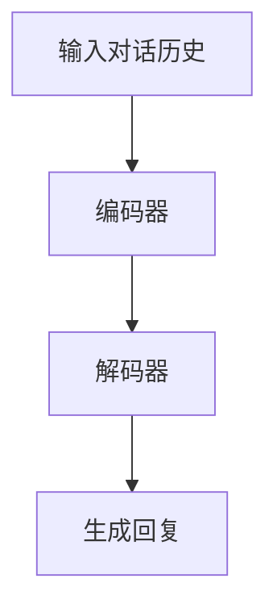
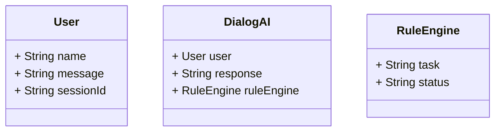
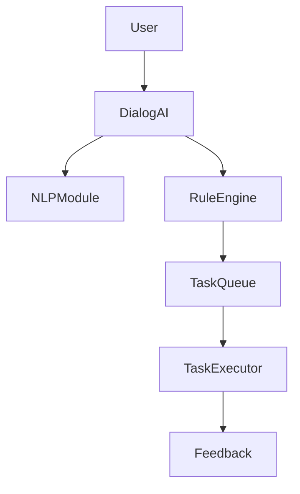
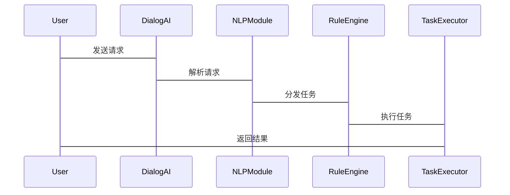

                 


# 构建企业级对话式AI助手：跨系统业务流程自动化与协调

> 关键词：企业级对话式AI，业务流程自动化，跨系统协调，自然语言处理，系统架构设计

> 摘要：本文详细探讨了构建企业级对话式AI助手的关键技术与实现方法，重点分析了跨系统业务流程自动化与协调的核心概念、算法原理、系统架构设计以及实际项目实现。通过案例分析和代码实现，深入讲解了如何利用自然语言处理技术与业务规则引擎，实现高效、智能的跨系统协作，为企业数字化转型提供有力支持。

---

## 第1章 对话式AI助手的背景与现状

### 1.1 对话式AI助手的背景

#### 1.1.1 从传统客服到智能对话的演进
传统的客服系统依赖人工操作，效率低且成本高。随着自然语言处理（NLP）和机器学习技术的发展，对话式AI助手逐渐成为企业提升客户体验和效率的重要工具。

#### 1.1.2 企业级对话式AI的需求与趋势
企业级对话式AI助手的需求主要源于对高效业务流程处理、24/7客户支持和个性化服务的追求。其发展趋势包括多轮对话能力、跨系统协作和高可用性。

#### 1.1.3 对话式AI在行业中的应用现状
目前，对话式AI已在金融、医疗、教育等多个行业得到广泛应用，但其在跨系统协作和复杂业务流程处理方面仍需进一步优化。

### 1.2 问题背景与问题描述

#### 1.2.1 传统业务流程中的痛点
传统业务流程存在效率低下、人工干预过多、客户体验差等问题，亟需通过智能化手段进行优化。

#### 1.2.2 对话式AI在业务流程自动化中的作用
对话式AI助手可以通过自然语言理解、意图识别和业务规则引擎，实现业务流程的自动化处理，提升效率和客户满意度。

#### 1.2.3 问题解决的边界与外延
对话式AI助手的边界在于其处理能力的限制，而外延则包括与企业现有系统的集成和数据安全问题。

### 1.3 核心概念与问题分析

#### 1.3.1 对话式AI的核心要素
对话式AI的核心要素包括自然语言理解（NLU）、对话管理（DM）、自然语言生成（NLG）和业务规则引擎。

#### 1.3.2 业务流程自动化的关键环节
业务流程自动化的关键环节包括需求识别、任务分配、执行反馈和结果优化。

#### 1.3.3 对话式AI与跨系统协调的关联性
对话式AI通过与企业系统（如CRM、ERP）的集成，实现跨系统协调，确保业务流程的高效执行。

---

## 第2章 对话式AI的核心概念与联系

### 2.1 核心概念原理

#### 2.1.1 对话式AI的输入输出模型
对话式AI的输入输出模型基于自然语言处理技术，通过意图识别和实体提取，实现与用户的有效交互。

#### 2.1.2 自然语言处理（NLP）在对话中的作用
NLP技术用于对话式AI的文本解析、意图识别和实体提取，是实现智能化对话的核心。

#### 2.1.3 业务规则引擎的实现机制
业务规则引擎通过预定义的规则，对对话内容进行解析，并生成相应的业务操作指令。

### 2.2 核心概念对比分析

#### 2.2.1 对话式AI与传统客服系统的对比
对话式AI相比传统客服系统，具有24/7可用性、高效性和个性化服务等优势。

#### 2.2.2 不同NLP模型的性能对比
不同的NLP模型（如RNN、Transformer）在对话生成中的表现各有优劣，需根据具体场景选择合适的模型。

#### 2.2.3 业务规则引擎与对话流程的关联性
业务规则引擎通过与对话流程的结合，实现复杂业务逻辑的自动化处理。

### 2.3 实体关系图（ER图）架构



---

## 第3章 对话式AI的算法原理与实现

### 3.1 算法原理概述

#### 3.1.1 基于Seq2Seq模型的对话生成
Seq2Seq模型通过编码器和解码器的结构，实现对话的生成与理解。

#### 3.1.2 基于Transformer的注意力机制
Transformer模型通过自注意力机制，提升对话生成的准确性和流畅性。

#### 3.1.3 模型训练与优化策略
模型训练采用大规模数据集，并通过正则化、学习率调整等方法进行优化。

### 3.2 算法流程图



### 3.3 核心算法实现

```python
def seq2seq_model(input_seq, output_seq):
    # 编码器部分
    encoder_input = input_seq
    encoder_output = encode(encoder_input)
    
    # 解码器部分
    decoder_input = output_seq
    decoder_output = decode(decoder_input, encoder_output)
    
    return decoder_output
```

---

## 第4章 对话式AI助手的系统架构设计

### 4.1 系统功能设计

#### 4.1.1 领域模型设计


#### 4.1.2 系统架构设计


### 4.2 系统交互设计



---

## 第5章 对话式AI助手的项目实战

### 5.1 环境安装与配置

```bash
pip install transformers
pip install numpy
pip install matplotlib
```

### 5.2 核心代码实现

```python
from transformers import pipeline

# 初始化模型
dialog_model = pipeline("text-generation", model="gpt2")

def process_request(user_input):
    response = dialog_model(user_input)[0]['generated_text']
    return response
```

### 5.3 案例分析与实现解读
通过客服系统案例，详细讲解对话式AI助手在实际业务中的应用，包括需求分析、系统设计和代码实现。

---

## 第6章 总结与展望

### 6.1 本章总结
对话式AI助手的构建涉及多个技术领域，通过自然语言处理、业务规则引擎和系统架构设计的结合，实现高效的跨系统协作。

### 6.2 未来展望
未来，对话式AI助手将更加智能化和个性化，支持更复杂的业务流程和多语言对话。

---

## 作者：AI天才研究院/AI Genius Institute & 禅与计算机程序设计艺术 /Zen And The Art of Computer Programming

