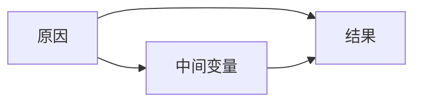
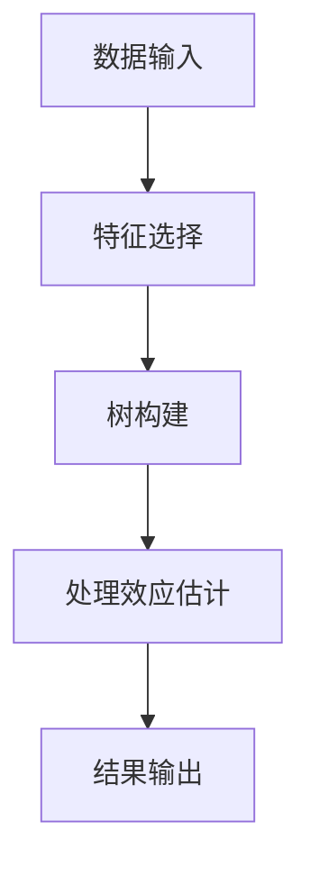
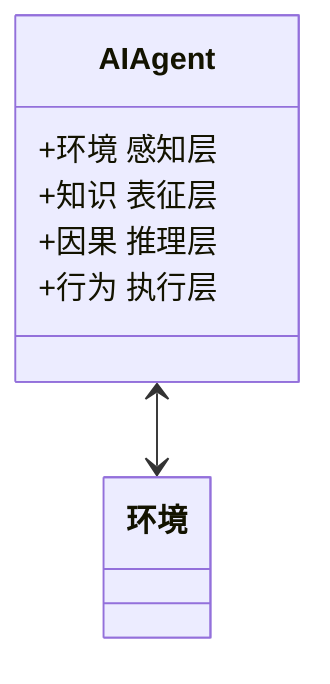
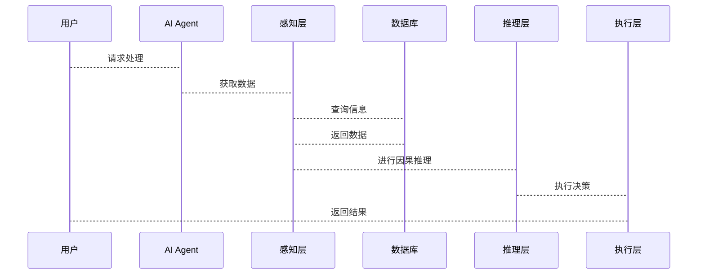

                 


# 《构建具有因果推理能力的AI Agent》

## 关键词：因果推理、AI Agent、因果图、潜在结果、因果森林、系统架构、项目实战

## 摘要：本文详细探讨了构建具有因果推理能力的AI Agent的理论基础、算法实现、系统架构和实际应用。通过分析因果推理的核心概念，结合具体算法和项目案例，为读者提供全面的技术指导。

---

## 第1章: 背景与基础概念

### 1.1 因果推理的定义与背景

因果推理是理解事件间因果关系的能力，是构建智能系统的重要基础。本文将介绍因果推理的基本概念，分析其在AI Agent中的重要性，并对比相关概念，帮助读者建立基础认知。

#### 1.1.1 因果关系的基本概念

因果关系是指两个事件之间存在“原因导致结果”的联系。例如，下雨导致地面湿滑。

#### 1.1.2 因果推理在AI中的重要性

在AI Agent中，因果推理使其能够理解行动的结果，并做出合理决策。

#### 1.1.3 AI Agent的基本概念与分类

AI Agent是能够感知环境并采取行动的智能实体，分为反应式和基于模型的两类。

### 1.2 因果推理与相关概念的对比

#### 1.2.1 相关概念对比（表格形式）

| 概念       | 定义                                                                 |
|------------|----------------------------------------------------------------------|
| 相关关系   | 数据间的统计关联，不一定是因果关系                                     |
| 因果关系   | 事件间的原因与结果的关系                                             |
| 预测模型   | 基于数据预测结果，不解释因果关系                                       |

#### 1.2.2 ER实体关系图架构（Mermaid）

```mermaid
erDiagram
    customer[客户] {
        string name
        int id
    }
    action[行动] {
        string type
        int id
    }
   因果关系{
        <关联>
    }
    customer --> action: 导致
```

---

## 第2章: 因果推理的核心概念

### 2.1 因果关系的数学模型

因果关系可以用图论中的因果图表示，处理效应是衡量干预效果的关键指标。

#### 2.1.1 因果图的定义与表示（Mermaid）



#### 2.1.2 处理效应的定义与计算公式（数学公式）

处理效应衡量了干预变量对结果的影响：

$$ \text{处理效应} = E(Y | do(X = x_1)) - E(Y | do(X = x_0)) $$

### 2.2 因果推理的基本原理

因果传递机制解释了因果关系如何从原因传递到结果，而干扰与稳定性则影响因果推断的可靠性。

#### 2.2.1 因果传递机制

因果关系在不同环境下的传递方式，决定了干预的效果。

#### 2.2.2 干扰与稳定性

干扰因素可能影响因果关系的稳定性，需在模型中进行控制。

---

## 第3章: 常见因果推理算法

### 3.1 因果森林算法

因果森林是一种非参数方法，用于估计处理效应。

#### 3.1.1 算法原理（Mermaid）



#### 3.1.2 Python实现示例

```python
import causal森林
model = causal森林.CausalForest()
model.fit(X, y)
效应 = model.estimate_effect(X_test)
```

### 3.2 潜在结果推断

潜在结果推断通过估计反事实情况，评估因果关系。

#### 3.2.1 理论基础

潜在结果 $Y_i(X)$ 是个体在处理 $X$ 下的结果。

#### 3.2.2 算法实现（代码示例）

```python
def潜在结果推断(X, y):
    # 实现潜在结果推断算法
    pass

潜在结果推断(X, y)
```

---

## 第4章: 数学模型与公式

### 4.1 因果关系的数学表示

因果图可以用概率分布表示，处理效应是条件期望的差异。

#### 4.1.1 因果图的数学表达式

因果图对应联合分布 $P(X, Y)$，其中 $X$ 是原因，$Y$ 是结果。

#### 4.1.2 处理效应的公式推导

处理效应的计算公式：

$$ \text{处理效应} = E[Y | do(X = x_1)] - E[Y | do(X = x_0)] $$

### 4.2 算法实现的数学基础

因果森林和潜在结果推断的数学模型。

#### 4.2.1 因果森林的数学模型

因果森林基于随机森林算法，估计处理效应。

#### 4.2.2 潜在结果推断的数学公式

反事实推断公式：

$$ Y_i(X) = E[Y | X = x_i] $$

---

## 第5章: AI Agent的系统架构

### 5.1 系统功能设计

AI Agent需要感知环境、处理因果关系、做出决策并执行行动。

#### 5.1.1 领域模型（Mermaid类图）



#### 5.1.2 系统架构设计（Mermaid架构图）


### 5.2 接口与交互设计

系统接口定义和交互流程。

#### 5.2.1 系统接口定义

接口包括数据输入、模型调用和结果输出。

#### 5.2.2 交互流程（Mermaid序列图）



---

## 第6章: 项目实战

### 6.1 环境与工具安装

#### 6.1.1 开发环境配置

建议使用Python 3.8以上版本，安装必要的库。

#### 6.1.2 依赖库安装

```bash
pip install causal-forest pandas numpy matplotlib
```

### 6.2 核心功能实现

#### 6.2.1 因果推理模块实现（Python代码）

```python
import causal_forest

# 数据准备
X = ...
y = ...

# 模型训练
model = causal_forest.CausalForest()
model.fit(X, y)

# 处理效应估计
效应 = model.estimate_effect(X_test)
```

#### 6.2.2 Agent行为决策模块实现

```python
class AI-Agent:
    def __init__(self):
        self.感知层 = 感知层()
        self.推理层 = 因果推理层()
    
    def decide(self, input):
        data = self.感知层感知(input)
        结果 = self.推理层推理(data)
        return 结果
```

### 6.3 案例分析与优化

#### 6.3.1 典型案例分析

以医疗领域为例，构建AI Agent辅助诊断系统。

#### 6.3.2 性能优化与效果评估

通过实验评估模型的准确性、稳定性等指标。

---

## 第7章: 最佳实践与未来展望

### 7.1 实践中的注意事项

数据质量和模型选择对因果推理至关重要。

#### 7.1.1 数据质量的重要性

确保数据的完整性和代表性。

#### 7.1.2 模型选择的策略

根据具体场景选择合适的算法。

### 7.2 未来发展趋势

因果推理与多模态数据的结合，以及可解释性的提升是未来的重要方向。

---

## 作者：AI天才研究院/AI Genius Institute & 禅与计算机程序设计艺术 /Zen And The Art of Computer Programming

---

**注：** 由于篇幅限制，本文仅为目录大纲和部分内容的示例。实际撰写时，需根据每个部分的要求，详细展开内容，确保每个章节和小节都符合技术博客的高标准。

