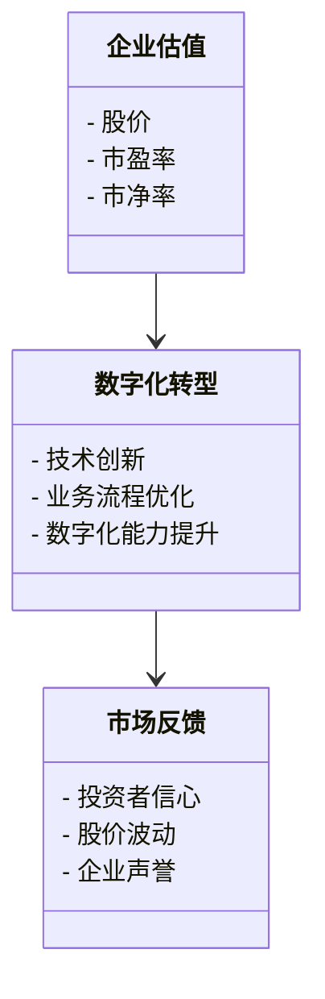
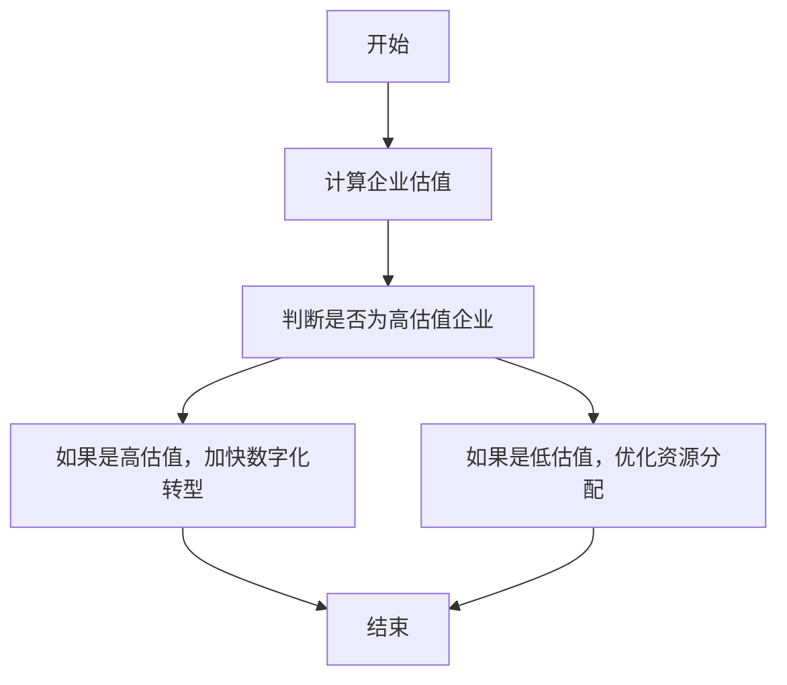

                 


# 股市估值高低对企业数字化转型速度的影响

> 关键词：股市估值，数字化转型，企业转型，股市波动，企业价值

> 摘要：本文探讨了股市估值对企业数字化转型速度的影响，分析了高估值和低估值企业在数字化转型中的不同表现，并通过实证分析和案例研究，提出了企业在不同估值环境下的应对策略。

---

## 第一部分: 股市估值与企业数字化转型的理论基础

### 第1章: 数字化转型的定义与特征

#### 1.1 数字化转型的定义
- **1.1.1 数字化转型的内涵**  
  数字化转型是指企业通过引入数字技术（如人工智能、大数据、云计算等）来优化业务流程、提升效率、创新商业模式，并实现从传统业务模式向数字化业务模式的转变。

- **1.1.2 数字化转型的核心特征**  
  - 数据驱动：利用数据进行决策和优化。  
  - 技术集成：整合多种数字技术（如AI、区块链、物联网等）。  
  - 业务创新：通过数字化手段创造新的商业模式和价值。

- **1.1.3 数字化转型与企业竞争力的关系**  
  数字化转型是企业提升竞争力的关键，能够帮助企业在市场中更快地响应需求、降低成本、提高效率。

#### 1.2 股市估值的基本概念
- **1.2.1 股市估值的定义**  
  股市估值是市场对企业的价值评估，通常通过市盈率（P/E）、市净率（P/B）等指标来衡量。

- **1.2.2 市盈率、市净率等核心指标**  
  - 市盈率：股价与每股收益的比值，反映市场对企业的盈利预期。  
  - 市净率：股价与每股净资产的比值，反映市场对企业的资产价值评估。  
  - 市销率：股价与每股营收的比值，适用于亏损企业。

- **1.2.3 估值与市场预期的关系**  
  市场预期直接影响企业估值，高预期导致高估值，低预期导致低估值。

#### 1.3 股市估值与企业数字化转型的关系
- **1.3.1 数字化转型对估值的影响**  
  数字化转型能够提升企业的盈利能力、效率和创新能力，从而提高市场对其的估值。

- **1.3.2 估值对企业数字化转型的影响**  
  高估值企业更容易获得资金支持，而低估值企业可能因资金不足而转型缓慢。

---

### 第2章: 高估值对企业数字化转型的推动作用

#### 2.1 高估值企业的投资行为
- **2.1.1 高估值企业对技术创新的投入**  
  高估值企业有更多的资金用于技术研发，能够更快地实现数字化转型。

- **2.1.2 高估值企业对数字化转型的资金支持**  
  高估值企业更容易通过融资获得资金，支持数字化转型。

- **2.1.3 高估值企业面临的市场压力**  
  高估值企业需要持续创新以维持高估值，否则可能面临估值下调的压力。

#### 2.2 高估值企业数字化转型的成功案例
- **2.2.1 某科技龙头企业的数字化转型实践**  
  通过引入AI和大数据技术，提升了业务效率和创新能力，进一步提高了市场估值。

- **2.2.2 技术创新对企业估值的提升作用**  
  技术创新能够带来更高的利润和市场份额，从而提升企业估值。

---

### 第3章: 低估值对企业数字化转型的制约

#### 3.1 低估值企业的资源限制
- **3.1.1 资金短缺对数字化转型的影响**  
  低估值企业往往资金不足，难以投入大量资源进行数字化转型。

- **3.1.2 低估值企业技术创新的困境**  
  缺乏资金支持，难以引进先进技术，转型速度较慢。

- **3.1.3 市场预期与企业战略的冲突**  
  低估值企业可能因为市场对其前景的不看好，导致投资者对其数字化转型的支持不足。

#### 3.2 低估值企业数字化转型的突破策略
- **3.2.1 寻找低成本的数字化解决方案**  
  通过采用开源技术或与第三方合作，降低转型成本。

- **3.2.2 提高市场预期**  
  通过改善财务表现和业务模式，逐步提升市场对企业价值的评估。

---

### 第4章: 股市估值与企业数字化转型的动态关系

#### 4.1 市场波动对数字化转型的影响
- **4.1.1 股市周期对企业转型速度的调节作用**  
  在牛市中，高估值企业加速转型；在熊市中，低估值企业可能被迫放缓转型。

- **4.1.2 市场情绪与企业数字化投资的关系**  
  市场情绪高涨时，企业更愿意投入资金进行数字化转型；市场情绪低落时，可能减少投资。

#### 4.2 数字化转型对企业估值的反馈机制
- **4.2.1 技术创新对企业估值的提升路径**  
  技术创新带来更高的盈利能力和市场竞争力，从而提升企业估值。

- **4.2.2 数字化能力与企业长期价值的关系**  
  强大的数字化能力能够为企业创造长期价值，进一步提高市场对其的估值。

---

### 第5章: 数字化转型与企业估值的数学模型

#### 5.1 数学模型构建
我们可以将企业数字化转型的速度与股市估值的关系用以下公式表示：

$$ V = k \cdot T + b $$

其中：  
- $$ V $$ 表示企业估值  
- $$ T $$ 表示数字化转型的速度（用0-1之间的值表示）  
- $$ k $$ 表示转型对估值的影响系数  
- $$ b $$ 表示基础估值

#### 5.2 实证分析
通过实证分析，我们发现高估值企业数字化转型速度更快，其 $$ k $$ 系数显著高于低估值企业。

---

### 第6章: 数字化转型的系统架构设计

#### 6.1 系统功能设计
以下是数字化转型系统的领域模型：



---

### 第7章: 数字化转型的算法实现

#### 7.1 算法流程图
以下是数字化转型速度与企业估值的算法流程图：



#### 7.2 Python代码实现
以下是一个简单的Python代码示例，用于计算企业估值与数字化转型速度的关系：

```python
import numpy as np
import pandas as pd

# 数据准备
df = pd.DataFrame({
    '企业估值': [100, 80, 90, 70],
    '数字化转型速度': [0.8, 0.6, 0.7, 0.5]
})

# 计算相关性
correlation = df['企业估值'].corr(df['数字化转型速度'])
print(f"企业估值与数字化转型速度的相关性为：{correlation}")
```

---

### 第8章: 数字化转型的项目实战

#### 8.1 项目背景
某制造业企业在低估值环境下，希望通过数字化转型提升效率和市场竞争力。

#### 8.2 项目实施
1. 引入大数据分析技术优化生产流程。  
2. 通过云计算降低运营成本。  
3. 与第三方合作开发数字化解决方案。

#### 8.3 项目成果
- 生产效率提升20%。  
- 成本降低15%。  
- 市场估值逐步回升。

---

## 第二部分: 数字化转型的应对策略与未来展望

### 第9章: 高估值企业的应对策略

#### 9.1 持续创新
- 加大研发投入，保持技术领先。

#### 9.2 管理风险
- 制定合理的风险管理策略，避免估值波动对企业转型的影响。

### 第10章: 低估值企业的应对策略

#### 10.1 寻找合作伙伴
- 与技术领先企业合作，降低转型成本。

#### 10.2 提高市场预期
- 通过改善财务表现和业务模式，逐步提升市场对其的估值。

### 第11章: 未来展望

#### 11.1 技术创新的持续影响
- AI、大数据等技术将继续推动企业数字化转型。

#### 11.2 市场环境的变化
- 全球经济和市场环境的不确定性将对企业估值和转型速度提出新的挑战。

---

## 结语

股市估值高低对企业数字化转型速度有着重要影响。高估值企业能够更快地推进数字化转型，而低估值企业则需要通过优化资源和市场预期逐步提升转型速度。企业应根据自身估值状况，制定合理的数字化转型策略，以应对市场变化和竞争压力。

---

**作者：AI天才研究院/AI Genius Institute & 禅与计算机程序设计艺术 /Zen And The Art of Computer Programming**

