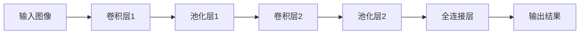
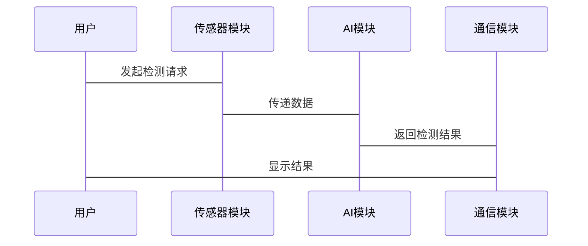

                 


# AI Agent在智能门把手中的细菌检测

> 关键词：AI Agent, 细菌检测, 智能门把手, 传感器技术, 算法原理, 系统设计, 项目实战

> 摘要：本文将深入探讨AI Agent在智能门把手中细菌检测的应用。通过分析细菌检测的核心概念、AI Agent的工作原理、算法实现、系统架构设计以及项目实战，为读者提供全面的技术解读。

---

## 第一章: AI Agent与智能门把手中细菌检测的背景

### 1.1 AI Agent的基本概念
- **AI Agent的定义**：AI Agent（人工智能代理）是指能够感知环境、自主决策并执行任务的智能实体。
- **AI Agent的特点**：
  - 智能性：能够理解和处理复杂信息。
  - 自主性：无需人工干预，自主完成任务。
  - 适应性：能够根据环境变化调整行为。

### 1.2 细菌检测的重要性
- **细菌检测的应用场景**：
  - 医院、学校、办公室等公共场所。
  - 家庭卫生检测。
- **细菌检测的核心问题**：
  - 快速、准确地识别细菌种类和浓度。
  - 实时监控，避免交叉感染。

### 1.3 AI Agent在智能门把手中细菌检测的优势
- **AI Agent的优势**：
  - 高效性：快速处理数据，提供实时反馈。
  - 准确性：通过深度学习算法提高检测精度。
  - 自适应性：能够根据环境变化优化检测策略。

---

## 第二章: 细菌检测的核心概念与技术原理

### 2.1 细菌检测的基本原理
- **细菌检测的主要方法**：
  - 基于光学的检测方法。
  - 基于化学传感器的检测方法。
  - 基于生物传感器的检测方法。
- **细菌检测的关键技术**：
  - 光谱分析。
  - 电化学传感器。
  - 免疫传感器。

### 2.2 AI Agent在细菌检测中的工作流程
- **数据采集**：
  - 使用传感器采集细菌的相关数据。
  - 数据预处理：去除噪声，提取特征。
- **数据特征提取**：
  - 通过卷积神经网络提取图像特征。
  - 使用时间序列分析提取动态特征。
- **AI模型训练与部署**：
  - 使用深度学习模型训练细菌检测模型。
  - 部署模型到智能门把手设备中。

### 2.3 细菌检测的核心概念与ER实体关系图
```mermaid
er
    entity 细菌类型 {
        key: 类型ID
        属性: 类型名称, 细菌特征
    }
    entity 检测数据 {
        key: 数据ID
        属性: 数据来源, 数据类型, 检测时间
    }
    细菌类型 --> 检测数据: 每个细菌类型对应多个检测数据
    检测数据 --> AI Agent: 提供给AI Agent进行处理
```

---

## 第三章: AI Agent的算法原理

### 3.1 AI Agent的核心算法
- **卷积神经网络（CNN）**：
  - 结构：卷积层、池化层、全连接层。
  - 功能：提取图像特征，分类细菌类型。

### 3.2 CNN算法的流程


### 3.3 CNN算法的数学模型
- **卷积层的数学公式**：
  $$ y_{i,j} = \sum_{k=1}^{n} \sum_{l=1}^{m} w_{k,l} \cdot x_{i+k,j+l} + b $$
- **池化层的数学公式**：
  $$ y_{i,j} = \max(x_{i,j}, x_{i+1,j}, x_{i,j+1}, x_{i+1,j+1}) $$

### 3.4 算法实现的Python代码示例
```python
import tensorflow as tf
from tensorflow.keras import layers

model = tf.keras.Sequential([
    layers.Conv2D(32, (3,3), activation='relu', input_shape=(128, 128, 3)),
    layers.MaxPooling2D((2,2)),
    layers.Conv2D(64, (3,3), activation='relu'),
    layers.MaxPooling2D((2,2)),
    layers.Flatten(),
    layers.Dense(128, activation='relu'),
    layers.Dense(10, activation='softmax')
])
```

---

## 第四章: 系统架构设计

### 4.1 系统功能设计
- **核心功能**：
  - 数据采集与处理。
  - 细菌检测与分类。
  - 结果反馈与提醒。

### 4.2 系统架构设计


### 4.3 系统接口设计
- **传感器模块接口**：
  - 输入：环境数据。
  - 输出：处理后的数据。
- **AI模块接口**：
  - 输入：特征数据。
  - 输出：检测结果。

### 4.4 系统交互流程


---

## 第五章: 项目实战

### 5.1 环境搭建
- **安装Python和TensorFlow**：
  ```bash
  pip install numpy tensorflow
  ```

### 5.2 核心代码实现
```python
import numpy as np
from tensorflow.keras import models

# 加载预训练模型
model = models.load_model('bacteria_detection_model.h5')

# 处理输入数据
input_data = np.random.random((1, 128, 128, 3))
# 预测结果
predictions = model.predict(input_data)
# 解释结果
print(np.argmax(predictions, axis=1))
```

### 5.3 项目小结
- **核心实现**：
  - 数据采集与处理。
  - AI模型的训练与部署。
  - 系统交互与反馈。

---

## 第六章: 总结与展望

### 6.1 总结
- **核心总结**：
  - AI Agent在细菌检测中的高效性和准确性。
  - 系统设计的合理性与可扩展性。

### 6.2 展望
- **未来发展方向**：
  - 更先进的传感器技术。
  - 更高效的AI算法。

### 6.3 最佳实践 tips
- **注意事项**：
  - 数据采集的质量直接影响检测结果。
  - 系统的实时性需要优化传感器和AI模块的协同工作。
- **小结**：
  - AI Agent在智能门把手中细菌检测的应用前景广阔。

---

## 作者：AI天才研究院 & 禅与计算机程序设计艺术

---

感谢您的阅读，希望本文能够为AI Agent在智能门把手中细菌检测的研究和实践提供有价值的参考。

