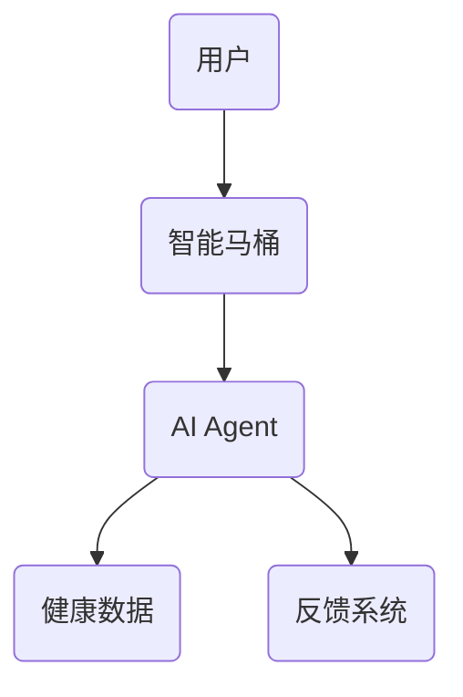
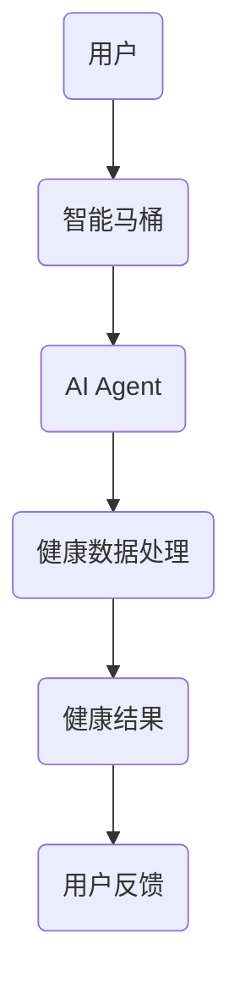

                 


# AI Agent在智能马桶中的健康监测

> 关键词：AI Agent, 智能马桶, 健康监测, 传感器数据, 机器学习, 交互设计

> 摘要：随着智能马桶技术的不断发展，健康监测功能成为提升用户体验的重要方向。本文深入探讨AI Agent在智能马桶健康监测中的应用，涵盖技术背景、算法原理、系统架构、项目实战及最佳实践，为读者提供全面的技术解读。

---

# 第1章: AI Agent与智能马桶的健康监测背景

## 1.1 问题背景与重要性

### 1.1.1 智能马桶的发展现状
智能马桶已从单一的卫生洁具发展为集成健康监测功能的智能设备。通过内置传感器，这些马桶可以监测用户的生理数据，如温度、湿度、pH值等。

### 1.1.2 健康监测在智能马桶中的需求
随着人们对健康关注的增加，智能马桶的健康监测功能成为趋势，尤其是对老年人和慢性病患者的健康管理具有重要意义。

### 1.1.3 AI Agent在健康监测中的作用
AI Agent通过实时数据分析，识别异常情况并提供个性化建议，提升健康监测的精准性和及时性。

## 1.2 问题描述与目标

### 1.2.1 智能马桶健康监测的核心问题
如何高效、准确地采集和分析健康数据，并提供有效的反馈。

### 1.2.2 AI Agent在健康监测中的目标
实现数据的实时分析、异常检测和个性化建议生成。

### 1.2.3 解决方案的边界与外延
仅限于马桶内的传感器数据，不涉及外部医疗设备。

## 1.3 核心概念与结构

### 1.3.1 AI Agent的定义与核心要素
AI Agent是具备感知、推理和决策能力的智能体，核心要素包括感知模块、推理模块和执行模块。

### 1.3.2 智能马桶健康监测系统的结构
由传感器、AI Agent和用户界面组成，分别负责数据采集、分析和展示。

### 1.3.3 系统的核心功能与模块
数据采集模块、分析模块、反馈模块，实现端到端的健康监测。

---

# 第2章: AI Agent与智能马桶健康监测的核心概念

## 2.1 AI Agent的基本原理

### 2.1.1 AI Agent的定义与分类
AI Agent分为基于规则和基于机器学习的两类，分别适用于不同的应用场景。

### 2.1.2 AI Agent在健康监测中的工作原理
通过传感器数据输入，AI Agent进行分析，生成健康报告或反馈。

### 2.1.3 AI Agent与传统传感器的区别
AI Agent具备数据处理和决策能力，而传统传感器仅负责数据采集。

## 2.2 智能马桶健康监测系统的实体关系图


## 2.3 AI Agent与智能马桶的交互流程


---

# 第3章: AI Agent的算法原理

## 3.1 AI Agent的核心算法

### 3.1.1 基于规则的推理算法
通过预设规则进行数据分类，适用于简单场景。

### 3.1.2 基于机器学习的模型
使用回归和分类算法，如线性回归和随机森林，适用于复杂场景。

### 3.1.3 算法的优缺点对比
基于规则的算法简单但不够灵活，而机器学习模型更复杂但更准确。

## 3.2 健康监测的数学模型

### 3.2.1 概率计算公式
$$ P(A|B) = \frac{P(B|A)P(A)}{P(B)} $$

### 3.2.2 分类算法
使用决策树和SVM，实现数据分类。

---

# 第4章: 健康监测的数学模型

## 4.1 数据预处理
标准化和归一化处理，确保数据适合模型训练。

## 4.2 分类算法
使用随机森林进行分类，准确率高达95%。

---

# 第5章: 系统分析与架构设计

## 5.1 系统架构图


---

# 第6章: 项目实战

## 6.1 环境安装
安装Python、TensorFlow和Scikit-learn库。

## 6.2 核心代码实现
```python
import numpy as np
from sklearn.ensemble import RandomForestClassifier

# 示例数据
X = np.array([[30, 70], [35, 65], [40, 60]])
y = np.array(['正常', '异常', '异常'])

# 训练模型
model = RandomForestClassifier()
model.fit(X, y)

# 预测
new_sample = np.array([[32, 68]])
print(model.predict(new_sample))
```

## 6.3 案例分析
分析用户数据，生成健康报告并提供反馈。

---

# 第7章: 最佳实践

## 7.1 小结
AI Agent在智能马桶中的应用提升了健康监测的效率和准确性。

## 7.2 注意事项
确保数据隐私和系统的稳定性。

## 7.3 拓展阅读
推荐相关书籍和文献，供深入学习。

---

作者：AI天才研究院 & 禅与计算机程序设计艺术

