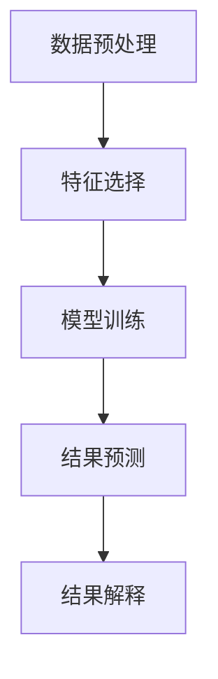
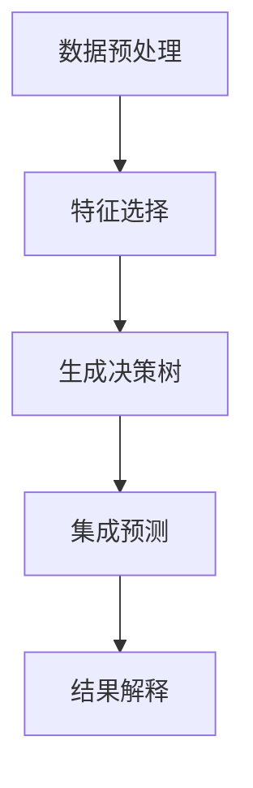
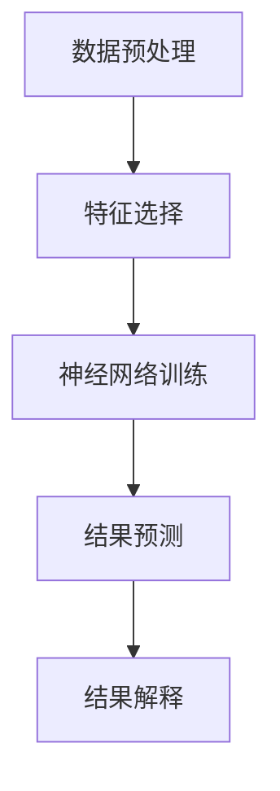

                 


# AI驱动的企业信用评级模型解释系统

> 关键词：AI驱动，信用评级模型，企业信用评估，模型解释性，机器学习算法

> 摘要：本文详细探讨了如何利用AI技术构建和解释企业信用评级模型。通过分析传统信用评级的局限性，介绍了AI驱动模型的优势，并深入讲解了核心算法的原理、系统架构的设计以及实际项目中的应用。文章结合理论与实践，为读者提供了一个全面了解和应用AI技术于信用评级的指南。

---

# 第一部分: AI驱动的企业信用评级模型背景与概述

## 第1章: 企业信用评级与AI驱动的概述

### 1.1 企业信用评级的背景与意义

#### 1.1.1 传统信用评级的局限性
传统的信用评级主要依赖于财务报表分析和经验判断，存在以下问题：
- 数据维度有限，难以捕捉非财务风险。
- 人工判断为主，主观性强，效率低。
- 风险预警能力有限，难以实时更新。

#### 1.1.2 AI技术在信用评级中的应用潜力
AI技术通过处理海量数据，能够提取更多特征，发现潜在风险，显著提升评级的准确性和效率。

#### 1.1.3 企业信用评级的重要性与应用场景
企业信用评级是企业融资、投资决策的重要依据，广泛应用于银行贷款审批、资本市场融资、供应链管理等领域。

---

### 1.2 AI驱动的信用评级模型的核心概念

#### 1.2.1 信用评级的基本定义与流程
信用评级是对企业的偿债能力和履约能力进行评估的过程，通常包括数据收集、特征提取、模型训练和结果输出四个阶段。

#### 1.2.2 AI技术在信用评级中的作用
AI技术通过机器学习算法，能够处理结构化和非结构化数据，挖掘传统方法难以发现的模式和风险因素。

#### 1.2.3 模型解释性的关键性
模型解释性是企业信用评级的核心要求，能够帮助决策者理解评级结果背后的原因，确保评级的透明性和可信度。

---

### 1.3 本书的目标与结构

#### 1.3.1 本书的核心目标
- 介绍AI驱动的信用评级模型的基本原理和实现方法。
- 提供实际项目中的实战指导，帮助读者快速上手。
- 强调模型的解释性，确保评级结果的可解释性和实用性。

#### 1.3.2 目录结构概览
- 第一部分：背景与概述。
- 第二部分：核心概念与联系。
- 第三部分：AI驱动信用评级模型的算法原理。
- 第四部分：系统分析与架构设计方案。
- 第五部分：项目实战与最佳实践。

#### 1.3.3 读者对象与预期收获
- 适用于数据科学家、金融从业者、企业风险管理相关人员。
- 读者将掌握AI驱动信用评级模型的设计、实现和解释方法。

---

## 第2章: 信用评级模型的核心要素

### 2.1 信用评级的核心要素分析

#### 2.1.1 企业财务指标
包括资产负债率、利润率、流动比率等，是信用评级的重要依据。

#### 2.1.2 市场表现与风险因素
行业趋势、市场波动、企业舆情等外部因素对信用评级有重要影响。

#### 2.1.3 公司治理与管理质量
公司治理结构、高管团队稳定性、内部控制机制等内部因素也需纳入考虑。

### 2.2 AI驱动模型的特征与优势

#### 2.2.1 数据驱动的特征
AI模型能够处理海量数据，提取非线性特征，显著提升评级的准确性。

#### 2.2.2 高维度数据处理能力
AI技术能够处理多维度数据，捕捉传统方法难以发现的风险信号。

#### 2.2.3 模型解释性的提升
通过特征重要性分析和可视化工具，AI模型能够提供可解释的评级结果。

### 2.3 信用评级模型的ER实体关系图

```mermaid
er
actor: 企业信用评级系统
end-user: 企业用户
model: 信用评级模型
data: 企业数据
```

---

## 第3章: 常见AI算法在信用评级中的应用

### 3.1 逻辑回归模型

#### 3.1.1 算法原理与流程
逻辑回归是一种经典的分类算法，适用于二分类问题。其核心思想是通过logistic函数将线性回归的结果映射到概率空间。

#### 3.1.2 逻辑回归的流程图


#### 3.1.3 逻辑回归的数学模型
$$ P(y=1|x) = \frac{e^{\beta_0 + \beta_1x_1 + \cdots + \beta_nx_n}}{1 + e^{\beta_0 + \beta_1x_1 + \cdots + \beta_nx_n}} $$

---

### 3.2 随机森林模型

#### 3.2.1 算法原理与流程
随机森林是一种基于决策树的集成算法，通过投票机制进行预测。

#### 3.2.2 随机森林的流程图


#### 3.2.3 随机森林的数学模型
$$ y = \text{median}(f_1(x), f_2(x), \cdots, f_n(x)) $$

---

### 3.3 神经网络模型

#### 3.3.1 算法原理与流程
神经网络是一种深度学习算法，能够处理复杂的非线性关系。

#### 3.3.2 神经网络的流程图


#### 3.3.3 神经网络的数学模型
$$ y = \sigma(wx + b) $$

---

## 第4章: 系统分析与架构设计方案

### 4.1 系统分析

#### 4.1.1 问题场景介绍
企业信用评级系统需要处理海量数据，提供实时评级结果，并保证模型的可解释性。

#### 4.1.2 项目介绍
构建一个基于AI的信用评级系统，实现对企业信用风险的智能评估。

---

### 4.2 系统功能设计

#### 4.2.1 领域模型类图


---

### 4.3 系统架构设计

#### 4.3.1 系统架构图


---

## 第5章: 项目实战与最佳实践

### 5.1 项目实战

#### 5.1.1 环境安装
需要安装Python、机器学习库（如scikit-learn、XGBoost）和数据处理工具（如Pandas）。

#### 5.1.2 核心代码实现

##### 数据预处理
```python
import pandas as pd

# 读取数据
data = pd.read_csv('企业数据.csv')

# 数据清洗
data = data.dropna()
```

##### 特征选择
```python
from sklearn.feature_selection import SelectKBest

selector = SelectKBest(k=10)
selected_data = selector.fit_transform(data)
```

##### 模型训练
```python
from sklearn.linear_model import LogisticRegression

model = LogisticRegression()
model.fit(selected_data, labels)
```

##### 模型解释
```python
from sklearn.inspection import permutation_importances

importances = permutation_importances(model, selected_data, labels)
```

---

### 5.2 最佳实践

#### 5.2.1 模型解释性的提升
使用特征重要性分析和可视化工具，如SHAP值，帮助用户理解模型决策过程。

#### 5.2.2 模型的可解释性
确保模型能够提供可解释的评级结果，以便企业用户理解和信任。

---

## 第6章: 总结与展望

### 6.1 小结
本文详细介绍了AI驱动的企业信用评级模型的设计、实现和解释过程，强调了模型解释性的重要性。

### 6.2 注意事项
在实际应用中，需注意数据隐私保护和模型的可解释性，确保评级结果的公正性和透明度。

### 6.3 拓展阅读
建议读者进一步学习相关领域的最新研究成果，如可解释性AI（XAI）技术的发展。

---

作者：AI天才研究院/AI Genius Institute & 禅与计算机程序设计艺术 /Zen And The Art of Computer Programming

