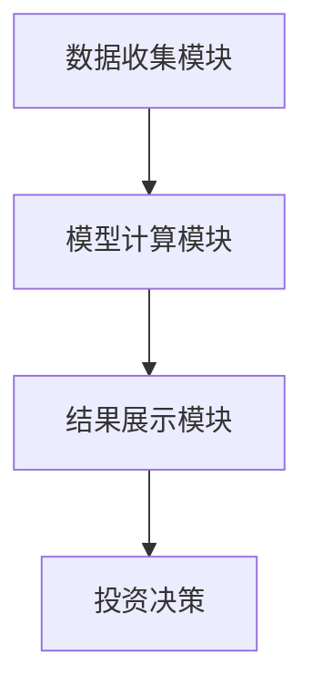

                 


# 《乔尔·格林布拉特的价值投资教育理念》

---

## 关键词：价值投资，格林布拉特，安全边际，竞争优势，选股策略，投资模型

---

## 摘要：  
本文深入探讨了乔尔·格林布拉特的价值投资理念，分析了其核心思想、选股策略以及数学模型的实现。通过详细讲解安全边际、竞争优势等核心概念，结合格林布拉特的“魔术数字”模型，本文为读者提供了从理论到实践的完整投资框架。文章还通过Python代码实现了一个简化的投资模型，并结合实际案例进行了分析，帮助读者更好地理解和应用格林布拉特的价值投资理念。

---

## 第一部分：价值投资的背景与核心理念

### 第1章：价值投资的定义与背景

#### 1.1 价值投资的起源与演变  
- 投资的定义与分类：投资是通过购买资产以期获得未来收益的行为，主要包括股票、债券、房地产等多种形式。  
- 价值投资的起源与发展：价值投资起源于20世纪初，以本杰明·格雷厄姆和戴维·多德为代表，强调以低于内在价值的价格购买优质资产。  
- 价值投资与其它投资理念的对比：与趋势投资、技术分析等其他投资方法相比，价值投资更注重企业的基本面分析和长期价值。

#### 1.2 格林布拉特的价值投资理念  
- 格林布拉特的生平与投资经历：乔尔·格林布拉特是一位著名的价值投资者，他通过长期投资优质资产，取得了显著的投资业绩。  
- 格林布拉特对价值投资的贡献：他将价值投资的理念进一步量化和系统化，提出了“魔术数字”模型，为投资者提供了实用的选股工具。  
- 格林布拉特理念的核心思想：以低于企业内在价值的价格买入具有竞争优势的企业，长期持有，等待市场重新认识到其价值。

#### 1.3 价值投资的核心原则  
- 购买便宜的资产：通过分析企业的财务指标，寻找市场价格低于内在价值的资产。  
- 长期投资与复利效应：通过长期持有优质资产，实现财富的稳步增长。  
- 风险控制与安全边际：通过安全边际（即市场价格与内在价值的差距）来降低投资风险。

---

### 第2章：安全边际与竞争优势

#### 2.1 安全边际的定义与作用  
- 安全边际的定义：安全边际是指市场价格低于企业内在价值的部分，是投资者在投资决策中考虑的风险缓冲区。  
- 安全边际的计算方法：  
  - 内在价值的计算：基于企业的盈利能力、成长性和财务状况，估算其未来现金流的现值。  
  - 市场价格与内在价值的差距即为安全边际。  
- 安全边际在投资决策中的应用：通过寻找具有较大安全边际的资产，降低投资风险。

#### 2.2 企业的竞争优势  
- 竞争优势的类型与分析：竞争优势可以分为成本优势、品牌优势、技术优势等。  
- 格林布拉特对企业竞争优势的评价标准：  
  - 企业的盈利能力是否稳定且可持续。  
  - 企业是否具有独特的竞争优势，能够在行业中长期保持领先地位。  
- 企业竞争优势与投资机会的结合：通过分析企业的竞争优势，选择具有长期竞争优势的企业进行投资。

---

### 第3章：格林布拉特的选股方法

#### 3.1 选股的核心指标  
- 市盈率（P/E）的计算与应用：  
  - P/E = 市场价格 / 每股净利润。  
  - 低市盈率通常意味着企业被市场低估。  
- 市净率（P/B）的计算与应用：  
  - P/B = 市场价格 / 每股净资产。  
  - 低市净率通常意味着企业资产被市场低估。  
- 股息率的计算与应用：  
  - 股息率 = 每股股息 / 市场价格。  
  - 高股息率通常意味着企业具有稳定的收益能力。

#### 3.2 格林布拉特的“魔术数字”模型  
- 魔术数字模型的定义与公式：  
  - 魔术数字 = （企业未来现金流的现值） / （市场资本成本）。  
  - 通过比较市场价格与魔术数字，判断资产是否被低估。  
- 魔术数字模型的计算步骤：  
  - 估算企业的未来现金流。  
  - 计算未来现金流的现值。  
  - 计算魔术数字。  
  - 比较市场价格与魔术数字，判断投资机会。  

#### 3.3 格林布拉特的选股策略  
- 低市盈率与低市净率的结合：通过同时考虑P/E和P/B指标，寻找被市场低估的资产。  
- 高股息率与企业盈利能力的结合：通过高股息率和稳定的盈利能力，寻找具有长期收益能力的资产。  
- 企业成长性与估值的结合：通过分析企业的成长性和估值水平，寻找具有长期增长潜力的资产。

---

## 第二部分：价值投资的数学模型与算法

### 第4章：价值投资的数学模型

#### 4.1 内在价值的计算模型  
- 内在价值的定义：内在价值是基于企业未来现金流的现值计算出的企业资产的真正价值。  
- 内在价值的计算公式：  
  $$ \text{内在价值} = \sum_{t=1}^{n} \frac{\text{现金流}_t}{(1 + r)^t} $$  
  其中，$r$ 是资本成本，$n$ 是预测的现金流期限。  

#### 4.2 安全边际的计算公式  
- 安全边际 = 内在价值 - 市场价格  
- 安全边际的百分比表示：  
  $$ \text{安全边际百分比} = \frac{\text{安全边际}}{\text{内在价值}} \times 100\% $$  

#### 4.3 魔术数字模型的计算公式  
- 魔术数字 = 内在价值 / 资本成本  
- 魔术数字的计算步骤：  
  1. 估算企业的未来现金流。  
  2. 计算未来现金流的现值。  
  3. 计算魔术数字。  

---

### 第5章：价值投资的算法实现

#### 5.1 算法实现的步骤  
1. 收集企业的财务数据，包括收入、利润、现金流等。  
2. 估算企业的未来现金流。  
3. 计算未来现金流的现值，得出内在价值。  
4. 计算安全边际。  
5. 对比市场价格与内在价值，判断投资机会。  

#### 5.2 Python代码实现  

```python
import pandas as pd
import numpy as np

# 假设我们有企业的财务数据，包括收入、利润、现金流等
# 这里我们使用虚构数据进行演示
data = {
    '年份': [2020, 2021, 2022, 2023],
    '现金流': [100, 120, 140, 160],
    '折现率': [0.1, 0.1, 0.1, 0.1]
}

df = pd.DataFrame(data)

# 计算未来现金流的现值
pv = []
for i in range(len(df)):
    pv.append(df['现金流'][i] / (1 + df['折现率'][i]) ** i)

# 计算内在价值
intrinsic_value = sum(pv)

# 市场价格（假设）
market_price = 1000

# 计算安全边际
margin_of_safety = intrinsic_value - market_price

# 输出结果
print(f"内在价值: {intrinsic_value}")
print(f"市场价格: {market_price}")
print(f"安全边际: {margin_of_safety}")
```

---

## 第三部分：价值投资的系统架构与项目实战

### 第6章：价值投资的系统架构

#### 6.1 系统架构设计  
- 系统功能模块：  
  1. 数据收集模块：收集企业的财务数据和市场数据。  
  2. 模型计算模块：计算内在价值和安全边际。  
  3. 结果展示模块：展示投资结果和决策建议。  

#### 6.2 系统架构图  


---

### 第7章：项目实战

#### 7.1 项目背景  
我们选择一家虚构的企业进行分析，假设其财务数据如下：  

| 年份 | 现金流（万元） | 折现率 | 市场价格（万元） |
|------|----------------|--------|------------------|
| 2020 | 100            | 0.1    | 1000             |
| 2021 | 120            | 0.1    |                  |
| 2022 | 140            | 0.1    |                  |
| 2023 | 160            | 0.1    |                  |

---

#### 7.2 代码实现  

```python
import pandas as pd
import numpy as np

# 数据准备
data = {
    '年份': [2020, 2021, 2022, 2023],
    '现金流': [100, 120, 140, 160],
    '折现率': [0.1, 0.1, 0.1, 0.1]
}

df = pd.DataFrame(data)

# 计算未来现金流的现值
pv = []
for i in range(len(df)):
    pv.append(df['现金流'][i] / (1 + df['折现率'][i]) ** i)

# 计算内在价值
intrinsic_value = sum(pv)

# 市场价格
market_price = 1000

# 计算安全边际
margin_of_safety = intrinsic_value - market_price

# 输出结果
print(f"内在价值: {intrinsic_value}")
print(f"市场价格: {market_price}")
print(f"安全边际: {margin_of_safety}")
```

---

## 第四部分：总结与展望

### 第8章：总结与展望

#### 8.1 小结  
本文通过详细讲解乔尔·格林布拉特的价值投资理念，结合数学模型和Python代码，展示了如何将理论应用于实践。通过安全边际、竞争优势等核心概念的分析，读者可以更好地理解价值投资的本质。

#### 8.2 注意事项  
- 投资者在实际操作中需要结合市场环境和企业实际情况，灵活调整投资策略。  
- 投资者需要具备扎实的财务分析能力和风险控制能力。  

#### 8.3 拓展阅读  
- 格林布拉特的《价值投资策略》  
- 本杰明·格雷厄姆的《 Intelligent Investor》  

---

## 作者：AI天才研究院/AI Genius Institute & 禅与计算机程序设计艺术 /Zen And The Art of Computer Programming

