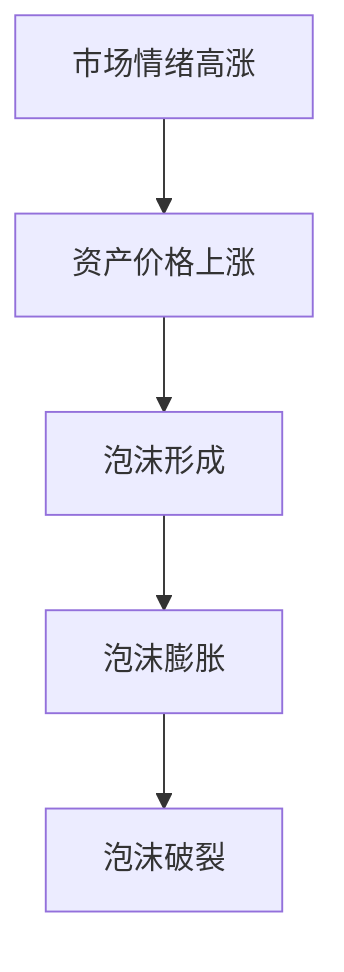
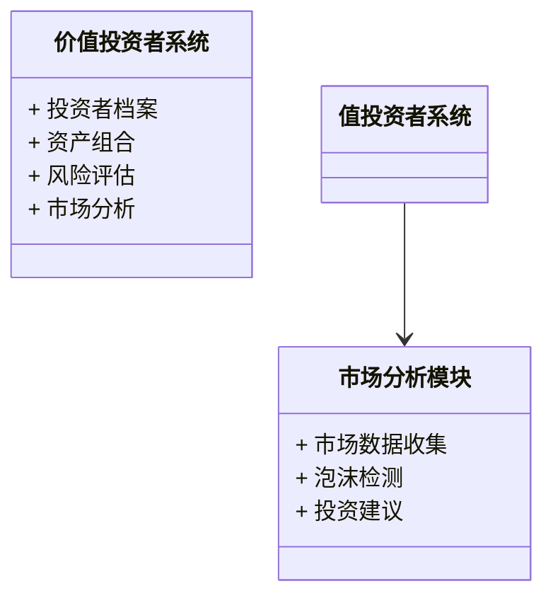

                 


```markdown
# 价值投资者如何应对市场泡沫

> 关键词：价值投资，市场泡沫，风险管理，投资策略，安全边际

> 摘要：本文深入探讨了价值投资者在面对市场泡沫时的核心策略，分析了泡沫的形成机制，并提供了应对策略和实际案例。文章结合数学模型、算法原理和系统架构，详细阐述了如何在泡沫环境中保护和增长投资组合。

---

## 第一部分：价值投资与市场泡沫的基础

### 第1章：价值投资的核心概念

#### 1.1 背景介绍
- **价值投资**是由本杰明·格雷厄姆提出的投资策略，强调以低于内在价值的价格购买优质资产。
- **内在价值**是资产在未来现金流的现值，与市场波动无关。
- **市场泡沫**是资产价格远高于其内在价值的现象，通常由市场情绪和过度投机引起。

#### 1.2 核心概念与联系
- **核心概念**：价值投资关注内在价值，市场泡沫关注市场价格偏离。
- **概念对比**：
  | 概念 | 价值投资 | 市场泡沫 |
  |------|----------|----------|
  | 目标 | 寻找低估资产 | 资产价格远高于价值 |
  | 风险 | 价格波动 | 资产可能大幅贬值 |

#### 1.3 核心原理
- **价值发现**：通过基本面分析识别低估资产。
- **安全边际**：购买价格远低于内在价值，以降低风险。

#### 1.4 价值投资的数学模型
- **内在价值公式**：
  $$ V = \sum_{t=1}^{n} \frac{C_t}{(1 + r)^t} $$
  其中，\( V \) 是内在价值，\( C_t \) 是第 \( t \) 年的现金流，\( r \) 是折现率。

---

### 第2章：市场泡沫的形成与特征

#### 2.1 泡沫形成的机制
- **市场情绪**：投资者过于乐观，导致价格虚高。
- **杠杆效应**：杠杆放大了价格波动和泡沫的形成。
- **羊群效应**：投资者跟风，加剧泡沫的扩散。

#### 2.2 泡沫的生命周期


---

## 第二部分：价值投资与市场泡沫的相互作用

### 第3章：泡沫环境中的价值投资机会

#### 3.1 识别低估资产
- **案例分析**：2008年金融危机期间，某些银行股被低估，后来反弹。
- **策略**：寻找基本面良好但价格被市场低估的资产。

#### 3.2 安全边际的重要性
- **计算安全边际**：
  $$ \text{安全边际} = \text{内在价值} - \text{市场价格} $$
  当安全边际为正时，投资风险较低。

---

### 第4章：应对市场泡沫的策略

#### 4.1 风险管理策略
- **分散投资**：将资金分配到不同资产类别，降低风险。
- **止损机制**：设定止损点，避免重大损失。
- **长期持有**：避免频繁交易，降低交易成本。

#### 4.2 投资组合调整
- **动态再平衡**：定期调整资产配置，以应对市场变化。
- **抗泡资产配置**：投资于不受泡沫影响的资产，如优质股息股。

---

## 第三部分：系统分析与项目实战

### 第5章：系统架构设计

#### 5.1 系统功能设计


---

### 第6章：项目实战分析

#### 6.1 环境安装
- **工具**：使用Python进行数据分析，利用Pandas和NumPy库。
- **数据源**：获取历史股价和财务数据。

#### 6.2 核心代码实现
```python
import pandas as pd
import numpy as np

def calculate_intrinsic_value(enterprise_value, cash_flow, discount_rate):
    # 计算内在价值
    return np.irr([enterprise_value - cash_flow/(1+discount_rate)**i for i in range(10)])
```

#### 6.3 应用解读
- **案例分析**：分析科技股泡沫，识别低估的科技公司。
- **结果展示**：生成投资建议报告，指导投资者行动。

---

## 第四部分：总结与展望

### 第7章：总结与最佳实践

#### 7.1 总结
- 价值投资者在泡沫环境中应保持冷静，寻找低估资产。
- 风险管理是应对泡沫的关键策略。

#### 7.2 最佳实践
- 定期评估投资组合，调整以应对市场变化。
- 保持长期投资心态，避免短期波动干扰。

---

## 作者

作者：AI天才研究院/AI Genius Institute  
联系方式：contact@aigeniusinstitute.com  
 GitHub：https://github.com/aigeniusinstitute

---

**注意**：本文为理论探讨，不构成具体投资建议。投资需谨慎，建议在专业指导下进行。
```

