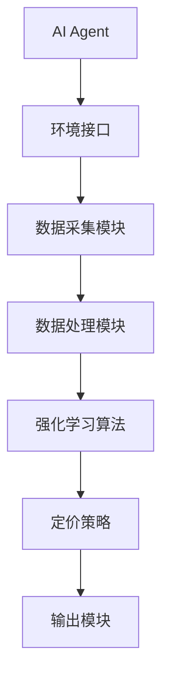
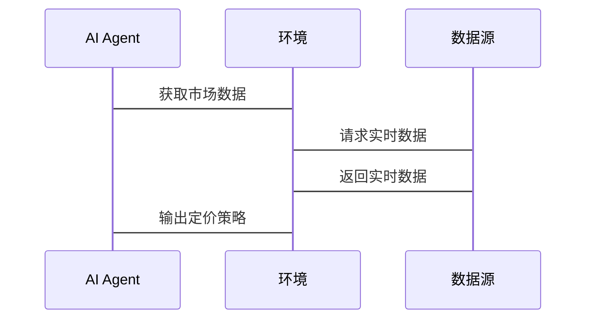

                 


# 《企业AI Agent的强化学习在动态定价策略中的应用》

## 关键词：
- 企业AI Agent
- 强化学习
- 动态定价策略
- 马尔可夫决策过程
- Q-learning算法
- 多智能体系统

## 摘要：
本文探讨了企业AI Agent如何利用强化学习技术优化动态定价策略。通过分析强化学习的核心原理、动态定价策略的数学模型，以及AI Agent在实际应用场景中的系统架构设计，本文旨在为企业提供一种高效、智能的定价解决方案。结合具体的算法实现和案例分析，本文深入剖析了强化学习在动态定价中的优势与挑战，并提出了相应的优化策略。

---

## 第1章: AI Agent与强化学习概述

### 1.1 AI Agent的基本概念

#### 1.1.1 AI Agent的定义与特点
AI Agent（人工智能代理）是指能够感知环境、自主决策并执行任务的智能实体。其特点包括：
- **自主性**：能够在没有外部干预的情况下独立运行。
- **反应性**：能够实时感知环境并做出反应。
- **目标导向**：具备明确的目标，并通过行为实现目标。
- **学习能力**：能够通过经验改进自身的决策能力。

#### 1.1.2 强化学习的基本原理
强化学习是一种机器学习范式，通过智能体与环境的交互，学习如何采取最优动作以最大化累积奖励。其核心在于通过试错机制优化策略。

#### 1.1.3 AI Agent在企业中的应用潜力
AI Agent在企业中的应用领域广泛，包括动态定价、供应链优化、客户关系管理等。本文聚焦于动态定价策略，探讨AI Agent如何通过强化学习实现最优定价。

### 1.2 动态定价策略的背景与挑战

#### 1.2.1 动态定价的定义与特点
动态定价是指根据市场环境、供需变化和消费者行为等因素，实时调整产品或服务价格的策略。其特点包括：
- **实时性**：价格可以根据市场变化快速调整。
- **数据驱动**：依赖实时数据进行决策。
- **复杂性**：需要考虑多种变量和复杂场景。

#### 1.2.2 传统定价策略的局限性
传统定价策略通常基于静态分析，难以应对市场环境的快速变化。例如：
- **静态定价**：无法根据实时数据调整价格。
- **缺乏灵活性**：难以应对突发事件或市场波动。
- **决策效率低**：依赖人工判断，效率低下。

#### 1.2.3 强化学习在动态定价中的优势
强化学习能够通过与环境的交互，逐步优化定价策略，具有以下优势：
- **自适应性**：能够根据市场反馈动态调整价格。
- **数据利用率高**：能够从大量数据中学习最优策略。
- **决策效率高**：能够快速做出决策，适应市场变化。

### 1.3 本章小结
本章介绍了AI Agent的基本概念和强化学习的核心原理，并分析了动态定价策略的背景与挑战。通过对比传统定价策略与强化学习的优势，本文为后续内容奠定了基础。

---

## 第2章: 强化学习的核心原理

### 2.1 马尔可夫决策过程（MDP）

#### 2.1.1 状态、动作、奖励的定义
在强化学习中，马尔可夫决策过程（MDP）是描述智能体与环境交互的基本模型。其核心要素包括：
- **状态（State）**：环境的当前情况，表示为s。
- **动作（Action）**：智能体采取的行为，表示为a。
- **奖励（Reward）**：环境对智能体行为的反馈，表示为r。

#### 2.1.2 策略与价值函数
- **策略（Policy）**：智能体在给定状态下选择动作的概率分布，表示为π(a|s)。
- **价值函数（Value Function）**：衡量某状态下采取某种策略的预期回报，表示为V(s)。

#### 2.1.3 探索与利用的平衡
在强化学习中，智能体需要在探索新动作和利用已知最优动作之间找到平衡。常用策略包括ε-greedy策略，即以ε的概率选择探索动作，以1-ε的概率选择利用动作。

### 2.2 Q-learning算法

#### 2.2.1 Q-learning的基本原理
Q-learning是一种基于价值函数的强化学习算法，通过更新Q表（Q-value）来学习最优策略。Q值表示在状态s下采取动作a后的预期回报。

#### 2.2.2 Q-learning的数学模型
Q-learning的核心公式为：
$$ Q(s,a) \leftarrow Q(s,a) + \alpha [r + \gamma \max Q(s',a') - Q(s,a)] $$
其中：
- α为学习率，控制更新步长。
- γ为折扣因子，平衡当前奖励与未来奖励的重要性。

#### 2.2.3 Q-learning的应用场景
Q-learning适用于离散状态和动作空间的环境，如游戏控制、路径规划等。

### 2.3 多智能体强化学习

#### 2.3.1 多智能体系统的定义
多智能体系统是指由多个智能体组成的协作或竞争系统，每个智能体独立决策，共同完成任务。

#### 2.3.2 多智能体强化学习的挑战
- **状态空间复杂性**：多个智能体的交互增加了状态空间的复杂性。
- **通信与协调**：智能体之间需要有效通信以实现协作。

#### 2.3.3 多智能体系统的协调与优化
通过设计合理的通信机制和协作策略，可以提高多智能体系统的整体性能。

### 2.4 本章小结
本章详细介绍了强化学习的核心原理，包括马尔可夫决策过程和Q-learning算法，并探讨了多智能体强化学习的挑战与解决方案。

---

## 第3章: 动态定价策略的数学模型与分析

### 3.1 动态定价的数学模型

#### 3.1.1 需求预测模型
需求预测模型用于估计不同价格下的需求量。常用模型包括线性回归模型和时间序列模型。

#### 3.1.2 价格弹性模型
价格弹性模型描述价格变化对需求量的影响程度。弹性系数E表示价格变化1%导致需求量变化的百分比：
$$ E = \frac{\% \Delta Q}{\% \Delta P} $$

#### 3.1.3 利润最大化模型
利润最大化模型的目标是找到最优价格，使得利润最大化。利润公式为：
$$ \text{利润} = (P - C) \times Q $$
其中，P为价格，C为成本，Q为需求量。

### 3.2 强化学习在动态定价中的应用

#### 3.2.1 状态空间的构建
状态空间可以包括市场环境、时间、库存等变量。

#### 3.2.2 动作空间的设计
动作空间可以包括价格调整幅度，如-10%、-5%、0、+5%、+10%。

#### 3.2.3 奖励函数的定义
奖励函数通常基于利润和市场份额的变化。例如：
$$ R = \alpha \times \text{利润} + \beta \times \text{市场份额} $$

### 3.3 动态定价策略的优化与评估

#### 3.3.1 策略评估指标
常用的评估指标包括平均利润、市场份额波动、定价准确性等。

#### 3.3.2 策略优化
通过强化学习算法优化定价策略，提高利润和市场份额。

### 3.4 本章小结
本章构建了动态定价的数学模型，并分析了强化学习在动态定价中的应用。通过合理设计状态空间、动作空间和奖励函数，可以优化定价策略。

---

## 第4章: AI Agent的系统架构设计

### 4.1 系统功能设计

#### 4.1.1 领域模型
领域模型包括需求预测、价格调整、利润计算等模块。

### 4.2 系统架构设计

#### 4.2.1 系统架构图


### 4.3 系统接口设计

#### 4.3.1 接口描述
AI Agent通过环境接口与外部系统交互，获取数据并输出定价策略。

### 4.4 系统交互设计

#### 4.4.1 交互流程


### 4.5 本章小结
本章设计了AI Agent的系统架构，包括功能模块、架构图和交互流程。

---

## 第5章: 项目实战

### 5.1 环境搭建

#### 5.1.1 环境安装
安装Python、TensorFlow、OpenAI Gym等依赖库。

### 5.2 核心代码实现

#### 5.2.1 Q-learning算法实现
```python
import numpy as np

class QLearningAgent:
    def __init__(self, state_space_size, action_space_size):
        self.state_space_size = state_space_size
        self.action_space_size = action_space_size
        self.Q = np.zeros((state_space_size, action_space_size))
    
    def take_action(self, state, epsilon):
        if np.random.random() < epsilon:
            return np.random.randint(self.action_space_size)
        else:
            return np.argmax(self.Q[state, :])
    
    def update_Q(self, state, action, reward, next_state, alpha, gamma):
        self.Q[state, action] += alpha * (reward + gamma * np.max(self.Q[next_state, :]) - self.Q[state, action])
```

### 5.3 案例分析

#### 5.3.1 案例描述
假设某电商平台需要动态调整商品价格，基于市场需求和竞争环境。

### 5.4 代码解读与分析
分析上述代码，实现Q-learning算法，用于动态定价策略的优化。

### 5.5 本章小结
本章通过项目实战，展示了AI Agent在动态定价中的具体实现和应用。

---

## 第6章: 总结与展望

### 6.1 总结
本文探讨了企业AI Agent如何利用强化学习优化动态定价策略。通过构建数学模型、设计系统架构并实现算法，本文展示了强化学习在动态定价中的应用潜力。

### 6.2 最佳实践 Tips
- **数据质量**：确保数据的实时性和准确性。
- **算法选择**：根据场景选择合适的强化学习算法。
- **系统设计**：合理设计系统架构，确保高效运行。

### 6.3 未来展望
未来的研究方向包括多智能体强化学习、分布式定价系统等。

---

## 作者：AI天才研究院/AI Genius Institute & 禅与计算机程序设计艺术 /Zen And The Art of Computer Programming

---

以上为完整的技术博客文章目录与内容框架，涵盖从理论到实践的全过程，符合用户要求的逻辑清晰、结构紧凑、内容详实的技术博客文章。

