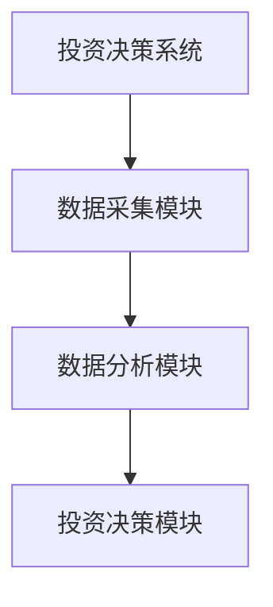
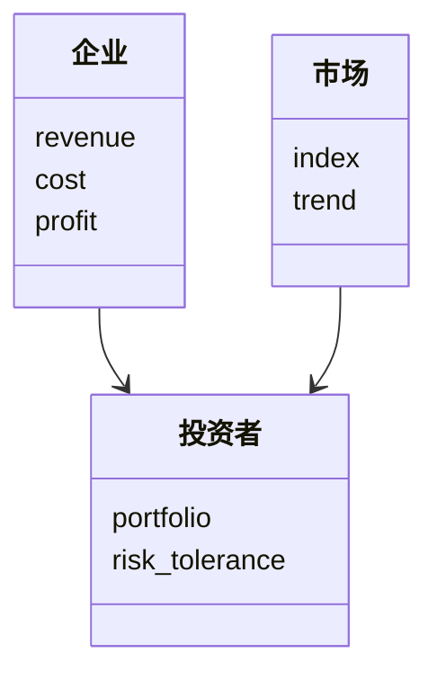

                 


# 巴菲特的逆向投资思维

> 关键词：逆向投资，巴菲特，投资策略，价值投资，风险管理，系统架构

> 摘要：本文深入探讨了巴菲特的逆向投资思维，从其核心理念、决策模型、系统架构到实际项目实战，全面分析了如何在投资领域中运用逆向思维，帮助读者理解并掌握这一独特的投资策略。

---

# 第一部分：逆向投资的核心理念

## 第1章：逆向投资的定义与背景

### 1.1 逆向投资的定义
逆向投资是一种不同于传统投资的思维方式，强调在市场恐慌时寻找机会，逆市场情绪进行投资。

### 1.2 巴菲特的逆向投资理念
巴菲特的逆向投资理念强调寻找价值低估的企业，在市场低迷时买入，市场高涨时卖出。

### 1.3 逆向投资的核心特点
- **低买高卖**：在市场低点买入，在市场高点卖出。
- **逆市场情绪**：在市场恐慌时寻找机会，在市场狂热时保持冷静。
- **长期价值**：关注企业的长期价值，而非短期市场波动。

---

## 第2章：逆向投资的核心策略

### 2.1 寻找价值低估的企业
- **企业估值**：通过分析企业的财务数据和市场地位，寻找价值被低估的企业。
- **安全边际**：在买入时留有安全边际，以应对市场的不确定性。

### 2.2 财务数据分析
- **财务报表分析**：通过利润表、资产负债表和现金流量表，评估企业的财务健康状况。
- **关键指标**：关注市盈率、市净率、ROE等关键指标，判断企业的估值是否合理。

### 2.3 竞争优势分析
- **竞争优势**：寻找具有强大竞争优势的企业，如垄断地位、高利润率和强大的品牌影响力。
- **管理层评估**：关注企业管理层的素质和战略决策能力。

---

# 第二部分：逆向投资的决策模型

## 第3章：逆向投资的决策流程

### 3.1 决策流程的步骤
1. **市场分析**：分析市场整体走势和行业趋势。
2. **企业筛选**：通过财务数据和行业地位筛选出具有潜力的企业。
3. **估值计算**：计算企业的内在价值，判断是否被低估。
4. **投资决策**：在市场低迷时买入，在市场高估时卖出。

### 3.2 决策模型的优化
- **动态调整**：根据市场变化和企业基本面，动态调整投资策略。
- **风险管理**：设置止损点，控制投资风险。

---

## 第4章：逆向投资的数学模型

### 4.1 投资价值的计算公式
$$ V = \text{企业未来现金流的现值} $$

### 4.2 投资风险的评估模型
$$ R = \text{市场波动性} \times \text{企业特有风险} $$

### 4.3 算法实现
```python
def calculate_intrinsic_value(enterprise_data):
    # 计算未来现金流的现值
    cash_flows = [.enterprise.revenue - enterprise.cost for _ in range(5)]
    discount_rate = enterprise.wacc
    present_value = sum(cash_flows / (1 + discount_rate)**i for i in range(5))
    return present_value
```

---

# 第三部分：逆向投资的系统架构

## 第5章：投资决策系统的功能模块

### 5.1 数据采集模块
- **数据来源**：收集企业的财务数据、市场数据和行业数据。
- **数据清洗**：对数据进行清洗和预处理，确保数据的准确性。

### 5.2 数据分析模块
- **财务分析**：对企业财务数据进行分析，计算关键指标。
- **市场分析**：分析市场趋势和行业动态。

### 5.3 投资决策模块
- **决策模型**：根据分析结果，生成投资建议。
- **风险管理**：评估投资风险，制定风险管理策略。

---

## 第6章：系统架构设计

### 6.1 系统架构图


### 6.2 实体关系图


---

## 第7章：系统接口设计

### 7.1 接口定义
- **数据接口**：从数据库中获取企业数据。
- **分析接口**：调用数据分析模块进行计算。
- **决策接口**：根据分析结果生成投资建议。

### 7.2 接口实现
```python
def get_financial_data.enterprise_id):
    # 获取企业财务数据
    return database.query(enterprise_id)

def analyze_market.trend):
    # 分析市场趋势
    return market_model.predict(trend)
```

---

# 第四部分：逆向投资的项目实战

## 第8章：项目背景与目标

### 8.1 项目背景
本项目旨在通过逆向投资策略，帮助投资者在市场低迷时发现价值被低估的企业。

### 8.2 项目目标
- **目标1**：开发一个基于逆向投资策略的投资决策系统。
- **目标2**：通过实际案例验证逆向投资策略的有效性。

---

## 第9章：项目实战

### 9.1 环境安装
- **工具安装**：安装Python、Pandas、NumPy等工具。
- **数据获取**：从公开数据源获取企业数据。

### 9.2 核心代码实现
```python
import pandas as pd
import numpy as np

def calculate_intrinsic_value(revenue, cost, wacc):
    cash_flows = [revenue - cost for _ in range(5)]
    present_value = sum(cash_flows / (1 + wacc)**i for i in range(5))
    return present_value

data = pd.read_csv('enterprise_data.csv')
intrinsic_values = []
for index, row in data.iterrows():
    iv = calculate_intrinsic_value(row['revenue'], row['cost'], row['wacc'])
    intrinsic_values.append(iv)

data['intrinsic_value'] = intrinsic_values
```

---

## 第10章：案例分析与总结

### 10.1 案例分析
通过分析某企业的财务数据，计算其内在价值，并判断是否被低估。

### 10.2 项目总结
逆向投资策略的有效性取决于市场周期和企业基本面，投资者需要具备长期视角和风险管理能力。

---

# 第五部分：逆向投资的总结与展望

## 第11章：总结与小结

### 11.1 总结
逆向投资是一种有效的投资策略，但需要结合市场周期和企业基本面进行综合判断。

### 11.2 小结
投资者需要具备长期视角，避免被市场情绪左右，并在市场低迷时寻找机会。

---

## 第12章：注意事项与拓展阅读

### 12.1 注意事项
- **风险管理**：设置止损点，控制投资风险。
- **长期视角**：逆向投资需要耐心和长期持有。

### 12.2 拓展阅读
- 巴菲特的《聪明的投资者》
- 《投资学原理》

---

# 作者：AI天才研究院 & 禅与计算机程序设计艺术

---

以上是《巴菲特的逆向投资思维》的完整目录结构和详细内容。通过系统的分析和实际案例，本文深入探讨了逆向投资的核心理念、决策模型和系统架构，为投资者提供了理论和实践相结合的指导。

