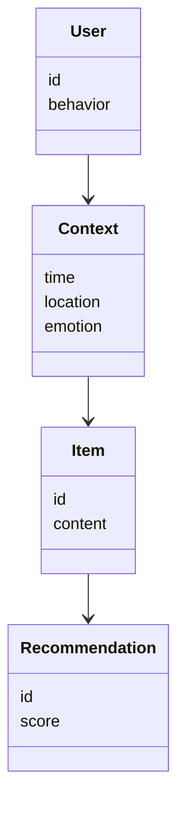

                 


# 开发AI Agent的上下文感知推荐系统

## 关键词：AI Agent、上下文感知推荐系统、机器学习、自然语言处理、推荐算法、系统架构

## 摘要：本文详细探讨了开发AI Agent的上下文感知推荐系统的核心概念、算法原理、系统架构以及项目实战。通过结合自然语言处理和机器学习技术，本文旨在实现动态、个性化的推荐系统，为用户提供更智能的服务体验。

---

## 第一部分：开发AI Agent的上下文感知推荐系统概述

### 第1章：上下文感知推荐系统的背景与概念

#### 1.1 问题背景与问题描述

- **1.1.1 推荐系统的基本概念**
  推荐系统是一种基于用户行为和数据挖掘技术，为用户推荐相关内容的技术。传统的推荐系统基于协同过滤、基于内容的推荐等方法。

- **1.1.2 上下文感知推荐的核心问题**
  上下文感知推荐系统不仅考虑用户的历史行为，还结合实时的上下文信息（如时间、地点、用户情绪等）来提供更精准的推荐。

- **1.1.3 传统推荐系统与上下文感知推荐的对比**
  | 对比维度 | 传统推荐系统 | 上下文感知推荐系统 |
  |----------|--------------|---------------------|
  | 数据源    | 用户行为数据 | 包括上下文信息       |
  | 推荐依据  | 基于历史数据 | 结合实时信息         |
  | 精度      | 较低         | 较高                |

#### 1.2 问题解决与边界分析

- **1.2.1 上下文感知推荐的解决方案**
  通过整合上下文信息，提升推荐系统的个性化和实时性。

- **1.2.2 系统的边界与外延**
  系统边界包括用户行为数据、实时上下文信息的获取与处理，外延包括与其他系统的交互。

- **1.2.3 核心要素与组成结构**
  核心要素包括用户模型、上下文模型、推荐算法、反馈机制。

#### 1.3 系统的核心概念与联系

- **1.3.1 核心概念原理**
  AI Agent通过分析上下文信息，动态调整推荐策略。

- **1.3.2 实体关系图**
  ```mermaid
  graph TD
    User --> Context
    Context --> Item
    Item --> Recommendation
  ```

### 第2章：AI Agent与上下文感知推荐系统的核心概念

#### 2.1 AI Agent的基本原理

- **2.1.1 AI Agent的定义与分类**
  AI Agent是具有智能决策能力的代理，分为简单反射式、基于模型、实用推理式等类型。

- **2.1.2 AI Agent的核心功能**
  包括感知环境、自主决策、执行动作。

- **2.1.3 AI Agent与推荐系统的结合**
  AI Agent通过分析上下文信息，优化推荐结果。

#### 2.2 上下文感知推荐系统的原理

- **2.2.1 定义与实现流程**
  上下文感知推荐系统通过整合上下文信息，提升推荐的准确性。

- **2.2.2 关键技术**
  包括自然语言处理、实时数据处理、机器学习模型。

- **2.2.3 实现流程**
  ```mermaid
  graph TD
    Start --> CollectData
    CollectData --> ProcessContext
    ProcessContext --> GenerateRecommendations
    GenerateRecommendations --> Output
  ```

#### 2.3 AI Agent与上下文推荐的关系

- **2.3.1 核心联系**
  AI Agent为上下文推荐提供决策能力，上下文推荐为AI Agent提供数据支持。

- **2.3.2 协同工作模式**
  AI Agent分析上下文信息，动态调整推荐策略。

- **2.3.3 优缺点对比**
  | 特性 | AI Agent | 上下文推荐 |
  |------|-----------|------------|
  | 优势 | 智能决策   | 高精度     |
  | 劣势 | 资源消耗大 | 实时性受限 |

### 第3章：上下文感知推荐系统的算法原理

#### 3.1 协同过滤算法

- **3.1.1 定义与分类**
  协同过滤基于用户相似性或物品相似性进行推荐。

- **3.1.2 数学模型**
  用户协同过滤公式：
  $$ sim(i,j) = \frac{\sum_{k} (r_{ik} - \bar{r_i})(r_{jk} - \bar{r_j})}{\sqrt{\sum_{k}(r_{ik} - \bar{r_i})^2} \cdot \sqrt{\sum_{k}(r_{jk} - \bar{r_j})^2}} $$

- **3.1.3 实现流程**
  ```mermaid
  graph TD
    Start --> CollectData
    CollectData --> ComputeSimilarity
    ComputeSimilarity --> GenerateRecommendations
    GenerateRecommendations --> Output
  ```

#### 3.2 深度学习模型

- **3.2.1 基于神经网络的推荐模型**
  使用神经网络处理文本和行为数据，提取深层特征。

- **3.2.2 Transformer模型的应用**
  使用自注意力机制处理上下文信息，提升推荐精度。

- **3.2.3 深度学习模型的数学表示**
  Transformer层：
  $$ \text{Attention}(Q,K,V) = \text{softmax}\left(\frac{QK^T}{\sqrt{d_k}}\right)V $$

#### 3.3 混合推荐算法

- **3.3.1 混合推荐的优势**
  结合协同过滤和深度学习的优点，提升推荐效果。

- **3.3.2 混合推荐的实现流程**
  ```mermaid
  graph TD
    Start --> CollaborativeFiltering
    CollaborativeFiltering --> DeepLearningModel
    DeepLearningModel --> HybridRecommendations
    HybridRecommendations --> Output
  ```

---

## 第二部分：系统架构与实现

### 第4章：系统架构设计

#### 4.1 系统功能设计

- **用户模型**：分析用户行为和偏好。
- **上下文模型**：处理实时上下文信息。
- **推荐引擎**：基于用户和上下文信息生成推荐。
- **反馈机制**：收集用户反馈，优化推荐结果。

#### 4.2 系统架构图



#### 4.3 接口设计与交互流程

- **接口设计**：定义RESTful API，处理用户请求和反馈。
- **交互流程**：用户请求推荐，系统分析上下文，生成推荐结果。

---

## 第三部分：项目实战

### 第5章：项目实战与案例分析

#### 5.1 环境安装与配置

- **安装依赖**：安装Python、TensorFlow、Keras等库。
- **数据准备**：收集用户行为数据和上下文信息。

#### 5.2 核心代码实现

- **数据预处理**：清洗和格式化数据。
- **模型训练**：训练协同过滤和深度学习模型。
- **推荐生成**：基于模型生成推荐结果。

#### 5.3 案例分析与结果展示

- **案例分析**：分析一个具体案例，展示推荐过程和结果。
- **结果展示**：可视化推荐结果，分析模型效果。

---

## 第四部分：最佳实践与总结

### 第6章：最佳实践与小结

#### 6.1 小结

- 总结全文内容，强调上下文感知推荐系统的优势。
- 提出未来的研究方向，如实时性优化、模型轻量化。

#### 6.2 注意事项

- 数据隐私保护：注意用户数据的隐私问题。
- 模型优化：优化模型性能，减少计算资源消耗。
- 多模态数据处理：结合文本、图像等多种数据源，提升推荐效果。

#### 6.3 拓展阅读

- 推荐阅读相关书籍和论文，提供进一步学习的资源。

---

## 作者：AI天才研究院/AI Genius Institute & 禅与计算机程序设计艺术 /Zen And The Art of Computer Programming

---

通过以上详细的内容，您可以按照章节逐步展开，完成一篇高质量的技术博客文章。

