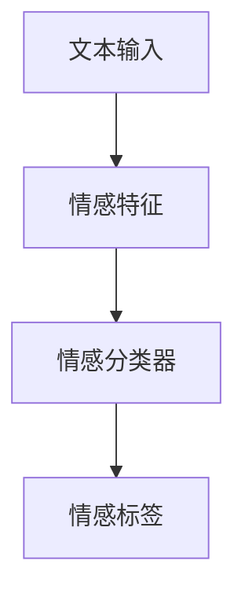
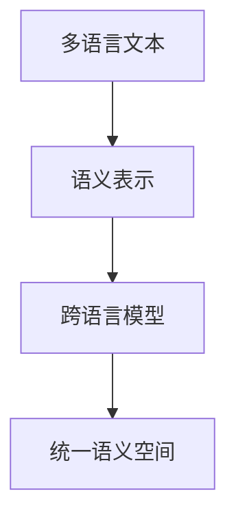
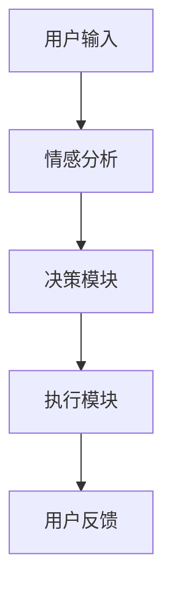

                 

# 开发AI Agent的多语言情感分析引擎

> 关键词：AI Agent，多语言情感分析，自然语言处理，深度学习，跨语言学习

> 摘要：本文深入探讨了开发AI Agent的多语言情感分析引擎的关键技术，包括情感分析的原理、多语言处理的挑战、AI Agent在情感分析中的应用，以及系统的架构设计和实现方案。通过详细的技术分析和实例，帮助读者理解如何构建高效、准确的多语言情感分析引擎。

---

# 第1章: AI Agent与多语言情感分析引擎的背景

## 1.1 问题背景

### 1.1.1 情感分析的定义与应用
情感分析是一种自然语言处理任务，旨在识别文本中蕴含的情感倾向，例如正面、负面或中性。它广泛应用于社交媒体监控、客户反馈分析、产品推荐等领域。随着全球化的加剧，情感分析的需求逐渐扩展到多语言环境，即对多种语言的文本进行情感分析。

### 1.1.2 多语言情感分析的挑战
多语言情感分析面临的主要挑战包括：
1. **数据稀疏性**：某些语言的标注数据较少，导致模型难以有效学习。
2. **跨语言语义差异**：不同语言中的词汇和语法结构差异可能导致情感表达的不同。
3. **计算资源限制**：多语言处理需要更多的计算资源和存储空间。

### 1.1.3 AI Agent在情感分析中的作用
AI Agent是一种能够自主决策和执行任务的智能体，可以在多语言环境中实时分析用户情感，提供个性化的反馈或服务。AI Agent的核心能力在于理解和处理复杂的情感信息，从而提高用户体验。

---

## 1.2 问题描述

### 1.2.1 多语言情感分析的核心问题
1. 如何在低资源语言中构建高质量的情感分析模型。
2. 如何有效处理跨语言语义差异，提升情感分析的准确性。

### 1.2.2 AI Agent在跨语言理解中的需求
1. 快速学习多种语言的情感表达。
2. 实时处理多语言输入并生成相应反馈。

### 1.2.3 当前技术的局限性与改进方向
当前技术在多语言情感分析中的局限性主要体现在模型的泛化能力和计算效率上。改进方向包括优化跨语言表示学习和提升模型的轻量化能力。

---

## 1.3 问题解决

### 1.3.1 多语言情感分析的解决方案
1. 利用预训练模型进行跨语言迁移学习。
2. 构建多语言数据集，通过数据增强技术提升模型性能。

### 1.3.2 AI Agent在情感分析中的实现路径
1. 基于深度学习的情感分析模型。
2. 基于强化学习的对话管理策略。

### 1.3.3 技术选型与实现策略
1. 技术选型：选择适合多语言处理的预训练模型，如BERT、XLM。
2. 实现策略：结合任务需求，设计高效的模型架构和训练策略。

---

## 1.4 边界与外延

### 1.4.1 多语言情感分析的边界
1. 仅支持特定语言和领域。
2. 模型性能受数据质量和规模限制。

### 1.4.2 AI Agent的功能边界
1. 专注于情感分析任务。
2. 不处理与情感分析无关的复杂任务。

### 1.4.3 相关技术的外延与区别
1. 与文本分类的区别：情感分析更注重情感倾向的判断。
2. 与机器翻译的区别：情感分析关注语义理解，而非语言转换。

---

## 1.5 概念结构与核心要素

### 1.5.1 情感分析的流程模型
1. 数据预处理：清洗、分词、停用词处理。
2. 特征提取：提取文本特征，如词袋模型、TF-IDF。
3. 模型训练：基于机器学习或深度学习方法训练情感分类器。
4. 情感预测：对输入文本进行情感分类。

### 1.5.2 多语言处理的核心要素
1. 跨语言表示学习：构建统一的语义表示空间。
2. 跨语言迁移学习：利用源语言数据提升目标语言模型性能。
3. 跨语言对比学习：通过对比目标语言和源语言的特征，优化模型表示。

### 1.5.3 AI Agent的组件构成
1. 感知模块：负责接收多语言输入并进行情感分析。
2. 决策模块：根据情感分析结果生成相应反馈或行动。
3. 执行模块：执行决策模块生成的指令。

---

## 1.6 本章小结

本章通过背景介绍、问题描述和解决方案，详细阐述了多语言情感分析和AI Agent的相关概念、挑战和实现路径。下一章将深入探讨核心概念与联系，帮助读者更好地理解多语言情感分析和AI Agent的技术细节。

---

# 第2章: 核心概念与联系

## 2.1 情感分析的核心原理

### 2.1.1 基于统计的方法
1. 词袋模型：统计文本中情感词的出现频率。
2. 朴素贝叶斯分类器：基于概率论进行分类。

### 2.1.2 基于深度学习的方法
1. RNN：处理序列数据，捕捉上下文信息。
2. CNN：提取文本中的局部特征。

### 2.1.3 基于预训练模型的方法
1. BERT：通过微调预训练模型进行情感分类。
2. XLM：专门设计的多语言预训练模型。

---

## 2.2 多语言处理的原理

### 2.2.1 跨语言表示学习
1. 目标：构建统一的语义表示空间。
2. 方法：利用对比学习或自监督学习优化表示。

### 2.2.2 跨语言迁移学习
1. 目标：利用源语言数据提升目标语言模型性能。
2. 方法：微调预训练模型或迁移特征。

### 2.2.3 跨语言句法分析
1. 目标：分析多语言文本的句法结构。
2. 方法：基于树形结构的句法分析。

---

## 2.3 AI Agent的实现原理

### 2.3.1 基于规则的对话管理
1. 方法：根据预设规则生成响应。
2. 优点：简单易实现，适用于规则明确的场景。
3. 缺点：灵活性差，难以处理复杂场景。

### 2.3.2 基于模型的对话管理
1. 方法：利用深度学习模型生成响应。
2. 优点：灵活性高，能够处理复杂场景。
3. 缺点：需要大量训练数据，计算资源消耗大。

### 2.3.3 基于强化学习的对话管理
1. 方法：通过强化学习优化对话策略。
2. 优点：能够自适应地学习最优策略。
3. 缺点：训练过程复杂，需要大量计算资源。

---

## 2.4 核心概念对比表格

| **核心概念** | **情感分析** | **多语言处理** | **AI Agent** |
|--------------|--------------|----------------|--------------|
| **定义**     | 判断文本情感 | 处理多种语言文本 | 智能体，能自主决策 |
| **任务目标** | 分类情感倾向 | 统一多语言语义 | 提供个性化服务 |
| **主要技术** | 统计方法、深度学习 | 跨语言表示、对比学习 | 规则、模型、强化学习 |

---

## 2.5 ER实体关系图

### 2.5.1 情感分析实体关系图

### 2.5.2 跨语言处理实体关系图

### 2.5.3 AI Agent实体关系图

---

## 2.6 本章小结

本章详细探讨了情感分析、多语言处理和AI Agent的核心原理，并通过对比分析和实体关系图展示了它们之间的联系。下一章将深入讲解算法原理，帮助读者理解多语言情感分析引擎的具体实现方法。

---

接下来的内容将按照目录大纲逐步展开，涵盖算法原理、数学模型、系统架构设计、项目实战、最佳实践等部分。每一章都将详细讲解相关技术，并结合实际案例和代码示例，帮助读者全面掌握开发AI Agent的多语言情感分析引擎的关键技术。

---

