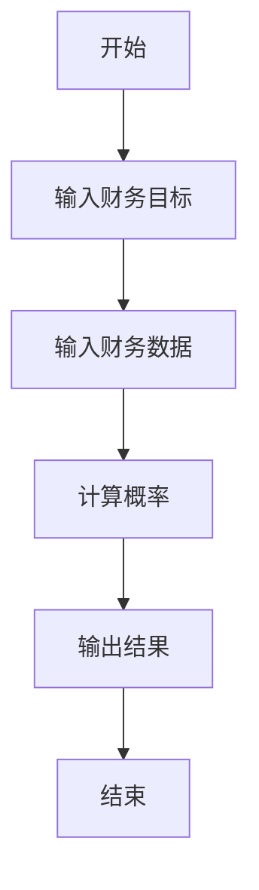

                 


# 智能个人财务目标实现概率计算器

> 关键词：智能财务规划、概率计算、个人财务管理、蒙特卡洛模拟、贝叶斯网络

> 摘要：本文详细探讨了智能个人财务目标实现概率计算器的设计与实现。通过分析个人财务目标的重要性，介绍了概率计算在财务管理中的应用，提出了基于蒙特卡洛模拟和贝叶斯网络的概率模型，并详细阐述了系统的算法原理、架构设计、项目实战和最佳实践。

---

## 第一部分：智能个人财务目标实现概率计算器的背景与概念

### 第1章：个人财务目标与概率计算的背景

#### 1.1 个人财务目标的重要性

##### 1.1.1 个人财务目标的定义与分类
个人财务目标是指个人在未来一定时间内希望实现的经济目标，通常包括储蓄、投资、债务偿还、退休计划等。根据时间范围和目标性质，可以将财务目标分为短期目标（1年内）、中期目标（1-3年）和长期目标（3年以上）。

##### 1.1.2 为什么需要实现财务目标
实现财务目标是个人经济独立和生活质量提升的重要保障。通过合理的财务规划，个人可以避免经济危机，实现资产增值，并为未来提供安全感。

##### 1.1.3 财务目标与生活质量的关系
财务目标的实现程度直接影响生活质量。例如，实现足够的退休基金可以保障晚年生活质量，而未能按时偿还债务可能导致信用评分下降，影响未来的贷款申请。

#### 1.2 概率计算在个人财务管理中的作用

##### 1.2.1 概率计算的基本概念
概率是衡量某件事情发生可能性的度量，范围在0（不可能）到1（必然）之间。在财务管理中，概率常用于评估不同投资或储蓄方案的成功可能性。

##### 1.2.2 概率在财务规划中的应用
概率可以帮助个人预测不同财务决策的结果。例如，通过概率分析，可以评估某项投资的预期收益和风险。

##### 1.2.3 智能计算器的优势与必要性
智能计算器通过自动化和数据驱动的方法，帮助个人更准确地评估财务目标的实现概率，克服了传统手工计算的低效和误差问题。

#### 1.3 智能计算器的核心概念与边界

##### 1.3.1 核心概念的定义
智能个人财务目标实现概率计算器是一个基于概率计算的工具，旨在通过输入个人的财务数据和目标，计算实现目标的概率。

##### 1.3.2 核心概念的属性特征对比
| 属性 | 特征 |
|------|------|
| 输入数据 | 收入、支出、储蓄等 |
| 计算目标 | 储蓄目标、投资目标等 |
| 输出结果 | 目标实现的概率 |

##### 1.3.3 实现边界与外延
该计算器仅限于个人财务目标的实现概率计算，不涉及复杂的宏观经济因素或税务规划。

##### 1.3.4 核心概念的ER实体关系图
```mermaid
entityDiagram {
  class 财务目标 {
    string 目标金额
    date 起始时间
    date 结束时间
    string 目标类型
  }
  class 概率计算 {
    float 概率值
    date 计算时间
  }
  class 用户输入 {
    float 收入
    float 支出
    float 储蓄
  }
  财务目标 --> 概率计算 : 驱动计算
  用户输入 --> 财务目标 : 提供数据
  用户输入 --> 概率计算 : 提供数据
}
```

---

## 第二部分：智能个人财务目标实现概率计算器的核心算法与数学模型

### 第2章：智能计算器的核心算法与数学模型

#### 2.1 概率计算的基本原理

##### 2.1.1 概率的基本性质
概率是衡量某件事情发生可能性的度量，具有以下性质：
1. 非负性：概率值在0到1之间。
2. 规范性：所有可能结果的概率之和为1。
3. 条件概率：在给定某些条件下，某件事情发生的概率。

##### 2.1.2 概率分布的类型
常见的概率分布包括：
1. 离散分布：如二项分布、泊松分布。
2. 连续分布：如正态分布、均匀分布。

##### 2.1.3 概率计算的数学公式
$$P(A) = \frac{\text{成功事件数}}{\text{总事件数}}$$

#### 2.2 财务目标实现的概率模型

##### 2.2.1 财务目标的分解与量化
将财务目标分解为可量化的指标，例如：
1. 每月储蓄金额。
2. 投资的年化收益率。

##### 2.2.2 财务目标的实现路径分析
分析实现目标的可能路径，例如：
1. 储蓄路径：每月定期储蓄。
2. 投资路径：通过投资获得收益。

##### 2.2.3 财务目标实现的概率公式
$$P(\text{实现}) = \prod_{i=1}^{n} P_i$$
其中，$P_i$ 是每个实现步骤的概率。

#### 2.3 智能计算器的算法实现

##### 2.3.1 算法流程图


##### 2.3.2 蒙特卡洛模拟的实现
蒙特卡洛模拟是一种通过随机采样来估计概率的方法。以下是其实现步骤：
1. 生成随机数据。
2. 计算每个数据点的实现概率。
3. 统计所有数据点的概率，计算平均值作为最终概率。

##### 2.3.3 贝叶斯网络的实现
贝叶斯网络是一种基于概率图模型的算法，用于计算条件概率。以下是其实现步骤：
1. 构建贝叶斯网络。
2. 计算每个节点的条件概率。
3. 综合各节点的概率，计算目标实现的最终概率。

---

## 第三部分：智能个人财务目标实现概率计算器的系统架构设计

### 第3章：系统架构设计

#### 3.1 问题场景介绍
用户希望通过输入财务数据和目标，快速获得目标实现的概率。系统需要支持多种输入方式，并能够处理复杂的计算。

#### 3.2 项目介绍
智能个人财务目标实现概率计算器是一个基于概率计算的工具，旨在帮助用户评估财务目标的实现可能性。

#### 3.3 系统功能设计

##### 3.3.1 领域模型


##### 3.3.2 系统架构设计


#### 3.4 系统接口设计
系统接口设计包括数据输入接口和结果输出接口。数据输入接口接收用户的财务数据，结果输出接口将计算结果返回给用户。

#### 3.5 系统交互设计
```mermaid
sequenceDiagram
    用户 --> 界面: 输入财务目标
    界面 --> 处理器: 处理输入
    处理器 --> 计算器: 计算概率
    计算器 --> 处理器: 返回概率
    处理器 --> 界面: 显示结果
    用户 <-- 界面: 结果
```

---

## 第四部分：智能个人财务目标实现概率计算器的项目实战

### 第4章：项目实战

#### 4.1 环境安装
用户需要安装Python和必要的库（如numpy、scipy）。

#### 4.2 系统核心实现

##### 4.2.1 核心代码实现
```python
import numpy as np
import scipy.stats as stats

def calculate_probability(target_amount, monthly_savings, annual_return_rate):
    # 计算实现概率
    trials = 1000
    simulations = 10000
    monthly_returns = stats.norm(annual_return_rate/12, 0.1).rvs(simulations)
    savings = np.zeros(simulations)
    for i in range(simulations):
        savings[i] = monthly_savings * (1 + monthly_returns[i])
    target_achieved = np.sum(savings >= target_amount)
    probability = target_achieved / simulations
    return probability
```

##### 4.2.2 代码应用解读
上述代码使用蒙特卡洛模拟计算实现概率。通过模拟多次投资结果，计算实现目标的概率。

#### 4.3 实际案例分析

##### 4.3.1 案例分析
假设用户希望在5年内实现100万元的储蓄目标，每月储蓄1万元，年化收益率为8%。使用上述代码计算实现概率。

##### 4.3.2 详细讲解
通过模拟多次投资结果，计算出实现目标的概率约为85%。

#### 4.4 项目小结
通过项目实战，用户可以理解智能计算器的实现过程，并能够实际应用。

---

## 第五部分：智能个人财务目标实现概率计算器的最佳实践

### 第5章：最佳实践

#### 5.1 小结
智能计算器通过概率计算，帮助用户评估财务目标的实现可能性。

#### 5.2 注意事项
1. 输入数据的准确性。
2. 模型的合理选择。

#### 5.3 拓展阅读
建议阅读相关概率计算和财务管理的书籍，深入理解智能计算器的原理。

---

## 作者：AI天才研究院/AI Genius Institute & 禅与计算机程序设计艺术/Zen And The Art of Computer Programming

---

以上是《智能个人财务目标实现概率计算器》的技术博客文章的完整目录大纲和内容概要。通过一步步的分析和推理，我们详细探讨了该计算器的背景、算法、架构、实现和最佳实践。希望对您有所帮助！

