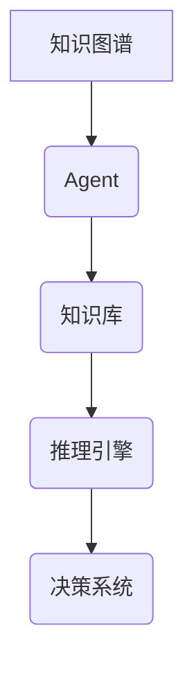
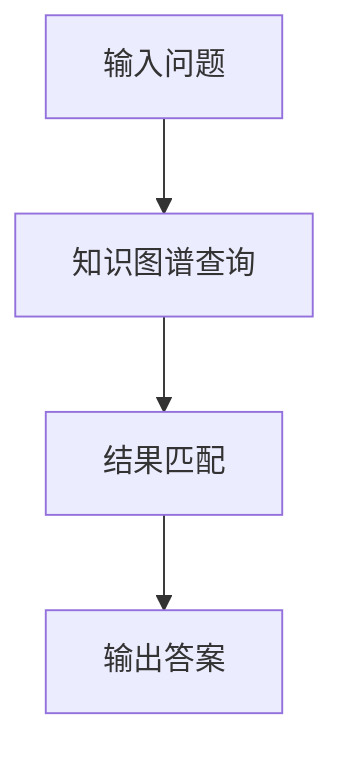
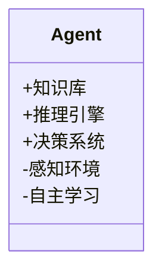
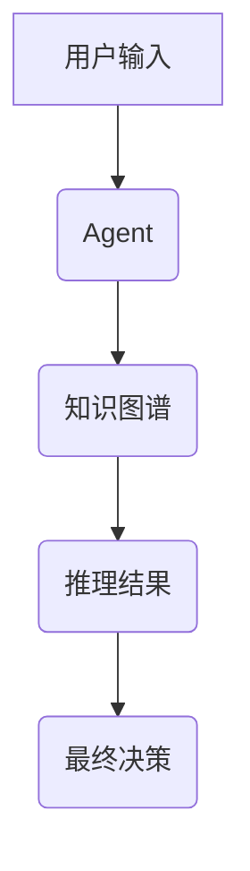

                 


# 知识图谱在AI Agent中的应用

**关键词**：知识图谱，AI Agent，智能体，问答系统，知识表示，决策模型，自然语言处理

**摘要**：  
本文详细探讨知识图谱在AI Agent中的应用，从背景介绍、核心概念、算法原理、系统架构到项目实战，全面解析知识图谱如何赋能AI Agent，提升其智能性和决策能力。通过具体案例分析，展示知识图谱在AI Agent中的实际应用场景，并展望未来发展方向。

---

## 第1章 知识图谱与AI Agent的背景介绍

### 1.1 知识图谱的定义与特点
知识图谱是一种结构化的数据表示方法，由三元组（头实体，关系，尾实体）组成，用于描述实体间的关系。其核心特点包括：
1. **结构化**：以图的形式组织知识，便于计算机理解和推理。
2. **可扩展性**：支持大规模知识的构建和扩展。
3. **语义丰富**：通过实体和关系的组合，提供丰富的语义信息。

### 1.2 AI Agent的定义与特点
AI Agent是一种能够感知环境、自主决策的智能体，其特点包括：
1. **自主性**：无需外部干预，自主完成任务。
2. **反应性**：能够实时感知环境并做出反应。
3. **学习能力**：通过学习提升自身能力。

### 1.3 知识图谱在AI Agent中的作用
知识图谱为AI Agent提供了丰富的知识库，使其能够更好地理解上下文、推理信息，并做出更智能的决策。

---

## 第2章 知识图谱与AI Agent的核心概念与联系

### 2.1 知识图谱的核心概念原理
知识图谱通过三元组表示法构建语义网络，支持实体的向量表示和相似度计算。

### 2.2 AI Agent的核心概念原理
AI Agent通过感知和决策机制，结合知识图谱进行推理和学习。

### 2.3 知识图谱与AI Agent的实体关系图


---

## 第3章 知识图谱与AI Agent的算法原理讲解

### 3.1 基于知识图谱的问答系统算法


#### 算法实现代码
```python
def knowledge_based_QA(question, knowledge_graph):
    results = knowledge_graph.query(question)
    if results:
        return results[0]
    else:
        return "无法回答"
```

---

## 第4章 知识图谱与AI Agent的数学模型与公式

### 4.1 知识图谱的表示学习模型
$$
\text{实体向量} = f(\text{实体名称})
$$

### 4.2 AI Agent的决策模型
$$
\text{相似度} = \frac{\text{向量点积}}{\|\text{向量1}\| \cdot \|\text{向量2}\|}
$$

---

## 第5章 系统分析与架构设计

### 5.1 应用场景
知识图谱在问答系统、推荐系统等领域有广泛应用。

### 5.2 系统功能设计


### 5.3 系统架构设计


---

## 第6章 项目实战

### 6.1 环境安装
安装必要的库，如知识图谱构建工具和深度学习框架。

### 6.2 代码实现
实现一个简单的问答系统，展示知识图谱在AI Agent中的应用。

### 6.3 案例分析
分析一个具体案例，展示知识图谱如何提升AI Agent的智能性。

---

## 第7章 总结与展望

### 7.1 最佳实践
建议在构建知识图谱时注重数据质量和模型优化。

### 7.2 小结
总结知识图谱在AI Agent中的重要性及其应用场景。

### 7.3 未来展望
展望知识图谱与AI Agent的进一步融合，推动更智能的决策系统。

---

**作者：AI天才研究院 & 禅与计算机程序设计艺术**

