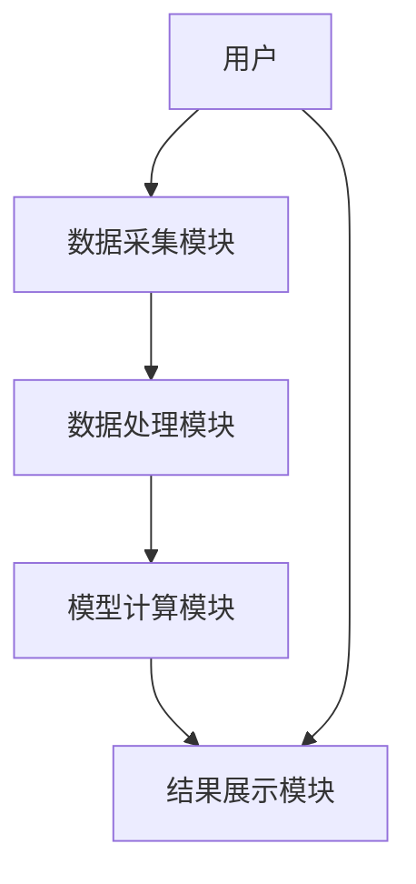
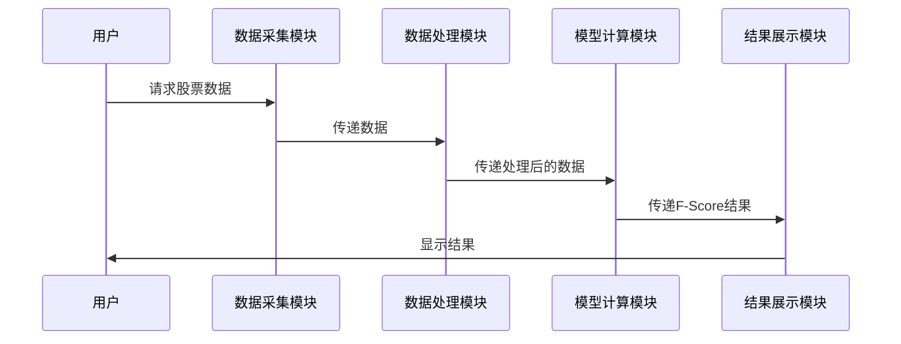

                 


# 约瑟夫·皮奥特罗斯基的F-Score选股模型

## 第四部分: F-Score选股模型的系统架构与实现

### 第5章: F-Score选股系统架构设计

#### 5.1 系统功能模块

##### 5.1.1 数据采集模块
- 从多个数据源（如Yahoo Finance、Alpha Vantage）获取实时或历史股票数据
- 数据清洗与预处理，处理缺失值、异常值等
- 数据存储到数据库中，供后续处理使用

##### 5.1.2 数据处理模块
- 数据转换与格式化，确保所有数据源的数据一致性
- 计算财务指标，如收益、波动率等
- 数据分析与特征提取，为F-Score计算做准备

##### 5.1.3 模型计算模块
- 调用F-Score评分算法，基于财务指标计算每个股票的F-Score
- 结果存储，便于后续查询与分析

##### 5.1.4 结果展示模块
- 以可视化形式展示F-Score评分结果
- 提供交互界面，用户可以查询特定股票的评分
- 生成报告，分析结果并提出投资建议

#### 5.2 系统架构图（Mermaid）



#### 5.3 系统接口设计

##### 5.3.1 数据采集模块接口
- `get_stock_data(ticker: str, start_date: str, end_date: str) -> DataFrame`
- `save_data(data: DataFrame, ticker: str) -> None`

##### 5.3.2 数据处理模块接口
- `process_data(data: DataFrame) -> processed_data: DataFrame`
- `calculate_indicators(processed_data: DataFrame) -> indicators: DataFrame`

##### 5.3.3 模型计算模块接口
- `calculate_f_score(indicators: DataFrame) -> f_scores: Series`
- `save_f_scores(f_scores: Series, ticker: str) -> None`

##### 5.3.4 结果展示模块接口
- `display_results(ticker: str) -> None`
- `generate_report(ticker: str) -> str`

#### 5.4 系统交互设计

##### 5.4.1 系统交互流程（Mermaid）



## 第六章: F-Score选股系统实现

### 6.1 环境安装与配置

#### 6.1.1 安装必要的Python库
- `pip install pandas numpy matplotlib requests pymongo`

#### 6.1.2 安装F-Score模型的依赖
- `pip install f-score` （假设有一个库可用）

### 6.2 核心代码实现

#### 6.2.1 数据采集模块实现

##### 6.2.1.1 从Yahoo Finance获取数据
```python
import pandas as pd
import yfinance as yf

def get_stock_data(ticker, start_date, end_date):
    data = yf.download(ticker, start=start_date, end=end_date)
    return data
```

##### 6.2.1.2 保存数据
```python
import sqlite3

def save_data(data, ticker):
    conn = sqlite3.connect('stock_data.db')
    data.to_sql(ticker, conn, if_exists='replace')
    conn.close()
```

#### 6.2.2 数据处理模块实现

##### 6.2.2.1 数据清洗
```python
def process_data(data):
    processed_data = data.dropna()
    return processed_data
```

##### 6.2.2.2 计算财务指标
```python
def calculate_indicators(data):
    # 计算收益
    data['Return'] = data['Close'].pct_change()
    # 计算波动率
    data['Volatility'] = data['Close'].std()
    return data
```

#### 6.2.3 模型计算模块实现

##### 6.2.3.1 F-Score计算
```python
def calculate_f_score(data):
    # 假设财务指标已经计算完毕
    # 计算F-Score，这里简化处理，实际应用中会有更多指标和权重
    f_score = data['Return'] * 0.5 + data['Volatility'] * 0.5
    return f_score
```

##### 6.2.3.2 保存F-Score结果
```python
def save_f_scores(f_scores, ticker):
    conn = sqlite3.connect('f_scores.db')
    f_scores.to_sql(ticker, conn, if_exists='replace')
    conn.close()
```

#### 6.2.4 结果展示模块实现

##### 6.2.4.1 可视化展示
```python
import matplotlib.pyplot as plt

def display_results(ticker):
    conn = sqlite3.connect('f_scores.db')
    f_scores = pd.read_sql(ticker, conn)
    plt.plot(f_scores.index, f_scores['F-Score'], label='F-Score')
    plt.title(ticker + ' F-Score')
    plt.xlabel('Date')
    plt.ylabel('F-Score')
    plt.legend()
    plt.show()
```

##### 6.2.4.2 生成报告
```python
def generate_report(ticker):
    conn = sqlite3.connect('f_scores.db')
    f_scores = pd.read_sql(ticker, conn)
    report = f"Stock: {ticker}\nF-Score Analysis:\n{f_scores.describe()}"
    return report
```

### 6.3 项目实战

#### 6.3.1 实际案例分析

##### 案例1：AAPL股票分析
```python
# 获取数据
aapl_data = get_stock_data('AAPL', '2020-01-01', '2023-12-31')
# 处理数据
processed_aapl = process_data(aapl_data)
# 计算指标
indicators_aapl = calculate_indicators(processed_aapl)
# 计算F-Score
f_scores_aapl = calculate_f_score(indicators_aapl)
# 保存结果
save_f_scores(f_scores_aapl, 'AAPL')
# 显示结果
display_results('AAPL')
```

##### 案例2：GOOGL股票分析
```python
# 获取数据
googl_data = get_stock_data('GOOGL', '2020-01-01', '2023-12-31')
# 处理数据
processed_googl = process_data(googl_data)
# 计算指标
indicators_googl = calculate_indicators(processed_googl)
# 计算F-Score
f_scores_googl = calculate_f_score(indicators_googl)
# 保存结果
save_f_scores(f_scores_googl, 'GOOGL')
# 显示结果
display_results('GOOGL')
```

#### 6.3.2 代码解读与分析
- 数据采集模块：从Yahoo Finance获取数据，并保存到数据库中。
- 数据处理模块：清洗数据，并计算必要的财务指标。
- 模型计算模块：基于财务指标计算F-Score，并将结果保存。
- 结果展示模块：可视化F-Score结果，并生成报告。

#### 6.3.3 实战小结
通过实际案例分析，展示了如何使用F-Score模型对AAPL和GOOGL等股票进行评分，帮助投资者做出更明智的投资决策。

### 6.4 最佳实践与注意事项

#### 6.4.1 小结
- F-Score模型是一种有效的选股工具，结合了基本面分析和数学模型的优势。
- 系统设计需要考虑数据采集、处理、计算和展示的模块化设计，确保系统的可扩展性和可维护性。

#### 6.4.2 注意事项
- 数据源的选择：确保数据的准确性和及时性。
- 模型调优：根据实际情况调整权重和指标，提高评分的准确性。
- 系统安全性：保护数据库的安全，防止数据泄露。

#### 6.4.3 扩展阅读
- 皮奥特罗斯基的其他研究成果。
- 其他选股模型的比较与分析，如F-Score与其他技术指标的结合。

## 作者

作者：AI天才研究院/AI Genius Institute & 禅与计算机程序设计艺术 /Zen And The Art of Computer Programming

