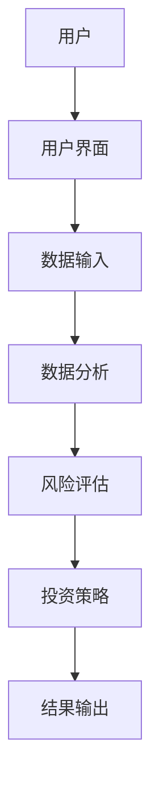
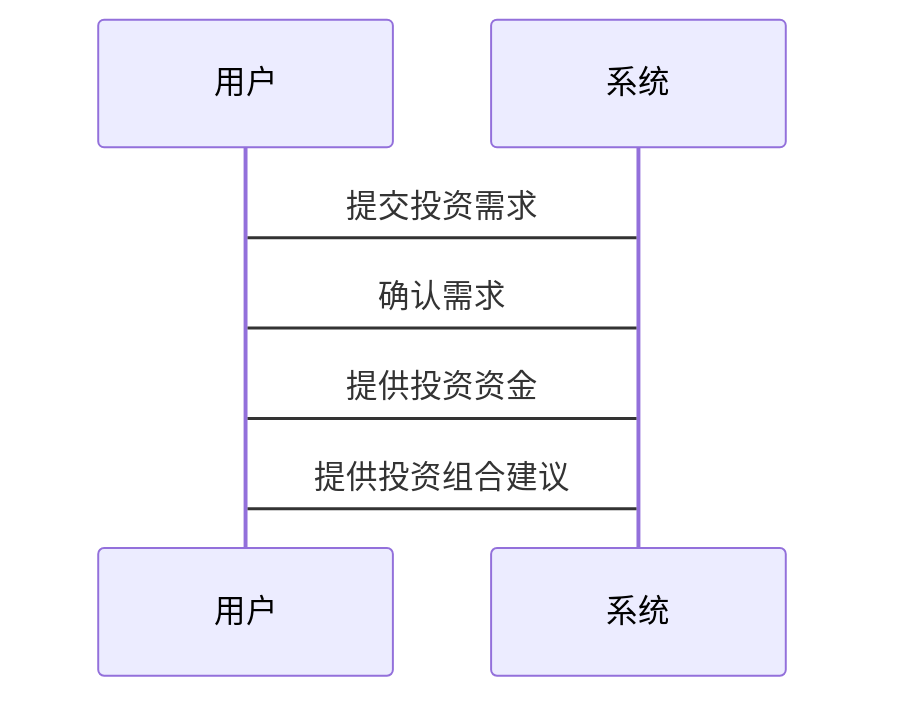

                 


```markdown
# 约翰·伯格的投资者教育理念

> 关键词：投资者教育，约翰·伯格，投资理念，长期投资，指数基金，风险管理，系统架构

> 摘要：本文详细阐述了约翰·伯格的投资者教育理念，从其背景、核心概念、理论基础到实际应用进行了全面分析。通过介绍资产配置、分散投资和成本控制等核心概念，结合现代投资组合理论和数学模型，探讨了如何通过系统架构和项目实战来实现有效的投资者教育。文章还提供了具体的案例分析和代码实现，帮助读者深入理解和应用这些理念。

---

# 第一部分: 背景介绍

## 第1章: 投资者教育的重要性
### 1.1 投资者教育的背景与意义
投资者教育是提升个人和机构投资决策能力的重要手段。通过教育，投资者能够更好地理解市场运作、风险管理和资产配置，从而做出更明智的投资决策。本文将从投资者教育的核心概念、理论基础和实际应用三个方面展开讨论。

### 1.2 约翰·伯格的背景与投资理念
约翰·伯格是 Vanguard 集团的创始人，他以其对指数基金的创新和对投资者教育的重视而闻名。伯格强调长期投资和分散投资的重要性，认为通过低成本的指数基金实现财富增长是最佳选择。本文将详细探讨他的核心理念。

---

# 第二部分: 核心理念

## 第2章: 资产配置的定义与重要性
### 2.1 资产配置的定义
资产配置是指将资金分配到不同的资产类别（如股票、债券、房地产等）中，以实现风险分散和收益最大化。资产配置的核心在于根据投资者的风险承受能力和投资目标进行合理的资产分配。

### 2.2 资产配置的重要性
资产配置能够有效降低投资组合的整体风险，同时提高收益的稳定性。通过合理的资产配置，投资者可以在不同市场环境下保持投资组合的稳定性。

### 2.3 资产配置的类型
资产配置通常分为战略性资产配置和战术性资产配置。战略性资产配置是长期的、基于投资者风险偏好和收益目标的配置；战术性资产配置则是短期的、基于市场环境的动态调整。

---

## 第3章: 分散投资的原理与应用
### 3.1 分散投资的原理
分散投资通过将资金分配到多个不同的资产或资产类别中，降低单一资产带来的风险。根据现代投资组合理论（MPT），分散投资能够有效降低非系统性风险。

### 3.2 分散投资的应用
在实际投资中，分散投资可以通过投资组合中包含不同类型的资产（如股票、债券、黄金等）来实现。此外，指数基金因其包含大量股票或债券的特点，也成为分散投资的理想工具。

### 3.3 分散投资的风险控制
通过分散投资，投资者可以有效降低特定资产或市场的风险，但系统性风险（如市场整体下跌）仍然存在。因此，投资者需要根据市场环境进行动态调整。

---

## 第4章: 成本控制的策略
### 4.1 投资成本的定义
投资成本包括管理费、交易费用和托管费用等。低成本投资策略通过降低这些费用，提高整体投资收益。

### 4.2 成本控制的重要性
长期来看，低成本投资策略能够显著提高投资收益。根据现代投资组合理论，即使微小的成本差异，长期积累也会对收益产生重大影响。

### 4.3 成本控制的实现
通过选择低成本的指数基金或交易所交易基金（ETF），投资者可以有效降低投资成本。此外，避免频繁交易和不必要的费用也是成本控制的重要手段。

---

# 第三部分: 理论基础

## 第5章: 现代投资组合理论（MPT）
### 5.1 均值-方差模型
现代投资组合理论的核心是通过优化投资组合的收益与风险关系，找到最优资产配置。均值-方差模型通过最大化收益或最小化风险来确定最优组合。

### 5.2 资本资产定价模型（CAPM）
资本资产定价模型描述了资产的预期收益与其系统性风险之间的关系。CAPM 为投资者提供了评估资产合理收益的工具。

### 5.3 投资组合优化的数学模型
$$
\text{最大化 } \mu_p - \lambda \times \sigma_p^2
$$

其中，$\mu_p$ 是投资组合的预期收益，$\sigma_p^2$ 是投资组合的风险，$\lambda$ 是风险厌恶系数。

---

## 第6章: 指数基金的数学模型
### 6.1 指数基金的定义
指数基金是通过跟踪特定市场指数（如标普500）进行投资的基金。其特点是分散投资、低成本和低维护。

### 6.2 指数基金的收益计算
指数基金的收益可以通过以下公式计算：

$$
\text{收益} = \sum_{i=1}^{n} w_i \times r_i
$$

其中，$w_i$ 是第 $i$ 个资产的权重，$r_i$ 是第 $i$ 个资产的收益率。

---

# 第四部分: 投资策略

## 第7章: 长期投资策略
### 7.1 长期投资的定义
长期投资是指持有资产超过一年的投资策略，其核心在于通过复利效应实现财富增长。

### 7.2 长期投资的优势
长期投资能够有效降低市场波动的影响，同时利用复利效应实现资产增值。

### 7.3 长期投资的风险管理
通过分散投资和定期再平衡，投资者可以有效管理长期投资的风险。

---

## 第8章: 价值投资策略
### 8.1 价值投资的定义
价值投资是通过寻找被市场低估的资产进行投资的策略，强调安全边际和长期价值。

### 8.2 价值投资的核心要素
价值投资的核心在于对资产的深入研究和长期持有，避免短期市场的波动干扰。

### 8.3 价值投资的风险控制
通过严格筛选和长期持有，价值投资者能够在市场波动中保持稳定收益。

---

# 第五部分: 风险管理

## 第9章: 风险管理的定义与重要性
### 9.1 风险管理的定义
风险管理是指识别、评估和应对投资中的潜在风险，以降低损失和提高收益。

### 9.2 风险管理的重要性
有效的风险管理能够帮助投资者在市场波动中保持投资组合的稳定性。

### 9.3 风险管理的实现
通过分散投资、定期再平衡和风险对冲等手段，投资者可以有效管理投资风险。

---

## 第10章: 风险对冲策略
### 10.1 风险对冲的定义
风险对冲是指通过投资相关资产或衍生工具，抵消投资组合中的部分风险。

### 10.2 风险对冲的应用
在实际投资中，投资者可以通过对冲市场风险或信用风险来降低整体投资风险。

### 10.3 风险对冲的优缺点
风险对冲能够有效降低特定风险，但同时也可能增加复杂性和成本。

---

# 第六部分: 系统架构

## 第11章: 投资者教育系统的架构设计
### 11.1 系统功能模块
- 用户界面模块
- 数据分析模块
- 风险评估模块
- 投资策略模块

### 11.2 系统架构图


### 11.3 系统接口设计
- 用户与系统交互接口
- 数据输入与输出接口
- 模块之间的调用接口

### 11.4 系统交互流程


---

# 第七部分: 项目实战

## 第12章: 指数基金组合构建
### 12.1 环境安装
- Python 3.8+
- pandas、numpy、scipy 等库

### 12.2 核心代码实现
```python
import pandas as pd
import numpy as np

# 示例指数基金数据
data = {'收益': [0.05, 0.03, 0.04, 0.02, 0.06]}
df = pd.DataFrame(data)

# 计算投资组合的收益
weights = np.array([1.0/5, 1.0/5, 1.0/5, 1.0/5, 1.0/5])
portfolio_return = np.sum(weights * df['收益'])

print(f"投资组合的预期收益为: {portfolio_return}")
```

### 12.3 案例分析
通过构建一个包含五只指数基金的投资组合，计算其预期收益和风险。案例分析展示了如何通过分散投资降低风险，同时实现稳定的收益。

### 12.4 项目小结
本项目通过实际操作，展示了如何在投资者教育中应用指数基金和资产配置的理论。通过代码实现和案例分析，读者可以更好地理解理论与实践的结合。

---

# 第八部分: 结论与展望

## 第13章: 结论
本文系统地介绍了约翰·伯格的投资者教育理念，从理论到实践，详细探讨了资产配置、分散投资和成本控制的核心概念。通过现代投资组合理论和指数基金的数学模型，结合实际案例和系统架构，为投资者提供了一套完整的教育方案。

## 第14章: 未来展望
随着金融科技的发展，投资者教育将更加智能化和个性化。未来的研究可以进一步探索人工智能在投资决策中的应用，以及如何通过技术手段提高投资者教育的效率和效果。

---

# 作者

作者：AI天才研究院/AI Genius Institute & 禅与计算机程序设计艺术 /Zen And The Art of Computer Programming
```

