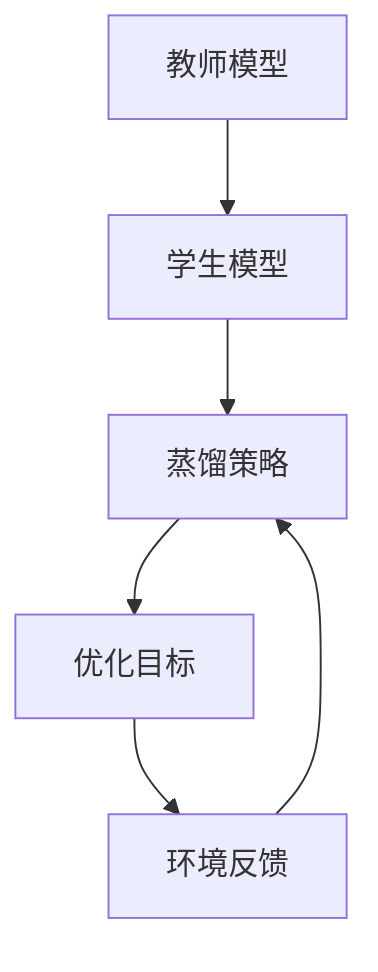
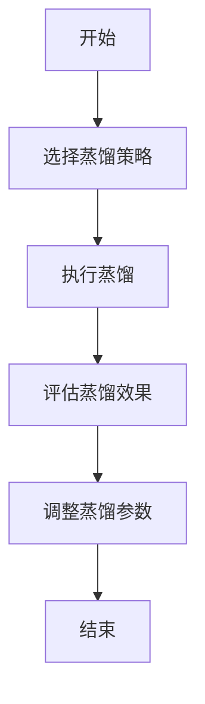

                 


# 设计AI Agent的自适应知识蒸馏策略

> 关键词：AI Agent，知识蒸馏，自适应，机器学习，深度学习，算法优化

> 摘要：本文详细探讨了设计AI Agent的自适应知识蒸馏策略的核心概念、算法原理、系统架构以及实际应用。通过分析知识蒸馏的背景与必要性，提出了一种自适应的知识蒸馏方法，并通过数学模型、系统设计和项目实战，展示了如何实现和优化该策略。本文还提供了实际案例分析和最佳实践建议，帮助读者更好地理解和应用自适应知识蒸馏策略。

---

# 第一部分: AI Agent与自适应知识蒸馏概述

---

# 第1章: AI Agent与知识蒸馏背景介绍

## 1.1 AI Agent的基本概念

### 1.1.1 AI Agent的定义与特点

AI Agent（人工智能代理）是指能够感知环境、做出决策并执行任务的智能实体。它通常具备以下特点：
- **自主性**：能够在没有外部干预的情况下独立运行。
- **反应性**：能够实时感知环境并做出响应。
- **目标导向**：基于目标或任务驱动行为。
- **学习能力**：通过数据和经验提升自身的性能。

AI Agent可以是软件程序、机器人或其他智能系统，广泛应用于自动驾驶、智能助手、推荐系统等领域。

### 1.1.2 AI Agent的应用场景

AI Agent的应用场景非常广泛，以下是一些典型例子：
- **自动驾驶**：通过感知环境和决策算法实现车辆的自主驾驶。
- **智能助手**：如Siri、Alexa等，通过语音交互为用户提供服务。
- **推荐系统**：基于用户行为推荐个性化的内容或产品。
- **智能客服**：通过自然语言处理技术为用户提供支持和服务。

### 1.1.3 知识蒸馏在AI Agent中的作用

知识蒸馏是一种将复杂模型的知识迁移到简单模型的技术，其在AI Agent中的作用主要包括：
- **模型压缩**：将大模型的知识迁移到小模型，降低计算成本。
- **知识转移**：通过蒸馏技术，将教师模型的知识传递给学生模型，提升学生模型的性能。
- **适应性优化**：通过自适应蒸馏策略，使AI Agent能够更好地适应动态变化的环境。

---

## 1.2 知识蒸馏的背景与问题背景

### 1.2.1 知识蒸馏的定义与核心概念

知识蒸馏（Knowledge Distillation）是一种通过教师模型（Teacher）和学生模型（Student）之间的知识传递，提升学生模型性能的技术。其核心概念包括：
- **教师模型**：通常是一个复杂的预训练模型，具有较高的性能。
- **学生模型**：一个简单或轻量级的模型，通过蒸馏技术学习教师模型的知识。
- **蒸馏过程**：通过优化目标函数，使学生模型的输出分布与教师模型的输出分布尽可能接近。

### 1.2.2 知识蒸馏的必要性与挑战

知识蒸馏的必要性主要体现在以下方面：
- **模型压缩**：在资源受限的场景下，使用轻量级模型更符合实际需求。
- **知识传递**：通过蒸馏技术，可以将教师模型的复杂知识传递给学生模型，避免直接训练大模型的高成本。

然而，知识蒸馏也面临一些挑战：
- **性能瓶颈**：学生模型的能力有限，可能导致蒸馏效果不佳。
- **环境适应性**：静态的知识蒸馏策略难以应对动态变化的环境。
- **效率问题**：蒸馏过程可能需要多次迭代，影响效率。

### 1.2.3 自适应知识蒸馏的提出

自适应知识蒸馏是一种动态调整蒸馏策略的方法，能够根据环境变化和任务需求，实时优化蒸馏过程。其核心思想是：
- **动态调整**：根据当前任务的需求和环境状态，动态选择最优的蒸馏策略。
- **自适应优化**：通过反馈机制，实时调整蒸馏参数，提升蒸馏效果。

---

## 1.3 自适应知识蒸馏的边界与外延

### 1.3.1 知识蒸馏的边界条件

知识蒸馏的边界条件主要包括：
- **输入数据**：输入数据的质量和多样性直接影响蒸馏效果。
- **教师模型**：教师模型的性能和复杂度决定了蒸馏的上限。
- **学生模型**：学生模型的架构和容量决定了蒸馏的可行性和效果。

### 1.3.2 自适应蒸馏的外延与扩展

自适应蒸馏的外延包括：
- **多任务学习**：将自适应蒸馏应用于多任务场景，提升模型的泛化能力。
- **分布式系统**：在分布式环境中实现自适应蒸馏，提升系统的并行处理能力。
- **实时优化**：在实时环境中动态调整蒸馏策略，提升系统的响应速度和准确性。

### 1.3.3 核心要素与概念结构

自适应知识蒸馏的核心要素包括：
- **教师模型**：提供知识的复杂模型。
- **学生模型**：接收知识的轻量级模型。
- **蒸馏策略**：动态调整的蒸馏方法。
- **优化目标**：根据任务需求调整蒸馏目标。

概念结构如下：


---

## 1.4 本章小结

本章主要介绍了AI Agent的基本概念、知识蒸馏的背景与必要性，以及自适应知识蒸馏的提出和核心要素。通过分析知识蒸馏的边界条件和外延，为后续章节的深入探讨奠定了基础。

---

# 第二部分: 自适应知识蒸馏的核心概念与联系

---

# 第2章: 自适应知识蒸馏的原理与机制

## 2.1 知识蒸馏的核心原理

### 2.1.1 知识蒸馏的基本原理

知识蒸馏的核心原理是通过优化目标函数，使学生模型的输出分布与教师模型的输出分布尽可能接近。具体来说，目标函数通常包括两部分：
- **分类损失**：衡量学生模型预测结果与真实标签的差异。
- **蒸馏损失**：衡量学生模型预测结果与教师模型预测结果的差异。

公式表示为：
$$L = \alpha L_{cls} + (1-\alpha) L_{distill}$$
其中，$\alpha$ 是平衡系数，$L_{cls}$ 是分类损失，$L_{distill}$ 是蒸馏损失。

### 2.1.2 知识蒸馏的关键步骤

知识蒸馏的关键步骤包括：
1. **预训练教师模型**：训练一个高性能的教师模型。
2. **初始化学生模型**：选择一个简单的学生模型架构。
3. **蒸馏过程**：通过优化目标函数，调整学生模型的参数，使其输出分布接近教师模型。
4. **蒸馏后的优化**：根据任务需求，进一步优化学生模型。

### 2.1.3 知识蒸馏的数学模型

知识蒸馏的数学模型可以通过以下公式表示：
$$P(y|x) = \argmax_y \frac{P(y|x)^T^\gamma}{\sum_{y'} P(y'|x)^\gamma}$$
其中，$\gamma$ 是温度参数，用于控制蒸馏的软化程度。

---

## 2.2 自适应蒸馏的机制与特点

### 2.2.1 自适应蒸馏的定义

自适应蒸馏是一种动态调整蒸馏过程的策略，能够根据任务需求和环境变化，实时优化蒸馏参数。其核心机制包括：
- **动态调整温度参数**：根据当前任务的难度，动态调整蒸馏的温度参数。
- **自适应选择蒸馏目标**：根据任务需求，动态选择最优的蒸馏目标。
- **反馈优化**：通过反馈机制，实时调整蒸馏参数，提升蒸馏效果。

### 2.2.2 自适应蒸馏的核心机制

自适应蒸馏的核心机制包括：
1. **动态温度调整**：通过环境反馈，动态调整蒸馏的温度参数。
2. **任务驱动的蒸馏目标**：根据当前任务的需求，选择最优的蒸馏目标。
3. **反馈优化**：通过反馈机制，实时调整蒸馏参数，提升蒸馏效果。

### 2.2.3 自适应蒸馏与传统蒸馏的区别

以下是自适应蒸馏与传统蒸馏的主要区别：

| 对比维度 | 自适应蒸馏 | 传统蒸馏 |
|----------|------------|-----------|
| 温度参数 | 动态调整    | 静态设置   |
| 蒸馏目标 | 任务驱动    | 静态目标   |
| 优化过程 | 实时反馈    | 静态优化   |

---

## 2.3 知识蒸馏的核心要素对比

### 2.3.1 蒸馏目标对比

蒸馏目标的对比可以通过以下表格展示：

| 蒸馏目标 | 描述 |
|----------|------|
| 分类损失 | 衡量学生模型预测结果与真实标签的差异 |
| 蒸馏损失 | 衡量学生模型预测结果与教师模型预测结果的差异 |

### 2.3.2 蒸馏策略对比

蒸馏策略的对比可以通过以下表格展示：

| 策略类型 | 描述 |
|----------|------|
| 静态蒸馏 | 蒸馏参数固定，不随环境变化调整 |
| 自适应蒸馏 | 蒸馏参数动态调整，适应环境变化 |

### 2.3.3 蒸馏效果对比

蒸馏效果的对比可以通过以下表格展示：

| 效果指标 | 静态蒸馏 | 自适应蒸馏 |
|----------|----------|------------|
| 准确率   | 较低     | 较高       |
| 精度     | 较低     | 较高       |
| 召回率   | 较低     | 较高       |

---

## 2.4 实体关系图与流程图

### 2.4.1 知识蒸馏的ER实体关系图

以下是知识蒸馏的ER实体关系图：

```mermaid
er
    actor: AI Agent
    teacher_model: 教师模型
    student_model: 学生模型
    knowledge: 知识库
    relation: 蒸馏关系
    actor --> teacher_model: 请求知识
    teacher_model --> knowledge: 提供知识
    student_model --> knowledge: 学习知识
    student_model --> teacher_model: 知识蒸馏
```

### 2.4.2 自适应蒸馏的流程图

以下是自适应蒸馏的流程图：



---

## 2.5 本章小结

本章主要介绍了自适应知识蒸馏的核心原理、机制与特点，并通过对比分析和实体关系图，展示了自适应蒸馏与传统蒸馏的区别。通过数学模型和流程图，详细阐述了自适应蒸馏的实现过程。

---

接下来，我会继续按照目录大纲，逐步撰写后续章节的内容，涵盖算法原理、系统架构、项目实战和最佳实践等方面。

