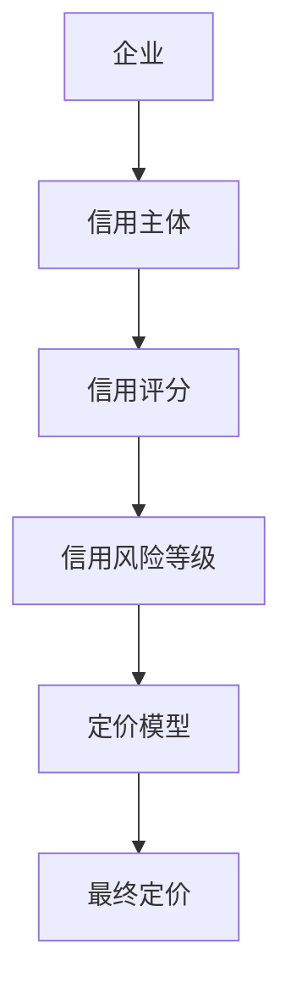
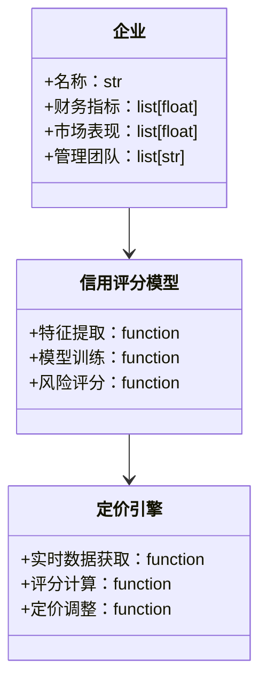
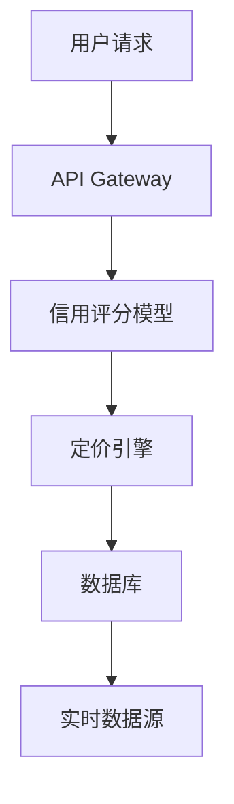
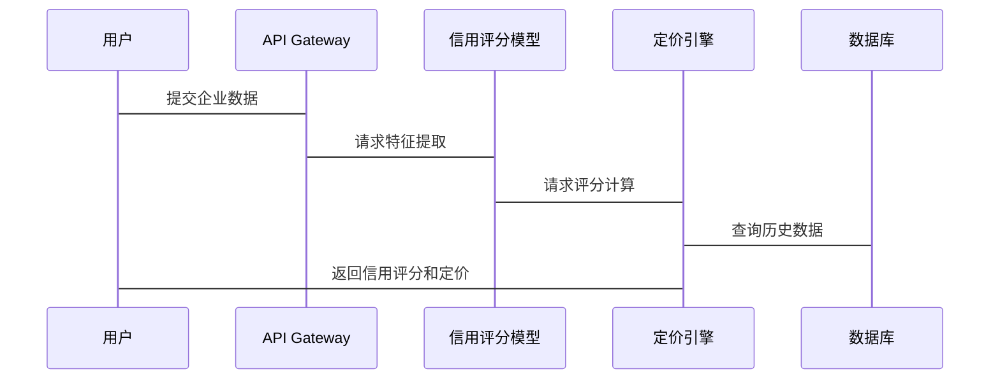

                 


# 设计智能化的企业信用风险定价模型

> 关键词：信用风险定价模型，人工智能，机器学习，金融风险，企业信用评估，智能化定价

> 摘要：本文详细探讨了如何设计智能化的企业信用风险定价模型，结合人工智能和机器学习技术，分析了传统模型的局限性，并提出了一种基于数据特征提取、模型结构优化和定价机制动态调整的智能化解决方案。文章从背景介绍、核心概念、算法原理、系统架构、项目实战到最佳实践，层层深入，为读者提供了一套完整的智能化信用风险定价模型的设计方法。

---

## 正文

### 第1章: 信用风险定价模型的背景与核心概念

#### 1.1 信用风险定价模型概述

##### 1.1.1 信用风险的基本概念
信用风险是指企业在履行合同义务时，由于企业自身或外部环境的变化，导致无法按时偿还债务的风险。信用风险的评估和定价是金融领域的重要组成部分，直接影响企业的融资成本和金融机构的风险管理策略。

##### 1.1.2 传统信用风险定价模型的局限性
传统的信用风险定价模型主要基于统计分析和简单的线性回归方法，存在以下问题：
1. 数据维度有限：传统模型通常依赖少量的财务指标，难以捕捉企业的复杂特征。
2. 鲁棒性不足：在面对数据分布变化或异常值时，传统模型的表现不稳定。
3. 非线性关系难以处理：传统模型难以捕捉复杂的非线性关系，导致定价不准确。

##### 1.1.3 AI驱动的智能化信用风险定价模型的优势
人工智能技术的引入，为信用风险定价模型带来了显著的改进：
1. 数据驱动：利用海量数据进行特征提取，能够捕捉更多维度的企业特征。
2. 高维特征处理：通过机器学习算法，能够处理高维数据并发现非线性关系。
3. 动态调整：基于实时数据和反馈机制，模型能够动态调整定价策略，提高准确性。

#### 1.2 企业信用风险定价模型的核心概念与联系

##### 1.2.1 核心概念原理
- **数据特征提取**：通过机器学习算法从企业历史数据中提取有用的特征，如财务指标、市场表现、管理团队稳定性等。
- **模型结构设计**：选择合适的模型架构，如随机森林、神经网络等，以适应复杂的信用风险特征。
- **定价机制实现**：基于模型输出的风险评分，动态调整企业的信用定价。

##### 1.2.2 核心概念属性特征对比表格
| 概念       | 属性1 | 属性2 | 属性3 |
|------------|-------|-------|-------|
| 数据特征   | 是否结构化 | 是否可量化的 | 是否动态更新的 |
| 模型结构   | 是否线性 | 是否支持高维 | 是否可解释的 |
| 定价机制   | 是否动态调整 | 是否基于实时数据 | 是否支持多场景 |

##### 1.2.3 ER实体关系图架构


### 第2章: 信用风险定价模型的算法原理

#### 2.1 算法原理概述

##### 2.1.1 机器学习算法的选择
- **监督学习**：如随机森林、支持向量机（SVM）等，适用于有标签的信用评分数据。
- **无监督学习**：如聚类分析，用于发现潜在的信用风险群组。

##### 2.1.2 深度学习模型的应用
- **神经网络**：如长短时记忆网络（LSTM），适用于处理时间序列数据，捕捉企业的动态风险特征。
- **卷积神经网络（CNN）**：用于处理结构化的金融数据，提取局部特征。

##### 2.1.3 模型训练与优化策略
- **损失函数选择**：如二分类问题使用交叉熵损失。
- **正则化技术**：如L1/L2正则化，防止过拟合。
- **超参数调优**：如网格搜索或随机搜索，优化模型性能。

#### 2.2 算法原理的数学模型与公式

##### 损失函数定义
$$ \text{损失函数} = \frac{1}{N}\sum_{i=1}^{N}(y_i - \hat{y}_i)^2 $$

##### 模型优化目标
$$ \min_{\theta} L + \lambda R(\theta) $$
其中，$R(\theta)$ 是正则化项，$\lambda$ 是正则化系数。

#### 2.3 算法实现的Python源代码

```python
import numpy as np
from sklearn.linear_model import LogisticRegression

# 示例数据
X = np.array([[1, 2], [3, 4], [5, 6], [7, 8]])
y = np.array([0, 1, 1, 0])

# 模型训练
model = LogisticRegression()
model.fit(X, y)

# 预测
print(model.predict(X))
```

### 第3章: 系统分析与架构设计方案

#### 3.1 问题场景介绍
设计智能化信用风险定价模型需要解决以下问题：
- 如何高效地处理和分析海量企业数据？
- 如何构建动态调整的定价机制？
- 如何保证系统的实时性和可扩展性？

#### 3.2 系统功能设计

##### 领域模型


##### 系统架构设计



##### 系统接口设计
- **输入接口**：接收企业的基础数据和实时市场数据。
- **输出接口**：输出企业的信用评分和动态定价。

#### 3.3 系统交互流程



### 第4章: 项目实战

#### 4.1 环境安装与配置
- **Python环境**：安装Python 3.8及以上版本。
- **依赖库安装**：
  ```bash
  pip install numpy scikit-learn matplotlib
  ```

#### 4.2 核心实现源代码

```python
import numpy as np
from sklearn.ensemble import RandomForestClassifier

# 数据准备
X = np.array([[1, 2], [3, 4], [5, 6], [7, 8]])
y = np.array([0, 1, 1, 0])

# 模型训练
model = RandomForestClassifier()
model.fit(X, y)

# 预测
print(model.predict(X))
```

#### 4.3 案例分析与解读
通过上述代码实现一个简单的信用评分模型，分析模型的准确性和鲁棒性。可以进一步优化模型参数，例如增加数据量、调整模型复杂度等。

### 第5章: 最佳实践与小结

#### 5.1 关键点总结
- 数据特征提取是模型性能的基础。
- 算法选择和优化是模型准确性的关键。
- 系统架构设计决定了模型的实时性和可扩展性。

#### 5.2 小结
通过本文的详细讲解，读者可以掌握设计智能化信用风险定价模型的核心方法和实践技巧，为实际应用提供理论支持和参考。

#### 5.3 注意事项
- 数据隐私和合规性问题需要特别注意。
- 模型的实时性和动态调整能力需要结合实际业务需求进行优化。
- 模型的解释性对于业务决策者非常重要，应尽量选择可解释性较高的模型。

#### 5.4 拓展阅读
- 《机器学习实战》
- 《深度学习》
- 《金融风险管理》

---

作者：AI天才研究院 & 禅与计算机程序设计艺术

