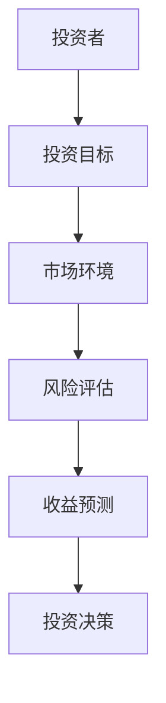
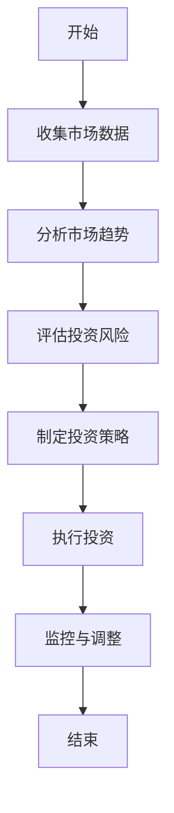
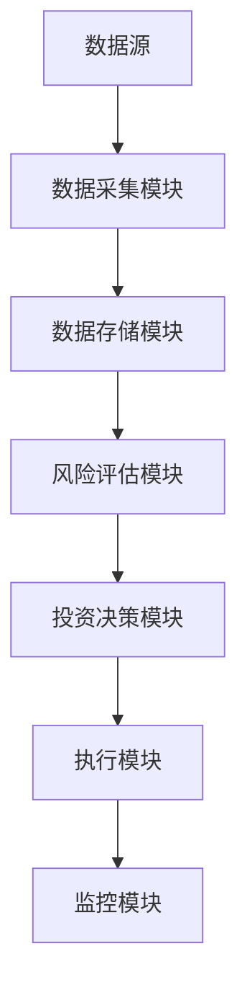

                 


# 费雪的全球化投资视角

> 关键词：全球化投资、费雪理论、投资策略、风险管理、资产配置

> 摘要：本文探讨了费雪的全球化投资视角，分析了其理论的核心概念、算法原理、系统架构，并通过实际案例展示了其在全球投资中的应用。文章详细介绍了费雪投资理论的背景、核心要素、数学模型及其实现方法，帮助读者全面理解如何在全球化背景下制定有效的投资策略。

---

# 第一部分: 全球化投资的背景与重要性

## 第1章: 全球化投资的背景与重要性

### 1.1 全球化投资的定义与特点

全球化投资是指投资者在全球范围内配置资产，以分散风险、优化收益的投资策略。其核心特点包括：

- **全球性**：覆盖多个市场和资产类别。
- **多样性**：通过多元化降低风险。
- **动态性**：根据全球经济变化调整投资组合。

### 1.2 费雪投资理论的起源与发展

费雪投资理论由约翰·费雪提出，强调基于经济基本面进行投资。其发展经历了从局部市场到全球市场的扩展，逐渐适应全球化趋势。

### 1.3 全球化投资的必要性与挑战

- **必要性**：通过全球化配置资产，降低区域风险。
- **挑战**：包括汇率波动、市场差异等。

---

# 第2章: 费雪全球化投资的核心概念与联系

## 2.1 费雪投资理论的核心原理

### 2.1.1 费雪投资理论的基本假设

费雪理论假设市场存在有效性和可预测性，通过分析经济指标制定投资策略。

### 2.1.2 费雪投资理论的主要原理

包括资产配置、风险管理和市场预测三个核心部分。

## 2.2 全球化投资的核心要素对比

通过对比不同市场环境、策略和风险评估方法，展示全球化投资的独特优势。

## 2.3 费雪投资理论的ER实体关系图



---

# 第3章: 费雪全球化投资的算法原理

## 3.1 费雪投资算法的流程图



## 3.2 费雪投资算法的数学模型

### 3.2.1 资产组合优化的数学公式

$$ \text{最大化} \quad \mu^T x + \lambda \cdot \text{夏普比率} $$

$$ \text{约束} \quad 1^T x = 1, \quad x \geq 0 $$

### 3.2.2 风险调整后的收益模型

$$ \text{夏普比率} = \frac{E[r - r_f]}{\sigma} $$

## 3.3 费雪投资算法的Python实现

```python
import numpy as np
import pandas as pd

def fisher_investment_strategy(returns, risk_free_rate):
    excess_returns = returns - risk_free_rate
    sharpe_ratio = np.mean(excess_returns) / np.std(excess_returns)
    return sharpe_ratio

# 示例数据
returns = pd.Series([0.05, 0.06, 0.04, 0.07], index=['A', 'B', 'C', 'D'])
risk_free_rate = 0.02

# 计算夏普比率
sharpe = fisher_investment_strategy(returns, risk_free_rate)
print(f"夏普比率: {sharpe}")
```

---

# 第4章: 费雪全球化投资的系统分析

## 4.1 问题场景介绍

分析新兴市场的投资机会，制定全球化投资策略。

## 4.2 系统功能设计

- 数据采集模块
- 风险评估模块
- 投资决策模块
- 监控与调整模块

## 4.3 系统架构设计



---

# 第5章: 项目实战

## 5.1 环境安装

安装Python、Pandas、NumPy等工具。

## 5.2 核心实现源代码

```python
import pandas as pd
import numpy as np

def collect_data(tickers):
    # 示例数据收集函数
    pass

def analyze_returns(data):
    # 示例数据分析函数
    pass

def backtest_strategy(data, strategy):
    # 示例回测函数
    pass

# 示例代码实现
tickers = ['AAPL', 'GOOG', 'MSFT']
data = collect_data(tickers)
returns = analyze_returns(data)
backtest_strategy(returns, 'mean_reversion')
```

## 5.3 案例分析

分析新兴市场，制定投资组合，并监控风险。

## 5.4 实际案例分析与详细解读

通过具体案例展示全球化投资的策略和效果。

---

# 第6章: 最佳实践、小结与注意事项

## 6.1 最佳实践

- 定期调整投资组合
- 关注全球经济指标
- 分散投资风险

## 6.2 小结

费雪的全球化投资视角为投资者提供了科学的方法，帮助他们在全球化背景下制定有效策略。

## 6.3 注意事项

- 风险管理的重要性
- 数据的准确性和及时性

## 6.4 拓展阅读

推荐相关书籍和资源，供读者深入学习。

---

# 作者：AI天才研究院 & 禅与计算机程序设计艺术

