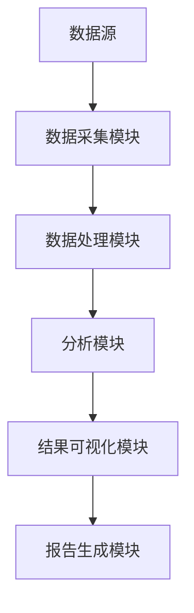

                 


# 费雪的行业分析方法

> 关键词：费雪、行业分析、投资策略、技术分析、企业分析、财务指标

> 摘要：费雪的行业分析方法是一种经典的行业和企业分析策略，旨在通过深入分析行业和企业的基本面，发现具有竞争优势和成长潜力的投资标的。本文将详细介绍费雪分析方法的核心框架、数学模型、系统架构设计以及实际项目案例，帮助读者全面掌握这一方法。

---

## 第一部分: 费雪的行业分析方法概述

### 第1章: 行业分析的背景与基础

#### 1.1 费雪投资分析方法的背景

##### 1.1.1 费雪投资分析方法的起源
菲利普·费雪（Philip Fisher）是20世纪著名的投资专家，他提出了“成长型投资”的概念，并强调长期关注企业的成长潜力和竞争优势。他的投资方法不同于传统的价值投资，更注重企业内在的成长性和行业环境的影响。

##### 1.1.2 费雪分析方法的核心思想
费雪认为，投资者应选择那些具有强大竞争优势、良好管理团队和持续增长潜力的企业。他提出了著名的“三步投资法”：
1. **第一步**：通过行业分析筛选出具有长期增长潜力的行业。
2. **第二步**：在选定的行业中，筛选出具有竞争优势和良好管理的企业。
3. **第三步**：通过财务分析和估值模型确定具有投资价值的企业。

##### 1.1.3 费雪分析方法的应用范围
费雪的分析方法广泛应用于股票投资、行业配置和企业战略决策中。尤其适用于成长型企业或行业的分析，帮助投资者识别具有长期增长潜力的投资标的。

#### 1.2 行业分析的基本概念

##### 1.2.1 行业的定义与分类
行业是指一组提供相似产品或服务的企业集合。根据规模、性质和所处阶段，行业可以分为成熟行业和成长行业。成熟行业增长稳定，而成长行业具有较高的增长潜力。

##### 1.2.2 行业分析的目的与意义
行业分析旨在帮助投资者识别行业趋势、竞争优势和潜在风险。通过分析行业，投资者可以更好地选择具有长期增长潜力的企业，降低投资风险。

##### 1.2.3 行业分析的步骤与流程
1. 确定行业的市场定位和竞争结构。
2. 分析行业的增长潜力和周期性。
3. 评估行业的财务健康状况。
4. 选择具有竞争优势的行业进行深入分析。

#### 1.3 费雪分析方法的核心框架

##### 1.3.1 费雪的三步投资法
- **第一步**：行业分析，筛选出具有长期增长潜力的行业。
- **第二步**：企业分析，评估企业的竞争优势和管理团队。
- **第三步**：财务分析，通过估值模型确定企业的投资价值。

##### 1.3.2 费雪的选股标准
1. 企业的市场地位和竞争优势。
2. 企业的管理层能力和战略。
3. 企业的财务状况和盈利潜力。
4. 企业的估值是否合理。

##### 1.3.3 费雪分析方法的优缺点
- **优点**：注重企业成长性和行业趋势，能够发现具有长期增长潜力的投资标的。
- **缺点**：对行业和企业的分析较为复杂，需要大量的数据支持和专业知识。

---

## 第2章: 费雪的核心分析框架

### 2.1 费雪的行业分析框架

#### 2.1.1 行业生命周期分析
行业的生命周期分为四个阶段：导入期、成长期、成熟期和衰退期。费雪分析方法强调选择处于成长期的行业，因为这些行业的增长潜力较大。

#### 2.1.2 行业竞争结构分析
通过分析行业的竞争结构，识别行业内的主要竞争对手和市场集中度。费雪认为，具有强大竞争优势的企业能够在行业中占据领先地位。

#### 2.1.3 行业财务指标分析
通过分析行业的财务指标，如收入增长率、利润率和资产负债率，评估行业的整体健康状况和增长潜力。

### 2.2 费雪的企业分析框架

#### 2.2.1 企业竞争优势分析
评估企业的核心竞争力，包括技术优势、成本优势和品牌优势。费雪认为，具有强大竞争优势的企业能够在行业中长期保持领先地位。

#### 2.2.2 企业管理层分析
分析企业的管理层能力和战略，评估管理层是否能够带领企业实现持续增长。

#### 2.2.3 企业财务状况分析
通过分析企业的财务报表，评估企业的盈利能力和财务健康状况。费雪认为，具有良好财务状况的企业更有可能实现长期增长。

### 2.3 费雪的行业与企业综合分析

#### 2.3.1 行业与企业的互动关系
行业和企业相互影响，行业趋势会影响企业的经营环境，而企业的战略和管理能力也会影响行业的发展。

#### 2.3.2 行业趋势对企业的影响
行业趋势如技术进步、政策变化和市场需求变化都会对企业产生重大影响。费雪分析方法强调关注行业趋势，以更好地把握企业的成长潜力。

#### 2.3.3 企业对行业趋势的应对策略
企业应根据行业趋势调整自身的战略和管理，以应对行业变化带来的挑战和机会。

---

## 第3章: 费雪分析方法的数学模型与公式

### 3.1 行业分析的数学模型

#### 3.1.1 行业增长模型
行业增长模型用于评估行业的增长潜力。常用的模型包括复合年均增长率（CAGR）和趋势外推模型。

$$ \text{CAGR} = \left( \frac{\text{末期值}}{\text{初期值}} \right)^{\frac{1}{n}} - 1 $$

#### 3.1.2 行业竞争模型
行业竞争模型用于评估行业的竞争结构，常用的模型包括市场份额分析和波特五力模型。

#### 3.1.3 行业风险模型
行业风险模型用于评估行业的潜在风险，常用的模型包括波动率分析和行业风险指数模型。

### 3.2 企业分析的数学模型

#### 3.2.1 企业盈利能力模型
企业盈利能力模型用于评估企业的盈利能力，常用的模型包括净利率和ROE（净资产收益率）。

$$ \text{ROE} = \frac{\text{净利润}}{\text{净资产}} $$

#### 3.2.2 企业成长性模型
企业成长性模型用于评估企业的成长潜力，常用的模型包括收入增长率和净利润增长率。

#### 3.2.3 企业估值模型
企业估值模型用于评估企业的投资价值，常用的模型包括市盈率（P/E）和市净率（P/B）。

$$ \text{P/E} = \frac{\text{股价}}{\text{每股收益}} $$

### 3.3 费雪分析方法的综合模型

#### 3.3.1 综合评分模型
综合评分模型用于评估企业的综合得分，常用的模型包括费雪综合评分模型。

#### 3.3.2 综合风险收益模型
综合风险收益模型用于评估企业的风险收益比，常用的模型包括夏普比率和特雷诺比率。

#### 3.3.3 综合投资决策模型
综合投资决策模型用于评估企业的投资价值，常用的模型包括费雪投资决策模型。

---

## 第4章: 费雪分析方法的系统架构设计

### 4.1 系统分析与架构设计方案

#### 4.1.1 行业数据分析模块
行业数据分析模块用于收集和处理行业数据，包括行业增长率、竞争结构和财务指标。

#### 4.1.2 企业信息处理模块
企业信息处理模块用于收集和处理企业信息，包括企业的竞争优势、管理层能力和财务状况。

#### 4.1.3 费雪分析模型实现模块
费雪分析模型实现模块用于将行业和企业数据输入费雪分析模型，输出分析结果。

### 4.2 系统功能设计

#### 4.2.1 数据采集与预处理
数据采集与预处理模块用于从多种数据源采集行业和企业数据，并进行清洗和标准化处理。

#### 4.2.2 行业与企业分析功能
行业与企业分析功能模块用于执行行业和企业分析，包括行业生命周期分析、竞争结构分析和财务指标分析。

#### 4.2.3 结果可视化与报告生成
结果可视化与报告生成模块用于将分析结果可视化，并生成详细的分析报告。

### 4.3 系统架构图



---

## 第5章: 费雪分析方法的项目实战

### 5.1 项目环境与工具安装

#### 5.1.1 环境配置
项目环境配置包括操作系统、编程语言和开发工具的安装与配置。推荐使用Python作为开发语言，并安装Pandas、NumPy和Matplotlib等库。

#### 5.1.2 工具安装
工具安装包括安装Python、Jupyter Notebook和数据可视化工具。

#### 5.1.3 数据源获取
数据源获取包括从公开数据源（如Yahoo Finance）获取行业和企业数据。

### 5.2 核心代码实现

#### 5.2.1 数据处理代码
数据处理代码用于清洗和标准化数据，包括缺失值处理和异常值处理。

```python
import pandas as pd

# 读取数据
data = pd.read_csv('industry_data.csv')

# 处理缺失值
data = data.dropna()

# 处理异常值
data = data[abs(data['revenue'] - data['revenue'].mean()) < 3 * data['revenue'].std()]
```

#### 5.2.2 行业分析代码
行业分析代码用于执行行业生命周期分析和竞争结构分析。

```python
import matplotlib.pyplot as plt

# 行业生命周期分析
data['industry_stage'] = '成长期'  # 示例代码，实际需要根据增长率判断
plt.hist(data['industry_stage'], bins=3, alpha=0.5, rwidth=0.9)
plt.title('行业生命周期分布')
plt.show()
```

#### 5.2.3 企业分析代码
企业分析代码用于执行企业竞争优势分析和财务状况分析。

```python
# 企业竞争优势分析
data['competitive_advantage'] = '强'  # 示例代码，实际需要根据多个指标综合判断
plt.bar(data['company'], data['competitive_advantage'], alpha=0.6)
plt.title('企业竞争优势分布')
plt.show()
```

### 5.3 实战案例分析

#### 5.3.1 案例背景介绍
以科技行业为例，分析某科技企业的行业地位和竞争优势。

#### 5.3.2 数据分析与处理
从公开数据源获取科技行业的数据，并进行清洗和预处理。

#### 5.3.3 费雪分析方法的应用
执行行业生命周期分析、竞争结构分析和财务指标分析，评估该科技企业的投资价值。

#### 5.3.4 结果解读与策略制定
根据分析结果，制定投资策略，选择具有长期增长潜力的企业进行投资。

---

## 第6章: 费雪分析方法

作者：AI天才研究院/AI Genius Institute & 禅与计算机程序设计艺术 /Zen And The Art of Computer Programming

---

通过本文的详细讲解，读者可以全面掌握费雪的行业分析方法，包括其核心框架、数学模型、系统架构设计和实际项目案例。费雪分析方法是一种强大的工具，能够帮助投资者识别具有长期增长潜力的企业，降低投资风险。希望本文能够为读者在投资决策中提供有价值的参考和指导。

