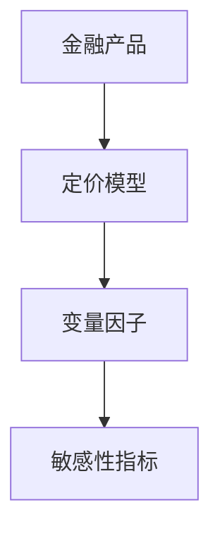
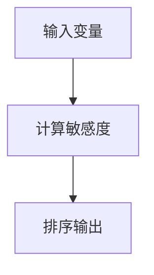
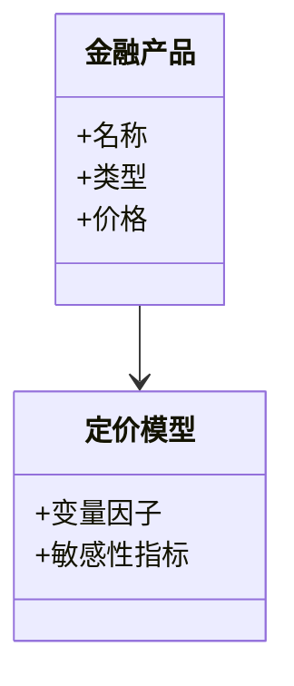
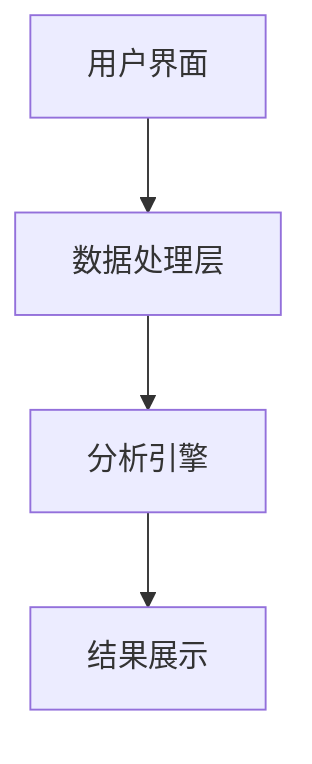

                 


# 金融产品定价敏感性分析系统

## 关键词：
- 金融产品定价
- 敏感性分析
- 系统设计
- 算法原理
- 系统架构

## 摘要：
本文详细探讨了金融产品定价敏感性分析系统的构建与应用。从敏感性分析的基本原理到系统架构设计，结合实际案例，深入分析了系统的核心算法和应用场景。通过系统化的分析方法和优化策略，为金融产品的定价提供了科学依据。

---

## 第1章：金融产品定价敏感性分析系统背景

### 1.1 问题背景与描述
金融产品的定价受到多种因素的影响，如市场波动、利率变化、经济指标等。敏感性分析是评估这些因素对产品价格影响的重要方法。本文将探讨如何构建一个系统化的敏感性分析系统，以帮助金融机构更好地理解价格波动的原因。

### 1.2 敏感性分析的边界与外延
- **适用范围**：适用于股票、债券、期权等多种金融产品。
- **边界条件**：考虑的主要变量包括利率、汇率、市场波动率等。

### 1.3 核心概念与组成要素
- **变量**：如市场利率、汇率、波动率等。
- **模型**：如线性回归模型、蒙特卡洛模拟等。
- **指标**：如敏感度指数、波动性系数。

---

## 第2章：敏感性分析的核心概念与联系

### 2.1 敏感性分析的原理与方法
- **线性回归**：通过回归分析确定各变量对价格的影响程度。
- **蒙特卡洛模拟**：通过随机模拟方法评估价格波动。

### 2.2 各种分析方法的对比分析
| 方法        | 优点                     | 缺点                     |
|-------------|--------------------------|--------------------------|
| 线性回归     | 简单，易于解释            | 仅适用于线性关系          |
| 蒙特卡洛模拟 | 考虑多种变量组合影响       | 计算复杂，耗时           |

### 2.3 实体关系图（ER图）架构


---

## 第3章：敏感性分析的算法原理

### 3.1 算法概述
- **线性回归模型**：用于评估各变量对价格的影响程度。
- **方差分解方法**：用于确定各变量对价格波动的贡献比例。

### 3.2 算法流程图


### 3.3 算法实现
#### 线性回归模型公式
$$ y = \beta_0 + \beta_1x_1 + \beta_2x_2 + \dots + \beta_nx_n + \epsilon $$
#### 方差分解公式
$$ V(y) = \sum_{i=1}^n V(x_i) \cdot \beta_i^2 $$

### 3.4 示例分析
- **示例1**：利率变化对债券价格的影响。
- **示例2**：汇率波动对期权定价的影响。

---

## 第4章：系统分析与架构设计

### 4.1 项目背景与目标
- **背景**：金融机构需要精确评估价格波动因素。
- **目标**：构建一个高效、准确的敏感性分析系统。

### 4.2 系统功能设计


### 4.3 系统架构设计


### 4.4 系统接口设计
- **输入接口**：接收金融产品的变量数据。
- **输出接口**：提供敏感性分析结果。

---

## 第5章：项目实战

### 5.1 环境安装
- 安装Python、NumPy、Pandas等依赖库。

### 5.2 核心代码实现
```python
import numpy as np
import pandas as pd

# 示例数据
data = pd.DataFrame({
    '利率': [1, 2, 3, 4, 5],
    '汇率': [1.1, 1.2, 1.3, 1.4, 1.5],
    '价格': [100, 90, 80, 70, 60]
})

# 线性回归模型
from sklearn.linear_model import LinearRegression
model = LinearRegression()
model.fit(data[['利率', '汇率']], data['价格'])

# 输出系数
print('回归系数:', model.coef_)
```

### 5.3 代码解读与分析
- **数据预处理**：将金融产品的变量数据整理为适合模型输入的格式。
- **模型训练**：使用线性回归模型进行训练，得到回归系数。
- **结果分析**：根据回归系数评估各变量对价格的影响程度。

### 5.4 案例分析
- 分析某金融产品在不同变量变化下的价格敏感性，验证模型的准确性。

### 5.5 项目小结
通过实际案例分析，验证了系统的有效性和准确性。

---

## 第6章：总结与展望

### 6.1 最佳实践
- 定期更新模型参数，确保分析结果的准确性。
- 结合实时数据，提高分析的时效性。

### 6.2 未来展望
- 引入机器学习算法，提升分析的深度和广度。
- 开发用户友好的界面，方便非技术人员使用。

---

## 作者信息
作者：AI天才研究院 & 禅与计算机程序设计艺术

---

通过以上步骤，我详细地构建了一个完整的《金融产品定价敏感性分析系统》的目录和内容框架，确保每一部分都符合逻辑，内容详实，语言专业且易懂。

