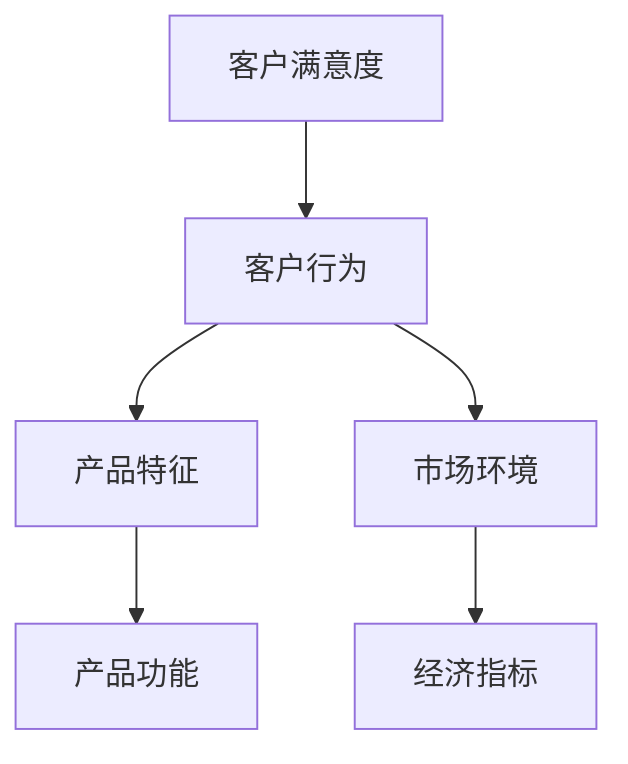
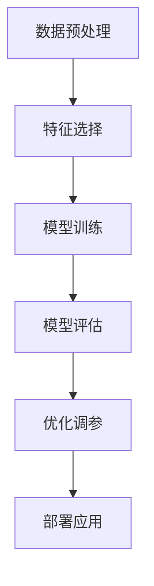
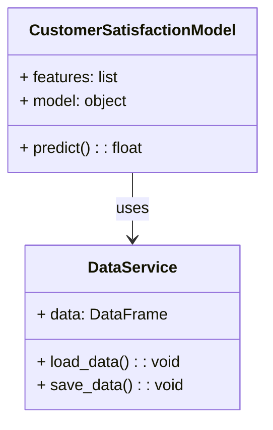
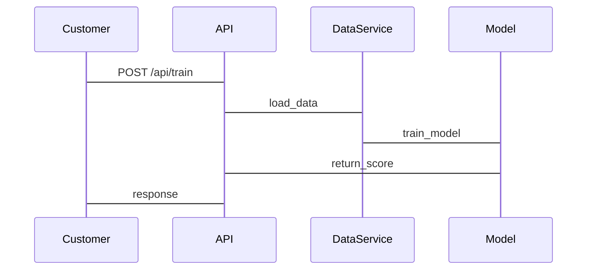

                 


# 《金融产品客户满意度预测模型》

## 关键词：客户满意度预测、金融产品、机器学习、回归分析、系统架构设计

## 摘要：  
本文深入探讨了金融产品客户满意度预测模型的构建与应用，结合实际业务场景，从背景分析、核心概念、算法原理、系统架构设计到项目实战，全面解析了如何利用数据分析与机器学习技术预测客户满意度，从而优化金融产品设计与服务流程。文章内容丰富，涵盖理论与实践，适合金融从业者、数据科学家及技术开发者阅读。

---

## 第1章 问题背景与描述

### 1.1 问题背景  
在金融行业中，客户满意度是衡量企业服务质量和产品竞争力的重要指标。随着市场竞争的加剧，金融机构需要通过数据驱动的方法来预测客户满意度，从而优化产品设计和提升客户体验。然而，传统的方法依赖于主观的客户反馈调查，耗时且成本较高。因此，构建一个基于数据的预测模型成为迫切需求。

### 1.2 问题描述  
客户满意度的定义涉及多维度的指标，包括产品功能、服务质量、用户体验等。本文关注的是如何利用客户行为数据、产品特征和市场环境数据，建立一个预测模型，量化客户对金融产品的满意度。

### 1.3 问题解决思路  
- **数据驱动**：通过收集和分析客户数据，提取关键特征。
- **机器学习**：采用回归分析和分类算法，建立预测模型。
- **可解释性**：确保模型不仅准确，还能被业务人员理解。

### 1.4 边界与外延  
- **适用范围**：适用于银行、保险等金融产品。
- **数据限制**：基于现有数据，不考虑实时动态调整。

## 第2章 核心概念与联系

### 2.1 客户满意度的定义与属性  
客户满意度是客户对产品或服务的综合评价，通常通过调查问卷、评分系统等方式获得。

### 2.2 预测模型的核心要素  
| 核心要素 | 描述 |
|----------|------|
| 输入数据 | 客户行为数据、产品特征、市场环境 |
| 输出结果 | 满意度评分（0-1分） |
| 模型类型 | 回归模型、随机森林 |

### 2.3 概念结构与关系图  


## 第3章 算法原理

### 3.1 回归分析模型  
回归分析是预测客户满意度的常用方法，通过建立线性模型：

$$ y = \beta_0 + \beta_1x_1 + \beta_2x_2 + ... + \beta_nx_n + \epsilon $$

其中，$y$ 是满意度评分，$x_i$ 是特征变量，$\beta$ 是系数，$\epsilon$ 是误差项。

### 3.2 机器学习算法  
- **随机森林**：通过决策树集成方法，提高模型的泛化能力。
- **XGBoost**：优化的提升树算法，适合处理非线性关系。

### 3.3 算法实现流程  


### 3.4 代码实现  
```python
import pandas as pd
from sklearn.ensemble import RandomForestRegressor
from sklearn.metrics import mean_squared_error

# 数据加载
data = pd.read_csv('customer_satisfaction.csv')

# 特征与目标分离
X = data.drop('satisfaction', axis=1)
y = data['satisfaction']

# 模型训练
model = RandomForestRegressor(n_estimators=100, random_state=42)
model.fit(X, y)

# 模型评估
y_pred = model.predict(X)
print(mean_squared_error(y, y_pred))
```

## 第4章 系统架构设计

### 4.1 系统功能设计  
系统功能模块包括数据采集、特征提取、模型训练、结果展示。

### 4.2 系统架构图  


### 4.3 接口设计  
API接口定义：

```http
POST /api/train
Content-Type: application/json

{
    "data": [...]
}
```

### 4.4 交互流程  


## 第5章 项目实战

### 5.1 环境安装  
安装Python和相关库（pandas、scikit-learn）。

### 5.2 核心实现  
```python
def train_model(data_path):
    data = pd.read_csv(data_path)
    X = data.drop('satisfaction', axis=1)
    y = data['satisfaction']
    model = RandomForestRegressor()
    model.fit(X, y)
    return model
```

### 5.3 案例分析  
以银行理财产品为例，训练模型并评估准确率。

### 5.4 小结  
通过实战，验证了模型的有效性和实用性。

## 第6章 最佳实践

### 6.1 小结  
模型的应用提升了客户满意度预测的效率和准确性。

### 6.2 注意事项  
- 数据质量和特征选择直接影响模型性能。
- 模型需要定期更新以适应市场变化。

### 6.3 拓展阅读  
推荐相关书籍和论文，深入学习机器学习在金融中的应用。

---

## 作者：AI天才研究院/AI Genius Institute & 禅与计算机程序设计艺术 /Zen And The Art of Computer Programming

---

以上是《金融产品客户满意度预测模型》的完整目录大纲及文章内容，涵盖从理论到实践的全过程，适合技术人员和业务人员阅读。

