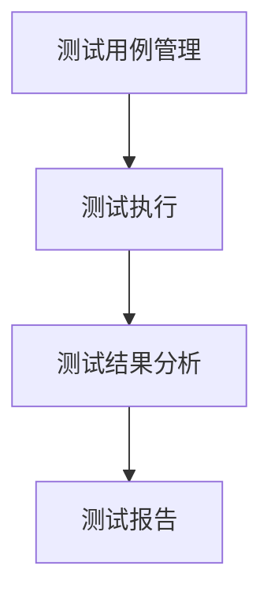

                 


# 《金融监管合规自动化测试平台》

> 关键词：金融监管、合规测试、自动化测试、规则引擎、机器学习

> 摘要：本文详细介绍了金融监管合规自动化测试平台的背景、核心概念、技术架构、系统实现、项目实战以及优化建议。通过对比分析和实际案例，阐述了平台在提高测试效率、降低成本、增强监管合规性方面的优势，并提供了具体的实现方案和最佳实践。

---

# 第一部分: 金融监管合规自动化测试平台背景介绍

## 第1章: 问题背景与描述

### 1.1 问题背景

在金融行业，合规性是企业的生命线。随着金融市场的快速发展，监管要求日益严格，金融机构需要频繁应对复杂的合规检查。传统的合规测试依赖人工操作，存在效率低、成本高、错误率高的问题。如何利用技术手段提高合规测试的效率和准确性，成为金融机构亟待解决的难题。

### 1.2 问题描述

- **人工测试的痛点**：测试人员需要手动编写测试用例、执行测试并分析结果，效率低下且容易出错。
- **合规要求的复杂性**：金融监管涉及多个领域，如反洗钱、关联交易、信息披露等，测试规则复杂且动态变化。
- **数据量大**：金融机构处理的数据量庞大，人工测试难以覆盖所有场景。

### 1.3 解决思路

- **自动化测试的必要性**：通过自动化测试平台，可以快速生成测试用例、执行测试并自动生成报告，显著提高效率。
- **平台的核心目标**：构建一个智能化的金融监管合规测试平台，能够自动识别合规风险，提供实时反馈。

### 1.4 边界与外延

- **边界**：平台专注于合规测试，不涉及业务逻辑的处理。
- **外延**：未来可以扩展到其他领域的合规测试，如税务合规、数据合规等。

---

# 第二部分: 核心概念与技术框架

## 第2章: 核心概念

### 2.1 金融监管合规测试的流程

- **传统测试流程**：编写测试用例 → 手动执行 → 分析结果。
- **自动化测试流程**：自动生成测试用例 → 自动执行 → 自动生成报告。

### 2.2 技术框架对比分析

| 技术框架         | 优点                     | 缺点                     |
|------------------|--------------------------|--------------------------|
| 规则引擎         | 易配置，适合规则明确的场景 | 难应对动态变化的规则     |
| 机器学习模型     | 能处理复杂场景，自适应性强 | 需大量数据训练，初期成本高 |

---

# 第三部分: 平台的技术架构与实现

## 第3章: 系统架构设计

### 3.1 模块划分与功能分配

- **测试用例管理模块**：负责测试用例的生成与管理。
- **测试执行模块**：负责测试用例的执行。
- **测试结果分析模块**：负责分析测试结果并生成报告。

### 3.2 系统架构图



---

## 第4章: 核心算法原理

### 4.1 规则引擎实现

#### 4.1.1 规则引擎的工作原理

规则引擎通过预定义的规则对输入数据进行判断，生成测试用例。规则可以是简单的条件判断，也可以是复杂的逻辑组合。

#### 4.1.2 规则引擎实现代码示例

```python
def generate_test_cases(rules):
    test_cases = []
    for rule in rules:
        test_case = {}
        for condition in rule['conditions']:
            if condition['type'] == 'and':
                # 处理逻辑与条件
                pass
            elif condition['type'] == 'or':
                # 处理逻辑或条件
                pass
        test_cases.append(test_case)
    return test_cases
```

---

### 4.2 机器学习模型实现

#### 4.2.1 机器学习模型的工作原理

模型通过训练数据学习合规测试的特征，生成测试用例。常用的算法包括决策树、随机森林等。

#### 4.2.2 机器学习模型实现代码示例

```python
from sklearn.tree import DecisionTreeClassifier

# 训练数据
X = ...  # 特征矩阵
y = ...  # 标签向量

# 训练模型
model = DecisionTreeClassifier()
model.fit(X, y)

# 生成测试用例
def generate_test_cases(model, features):
    predictions = model.predict(features)
    test_cases = []
    for i in range(len(predictions)):
        if predictions[i] == 1:
            test_cases.append(features[i])
    return test_cases
```

---

# 第四部分: 平台系统实现

## 第5章: 系统实现

### 5.1 环境配置

- **开发环境**：Python 3.8以上版本、Jupyter Notebook、Git。
- **依赖库安装**：`pip install pandas scikit-learn`。

### 5.2 核心功能实现

#### 5.2.1 测试用例管理模块实现

```python
class TestCaseManager:
    def __init__(self):
        self.test_cases = []

    def add_test_case(self, test_case):
        self.test_cases.append(test_case)

    def get_all_test_cases(self):
        return self.test_cases
```

#### 5.2.2 测试执行模块实现

```python
class TestCaseExecutor:
    def __init__(self):
        pass

    def execute_test_case(self, test_case):
        # 执行测试用例并返回结果
        pass
```

---

## 第6章: 项目实战

### 6.1 银行系统合规测试案例

#### 6.1.1 需求分析

- **目标**：测试银行系统的反洗钱合规性。
- **数据来源**：银行交易数据、客户信息。

#### 6.1.2 测试用例设计

- **规则引擎**：检测大额交易、异常交易。
- **机器学习模型**：预测潜在的洗钱行为。

#### 6.1.3 测试执行与结果分析

- **测试执行**：通过平台自动执行测试用例。
- **结果分析**：生成测试报告，标记异常交易。

---

## 第7章: 优化与扩展

### 7.1 性能优化

- **并行执行**：利用多线程或分布式计算提高测试效率。
- **缓存机制**：缓存频繁使用的测试用例和结果。

### 7.2 功能扩展

- **日志管理**：记录测试过程中的日志信息，便于排查问题。
- **用户权限管理**：支持多用户同时使用，权限分级管理。

---

## 第8章: 总结与展望

### 8.1 总结

本文详细介绍了金融监管合规自动化测试平台的设计与实现，通过对比分析和实际案例，展示了平台在提高测试效率和准确性方面的优势。

### 8.2 展望

未来，平台可以进一步扩展功能，如引入区块链技术确保数据不可篡改，或者利用人工智能技术实现更智能的测试用例生成。

---

作者：AI天才研究院/AI Genius Institute & 禅与计算机程序设计艺术 /Zen And The Art of Computer Programming

