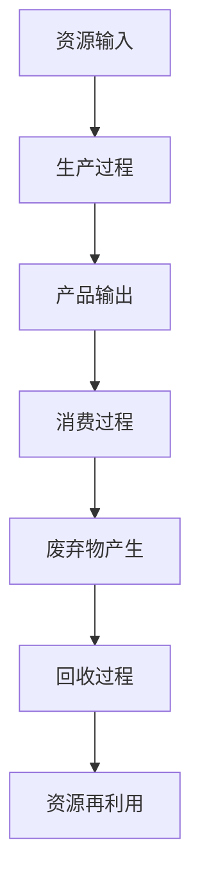
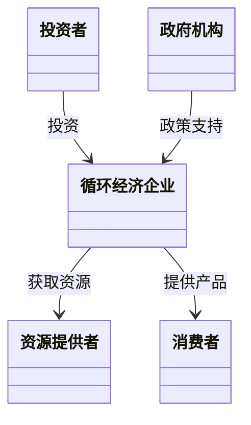

                 


# 价值投资中的循环经济模式分析

## 关键词：
- 价值投资，循环经济，投资模式，资源利用，可持续发展

## 摘要：
本文探讨了循环经济模式在价值投资中的应用，分析了循环经济的核心要素及其与价值投资的结合方式。通过数学模型和算法，评估了循环经济模式的投资价值，并通过实际案例展示了如何在投资中实践循环经济模式。文章还总结了最佳实践和投资建议，为价值投资者提供了新的视角和策略。

## 第1章：循环经济与价值投资的背景介绍

### 1.1 循环经济的基本概念与价值投资概述

#### 1.1.1 循环经济的定义与核心理念
循环经济是一种以资源高效利用和循环为目标的经济模式，强调减少资源消耗和环境污染，通过闭环系统实现资源的多次利用。

#### 1.1.2 循环经济的特征与优势
- **资源高效利用**：最大限度地减少资源浪费，提高资源利用率。
- **减少环境污染**：通过回收和再利用，降低废弃物的产生和处理。
- **促进可持续发展**：循环经济模式有助于实现经济增长与环境保护的平衡。

#### 1.1.3 循环经济与传统经济模式的对比
| 特性       | 循环经济         | 传统经济       |
|------------|------------------|----------------|
| 资源利用   | 高效循环         | 一次性线性       |
| 环境影响   | 低污染           | 高污染         |
| 可持续性   | 高               | 低             |

### 1.2 价值投资的基本概念
#### 1.2.1 价值投资的定义与核心理念
价值投资是一种长期投资策略，注重投资标的的内在价值，选择那些市场价格低于其内在价值的公司进行投资。

#### 1.2.2 价值投资的基本原则与策略
- **注重基本面分析**：关注公司的财务状况、行业地位和竞争优势。
- **长期持有**：价值投资者倾向于长期持有优质资产，等待市场重新评估其价值。
- **安全边际**：确保投资价格低于其内在价值，以降低风险。

#### 1.2.3 价值投资与其它投资模式的对比
| 特性       | 价值投资         | 投机投资       | 索取投资       |
|------------|------------------|----------------|----------------|
| 投资策略   | 长期持有，注重价值| 短期交易，追求价格波动 | 追求高收益，风险较高 |
| 风险控制   | 低               | 高             | 中             |
| 投资对象   | 优质公司         | 市场波动较大股票 | 高风险资产     |

### 1.3 循环经济与价值投资的结合
#### 1.3.1 循环经济模式在投资中的应用
循环经济模式为价值投资者提供了新的投资方向，如环保技术、循环经济企业等。

#### 1.3.2 价值投资视角下的循环经济模式分析
价值投资者关注循环经济企业的长期盈利能力、竞争优势和可持续发展能力。

#### 1.3.3 循环经济与价值投资的协同发展
通过投资循环经济企业，价值投资者不仅获得经济回报，还推动了社会的可持续发展。

## 第2章：循环经济模式的结构与核心要素

### 2.1 循环经济模式的结构分析
使用mermaid流程图展示循环经济的资源流动和转换过程。



### 2.2 循环经济模式的核心要素
#### 2.2.1 资源的高效利用
通过技术创新和管理优化，提高资源利用率，减少浪费。

#### 2.2.2 技术的创新与应用
发展循环经济技术，如废弃物再利用技术、清洁能源技术等，推动经济的可持续发展。

#### 2.2.3 市场机制的作用
通过价格机制、市场激励等手段，促进资源的循环利用和市场有效配置。

### 2.3 循环经济模式的属性特征对比
| 特性       | 循环经济         | 线性经济       |
|------------|------------------|----------------|
| 资源利用   | 循环高效         | 单一消耗       |
| 环境影响   | 低污染           | 高污染         |
| 可持续性   | 高               | 低             |

## 第3章：循环经济模式与价值投资的关联

### 3.1 循环经济模式对价值投资的影响
#### 3.1.1 循环经济模式对投资标的的价值提升
循环经济企业通常具有更高的利润率和市场竞争力，提升了其投资价值。

#### 3.1.2 循环经济模式对投资风险的降低
通过减少资源依赖和环境污染风险，循环经济模式降低了企业的经营风险。

#### 3.1.3 循环经济模式对投资收益的长期促进
循环经济企业的可持续发展模式为其带来了稳定的收益增长。

### 3.2 价值投资视角下的循环经济模式分析
#### 3.2.1 循环经济模式的长期价值评估
价值投资者关注循环经济企业的长期盈利能力和市场地位。

#### 3.2.2 循环经济模式的可持续性分析
循环经济模式的可持续性是价值投资的重要考量因素。

#### 3.2.3 循环经济模式的市场竞争力分析
循环经济模式通过降低成本和提高效率，增强了企业的市场竞争力。

### 3.3 循环经济模式与价值投资的协同效应
#### 3.3.1 循环经济模式对价值投资理念的契合
循环经济模式强调长期价值和可持续发展，与价值投资理念高度契合。

#### 3.3.2 价值投资对循环经济模式的推动作用
价值投资者的投资行为推动了循环经济模式的发展和普及。

#### 3.3.3 循环经济模式与价值投资的协同发展策略
通过价值投资推动循环经济模式的应用，实现经济与环境的双重效益。

## 第4章：循环经济模式的价值投资算法与数学模型

### 4.1 循环经济模式的数学模型
#### 4.1.1 资源利用效率模型
$$ \text{资源利用效率} = \frac{\text{资源总利用量}}{\text{资源总投入量}} $$

#### 4.1.2 投入产出模型
$$ \text{投入产出比} = \frac{\text{产出价值}}{\text{投入资源成本}} $$

#### 4.1.3 价值评估模型
$$ \text{投资价值} = \text{内在价值} \times \text{安全边际} $$

### 4.2 价值投资中的算法分析
#### 4.2.1 投资组合优化算法
使用动态规划算法优化投资组合，最大化收益并最小化风险。

#### 4.2.2 风险评估与控制算法
通过蒙特卡洛模拟评估不同市场条件下的投资风险。

### 4.3 循环经济模式与价值投资的协同算法
#### 4.3.1 协同优化算法
结合循环经济模式和价值投资策略，优化投资组合。

## 第5章：循环经济模式的数学公式与案例分析

### 5.1 循环经济模式的数学公式
#### 5.1.1 资源利用效率公式
$$ \text{资源利用效率} = \frac{\text{回收资源量}}{\text{初始资源投入}} $$

#### 5.1.2 投入产出比公式
$$ \text{投入产出比} = \frac{\text{产品价值}}{\text{资源消耗成本}} $$

### 5.2 案例分析
#### 5.2.1 某环保科技公司的投资分析
该公司通过技术创新实现了废弃物的高效回收和再利用，具有较高的资源利用效率和市场竞争力。

## 第6章：系统分析与架构设计

### 6.1 领域模型
使用mermaid类图展示循环经济中的参与者和关系。



### 6.2 系统架构设计
使用mermaid架构图展示系统的主要模块和数据流。

```mermaid
architectural
    客户端
    服务端
    数据库
    接口
    
    客户端 --> 接口: 请求数据
    接口 --> 服务端: 处理请求
    服务端 --> 数据库: 查询数据
    服务端 --> 接口: 返回响应
```

### 6.3 接口设计
定义API接口，如RESTful API，用于数据交互。

## 第7章：项目实战

### 7.1 环境安装
安装必要的开发工具和依赖库，如Python、NumPy、Pandas等。

### 7.2 核心实现
编写Python代码实现循环经济模式的价值评估和投资策略。

```python
import numpy as np
import pandas as pd

# 示例数据
data = pd.DataFrame({
    '公司名称': ['公司A', '公司B', '公司C'],
    '资源利用效率': [0.8, 0.9, 0.7],
    '投入产出比': [1.2, 1.5, 1.1],
    '内在价值': [100, 120, 90]
})

# 计算投资价值
data['投资价值'] = data['内在价值'] * data['安全边际']

print(data)
```

### 7.3 案例分析
分析某循环经济项目的实际运营情况，评估其投资价值和风险。

## 第8章：总结与展望

### 8.1 最佳实践 tips
- 价值投资者应关注循环经济企业的长期价值和竞争优势。
- 投资者需结合市场环境和企业实际情况，制定合理的投资策略。

### 8.2 小结
循环经济模式与价值投资的结合为投资者提供了新的机遇和挑战，通过科学的分析和合理的投资策略，可以实现经济与环境的双重效益。

### 8.3 注意事项
- 投资者需充分评估市场风险和企业经营状况。
- 长期关注企业的可持续发展能力。

### 8.4 拓展阅读
推荐相关书籍和文献，供读者深入学习循环经济与价值投资的知识。

## 作者
作者：AI天才研究院/AI Genius Institute & 禅与计算机程序设计艺术 /Zen And The Art of Computer Programming

