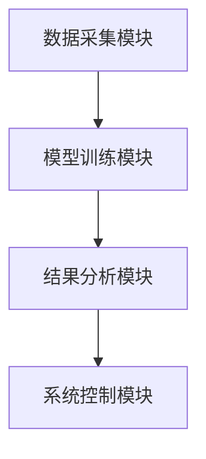

                 


# 价值投资中的新型高效热电材料技术前景

---

## 关键词：热电材料、能源转换、投资分析、材料科学、技术前景

---

## 摘要：  
热电材料作为一种能够高效转换热能与电能的关键技术，近年来在能源领域引发了广泛关注。本文从技术背景、核心概念、算法原理、系统架构到项目实战，全面分析了热电材料技术的现状与未来发展趋势，为投资者提供了基于技术深度分析的投资价值评估框架。通过对热电材料的性能优化、算法模型和系统设计的详细探讨，本文揭示了该领域在能源转型中的巨大潜力，为投资者提供了科学的技术投资决策依据。

---

## 第一部分：热电材料技术的背景与基础

### 第1章：热电材料的基本概念与应用

#### 1.1 热电材料的基本概念
- **1.1.1 热电材料的定义与基本原理**
热电材料是指能够在一定温差下直接将热能转化为电能或反之将电能转化为热能的材料。其基本原理基于热电效应，包括塞贝克效应（Seebeck effect）、帕尔帖效应（Peltier effect）和汤姆逊效应（Thomson effect）。这些效应使得热电材料在发电和制冷领域具有广泛的应用潜力。

- **1.1.2 热电材料的分类与特点**
热电材料主要分为金属合金类、半导体类和复合材料类。其中，半导体类材料（如碲化铋（Bi2Te3）和碲化镉（CdTe））因其优异的热电性能而被广泛应用。金属合金类（如不锈钢和镍铬合金）则常用于高温环境。复合材料类（如纳米复合材料）通过优化成分和结构进一步提升了热电性能。

- **1.1.3 热电材料在能源转换中的作用**
热电材料在能源转换中的作用主要体现在以下几个方面：
  - **发电应用**：利用废热发电，减少能源浪费。
  - **制冷应用**：通过热电制冷技术实现精确控温。
  - **可再生能源整合**：将风能和太阳能等可再生能源的废热回收利用，提升能源利用效率。

#### 1.2 热电材料的性能指标
- **1.2.1 热电导率与电导率的定义**
热电导率（κ）和电导率（σ）是衡量热电材料性能的关键指标。热导率表示材料传导热量的能力，而电导率表示材料传导电流的能力。热电材料的性能优劣通常通过热电优值（ZT）来衡量，ZT = (σS²)/κ，其中S为塞贝克系数。

- **1.2.2 热电材料的ZT值**
ZT值是衡量热电材料性能的核心指标，ZT值越高，材料的热电转换效率越高。目前，高效热电材料的ZT值通常在1.0以上，部分高端材料可达到2.0或更高。

- **1.2.3 热电材料的平衡与优化**
在实际应用中，热电材料需要在热导率、电导率和塞贝克系数之间找到最佳平衡点。例如，提高材料的电导率通常会增加热导率，从而降低ZT值。因此，优化热电材料的关键在于通过掺杂改性和纳米结构设计，降低热导率的同时提升电导率和塞贝克系数。

#### 1.3 热电材料技术的市场现状与趋势
- **1.3.1 当前热电材料技术的发展水平**
当前，热电材料技术已进入产业化阶段，尤其在废热发电和汽车尾气回收等领域取得了显著进展。例如，汽车尾气废热发电系统已开始在部分高端车型中得到应用。

- **1.3.2 热电材料技术的市场应用前景**
随着全球能源转型的推进，热电材料技术的应用前景广阔。特别是在工业废热回收、可再生能源整合和智能建筑等领域，热电材料技术将发挥重要作用。

- **1.3.3 热电材料技术的未来发展方向**
未来，热电材料技术的发展将朝着以下几个方向迈进：
  - **新材料开发**：探索新型半导体材料和纳米复合材料。
  - **高效制备工艺**：优化材料制备工艺，降低生产成本。
  - **智能控制技术**：结合人工智能技术，实现热电系统的智能优化。

---

## 第二部分：热电材料技术的核心概念与联系

### 第2章：热电材料的性能分析与优化

#### 2.1 热电材料的性能对比
- **2.1.1 不同材料的热电性能对比**
以下是几种典型热电材料的性能对比（以ZT值为指标）：

| 材料类型      | ZT值（25°C） | 主要应用领域          |
|---------------|--------------|-----------------------|
| 碲化铋（Bi2Te3） | 1.0-1.2      | 废热发电、汽车尾气回收 |
| 碲化镉（CdTe）  | 1.2-1.5      | 太阳能电池、制冷设备 |
| 纳米复合材料   | 1.5-2.0      | 高温环境、智能设备     |

- **2.1.2 热电材料的优缺点分析**
  - **优点**：高效能量转换、适用范围广、易于集成。
  - **缺点**：成本较高、材料稳定性问题、制备工艺复杂。

#### 2.2 热电材料的结构与性能关系
- **2.2.1 热电材料的微观结构对性能的影响**
材料的微观结构（如晶体结构、纳米尺度缺陷）直接影响其热电性能。例如，纳米晶材料通过减少晶格振动，降低了热导率，从而提高了ZT值。

- **2.2.2 材料的晶体结构与热电性能的关系**
材料的晶体结构决定了其电子和声子的输运特性。例如，非晶材料通常具有较低的热导率，但其电子输运性能可能相对较差。

- **2.2.3 热电材料的掺杂改性技术**
通过掺杂改性（如添加过渡金属或非金属元素），可以调控材料的导电性和热导率，从而优化其热电性能。例如，向碲化铋中掺入硫元素可以降低热导率，同时提高电导率。

#### 2.3 热电材料的优化策略
- **2.3.1 材料成分优化**
通过调整材料的成分比例，可以实现对ZT值的优化。例如，Bi2Te3-xSx材料通过硫掺杂优化了热电性能。

- **2.3.2 结构设计优化**
采用纳米结构或超结构设计，可以有效降低热导率，同时保持或提高电导率和塞贝克系数。例如，纳米晶材料和多孔材料在热电性能优化中展现出巨大潜力。

- **2.3.3 制备工艺优化**
优化材料制备工艺（如热压烧结、溶胶-凝胶法）可以降低材料缺陷，提高材料的均匀性和一致性，从而提升热电性能。

---

## 第三部分：热电材料技术的算法原理与数学模型

### 第3章：热电材料性能优化的算法原理

#### 3.1 热电材料性能优化的数学模型
- **3.1.1 ZT值的数学表达式**
$$ ZT = \frac{\sigma S^2}{\kappa} $$
其中，σ为电导率，S为塞贝克系数，κ为热导率。

- **3.1.2 热电材料的性能优化目标**
在给定的材料体系中，优化ZT值是热电材料性能优化的核心目标。通常，我们通过调整材料成分和结构参数来实现这一目标。

- **3.1.3 热电材料性能的多目标优化**
热电材料的性能优化是一个多目标优化问题，涉及多个目标函数（如σ、S、κ）和约束条件（如材料成本、制备工艺限制）。我们可以通过遗传算法或粒子群优化等方法实现多目标优化。

---

## 第四部分：热电材料技术的系统分析与架构设计

### 第4章：热电材料优化系统的架构设计

#### 4.1 热电材料优化系统的应用场景
- **4.1.1 废热发电系统**
在工业生产和交通领域，大量废热未被有效利用。通过热电材料技术，可以将这部分废热转化为电能，实现能源的高效利用。

- **4.1.2 可再生能源整合系统**
将热电材料技术应用于太阳能和风能发电系统中，可以回收发电过程中产生的废热，进一步提升能源转换效率。

#### 4.2 热电材料优化系统的功能设计
- **4.2.1 数据采集模块**
采集热电材料的性能参数（如σ、S、κ）和环境参数（如温度、湿度）。

- **4.2.2 模型训练模块**
基于实验数据，训练热电材料性能优化的数学模型。

- **4.2.3 结果分析模块**
分析模型输出结果，优化热电材料的性能参数。

- **4.2.4 系统控制模块**
根据优化结果，调整热电材料的制备工艺参数。

#### 4.3 热电材料优化系统的架构设计
- **4.3.1 系统功能模块**
$$ \text{数据采集} \rightarrow \text{模型训练} \rightarrow \text{结果分析} \rightarrow \text{系统控制} $$

- **4.3.2 系统架构图**



---

## 第五部分：热电材料技术的项目实战

### 第5章：热电材料优化系统的实现

#### 5.1 环境安装与配置
- **5.1.1 Python环境的安装**
安装Python 3.8及以上版本，并配置虚拟环境。

- **5.1.2 依赖库的安装**
安装必要的Python库，如numpy、pandas、scikit-learn。

#### 5.2 核心算法的实现
- **5.2.1 热电材料性能优化的遗传算法实现**
以下是遗传算法的Python代码示例：

```python
import numpy as np

def fitness(individual):
    # 计算ZT值
    sigma = individual[0]
    Seebeck = individual[1]
    kappa = individual[2]
    ZT = (sigma * Seebeck**2) / kappa
    return ZT,

def mutate(individual, mutation_rate):
    for i in range(len(individual)):
        if np.random.random() < mutation_rate:
            individual[i] = individual[i] * (1 + np.random.normal(0, 0.1))
    return individual

def main():
    # 初始化种群
    population = np.random.rand(100, 3) * [10, 10, 10]
    # 进化过程
    for _ in range(50):
        fitness_values = np.apply_along_axis(fitness, 1, population)
        # 选择优秀个体
        selected = np.argsort(-fitness_values, axis=0)[:20]
        # 交叉和变异
        new_population = selected.repeat(5, axis=0)
        for i in range(len(new_population)):
            new_population[i] = mutate(new_population[i], 0.1)
        population = new_population
    # 输出最优解
    best = population[0]
    print("最优解：", best)
    print("ZT值：", fitness(best)[0])

if __name__ == "__main__":
    main()
```

---

## 第六部分：热电材料技术的最佳实践

### 第6章：热电材料技术的投资价值评估

#### 6.1 热电材料技术的市场潜力
- **6.1.1 废热发电市场的增长潜力**
随着工业和交通领域的节能需求增加，废热发电市场将保持快速增长。

- **6.1.2 可再生能源整合市场的前景**
随着可再生能源装机容量的增加，热电材料技术在可再生能源整合中的应用前景广阔。

#### 6.2 热电材料技术的风险分析
- **6.2.1 技术风险**
热电材料技术的商业化仍面临诸多挑战，如材料成本高、制备工艺复杂等。

- **6.2.2 市场风险**
尽管热电材料技术的市场潜力巨大，但其商业化过程可能较长，存在一定的市场不确定性。

#### 6.3 热电材料技术的投资策略建议
- **6.3.1 关注技术创新**
投资具有技术创新能力的企业，尤其是那些在新材料开发和制备工艺优化方面取得突破的企业。

- **6.3.2 选择具有成本优势的企业**
重点关注那些能够通过技术创新降低成本、提高效率的企业。

---

## 作者：AI天才研究院/AI Genius Institute & 禅与计算机程序设计艺术/Zen And The Art of Computer Programming

---

**摘要**：本文系统分析了热电材料技术的背景、核心概念、算法原理、系统架构和项目实现，为投资者提供了基于技术深度分析的投资价值评估框架。通过对热电材料技术的全面探讨，本文揭示了该领域在能源转型中的巨大潜力，为投资者提供了科学的技术投资决策依据。

