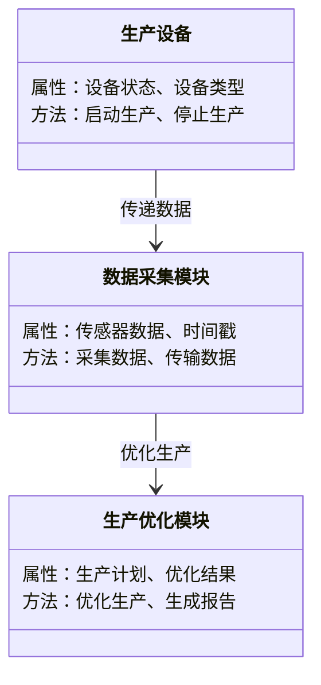

                 


# 价值投资中的智能制造柔性生产线分析

---

## 关键词  
智能制造，柔性生产线，价值投资，工业物联网（IIoT），数字化制造，人工智能

---

## 摘要  
智能制造柔性生产线是现代制造业的重要组成部分，其灵活性和高效性为企业创造价值的同时，也为投资者提供了新的投资机会。本文从技术与经济双重角度，详细分析了智能制造柔性生产线的原理、优势、应用案例以及对投资决策的影响，探讨了如何通过技术评估和财务分析来识别高价值投资标的。

---

# 第1章 柔性生产线的背景与概念

## 1.1 制造业智能化的背景与趋势  
随着全球市场竞争的加剧，传统制造业面临效率低下、成本高昂、灵活性不足等问题。智能制造的兴起，为企业提供了通过技术创新实现转型升级的契机。柔性生产线作为智能制造的核心组成部分，能够根据市场需求快速调整生产节奏，成为企业竞争力的重要来源。

## 1.2 柔性生产线的定义与特点  
柔性生产线是指通过模块化设计和智能化设备，能够快速适应不同产品类型和生产规模的生产线。其特点包括：  
1. **灵活性**：可以根据市场需求快速调整生产计划。  
2. **高效性**：通过自动化和数据驱动优化生产流程。  
3. **适应性**：能够适应不同产品规格和生产规模。  

## 1.3 价值投资视角下的智能制造分析  
在价值投资中，投资者需要关注企业的技术创新能力、成本控制能力以及市场适应能力。智能制造柔性生产线通过提高生产效率、降低成本和增强市场响应能力，为企业创造了更大的价值，也为投资者提供了优质的投资标的。

---

# 第2章 柔性生产线的核心原理

## 2.1 柔性生产线的系统架构  
柔性生产线的系统架构通常包括以下几个模块：  
1. **生产设备模块**：包括自动化设备、传感器和执行器。  
2. **数据采集与分析模块**：通过IIoT实时采集生产数据并进行分析。  
3. **生产优化模块**：基于数据分析优化生产流程。  

## 2.2 柔性生产线的关键技术  
1. **工业物联网（IIoT）**：通过传感器和通信技术实现生产设备的实时监控和数据传输。  
2. **数字化制造**：利用数字技术实现设计、生产、物流的全流程数字化管理。  
3. **人工智能**：通过机器学习算法优化生产计划和预测市场需求。  

## 2.3 柔性生产线的属性特征对比  
以下是柔性生产线与传统生产线的对比分析：

| **特征**       | **柔性生产线**         | **传统生产线**         |
|----------------|-----------------------|-----------------------|
| 生产效率       | 高，可根据需求调整    | 低，固定生产节奏       |
| 灵活性          | 高，适应多种产品类型   | 低，适应单一产品类型   |
| 成本控制       | 优，资源浪费少        | 劣，资源浪费较多       |
| 响应速度       | 快，快速调整生产计划    | 慢，调整周期长          |

---

# 第3章 柔性生产线的算法原理

## 3.1 生产优化算法  
柔性生产线的生产优化通常采用动态规划算法，通过数学建模实现生产计划的最优安排。以下是动态规划算法的步骤：

1. **问题建模**：将生产计划转化为数学问题，例如最小化成本或最大化效率。  
2. **状态定义**：定义状态变量，例如时间、资源和生产任务。  
3. **状态转移**：根据状态转移方程计算最优解。  
4. **结果验证**：通过模拟验证算法的可行性。  

## 3.2 机器学习在生产预测中的应用  
机器学习算法可以用于预测市场需求和生产成本。以下是基于机器学习的生产预测模型：

```python
# 数据预处理
import pandas as pd
from sklearn.model_selection import train_test_split
from sklearn.ensemble import RandomForestRegressor

data = pd.read_csv('production_data.csv')
X = data.drop('cost', axis=1)
y = data['cost']

X_train, X_test, y_train, y_test = train_test_split(X, y, test_size=0.2)

# 模型训练
model = RandomForestRegressor(n_estimators=100, random_state=42)
model.fit(X_train, y_train)

# 模型预测
predictions = model.predict(X_test)
```

## 3.3 数学模型与公式  
生产成本的计算公式如下：  
$$ \text{总成本} = \text{固定成本} + \text{可变成本} \times \text{产量} $$  
其中，固定成本包括设备折旧和人工成本，可变成本包括原材料和能源消耗。

---

# 第4章 系统分析与架构设计

## 4.1 问题场景介绍  
假设我们有一个汽车制造企业，需要生产多种类型的汽车零部件。由于市场需求波动较大，企业需要采用柔性生产线来提高生产效率和降低成本。

## 4.2 系统功能设计  
以下是系统的功能模块图：



## 4.3 系统架构设计  
以下是系统的架构图：


---

# 第5章 项目实战

## 5.1 环境安装  
安装必要的软件和工具，例如Python、TensorFlow和Kafka。

## 5.2 核心代码实现  
以下是生产优化模块的核心代码：

```python
import numpy as np
import pandas as pd

# 数据加载
data = pd.read_csv('production_data.csv')

# 数据预处理
from sklearn.preprocessing import StandardScaler
scaler = StandardScaler()
scaled_data = scaler.fit_transform(data)

# 模型训练
from sklearn.cluster import KMeans
kmeans = KMeans(n_clusters=3, random_state=42)
kmeans.fit(scaled_data)

# 模型预测
predictions = kmeans.predict(scaled_data)
```

## 5.3 案例分析  
以某汽车制造企业为例，分析柔性生产线的应用效果。通过数据对比，展示生产效率和成本的显著改善。

---

# 第6章 总结与展望

## 6.1 本章总结  
柔性生产线通过技术创新和数据驱动优化生产流程，为企业创造更大的价值。在价值投资中，投资者需要关注企业的技术创新能力、市场适应能力和财务表现。

## 6.2 未来展望  
随着人工智能和IIoT技术的进一步发展，柔性生产线将更加智能化和高效化。投资者需要持续关注技术创新和市场动态，以抓住更多的投资机会。

---

## 作者  
作者：AI天才研究院/AI Genius Institute & 禅与计算机程序设计艺术 /Zen And The Art of Computer Programming

