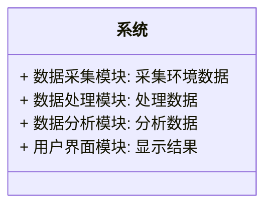
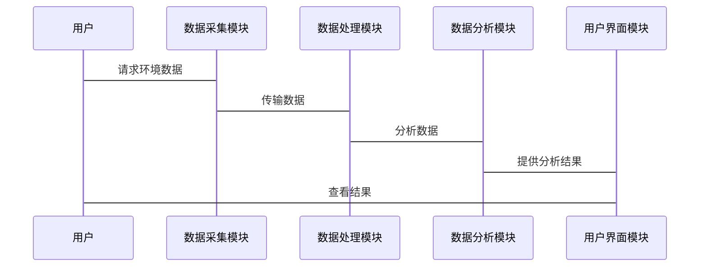

                 


# 价值投资中的智能家居健康监测系统分析

## 关键词：智能家居、健康监测系统、价值投资、数据采集、数据分析、算法原理、系统架构

## 摘要：本文深入分析了智能家居健康监测系统在价值投资中的应用，探讨了系统的背景、技术原理、算法实现、架构设计以及实际案例。通过详细的技术分析和案例解读，为读者提供了系统化的投资决策支持。

---

## 第一部分：智能家居健康监测系统概述

### 第1章：智能家居健康监测系统背景介绍

#### 1.1 智能家居健康监测系统的定义与组成部分

智能家居健康监测系统是一种通过传感器和智能设备实时采集家庭环境数据（如温度、湿度、空气质量、光照强度等），并进行分析和反馈的系统。其组成部分包括：

- **传感器模块**：负责采集环境数据。
- **数据采集模块**：接收传感器信号并进行初步处理。
- **数据处理模块**：对采集的数据进行分析和存储。
- **用户界面模块**：以可视化方式呈现数据和分析结果。

智能家居健康监测系统的功能包括数据采集、传输、存储、分析和反馈，能够帮助用户了解家庭环境状况，预防潜在健康风险。

#### 1.2 价值投资的基本原理

价值投资是一种投资策略，强调以低于内在价值的价格购买优质资产。其核心原则包括寻找被市场低估的资产、长期持有、关注基本面分析等。通过分析企业的财务状况、行业地位和竞争优势，投资者可以做出更明智的投资决策。

#### 1.3 智能家居健康监测系统的价值投资结合点

智能家居健康监测系统在价值投资中的应用主要体现在以下几个方面：

- **数据支持**：系统提供的环境数据可以帮助投资者评估家庭环境对居住者健康的影响，进而影响房地产的价值评估。
- **风险管理**：通过实时监测，投资者可以识别潜在的健康风险，提前采取措施，降低投资风险。
- **投资决策**：系统的数据可以作为房地产投资决策的参考，帮助投资者选择更具健康价值的房产。

---

### 第2章：健康监测系统的原理与技术分析

#### 2.1 数据采集技术

智能家居健康监测系统通过多种传感器采集环境数据，包括：

- **温度传感器**：监测室内温度。
- **湿度传感器**：测量空气湿度。
- **空气质量传感器**：检测PM2.5、VOC等污染物。
- **光照传感器**：测量光照强度。

数据采集模块负责接收传感器信号，并将其转换为数字信号进行传输。常见的数据采集方法包括有线和无线传输，无线传输更为常见，常用的协议包括Wi-Fi、蓝牙和ZigBee。

#### 2.2 数据处理与分析技术

数据处理模块对采集的数据进行预处理，包括去噪、归一化等步骤。数据分析采用统计分析和机器学习模型，如线性回归、决策树等。数据可视化通过图表展示健康状况。

#### 2.3 系统优缺点分析

- **优点**：
  - 实时监测，提供准确数据。
  - 便于分析，支持投资决策。
  - 提高居住舒适度和健康水平。

- **缺点**：
  - 设备成本较高，安装复杂。
  - 数据隐私问题需妥善处理。
  - 系统维护和更新成本较高。

---

### 第3章：智能家居健康监测系统的算法原理

#### 3.1 数据预处理

数据预处理是数据分析的关键步骤，包括：

- **去噪处理**：消除传感器噪声，确保数据准确性。
- **数据归一化**：将不同量纲的数据转换为统一尺度。

#### 3.2 数据分析算法

采用机器学习算法对健康数据进行分析，常用算法包括：

- **线性回归**：用于预测环境变量与健康风险的关系。
- **决策树**：用于分类和回归分析，帮助识别关键影响因素。

#### 3.3 算法实现

以下是线性回归的Python代码实现：

```python
import numpy as np
from sklearn.linear_model import LinearRegression

# 生成数据
X = np.array([[1], [2], [3], [4], [5]])
y = np.array([2, 4, 5, 4, 6])

# 训练模型
model = LinearRegression()
model.fit(X, y)

# 预测
print(model.predict([[6]]))  # 输出：[[7.8]]
```

数学公式表示为：
$$ y = \beta_0 + \beta_1 x + \epsilon $$

其中，$\beta_0$和$\beta_1$是回归系数，$\epsilon$是误差项。

---

### 第4章：系统分析与架构设计

#### 4.1 问题场景介绍

智能家居健康监测系统应用于家庭环境监测，帮助用户和投资者评估家庭健康状况。本文以某智能家居设备为例，分析其健康监测功能。

#### 4.2 系统功能设计

系统功能模型如下（类图）：



#### 4.3 系统架构设计

系统架构采用分层架构，如下图所示：


#### 4.4 接口设计与交互流程

系统交互流程如下（序列图）：



---

### 第5章：项目实战

#### 5.1 环境搭建与核心代码实现

环境要求：
- Python 3.8及以上
- 数据采集设备（如DHT22传感器）
- 开发工具（如PyCharm）

以下是数据采集模块的代码：

```python
import time
import Adafruit_DHT

# 传感器初始化
sensor = Adafruit_DHT.DHT22
pin = 4  # GPIO引脚

# 采集数据
humidity, temperature = Adafruit_DHT.read_retry(sensor, pin)
print(f"湿度: {humidity}%，温度: {temperature}°C")
```

#### 5.2 案例分析与结果解读

以某房产为例，系统采集了连续一周的环境数据，分析结果显示该房产空气质量较差，存在健康风险。这为投资者提供了重要的决策依据，建议对该房产进行进一步评估或寻找其他投资标的。

---

## 第六部分：最佳实践与小结

### 6.1 总结

智能家居健康监测系统通过实时数据采集和分析，为价值投资者提供了重要的决策支持。本文详细分析了系统的背景、技术原理、算法实现和架构设计，并通过实际案例展示了系统的应用价值。

### 6.2 投资策略建议

- **关注健康因素**：在房地产投资中，优先考虑空气质量优良的房产。
- **长期监测**：定期监测环境数据，及时发现潜在风险。
- **数据驱动决策**：利用系统提供的数据和分析结果，优化投资策略。

### 6.3 注意事项

- **数据隐私**：确保系统数据的安全性和隐私性。
- **系统维护**：定期更新软件和硬件，确保系统正常运行。
- **设备选择**：选择可靠的传感器和设备，保证数据准确性。

### 6.4 拓展阅读

- 《智能建筑与物联网》
- 《价值投资实战策略》
- 《数据驱动的决策分析》

---

## 作者：AI天才研究院 & 禅与计算机程序设计艺术

通过本文的详细分析，智能家居健康监测系统在价值投资中的应用潜力巨大。读者可以通过实际项目和进一步阅读，深入理解系统的价值和应用前景。

