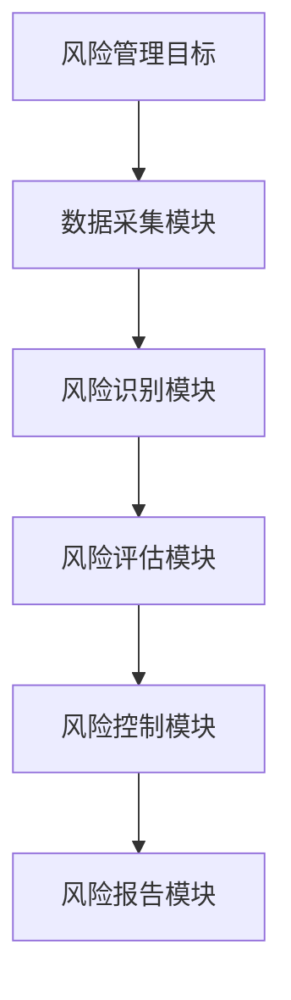
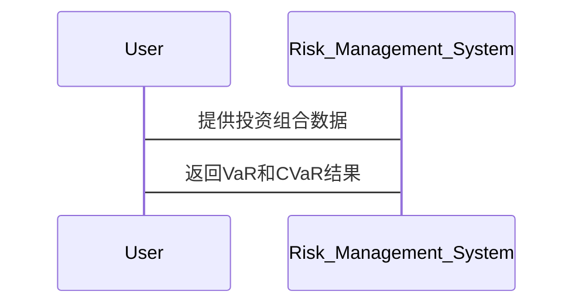

                 


# 价值投资中的风险管理策略

> **关键词**: 价值投资, 风险管理, 风险评估, 投资组合, 止损策略

> **摘要**: 本文深入探讨了价值投资中的风险管理策略，结合专业技术语言，详细分析了风险管理的核心概念、策略框架、数学模型及系统架构。通过案例分析和项目实战，帮助投资者构建高效的风险管理模型，确保投资组合的稳健增长。

---

## 第一部分: 价值投资中的风险管理基础

### 第1章: 价值投资与风险管理概述

#### 1.1 价值投资的核心理念
##### 1.1.1 价值投资的定义与特点
价值投资是一种基于对公司内在价值分析的投资策略，强调以低于内在价值的价格买入优质资产。其核心特点包括：
- 长期导向：关注企业的长期价值，而非短期价格波动。
- 安全边际：买入价格低于内在价值，以降低风险。
- 逆向思维：在市场恐慌时寻找机会，在市场狂热时保持冷静。

##### 1.1.2 价值投资的核心原则
- ** Margin of Safety (安全边际)**：买入价格与内在价值之间的差距，提供风险缓冲。
- **长期持有**：避免频繁交易，减少成本和错误决策。
- **价值评估**：通过基本面分析确定企业的内在价值。

##### 1.1.3 价值投资与风险管理的关联
风险管理是价值投资成功的关键因素。通过合理分散投资、设置止损策略、评估投资组合风险，投资者可以在波动的市场中保持稳健收益。

---

### 第2章: 风险管理的核心概念与原理

#### 2.1 风险的量化与评估
##### 2.1.1 风险的度量方法
风险可以通过以下方式量化：
- **波动率（Volatility）**：衡量资产价格的短期波动性。
- **最大回撤（Max Drawdown）**：投资组合在一段时间内从高点下跌的最大幅度。
- **VaR（Value at Risk）**：在特定置信水平下，投资组合可能遭受的最大损失。

##### 2.1.2 风险评估的数学模型
##### 2.1.2.1 方差（Variance）的计算公式
$$ \text{方差} = \frac{1}{n}\sum_{i=1}^{n}(x_i - \bar{x})^2 $$
其中，$x_i$ 是观测值，$\bar{x}$ 是均值。

##### 2.1.2.2 标准差（Standard Deviation）的计算公式
$$ \text{标准差} = \sqrt{\text{方差}} $$

##### 2.1.3 风险与收益的权衡
投资者需要在高风险高收益和低风险低收益之间找到平衡点。通过夏普比率（Sharpe Ratio）可以衡量投资组合的风险调整后收益：
$$ \text{夏普比率} = \frac{\text{投资组合收益} - \text{无风险利率}}{\text{投资组合标准差}} $$

---

#### 2.2 风险管理的策略框架
##### 2.2.1 风险控制的层次
风险管理可以分为以下层次：
- **个体风险**：单个资产的风险。
- **组合风险**：投资组合的整体风险。
- **系统性风险**：市场整体波动带来的风险。

##### 2.2.2 风险管理的三要素
- **目标**：明确风险管理的目标（如最小化回撤、控制波动率）。
- **工具**：使用期权、期货等金融工具进行对冲。
- **方法**：采用定性和定量分析相结合的方法。

##### 2.2.3 风险管理的PDCA循环
- **Plan**：制定风险管理计划。
- **Do**：执行风险管理策略。
- **Check**：监控风险表现。
- **Act**：调整和优化策略。

---

## 第二部分: 价值投资中的风险管理策略

### 第3章: 风险分散策略

#### 3.1 投资组合的分散化原理
分散化是降低非系统性风险的有效方法。通过投资不同行业、不同地区的资产，可以减少单一资产带来的风险。

##### 3.1.1 股票、债券、现金的配置比例
- 股票：承担高风险，追求高收益。
- 债券：提供稳定的利息收入，降低整体组合的波动性。
- 现金：应对突发事件，保持流动性。

##### 3.1.2 行业与地区的分散化策略
- 行业分散：投资于不同行业的股票，避免单一行业风险。
- 地区分散：在全球范围内配置资产，降低地域性风险。

---

### 第4章: 风险对冲策略

#### 4.1 期权与期货的对冲原理
- **期权**：通过买入看跌期权，对冲下行风险。
- **期货**：利用期货合约锁定价格，对冲市场波动。

##### 4.1.1 市场中性策略的应用
市场中性策略通过同时做多和做空，使整体组合的Beta值接近零，从而降低系统性风险。

##### 4.1.2 风险对冲的优缺点分析
- 优点：有效降低系统性风险。
- 缺点：需要承担对冲成本，可能限制收益。

---

## 第三部分: 风险管理的系统分析与架构设计

### 第5章: 风险管理系统的设计

#### 5.1 风险管理系统的功能模块
- **风险识别模块**：识别潜在风险因素。
- **风险评估模块**：量化风险程度。
- **风险控制模块**：制定和执行风险管理策略。

##### 5.1.1 系统架构的Mermaid图


#### 5.2 风险管理系统的实现
##### 5.2.1 数据收集与处理
- 数据来源：市场数据、财务报表、宏观经济指标。
- 数据清洗：去除异常值，处理缺失数据。

##### 5.2.2 风险评估算法的实现
- 使用VaR模型计算潜在损失：
$$ \text{VaR} = \mu + z \times \sigma $$
其中，$\mu$ 是均值，$z$ 是标准正态分布的分位数，$\sigma$ 是标准差。

---

## 第四部分: 项目实战——风险管理模型的构建

### 第6章: 项目实战

#### 6.1 环境搭建与数据准备
##### 6.1.1 数据源的选择
- 使用Yahoo Finance获取股票数据。
- 使用Pandas进行数据清洗和预处理。

##### 6.1.2 数据分析工具的安装
- 安装Python环境。
- 安装必要的库：Pandas、NumPy、Matplotlib、Scikit-learn。

#### 6.2 风险管理模型的实现
##### 6.2.1 风险评估模型的代码实现
```python
import pandas as pd
import numpy as np
import matplotlib.pyplot as plt
from sklearn.metrics import mean_squared_error

# 数据加载与处理
data = pd.read_csv('stock_data.csv')
returns = data['Adj Close'].pct_change().dropna()

# 风险评估模型
def calculate_vaR(returns, confidence_level=0.95):
    sorted_returns = sorted(returns)
    index = int(len(sorted_returns) * (1 - confidence_level))
    var = sorted_returns[index]
    return var

# 示例计算
var = calculate_vaR(returns)
print(f"VaR at {confidence_level} confidence level: {var}")
```

##### 6.2.2 系统交互序列图


---

## 第五部分: 总结与展望

### 第7章: 总结与小结

#### 7.1 最佳实践 Tips
- 定期评估投资组合的风险。
- 根据市场变化调整风险管理策略。
- 结合定量分析和定性分析，制定全面的风险管理方案。

#### 7.2 项目小结
通过本文的分析和实战，读者可以掌握价值投资中的风险管理策略，包括风险分散、对冲和系统化管理方法。

---

作者：AI天才研究院/AI Genius Institute & 禅与计算机程序设计艺术 /Zen And The Art of Computer Programming

