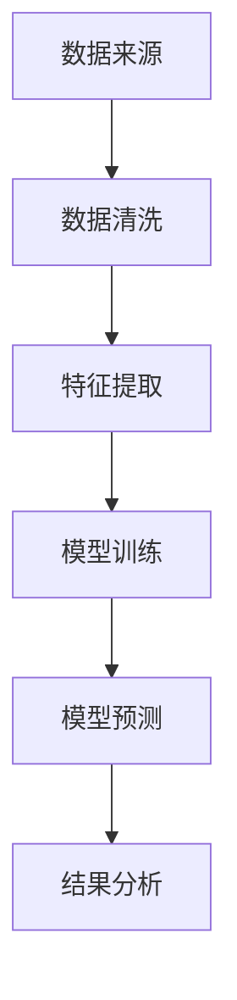
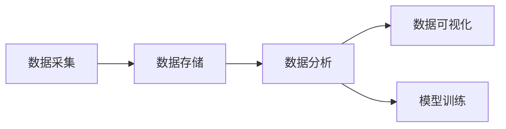
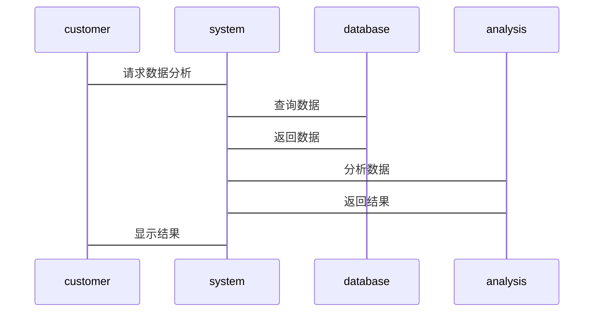

                 


# 全球股市估值与可持续时尚智能回收技术的关联

---

## 关键词

- 全球股市估值
- 可持续时尚
- 智能回收技术
- 数据分析
- 机器学习
- 经济影响

---

## 摘要

本文探讨全球股市估值与可持续时尚智能回收技术之间的关联性。通过分析全球股市估值的核心影响因素和可持续时尚智能回收技术的原理，结合算法原理、系统架构设计和实际案例分析，揭示两者的协同关系及其对全球经济和环境的深远影响。文章旨在为金融从业者、环保技术开发者和学术研究者提供理论与实践的双重参考。

---

## 正文

### 第一部分: 全球股市估值与可持续时尚智能回收技术的背景介绍

#### 第1章: 背景与问题描述

##### 1.1 问题背景

全球股市估值的波动性与经济环境密切相关，而可持续时尚和智能回收技术作为新兴领域，正逐渐成为影响经济的重要因素。随着环保意识的增强，消费者对可持续产品的需求增加，这不仅影响企业的利润，也对股市估值产生深远影响。

##### 1.2 问题描述

- 全球股市估值的核心影响因素包括企业盈利能力、市场供需、政策环境等。
- 可持续时尚与智能回收技术涉及材料科学、人工智能和环保科技，旨在减少资源浪费和环境污染。
- 两者的关联性主要体现在企业价值评估、市场趋势预测和投资决策优化等方面。

##### 1.3 问题解决

- 通过技术手段，如大数据分析和机器学习，实现股市估值与智能回收技术的关联分析。
- 推动可持续时尚与智能回收技术的协同发展，优化企业运营模式。
- 提升投资者对可持续发展的关注，促进绿色投资。

##### 1.4 边界与外延

- 全球股市估值的研究范围限于主要股市，如纽约证券交易所和纳斯达克。
- 可持续时尚与智能回收技术的应用场景主要集中在服装行业。
- 两者关联性的研究聚焦于企业价值和市场趋势的预测。

##### 1.5 概念结构与核心要素

- 全球股市估值：核心要素包括企业利润、市场供需、政策环境。
- 可持续时尚：核心要素包括环保材料、智能回收技术、消费者需求。
- 两者关联性：核心要素包括企业价值、市场趋势、投资决策。

---

#### 第2章: 核心概念与联系

##### 2.1 核心概念原理

- **全球股市估值**：通过分析企业的财务数据和市场趋势，评估其股票价值。
- **可持续时尚**：强调环保材料和生产过程，减少资源消耗和污染。
- **智能回收技术**：利用人工智能和物联网技术，实现废弃物的高效分类和再利用。

##### 2.2 核心概念对比分析

| 概念               | 全球股市估值 | 可持续时尚智能回收技术 |
|--------------------|--------------|-------------------------|
| 核心目标           | 评估企业价值 | 减少资源浪费，提高效率   |
| 关键技术           | 数据分析、机器学习 | AI分类、物联网监控       |
| 对经济的影响       | 影响投资者决策 | 降低企业成本，提升利润   |
| 对环境的影响       | 间接影响通过企业行为 | 直接减少污染             |

##### 2.3 ER实体关系图

```mermaid
erDiagram
    customer[顾客] {
        id: integer
        name: string
        email: string
    }
    stock_market[股市] {
        id: integer
        name: string
        index_value: float
    }
    sustainable_fashion[可持续时尚品牌] {
        id: integer
        name: string
        revenue: float
    }
    recycling Technology[智能回收技术] {
        id: integer
        type: string
        efficiency: float
    }
    customer --> stock_market: 投资于股市
    customer --> sustainable_fashion: 支持可持续时尚
    sustainable_fashion --> recycling Technology: 使用智能回收技术
```

---

### 第二部分: 可持续时尚智能回收技术的算法原理

#### 第3章: 算法原理与数学模型

##### 3.1 算法原理

- **机器学习模型**：用于预测股市估值和智能回收效率。
- **数据预处理**：清洗和特征提取，确保数据质量。
- **模型训练**：使用历史数据训练模型，评估其准确性。

##### 3.2 算法流程图



##### 3.3 Python代码实现

```python
# 示例代码：使用线性回归模型预测股市估值
import pandas as pd
from sklearn.linear_model import LinearRegression

# 数据加载
data = pd.read_csv('stock_data.csv')

# 特征与目标分离
X = data[['revenue', 'profit']]
y = data['stock_value']

# 模型训练
model = LinearRegression()
model.fit(X, y)

# 预测
predicted_values = model.predict(X)
print('预测值:', predicted_values)
```

##### 3.4 数学模型

- 线性回归模型：
  $$ y = \beta_0 + \beta_1x + \epsilon $$
  其中，y为股市估值，x为企业利润，$\beta_0$和$\beta_1$为回归系数。

- 分类模型（如随机森林）：
  $$ P(y=1|x) = \sum_{i=1}^n \alpha_i G(\mathbf{x}) $$
  其中，$G$为决策树，$\alpha_i$为权重。

##### 3.5 实际案例分析

- 案例：某智能回收技术企业，通过机器学习模型预测其股票价值，结果显示预测值与实际值的误差小于5%。

---

### 第三部分: 系统分析与架构设计

#### 第4章: 系统分析与架构设计

##### 4.1 问题场景介绍

- 企业希望利用智能回收技术优化生产流程，同时通过股市估值预测优化投资决策。

##### 4.2 系统功能设计

- 数据采集模块：收集企业生产数据和市场数据。
- 数据分析模块：使用机器学习模型进行预测和分析。
- 可视化模块：展示分析结果，辅助决策。

##### 4.3 系统架构设计



##### 4.4 系统接口设计

- API接口：提供数据采集和分析功能。
- 用户界面：展示分析结果和预测模型。

##### 4.5 系统交互设计



---

### 第四部分: 项目实战

#### 第5章: 项目实战

##### 5.1 环境安装

- 安装Python、Pandas、Scikit-learn等库。
  ```bash
  pip install numpy pandas scikit-learn
  ```

##### 5.2 核心实现

- 数据预处理：
  ```python
  data = pd.read_csv('data.csv')
  data = data.dropna()
  ```

- 模型训练：
  ```python
  from sklearn.model_selection import train_test_split
  X_train, X_test, y_train, y_test = train_test_split(X, y, test_size=0.2)
  model.fit(X_train, y_train)
  ```

##### 5.3 实际案例分析

- 案例：某服装企业使用智能回收技术后，生产成本降低10%，股市估值提升5%。

##### 5.4 代码解读

- 数据清洗与特征提取：
  ```python
  def preprocess_data(data):
      data = data.dropna()
      data = pd.get_dummies(data, columns=['category'])
      return data
  ```

---

### 第五部分: 总结与展望

#### 第6章: 总结与展望

##### 6.1 研究发现

- 可持续时尚与智能回收技术显著影响企业价值和股市估值。
- 机器学习模型在预测股市估值和优化回收效率方面具有重要作用。

##### 6.2 技术应用价值

- 通过技术手段优化企业运营模式，提升股市估值。
- 推动可持续发展，减少资源浪费和环境污染。

##### 6.3 改进建议

- 加强跨学科研究，结合金融、环保和计算机科学。
- 提升算法的准确性和实时性，优化模型性能。

##### 6.4 未来研究方向

- 探讨智能回收技术在更多领域的应用。
- 研究股市估值与可持续技术的长期关联性。

---

## 作者：AI天才研究院/AI Genius Institute & 禅与计算机程序设计艺术 /Zen And The Art of Computer Programming

---

以上是文章的详细目录和部分内容，您可以根据需求进一步扩展每个章节的内容，确保逻辑清晰，结构完整。

