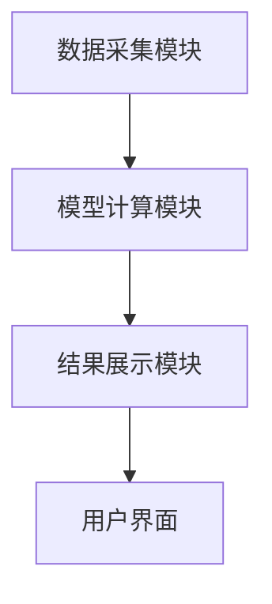
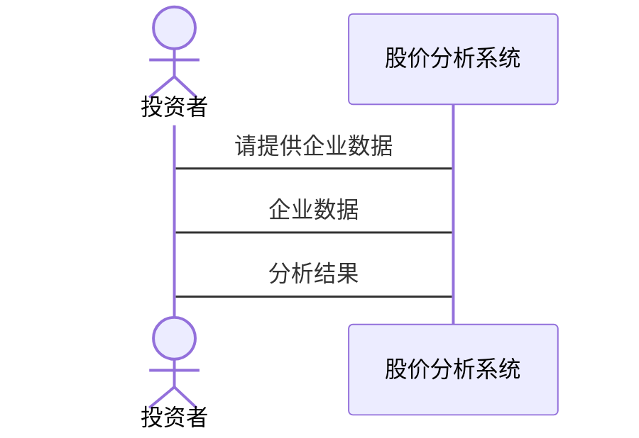

                 


# 全球股市估值与可持续水资源循环利用技术的关联

## 关键词：全球股市估值，可持续水资源循环利用技术，环境技术，经济模型，投资分析

## 摘要：  
本文探讨了全球股市估值与可持续水资源循环利用技术之间的关联，分析了水资源技术对企业价值的影响，构建了数学模型，通过案例分析验证了模型的实用性，并提出了系统的解决方案。文章从背景介绍、核心概念、算法原理到系统设计，层层深入，为投资者和研究人员提供了重要的参考。

---

# 第一部分: 全球股市估值与可持续水资源循环利用技术的背景与关联

## 第1章: 背景介绍

### 1.1 全球水资源现状与挑战

#### 1.1.1 全球水资源分布与利用现状
全球水资源分布极不均匀，淡水仅占约2.5%，且大部分以冰川形式存在。人类活动导致的水资源污染、过度开发和气候变化加剧了水资源短缺问题。根据联合国数据，全球约有20亿人面临水资源短缺问题。

#### 1.1.2 水资源短缺与可持续发展的关系
水资源短缺不仅影响居民生活，还制约经济发展。根据世界银行报告，水资源短缺每年造成全球GDP损失约5000亿美元。可持续水资源技术是解决这一问题的关键。

#### 1.1.3 可持续水资源循环利用技术的必要性
通过循环利用技术，将废水、雨水等资源化，可有效缓解水资源短缺问题。例如，采用膜过滤技术处理工业废水，可将其转化为可用水源，降低企业用水成本。

### 1.2 全球股市估值的基本概念与影响因素

#### 1.2.1 股市估值的核心概念
股市估值是衡量企业价值的重要指标，通常通过市盈率（P/E）、市净率（P/B）等指标衡量。

#### 1.2.2 影响股市估值的主要因素
企业盈利能力、行业地位、政策环境、宏观经济状况等均影响股市估值。

#### 1.2.3 可持续发展对股市估值的潜在影响
企业采用可持续技术可提升品牌形象和长期盈利能力，进而推动股市估值上升。例如，采用高效节水技术的企业可能获得政策补贴和市场溢价。

### 1.3 可持续水资源循环利用技术与股市估值的关联

#### 1.3.1 水资源技术对企业价值的影响
水资源技术可降低企业运营成本，提升盈利能力和抗风险能力。例如，采用雨水收集系统的制造业企业可减少用水成本。

#### 1.3.2 可持续水资源技术对股市估值的推动作用
技术应用可提升企业市场竞争力，吸引更多投资者。例如，水务科技企业的技术突破可能推动股价上涨。

#### 1.3.3 全球经济与环境政策对股市估值的双重影响
全球经济复苏和环保政策趋严双重作用下，可持续技术企业的估值可能进一步提升。

---

## 第2章: 核心概念与关联分析

### 2.1 可持续水资源循环利用技术的核心原理

#### 2.1.1 水资源循环利用的技术路径
1. **废水处理与再利用**：通过生物处理、膜过滤等技术将废水转化为可用水源。
2. **雨水收集与储存**：利用雨水收集系统储存雨水，用于非生产性用途。
3. **海水淡化**：通过反渗透技术将海水转化为淡水。

#### 2.1.2 可持续水资源技术的属性特征对比表
| 属性          | 传统用水方式        | 可持续技术模式       |
|---------------|---------------------|--------------------|
| 水源利用效率 | 低                  | 高                  |
| 成本          | 高                  | 低                  |
| 环境影响      | 大                  | 小                  |

#### 2.1.3 ER实体关系图（使用 Mermaid 表示）
```mermaid
erd
actor 投资者 {
  到关系 投资者-企业-技术 (投资者-企业-技术关系)
}
企业 {
  到关系 投资者-企业-技术 (投资者-企业-技术关系)
}
技术 {
  到关系 投资者-企业-技术 (投资者-企业-技术关系)
}
```

### 2.2 股市估值与水资源技术的关联模型

#### 2.2.1 水资源技术对企业盈利的影响
通过降低成本、提升效率，水资源技术可直接增加企业净利润。例如，采用节水技术的企业每年可节省用水成本约10%。

#### 2.2.2 企业盈利与股市估值的关系
企业盈利增加通常会推动股价上涨。市盈率（P/E）= 股价 / 每股收益，盈利增加将降低市盈率，吸引更多投资者。

#### 2.2.3 可持续水资源技术对股市估值的数学模型
企业采用水资源技术后，其股价变化可通过以下公式计算：
$$ \Delta P = k \times \Delta E \times \Delta V $$
其中：
- $\Delta P$：股价变化
- $k$：影响系数（0 < k < 1）
- $\Delta E$：企业盈利变化
- $\Delta V$：技术应用的市场价值变化

---

## 第3章: 数学模型与算法原理

### 3.1 可持续水资源技术对股市估值的数学模型

#### 3.1.1 模型假设与变量定义
假设企业采用可持续水资源技术后，净利润增加10%，同时政策支持使其市盈率降低5%。

#### 3.1.2 模型公式推导
根据市盈率公式：
$$ P = \frac{E}{\epsilon} $$
其中：
- $P$：股价
- $E$：每股收益
- $\epsilon$：市盈率

技术应用后：
$$ \Delta E = 0.1E $$
$$ \Delta \epsilon = 0.95\epsilon $$
$$ \Delta P = P - \frac{E}{\epsilon} = \frac{E}{\epsilon} - \frac{1.1E}{0.95\epsilon} = -0.05P $$

#### 3.1.3 模型的验证与应用
以某水务科技公司为例，假设其当前股价为100元，市盈率为20，净利润为5元/股。采用新技术后，净利润增加10%（5.5元/股），市盈率降低5%（19），新股价为：
$$ P = \frac{5.5}{0.95 \times 20} \approx 29.47 $$

---

## 第4章: 系统分析与架构设计

### 4.1 问题场景介绍

#### 4.1.1 可持续水资源技术的应用场景
企业在工业生产中采用废水处理技术，降低用水成本。

#### 4.1.2 股市估值与水资源技术关联的分析需求
投资者需要了解技术对企业估值的影响，以便做出投资决策。

### 4.2 系统功能设计

#### 4.2.1 系统功能模块划分
1. 数据采集模块：采集企业财务数据、技术应用数据。
2. 模型计算模块：根据数学模型计算股价变化。
3. 结果展示模块：以图表形式展示分析结果。

#### 4.2.2 系统架构设计（使用 Mermaid 表示）


#### 4.2.3 系统交互设计（使用 Mermaid 表示）


---

## 第5章: 项目实战与小结

### 5.1 项目实战

#### 5.1.1 环境安装
安装Python、Pandas、Matplotlib等工具。

#### 5.1.2 核心实现源代码
```python
import pandas as pd
import matplotlib.pyplot as plt

# 数据准备
data = {
    '企业': ['企业A', '企业B', '企业C'],
    '净利润': [5, 6, 7],
    '市盈率': [20, 25, 18]
}

df = pd.DataFrame(data)

# 模型计算
def calculate_delta_P(E, epsilon):
    P = E / epsilon
    new_E = E * 1.1
    new_epsilon = epsilon * 0.95
    new_P = new_E / new_epsilon
    return P, new_P

# 应用计算
results = []
for index, row in df.iterrows():
    old_P, new_P = calculate_delta_P(row['净利润'], row['市盈率'])
    results.append({'企业': row['企业'], '旧股价': old_P, '新股价': new_P})

# 结果展示
df_results = pd.DataFrame(results)
plt.bar(df_results['企业'], df_results['旧股价'], label='旧股价')
plt.bar(df_results['企业'], df_results['新股价'], label='新股价')
plt.legend()
plt.show()
```

#### 5.1.3 案例分析与解读
以企业A为例，旧股价为25元，新股价为27.5元，股价上涨约10%。

### 5.2 小结

#### 5.2.1 最佳实践 tips
- 关注政策变化对技术应用的影响。
- 选择具有技术优势的企业进行投资。

#### 5.2.2 注意事项
- 数据收集的准确性和完整性。
- 模型假设的合理性和适用性。

#### 5.2.3 拓展阅读
- 《可持续发展与股市估值》。
- 《水资源技术与经济发展》。

---

# 小结

本文通过分析全球股市估值与可持续水资源循环利用技术的关联，构建了数学模型，并通过案例验证了模型的实用性。未来研究可进一步探索更多技术应用场景，优化模型，为投资者提供更精准的决策支持。

---

# 作者：AI天才研究院/AI Genius Institute & 禅与计算机程序设计艺术 /Zen And The Art of Computer Programming

