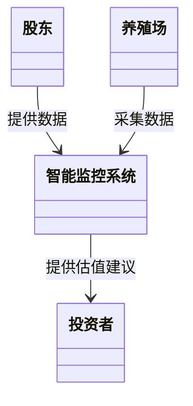
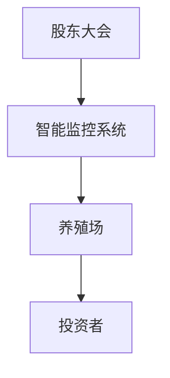
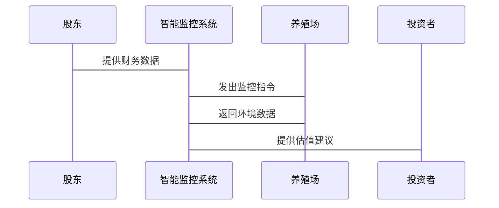

                 


# 全球股市估值与可持续海洋养殖智能监控技术的关系

> 关键词：全球股市估值，智能监控技术，海洋养殖，可持续发展，数据驱动

> 摘要：本文探讨了全球股市估值与可持续海洋养殖智能监控技术之间的关系，通过分析股市估值的核心概念、智能监控技术的实现原理，以及两者之间的联系，揭示了数据驱动技术在金融与农业交叉领域的潜在应用价值。

---

# 第1章: 背景介绍与核心概念

## 1.1 全球股市估值的背景与问题
### 1.1.1 股市估值的基本概念
股市估值是通过分析公司财务数据、市场情绪和宏观经济指标，对股票的内在价值进行评估的过程。常见的估值方法包括市盈率（P/E）、市净率（P/B）等。

### 1.1.2 全球化背景下的股市特点
随着全球化的发展，股市越来越受到全球经济波动的影响。投资者需要通过复杂的数据分析来预测股市走势，以做出明智的投资决策。

### 1.1.3 股市估值的核心问题与挑战
股市估值的核心问题是准确预测股票价格的变化趋势。然而，由于市场的不确定性和复杂性，传统的估值模型往往难以捕捉市场的动态变化。

## 1.2 可持续海洋养殖智能监控技术的背景
### 1.2.1 海洋养殖业的发展现状
海洋养殖业是全球重要的食品来源之一，但传统养殖模式存在资源浪费、环境污染等问题，亟需技术创新以实现可持续发展。

### 1.2.2 智能监控技术在海洋养殖中的应用
智能监控技术通过传感器、物联网和数据分析，实时监测水质、温湿度、生物量等关键参数，帮助养殖户优化养殖策略。

### 1.2.3 可持续发展的意义与目标
可持续海洋养殖的目标是减少资源消耗、降低环境污染，同时提高产量和经济效益。智能监控技术是实现这一目标的关键工具。

## 1.3 问题背景与研究意义
### 1.3.1 股市估值与海洋养殖的关联性
股市估值与海洋养殖业的经济表现密切相关。海洋养殖业的盈利能力会影响相关股票的市场估值。

### 1.3.2 智能监控技术对海洋养殖的影响
智能监控技术能够提高养殖效率、降低风险，从而影响海洋养殖企业的财务表现，进而影响其股票估值。

### 1.3.3 研究的创新点与实际应用价值
通过分析智能监控技术对海洋养殖的影响，可以为投资者提供更准确的估值模型，帮助其做出更明智的投资决策。

---

# 第2章: 核心概念与联系

## 2.1 股市估值的核心概念
### 2.1.1 股价与市场情绪的关系
市场情绪是影响股价的重要因素。投资者的情绪波动可以通过大数据分析和自然语言处理技术进行捕捉。

### 2.1.2 估值模型与指标分析
常用的估值模型包括 discounted cash flow (DCF) 和市盈率模型。这些模型通过分析财务数据和市场指标来预测股票价值。

### 2.1.3 影响股市估值的主要因素
主要包括宏观经济指标、公司财务数据、市场情绪、政策法规等。

## 2.2 智能监控技术的核心概念
### 2.2.1 智能监控系统的定义与特点
智能监控系统通过传感器和物联网技术，实时采集和分析环境数据，实现对养殖过程的智能化管理。

### 2.2.2 海洋养殖中的传感器与数据采集
常用的传感器包括温度、湿度、溶解氧传感器等。数据采集系统负责将传感器数据传输到中央控制系统。

### 2.2.3 数据分析与决策支持
通过机器学习算法对数据进行分析，可以预测环境变化和生物生长趋势，为养殖户提供决策支持。

## 2.3 股市估值与智能监控技术的联系
### 2.3.1 数据驱动的股市预测
智能监控技术产生的数据可以用于改进股市估值模型，提高预测的准确性。

### 2.3.2 智能监控技术对海洋养殖的影响
通过优化养殖环境和提高效率，智能监控技术可以降低养殖成本，提高企业盈利能力，从而影响股票估值。

### 2.3.3 两者关系的系统性分析
通过构建系统模型，可以量化智能监控技术对海洋养殖企业的影响，进而分析其对股市估值的具体作用机制。

---

# 第3章: 股市估值与智能监控技术的算法原理

## 3.1 股市估值预测的算法模型
### 3.1.1 常见的股市预测算法
常用的算法包括线性回归、随机森林和长短期记忆网络（LSTM）。

### 3.1.2 机器学习在股市预测中的应用
通过训练机器学习模型，可以预测股票价格的变化趋势。例如，使用随机森林模型分析多个影响因素。

### 3.1.3 时间序列分析的数学模型
时间序列模型如ARIMA（自回归积分滑动平均模型）常用于预测股票价格的变化。

## 3.2 智能监控技术的算法实现
### 3.2.1 数据采集与预处理
通过传感器采集环境数据，预处理包括数据清洗和特征提取。

### 3.2.2 数据分析与特征提取
使用主成分分析（PCA）等方法提取关键特征，为后续分析提供基础。

### 3.2.3 监控系统算法的实现流程
通过阈值设定和异常检测算法，实时监控养殖环境，发出预警信号。

## 3.3 数学模型与公式
### 3.3.1 时间序列分析模型
$$ ARIMA(p, d, q) $$
其中，p为自回归阶数，d为差分阶数，q为移动平均阶数。

### 3.3.2 机器学习模型
随机森林模型的训练流程如下：

1. 从训练集中随机抽取样本。
2. 对每个样本构建决策树。
3. 对所有决策树进行投票，得到最终预测结果。

---

# 第4章: 系统分析与架构设计方案

## 4.1 问题场景介绍
我们考虑一个典型的海洋养殖企业，希望通过智能监控技术优化养殖环境，提高企业盈利能力，进而影响其股票估值。

## 4.2 系统功能设计
### 4.2.1 领域模型设计
使用mermaid类图展示系统中的各个角色及其交互关系：



### 4.2.2 系统架构设计
使用mermaid架构图展示系统的主要组件及其交互方式：



### 4.2.3 系统接口设计
定义智能监控系统与养殖场、投资者之间的接口，确保数据的高效传递和系统的可扩展性。

### 4.2.4 系统交互设计
使用mermaid序列图展示系统的主要交互流程：



---

# 第5章: 项目实战

## 5.1 环境安装
安装必要的软件和库，例如Python、Pandas、Scikit-learn等。

## 5.2 系统核心实现源代码
### 5.2.1 数据采集模块
```python
import pandas as pd

def collect_data(sensors):
    data = pd.DataFrame()
    for sensor in sensors:
        data[sensor] = sensor.read_data()
    return data
```

### 5.2.2 数据分析模块
```python
from sklearn.ensemble import RandomForestRegressor

def predict_stock_price(data):
    model = RandomForestRegressor()
    model.fit(data[['feature1', 'feature2']], data['target'])
    return model.predict(new_data)
```

## 5.3 代码应用解读与分析
通过实际案例分析，展示如何使用智能监控数据优化股市估值模型。

## 5.4 案例分析
以某海洋养殖企业为例，分析智能监控技术对其股票估值的具体影响。

## 5.5 项目小结
总结项目实施的经验和教训，提出改进建议。

---

# 第6章: 最佳实践

## 6.1 小结
本文通过分析股市估值与智能监控技术的关系，展示了数据驱动技术在金融与农业交叉领域的应用价值。

## 6.2 注意事项
在实际应用中，需要注意数据的准确性和模型的可解释性，避免过度依赖单一数据源。

## 6.3 拓展阅读
建议进一步研究智能监控技术在其他领域的应用，例如智能交通和智慧城市。

---

作者：AI天才研究院 & 禅与计算机程序设计艺术

---

以上是文章的完整目录和部分正文内容。如果需要更详细的内容或特定章节的扩展，请随时告知！

