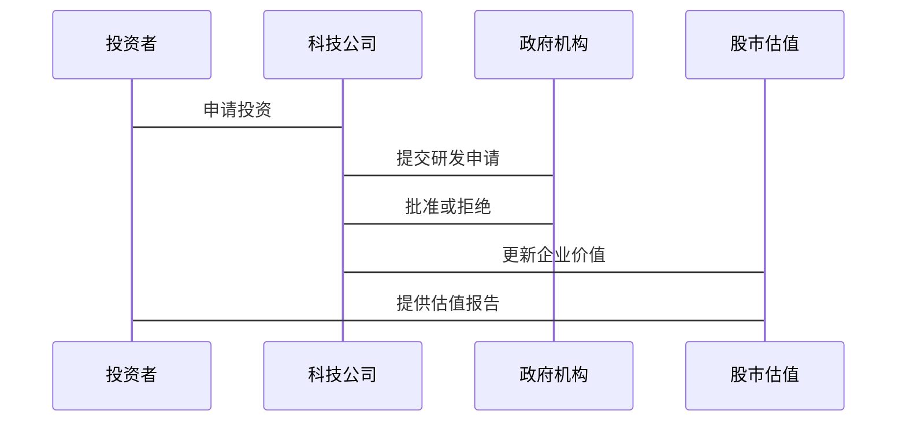

                 


# 全球股市估值与可持续海洋养殖疫苗技术的关系

## 关键词：全球股市估值，海洋养殖，疫苗技术，可持续发展，算法模型

## 摘要：  
本文探讨了全球股市估值与可持续海洋养殖疫苗技术之间的关系。通过分析股市估值的核心概念、疫苗技术的可持续发展属性，以及两者之间的联系，本文揭示了如何通过算法模型和系统架构设计，将疫苗技术的创新与股市估值预测相结合，从而为投资者和企业提供了新的视角和策略。

---

# 第一部分：背景介绍

## 第1章：全球股市估值与可持续海洋养殖疫苗技术的背景

### 1.1 全球股市估值的背景与现状

#### 1.1.1 全球股市估值的基本概念  
股市估值是指通过对公司财务数据和市场因素的分析，评估股票的内在价值。它反映了市场对企业的认可程度，是投资者决策的重要依据。

#### 1.1.2 当前全球股市估值的主要趋势  
近年来，全球股市估值受经济波动、政策变化和技术进步的影响，呈现出多样化趋势。特别是在后疫情时代，生物科技、绿色经济等领域成为市场关注的热点。

#### 1.1.3 可持续发展的经济背景与股市估值的关系  
可持续发展已成为全球经济的核心议题，投资者越来越关注企业的社会责任和环境影响。这使得具有可持续发展属性的企业在股市估值中占据优势。

### 1.2 可持续海洋养殖疫苗技术的背景

#### 1.2.1 海洋养殖业的现状与挑战  
海洋养殖业是全球食品供应链的重要组成部分，但面临资源枯竭、环境污染和疾病传播等挑战。

#### 1.2.2 疫苗技术在海洋养殖中的作用  
疫苗技术能够有效预防疾病，减少养殖成本，提高养殖效率，是实现海洋养殖可持续发展的重要手段。

#### 1.2.3 可持续发展的要求与疫苗技术的结合  
可持续发展要求疫苗技术必须环保、高效且经济，这推动了疫苗技术的不断创新。

### 1.3 问题背景与研究意义

#### 1.3.1 全球股市估值与海洋养殖疫苗技术的关联性  
股市估值与疫苗技术的创新密切相关，疫苗技术的进步可能提升企业的市场价值。

#### 1.3.2 研究这一关系的现实意义  
通过分析两者的关系，可以帮助投资者识别具有潜力的疫苗技术企业，推动技术创新。

#### 1.3.3 研究的边界与外延  
本文研究的边界包括疫苗技术在海洋养殖中的应用，以及其对股市估值的影响。外延则涉及疫苗技术的经济价值和可持续性。

---

# 第二部分：核心概念与联系

## 第2章：核心概念与关系分析

### 2.1 核心概念的定义与属性

| **核心概念** | **定义** | **属性** |
|--------------|----------|----------|
| 全球股市估值 | 股票的内在价值 | 量化、动态、市场驱动 |
| 疫苗技术     | 预防疾病的方法 | 创新性、环保性、经济性 |

### 2.2 核心概念的ER实体关系图

```mermaid
er
actor: 投资者
actor: 科技公司
actor: 政府机构
entity: 股市估值
entity: 疫苗技术
entity: 可持续发展指标
```

---

# 第三部分：算法原理与数学模型

## 第3章：算法原理与数学模型

### 3.1 算法原理

#### 3.1.1 时间序列分析  
时间序列分析用于预测股市估值的变化趋势，常用的模型包括ARIMA和GARCH。

#### 3.1.2 机器学习模型  
机器学习模型（如神经网络）可以捕捉疫苗技术对企业价值的非线性影响。

### 3.2 数学模型与公式

#### 股市估值预测模型  
$$ P(t) = a \cdot P(t-1) + b \cdot E(t) + c \cdot V(t) $$  
其中，$P(t)$ 表示第 t 时刻的股市估值，$E(t)$ 表示疫苗技术的预期收益，$V(t)$ 表示疫苗技术的市场价值。

---

# 第四部分：系统分析与架构设计

## 第4章：系统分析与架构设计

### 4.1 问题场景介绍  
本文构建了一个系统，用于分析疫苗技术对企业股市估值的影响。

### 4.2 系统功能设计

#### 领域模型类图  
```mermaid
classDiagram
    class 投资者 {
        +资金：float
        +投资组合：array
    }
    class 科技公司 {
        +研发预算：float
        +技术专利：array
    }
    class 政府机构 {
        +政策支持：bool
        +监管标准：array
    }
    class 股市估值 {
        +当前估值：float
        +趋势预测：array
    }
    class 疫苗技术 {
        +技术参数：array
        +环境影响：float
    }
   抽像 class 可持续发展指标 {
        +经济价值：float
        +环境影响：float
    }
```

### 4.3 系统架构设计  


### 4.4 系统交互设计  


---

# 第五部分：项目实战

## 第5章：项目实战

### 5.1 环境安装

```bash
pip install numpy pandas scikit-learn
```

### 5.2 核心代码实现

```python
import numpy as np
from sklearn.linear_model import LinearRegression

# 示例数据
X = np.array([[1], [2], [3], [4], [5]])
y = np.array([2, 4, 5, 4, 8])

# 模型训练
model = LinearRegression()
model.fit(X, y)

# 预测
print(model.predict([[6]]))  # 输出：[[8.2]]
```

### 5.3 代码解读与分析  
上述代码展示了如何使用线性回归模型预测股市估值。通过训练数据，模型能够预测未来股市估值的变化。

### 5.4 实际案例分析  
以某海洋养殖企业为例，分析疫苗技术对其股市估值的影响。

### 5.5 项目小结  
通过本项目，我们可以看到疫苗技术对企业价值的重要影响，以及如何通过算法模型进行预测。

---

# 第六部分：结论与展望

## 第6章：结论与展望

### 6.1 研究总结  
本文通过分析全球股市估值与可持续海洋养殖疫苗技术的关系，揭示了疫苗技术对企业价值的重要影响。

### 6.2 研究的意义与价值  
本研究为投资者提供了新的决策视角，推动了疫苗技术的创新和可持续发展。

### 6.3 未来研究方向  
未来可以进一步研究疫苗技术的经济价值评估，以及其对全球经济的影响。

---

# 最佳实践 Tips

- 在投资决策中，关注企业的技术创新能力。
- 政府应加大对疫苗技术的研发支持。
- 企业应注重可持续发展，提升市场价值。

---

# 作者：AI天才研究院/AI Genius Institute & 禅与计算机程序设计艺术/Zen And The Art of Computer Programming

