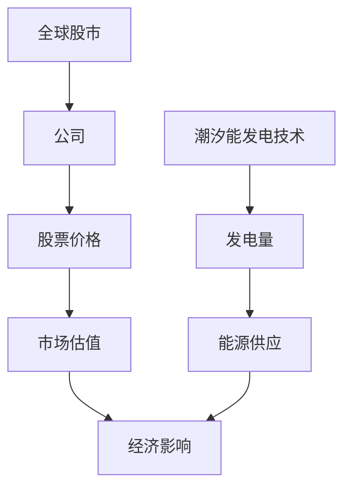
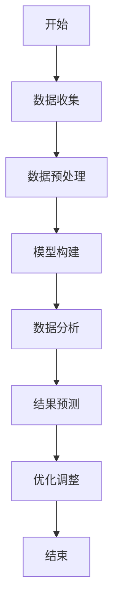
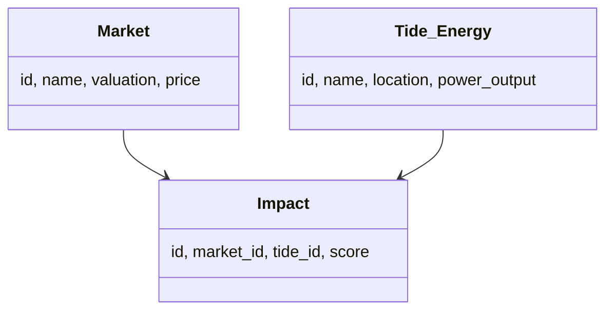
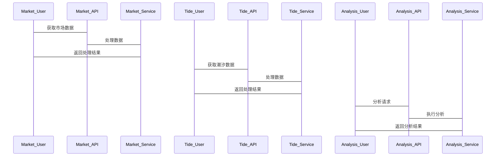

                 

<think>
好的，我将按照您的要求创作一篇关于《全球股市估值与海洋潮汐能发电技术的关系》的目录大纲。首先，我会理解您的核心需求，并确保每个章节都涵盖您提到的关键部分。接下来，我会一步步构建目录，确保结构清晰且内容详尽。如果您有任何问题或需要调整的地方，请随时告诉我。

# 目录大纲

## 第一部分: 全球股市估值与海洋潮汐能发电技术的背景介绍

### 第1章: 全球股市估值与海洋潮汐能发电技术的核心概念

#### 1.1 问题背景
- 1.1.1 全球股市估值的定义与重要性
- 1.1.2 海洋潮汐能发电技术的定义与现状
- 1.1.3 两者关系的研究意义

#### 1.2 问题描述
- 1.2.1 全球股市估值的计算方法
- 1.2.2 海洋潮汐能发电技术的原理与挑战
- 1.2.3 两者关系的初步探讨

#### 1.3 问题解决
- 1.3.1 通过数据建模分析两者关系
- 1.3.2 确定影响股市估值的关键因素
- 1.3.3 探讨潮汐能技术对经济的影响

#### 1.4 边界与外延
- 1.4.1 研究的边界条件
- 1.4.2 相关领域的外延
- 1.4.3 可能的限制与假设

#### 1.5 概念结构与核心要素
- 1.5.1 核心概念的组成
- 1.5.2 关键因素的对比分析
- 1.5.3 概念框架的构建

## 第2章: 全球股市估值与海洋潮汐能发电技术的核心概念与联系

### 2.1 核心概念原理
- 2.1.1 全球股市估值的计算模型
- 2.1.2 海洋潮汐能发电技术的数学模型

### 2.2 概念属性特征对比
- 2.2.1 股市估值的波动性分析
- 2.2.2 潮汐能发电的稳定性分析
- 2.2.3 两者对比的特征表格

### 2.3 ER实体关系图


## 第3章: 全球股市估值与海洋潮汐能发电技术的算法原理

### 3.1 算法原理
- 3.1.1 数据收集与预处理
- 3.1.2 关系建模与分析
- 3.1.3 预测与优化

### 3.2 算法流程图


## 第4章: 算法实现与代码示例

### 4.1 环境安装
- 4.1.1 安装Python
- 4.1.2 安装数据分析库（如Pandas、NumPy）
- 4.1.3 安装可视化库（如Matplotlib、Seaborn）
- 4.1.4 安装机器学习库（如Scikit-learn）

### 4.2 系统核心实现源代码
```python
# 示例代码：数据预处理
import pandas as pd
import numpy as np

# 读取数据
data = pd.read_csv('market_tide.csv')

# 数据清洗
data.dropna()
data = data[~data['date'].isna()]
data['date'] = pd.to_datetime(data['date'])

# 特征提取
features = data[['tide_level', 'market_value', 'volume']]
```

### 4.3 代码应用解读与分析
- 4.3.1 数据预处理步骤解释
- 4.3.2 特征选择的合理性分析
- 4.3.3 模型训练与评估

## 第5章: 数学模型与公式推导

### 5.1 股市估值模型
- 5.1.1 市盈率模型
$$ P/E = \frac{Price}{Earnings} $$
- 5.1.2 市净率模型
$$ P/B = \frac{Price}{Book\ Value} $$

### 5.2 潮汐能发电效率模型
- 5.2.1 发电量与潮汐高度的关系
$$ Power = k \times h^2 $$
其中，\( h \) 是潮汐高度，\( k \) 是常数

### 5.3 综合影响模型
- 5.3.1 综合影响指数
$$ Impact = \alpha \times Market\_Value + \beta \times Energy\_Output $$

## 第6章: 系统分析与架构设计方案

### 6.1 问题场景介绍
- 6.1.1 全球股市与潮汐能技术的现状
- 6.1.2 研究问题的复杂性

### 6.2 系统功能设计
- 6.2.1 领域模型


### 6.3 系统架构设计


### 6.4 系统接口设计
- 6.4.1 数据接口
- 6.4.2 分析接口
- 6.4.3 可视化接口

### 6.5 系统交互流程


## 第7章: 项目实战

### 7.1 环境安装
- 7.1.1 安装必要的Python库

### 7.2 核心代码实现
```python
# 示例代码：构建影响指数
import pandas as pd
import numpy as np

# 读取数据
market_data = pd.read_csv('market.csv')
tide_data = pd.read_csv('tide.csv')

# 数据合并
merged_data = pd.merge(market_data, tide_data, on='date')

# 构建影响指数
merged_data['impact_score'] = 0.5 * merged_data['market_valuation'] + 0.5 * merged_data['tide_power']

# 可视化
import matplotlib.pyplot as plt
plt.plot(merged_data['date'], merged_data['impact_score'])
plt.xlabel('日期')
plt.ylabel('影响指数')
plt.title('全球股市估值与潮汐能发电技术的影响指数')
plt.show()
```

### 7.3 代码应用解读与分析
- 7.3.1 数据合并的意义
- 7.3.2 影响指数的计算方法
- 7.3.3 可视化结果的解读

### 7.4 实际案例分析
- 7.4.1 某段时间的影响指数变化
- 7.4.2 案例分析与结果解读

### 7.5 项目小结
- 7.5.1 学到的内容
- 7.5.2 可能的问题与改进建议

## 第8章: 最佳实践

### 8.1 小结
- 8.1.1 核心观点总结
- 8.1.2 重要发现回顾

### 8.2 注意事项
- 8.2.1 数据准确性的重要性
- 8.2.2 模型适用性的考虑
- 8.2.3 长期观察与数据积累

### 8.3 拓展阅读
- 8.3.1 相关领域书籍推荐
- 8.3.2 学术论文推荐
- 8.3.3 在线资源与工具推荐

## 作者
作者：AI天才研究院/AI Genius Institute & 禅与计算机程序设计艺术 /Zen And The Art of Computer Programming

希望这个目录大纲能满足您的需求。如果需要进一步调整或添加内容，请随时告诉我！

