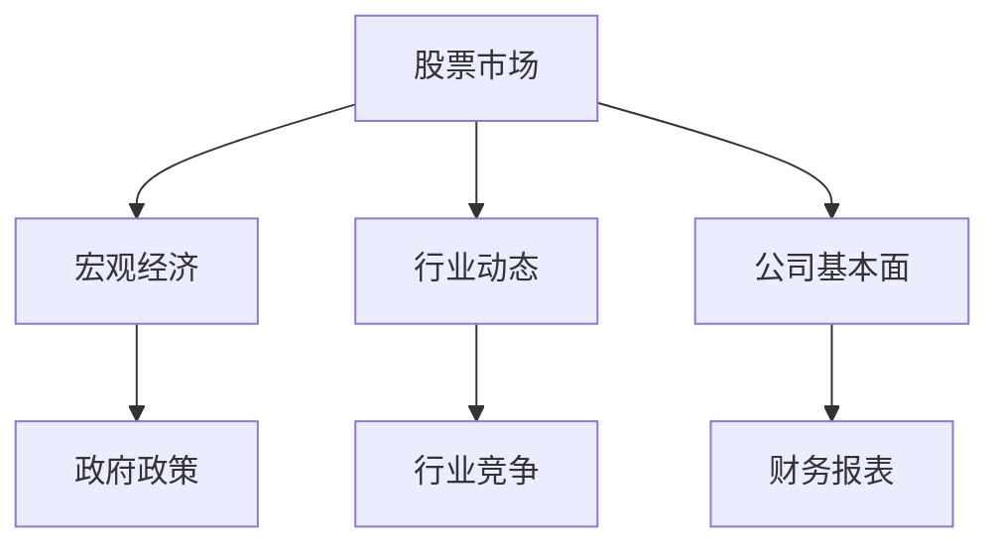

                 

# 全球股市估值与量子通信在金融安全中的应用

> 关键词：全球股市估值、量子通信、金融安全、量子加密、量子计算、金融风险管理

> 摘要：本文深入探讨了全球股市估值的核心模型与方法，并结合量子通信的基本原理与技术实现，分析了其在金融安全中的应用前景。文章从背景介绍、核心概念、算法原理、系统架构等多方面展开，结合实际案例与最佳实践，为读者提供了一个全面、系统的技术视角。

---

# 第1章: 全球股市估值与量子通信的背景与核心概念

## 1.1 全球股市估值的背景与重要性

### 1.1.1 什么是全球股市估值
全球股市估值是指通过对全球范围内股票市场的整体或部分进行评估，以确定其内在价值和市场表现的过程。这一过程涉及宏观经济、行业动态和公司基本面等多个维度。

$$
\text{股市估值} = \frac{\text{公司未来现金流的现值}}{\text{市场参与者的风险偏好}}
$$

### 1.1.2 全球股市估值的核心目标
股市估值的核心目标是通过分析市场数据，预测股票价格的变化趋势，帮助投资者做出理性决策。

### 1.1.3 全球股市估值的边界与外延
- **边界**：限制在股票市场范围内，不考虑其他金融资产。
- **外延**：涉及宏观经济、行业和公司基本面等多个层面。

### 1.1.4 全球股市估值的实体关系图

## 1.2 量子通信的基本概念与特点

### 1.2.1 量子通信的定义
量子通信是利用量子力学原理进行信息传输的技术，其核心优势在于通信的安全性和高效性。

### 1.2.2 量子通信的核心原理
- **量子叠加**：信息以量子叠加态形式存在。
- **量子纠缠**：信息之间存在不可分割的关联。
- **量子测量**：测量会破坏量子状态。

### 1.2.3 量子通信与传统通信的区别

| 特性 | 传统通信 | 量子通信 |
|------|----------|----------|
| 数据传输 | 确定性 | 概率性 |
| 安全性 | 易受攻击 | 高安全性 |
| 速度 | 受限 | 理论上无限快 |

## 1.3 量子通信在金融安全中的应用前景

### 1.3.1 量子通信在金融安全中的潜在应用领域
- **数据加密**：保护金融交易数据的安全。
- **隐私保护**：确保金融数据的隐私性。
- **风险管理**：实时监控金融市场波动。

### 1.3.2 量子通信在金融安全中的优势
- **不可窃听性**：量子通信的信息传输无法被窃听。
- **抗干扰性**：量子通信的信息传输具有高度的抗干扰能力。
- **高效性**：量子通信的传输速度远超传统通信。

### 1.3.3 量子通信应用的挑战与机遇
- **技术挑战**：量子通信的技术实现难度大。
- **成本挑战**：量子通信的设备成本高昂。
- **机遇**：量子通信的出现为金融安全提供了新的解决方案。

## 1.4 本章小结

---

# 第2章: 全球股市估值的核心模型与方法

## 2.1 传统股市估值模型

### 2.1.1 市盈率模型

$$
\text{市盈率} = \frac{\text{股价}}{\text{每股收益}}
$$

### 2.1.2 市净率模型

$$
\text{市净率} = \frac{\text{股价}}{\text{每股净资产}}
$$

### 2.1.3 股息率模型

$$
\text{股息率} = \frac{\text{每股股息}}{\text{股价}}
$$`

## 2.2 现代股市估值模型

### 2.2.1 资本资产定价模型（CAPM）

$$
\text{预期收益} = r_f + \beta (E(R_m) - r_f)
$$`

### 2.2.2 投资组合理论

$$
\text{最优组合} = \arg \min \sigma^2 \quad \text{在} \quad \mu \geq \bar{\mu}
$$`

### 2.2.3 风险中性定价模型

$$
\text{期权价格} = \frac{1}{\text{无风险利率}} \times \text{预期未来价值}
$$`

## 2.3 全球股市估值的影响因素

### 2.3.1 宏观经济因素

| 经济指标 | 影响 |
|----------|------|
| 利率 | 利率上升，股市估值下降 |
| 汇率 | 汇率波动影响外资流入 |

### 2.3.2 行业因素

| 行业 | 影响 |
|------|------|
| 科技行业 | 创新能力强，估值高 |
| 传统行业 | 估值相对稳定 |

### 2.3.3 公司基本面因素

| 公司指标 | 影响 |
|----------|------|
| 收益率 | 收益率高，估值高 |
| 债务率 | 债务率高，估值低 |

## 2.4 本章小结

---

# 第3章: 量子通信的基本原理与技术实现

## 3.1 量子通信的基本原理

### 3.1.1 量子叠加原理

$$
|\psi\rangle = \alpha|0\rangle + \beta|1\rangle
$$`

### 3.1.2 量子纠缠原理

$$
|\psi\rangle = \frac{1}{\sqrt{2}}(|0\rangle|1\rangle + |1\rangle|0\rangle)
$$`

### 3.1.3 量子测量原理

$$
\text{测量结果} = \text{随机选择} |0\rangle \text{或} |1\rangle
$$`

## 3.2 量子通信的主要技术

### 3.2.1 量子密钥分发（QKD）

### 3.2.2 量子隐形传态

### 3.2.3 量子网络协议

## 3.3 量子通信的关键实现技术

### 3.3.1 量子态制备与操控

### 3.3.2 量子信道的构建

### 3.3.3 量子错误纠正

## 3.4 本章小结

---

# 第4章: 量子通信在金融安全中的应用

## 4.1 量子加密在金融数据传输中的应用

### 4.1.1 量子密钥分发在金融数据加密中的应用

### 4.1.2 量子加密算法在金融交易中的应用

### 4.1.3 量子加密在金融网络中的安全性

## 4.2 量子通信在金融隐私保护中的应用

### 4.2.1 量子通信在金融隐私保护的核心原理

### 4.2.2 量子通信在金融隐私保护中的具体实现

### 4.2.3 量子通信在金融隐私保护中的优势

## 4.3 量子通信在金融风险管理中的应用

### 4.3.1 量子通信在金融风险管理中的作用

### 4.3.2 量子通信在金融风险管理中的具体应用

### 4.3.3 量子通信在金融风险管理中的优势

## 4.4 本章小结

---

# 作者：AI天才研究院/AI Genius Institute & 禅与计算机程序设计艺术 /Zen And The Art of Computer Programming

