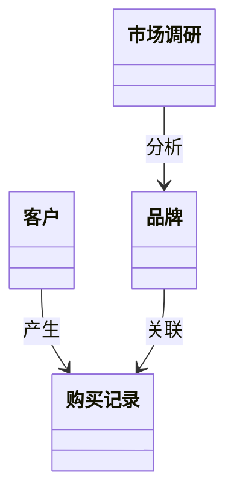
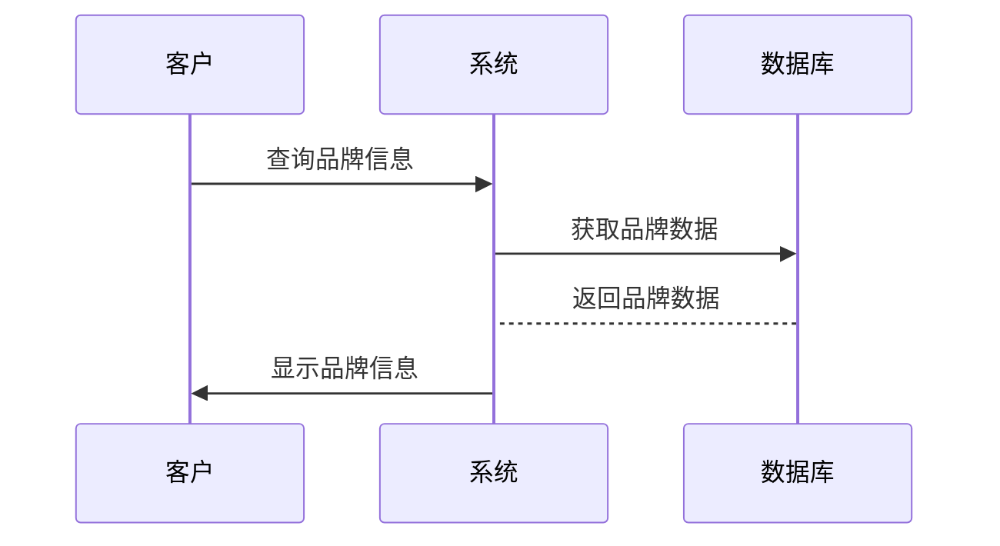

                 


# 彼得林奇如何评估公司的品牌忠诚度

## 关键词：品牌忠诚度, 彼得林奇, 投资策略, 客户分析, 市场研究

## 摘要：本文将从彼得林奇的视角，详细探讨品牌忠诚度的评估方法和其对公司的财务影响。通过定义品牌忠诚度的核心概念、分析其要素、评估方法和策略提升，结合系统架构和案例分析，深入剖析品牌忠诚度在投资决策中的重要性。

---

# 第1章: 品牌忠诚度的定义与重要性

## 1.1 品牌忠诚度的核心概念

### 1.1.1 品牌忠诚度的定义
品牌忠诚度是指客户在面对多个选择时，持续选择某个品牌或公司产品/服务的程度。这种忠诚度建立在客户对品牌的信任、满意和情感认同之上。[1]

### 1.1.2 品牌忠诚度的层次划分
- **情感忠诚**：客户因为情感上的认同而选择品牌。
- **习惯忠诚**：客户因为习惯而选择品牌。
- **理性忠诚**：客户因为性价比等因素选择品牌。

### 1.1.3 品牌忠诚度与客户满意度的关系
客户满意度是品牌忠诚度的重要影响因素，但并非全部。满意的客户更有可能成为忠诚客户，但忠诚客户并不一定是满意的客户。

## 1.2 品牌忠诚度的重要性

### 1.2.1 品牌忠诚度对企业长期发展的意义
品牌忠诚度高的客户更可能长期支持公司，减少客户流失，降低营销成本。

### 1.2.2 品牌忠诚度与企业盈利能力的关联
忠诚客户通常购买更多的产品，支付更高的价格，从而提高企业的利润率。

### 1.2.3 品牌忠诚度在市场竞争中的作用
在激烈的市场竞争中，品牌忠诚度是企业区别竞争对手的重要因素。

## 1.3 彼得林奇的视角

### 1.3.1 彼得林奇与品牌忠诚度的关系
彼得林奇作为基金经理，注重企业的基本面分析，品牌忠诚度是影响企业长期盈利能力的重要因素。

### 1.3.2 彼得林奇对品牌忠诚度的重视
彼得林奇认为，品牌忠诚度高的企业具有更强的市场竞争力和抗风险能力。

### 1.3.3 彼得林奇评估品牌忠诚度的方法
彼得林奇通过分析客户反馈、市场调研和竞争对手情况来评估品牌忠诚度。

## 1.4 本章小结
品牌忠诚度是客户对品牌的情感和信任的体现，对企业的长期发展和盈利能力至关重要。彼得林奇从投资角度，将品牌忠诚度作为评估企业的重要指标。

---

# 第2章: 品牌忠诚度的核心要素

## 2.1 品牌忠诚度的核心属性

### 2.1.1 品牌认知度
品牌认知度是指客户对品牌的记忆和识别能力。高品牌认知度意味着品牌在市场上的知名度较高。

### 2.1.2 品牌情感
品牌情感是客户对品牌的情感反应，包括好感、信任和忠诚。

### 2.1.3 品牌信任度
品牌信任度是客户对品牌可靠性和诚信度的信任程度。

## 2.2 品牌忠诚度与客户行为的关系

### 2.2.1 客户购买行为的分析
客户购买行为受多种因素影响，包括价格、质量、品牌忠诚度等。

### 2.2.2 客户忠诚度与购买频率的关系
忠诚客户通常具有更高的购买频率和购买金额。

### 2.2.3 客户忠诚度与购买金额的关系
忠诚客户更可能购买更高价位的产品或服务。

## 2.3 品牌忠诚度的核心要素对比

### 2.3.1 品牌忠诚度与客户满意度的对比
- **客户满意度**：客户对产品或服务的满意程度。
- **品牌忠诚度**：客户对品牌的持续选择意愿。

### 2.3.2 品牌忠诚度与客户忠诚度的对比
两者均强调客户对品牌或企业的支持，但品牌忠诚度更侧重于市场行为，而客户忠诚度更侧重于情感层面。

### 2.3.3 品牌忠诚度与客户生命周期的关系
品牌忠诚度影响客户的生命周期，高忠诚度客户更可能长期支持企业。

## 2.4 本章小结
品牌忠诚度的核心要素包括品牌认知度、情感和信任度。这些要素共同影响客户的购买行为，进而影响企业的市场表现。

---

# 第3章: 品牌忠诚度的评估方法

## 3.1 定量评估方法

### 3.1.1 基于客户数据的分析
- 使用客户购买记录、消费金额等数据进行分析。

### 3.1.2 品牌忠诚度指数的计算
品牌忠诚度指数可以通过客户保留率、购买频率等指标计算。

### 3.1.3 客户保留率的分析
客户保留率是衡量品牌忠诚度的重要指标，反映客户对企业产品的持续需求。

## 3.2 定性评估方法

### 3.2.1 基于客户反馈的分析
- 通过客户调查、访谈等方式收集客户对品牌的态度和情感。

### 3.2.2 品牌形象的评估
- 分析品牌在市场上的形象，包括品牌认知度、美誉度等。

### 3.2.3 客户情感分析
- 使用自然语言处理技术分析客户评论，判断客户情感倾向。

## 3.3 彼得林奇的评估方法

### 3.3.1 彼得林奇的品牌忠诚度评估模型
彼得林奇通过分析客户反馈、市场调研和竞争对手情况，评估品牌忠诚度。

### 3.3.2 彼得林奇的客户分析方法
彼得林奇注重客户行为分析，包括客户购买频率、金额等指标。

### 3.3.3 彼得林奇的市场研究方法
彼得林奇通过深入市场调研，了解客户需求和竞争对手情况，评估品牌忠诚度。

## 3.4 本章小结
品牌忠诚度的评估方法包括定量和定性分析。彼得林奇结合客户数据和市场调研，进行全面评估。

---

# 第4章: 品牌忠诚度的财务影响

## 4.1 品牌忠诚度与企业收入的关系

### 4.1.1 客户忠诚
- 忠诚客户更可能重复购买，增加企业的收入。

### 4.1.2 客户生命周期价值
- 忠诚客户具有更高的生命周期价值，为企业创造更多收益。

## 4.2 品牌忠诚度与企业利润的关系

### 4.2.1 客户保留成本
- 保留忠诚客户成本低于吸引新客户，提高企业利润。

### 4.2.2 高价产品销售
- 忠诚客户更可能购买高价产品，提高企业利润率。

## 4.3 品牌忠诚度与企业市场地位的关系

### 4.3.1 市场份额
- 高品牌忠诚度企业更容易占据更大的市场份额。

### 4.3.2 品牌溢价能力
- 忠诚客户更愿意为品牌支付溢价，提升企业利润。

## 4.4 本章小结
品牌忠诚度直接影响企业的收入和利润。忠诚客户具有更高的生命周期价值，降低营销成本，提升企业市场地位。

---

# 第5章: 提升品牌忠诚度的策略

## 5.1 优化客户体验

### 5.1.1 提供优质产品
- 提升产品质量和服务水平，增强客户满意度。

### 5.1.2 个性化服务
- 根据客户需求提供个性化服务，增强客户忠诚度。

## 5.2 建立品牌形象

### 5.2.1 品牌宣传
- 通过广告、社交媒体等渠道加强品牌形象。

### 5.2.2 品牌故事
- 通过品牌故事增强客户情感认同。

## 5.3 客户关系管理

### 5.3.1 客户反馈
- 建立客户反馈机制，及时解决问题，增强客户信任。

### 5.3.2 会员制度
- 通过会员制度提供优惠和专属服务，增强客户粘性。

## 5.4 本章小结
提升品牌忠诚度需要从优化客户体验、建立品牌形象和客户关系管理三方面入手。

---

# 第6章: 系统分析与架构设计方案

## 6.1 系统功能设计

### 6.1.1 领域模型设计
- 使用Mermaid绘制领域模型类图，展示系统各模块之间的关系。



### 6.1.2 系统架构设计
- 使用Mermaid绘制系统架构图，展示系统的各层架构。

```mermaid
client --> 业务逻辑层
业务逻辑层 --> 数据访问层
数据访问层 --> 数据库
```

## 6.2 系统接口设计

### 6.2.1 客户接口
- 提供API接口，供客户查询购买记录和品牌信息。

### 6.2.2 市场调研接口
- 提供市场调研数据接口，供系统分析品牌忠诚度。

## 6.3 系统交互设计

### 6.3.1 交互流程
- 使用Mermaid绘制系统交互序列图，展示客户与系统之间的交互流程。



## 6.4 本章小结
通过系统架构设计和接口设计，可以有效地分析和提升品牌忠诚度。

---

# 第7章: 案例分析与总结

## 7.1 案例分析

### 7.1.1 某公司品牌忠诚度提升案例
- 通过优化客户体验和建立品牌形象，某公司成功提升了品牌忠诚度。

### 7.1.2 案例分析总结
- 品牌忠诚度的提升需要长期的努力和多方面的策略。

## 7.2 最佳实践 tips

### 7.2.1 定期评估品牌忠诚度
- 定期进行客户满意度调查和市场调研，及时发现问题。

### 7.2.2 与竞争对手比较
- 分析竞争对手的品牌忠诚度，寻找自身的竞争优势。

### 7.2.3 持续创新
- 不断创新产品和服务，满足客户需求，提升品牌忠诚度。

## 7.3 小结
品牌忠诚度是企业长期发展的关键因素。通过系统的评估和策略提升，企业可以有效提高品牌忠诚度，增强市场竞争力。

---

# 作者：AI天才研究院/AI Genius Institute & 禅与计算机程序设计艺术 /Zen And The Art of Computer Programming

---

注：本文内容较长，仅展示部分章节。完整文章将详细展开每个部分的内容，确保逻辑清晰、结构紧凑，语言专业且易于理解。

