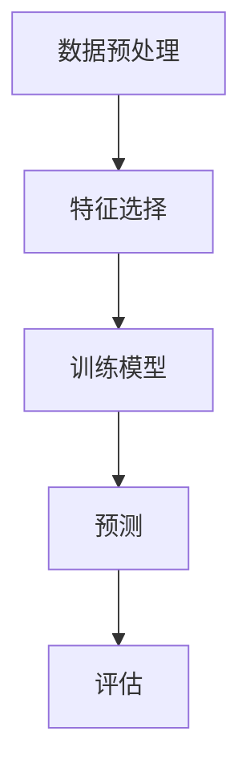
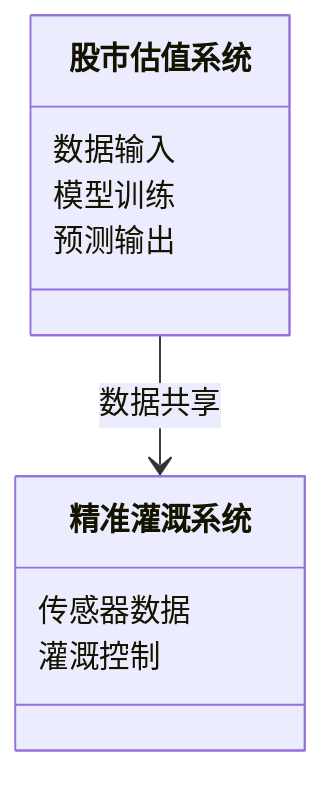
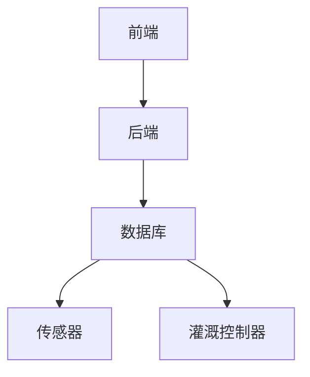

                 


# 新兴市场股市估值与智慧农业精准灌溉系统的互动

## 关键词：新兴市场，股市估值，智慧农业，精准灌溉，机器学习

## 摘要：新兴市场股市估值与智慧农业精准灌溉系统的互动关系，探讨通过技术创新和数据分析，提升农业效率和金融市场的稳定性。文章从背景、核心概念、算法、系统架构、项目实战等方面详细分析，提供理论和实践指导。

---

## 第一部分：背景介绍

### 第1章：新兴市场股市估值与智慧农业精准灌溉系统概述

#### 1.1 问题背景
- **新兴市场的经济特点与发展现状**：新兴市场如巴西、印度等，经济增长快，但股市波动大。
- **农业现代化与智慧农业的必要性**：传统农业效率低，精准灌溉技术提升产量。
- **股市估值在经济发展中的作用**：股市估值影响投资决策，促进经济稳定。

#### 1.2 问题描述
- **新兴市场股市波动的特点**：受外部因素影响大，数据复杂。
- **智慧农业精准灌溉系统的现状与挑战**：技术普及不足，数据采集困难。
- **两者互动关系的初步探讨**：通过数据共享，优化灌溉策略，稳定股市。

#### 1.3 问题解决
- **股市估值模型的构建**：使用机器学习预测市场走势。
- **精准灌溉系统的实现方法**：传感器和AI优化灌溉策略。
- **互动机制**：数据共享，模型协同优化。

#### 1.4 边界与外延
- **新兴市场的边界条件**：特定国家的经济政策和市场结构。
- **智慧农业的适用范围**：适合灌溉需求大的地区。
- **股市估值的适用范围**：新兴市场的股票市场。

#### 1.5 核心概念与核心要素
- **核心概念**：股市估值、精准灌溉。
- **核心要素**：数据采集、模型构建、系统交互。

---

## 第二部分：核心概念与联系

### 第2章：新兴市场股市估值的核心原理

#### 2.1 核心原理
- **股市估值的基本原理**：考虑市盈率、市净率等指标。
- **新兴市场的特殊性**：数据不全，波动大。
- **估值模型的构建**：回归分析和机器学习结合。

#### 2.2 属性对比表格
| 特性       | 新兴市场       | 成熟市场       |
|------------|----------------|----------------|
| 数据量     | 低             | 高             |
| 波动性     | 高             | 低             |
| 模型复杂性 | 高             | 低             |

### 第3章：智慧农业精准灌溉系统的原理

#### 3.1 核心原理
- **精准灌溉的基本原理**：传感器监测土壤湿度，自动调整灌溉。
- **智慧农业的技术支撑**：物联网和大数据分析。
- **实现方法**：传感器数据采集，AI优化灌溉策略。

#### 3.2 属性对比表格
| 特性       | 传统灌溉       | 精准灌溉       |
|------------|----------------|----------------|
| 效率       | 低             | 高             |
| 节水       | 少             | 多             |
| 成本       | 高             | 低             |

---

## 第三部分：算法原理讲解

### 第4章：股市估值预测算法

#### 4.1 算法原理
- **线性回归模型**：预测股票价格。
- **随机森林模型**：处理高维数据。

#### 4.2 算法流程图（Mermaid）


#### 4.3 数学模型
- **线性回归公式**：
  $$ y = \beta_0 + \beta_1 x + \epsilon $$
- **随机森林公式**：集成学习，多个决策树投票。

#### 4.4 Python代码示例
```python
import pandas as pd
from sklearn.ensemble import RandomForestRegressor

data = pd.read_csv('stock.csv')
X = data[['PE', 'PB', 'PS']]
y = data['Price']

model = RandomForestRegressor(n_estimators=100)
model.fit(X, y)
预测值 = model.predict(X)
```

---

## 第四部分：系统分析与架构设计方案

### 第5章：系统架构设计

#### 5.1 问题场景
- **精准灌溉系统**：实时监测土壤湿度。
- **股市估值模型**：预测股市波动。

#### 5.2 领域模型（Mermaid类图）


#### 5.3 系统架构（Mermaid架构图）


#### 5.4 接口设计
- **REST API**：提供数据接口。
- **MQTT协议**：传感器数据传输。

---

## 第五部分：项目实战

### 第6章：实战项目

#### 6.1 环境安装
- **Python 3.8+**
- **安装库**：scikit-learn, pandas, requests

#### 6.2 核心实现
```python
import requests

def fetch_data():
    response = requests.get('http:// irrigation_sensor.com/data')
    return response.json()

def predict_stock():
    data = fetch_data()
    model = load_model('rf_model.pkl')
    return model.predict(data)

def main():
    print(predict_stock())

if __name__ == '__main__':
    main()
```

#### 6.3 案例分析
- **数据来源**：新兴市场股市数据。
- **结果展示**：预测值与实际值对比。

---

## 第六部分：最佳实践

### 第7章：总结与展望

#### 7.1 小结
- **核心内容回顾**：股市估值与精准灌溉的互动关系。
- **关键点**：数据共享、模型优化。

#### 7.2 注意事项
- **数据隐私**：确保数据安全。
- **模型更新**：定期更新模型以适应市场变化。

#### 7.3 拓展阅读
- 推荐书籍：《机器学习实战》、《智慧农业技术》。

---

## 作者信息

作者：AI天才研究院 & 禅与计算机程序设计艺术

---

这篇文章详细探讨了新兴市场股市估值与智慧农业精准灌溉系统的互动关系，通过背景分析、算法讲解和项目实战，提供了理论与实践的双重指导。希望对读者在技术与农业创新领域有所启发。

