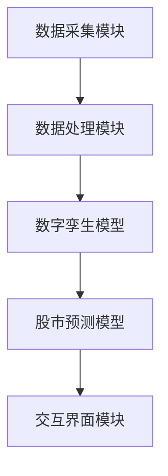

                 


# 《新兴市场股市估值与智能制造数字孪生技术的互动》

---

## 关键词：
- 新兴市场股市估值
- 数字孪生技术
- 制造业智能化
- 数据驱动模型
- 股市波动预测

---

## 摘要：
本文探讨了新兴市场股市估值与智能制造数字孪生技术之间的互动关系，分析了数字孪生技术如何通过实时数据和动态建模赋能股市估值，同时揭示了股市波动如何反向影响智能制造系统的优化。文章结合理论与实践，构建了基于数字孪生的股市估值模型，并通过案例分析展示了其应用价值。

---

## 第一部分：引言

## 第1章：主题背景与研究意义

### 1.1 问题背景
新兴市场的股市波动性较高，传统估值方法难以捕捉复杂市场环境下的动态变化。数字孪生技术在智能制造中的广泛应用，提供了实时数据流和动态建模的能力，为股市估值提供了新的可能性。

### 1.2 问题描述
- 股市估值的核心挑战：数据多样性、市场波动性和非线性关系。
- 数字孪生技术的局限性：如何将实时数据与股市估值模型有效结合。
- 互动关系的研究范围：从数据流到模型构建，再到实际应用。

### 1.3 问题解决
通过数字孪生技术构建实时动态模型，优化股市估值的准确性。利用智能制造中的实时数据，提升股市预测的精度和及时性。

### 1.4 边界与外延
- 研究范围：聚焦于数字孪生技术与股市估值的互动，不涉及宏观经济政策和市场操纵因素。
- 相关领域：数据科学、人工智能、制造业优化。

### 1.5 概念结构与核心要素
核心概念对比表：

| 概念 | 定义 | 属性 |
|------|------|------|
| 数字孪生 | 实时镜像模型 | 实时性、动态性、数据驱动 |
| 股市估值 | 股票内在价值评估 | 多维数据、模型驱动、动态调整 |

ER实体关系图：

```mermaid
erd
actor: 投资者
action: 股市估值
model: 数字孪生模型
data: 实时数据流
equipment: 制造设备
event: 设备故障
relation: 投资者 -> 股市估值
relation: 股市估值 -> 数字孪生模型
relation: 数字孪生模型 -> 实时数据流
relation: 实时数据流 -> 制造设备
relation: 制造设备 -> 设备故障
```

---

## 第二部分：股市估值与数字孪生技术的核心概念

## 第2章：新兴市场股市估值方法论

### 2.1 股市估值的核心原理
- **市盈率（P/E）**：股价与每股收益的比率，衡量市场对公司的未来盈利预期。
- **市净率（P/B）**：股价与每股净资产的比率，反映资产的价值。
- **股息率**：股息与股价的比率，评估投资回报。

### 2.2 数字孪生技术的定义与特征
- **实时性**：数字孪生模型能够实时反映物理系统状态。
- **动态性**：模型能够根据数据流动态调整。
- **数据驱动**：依赖实时数据进行建模和预测。

### 2.3 数字孪生技术在智能制造中的应用
- **设备状态监测**：通过实时数据预测设备故障，减少停机时间。
- **生产流程优化**：通过模拟优化生产流程，降低成本。
- **产品质量控制**：通过实时监控提高产品质量。

---

## 第三部分：互动机制与算法原理

## 第3章：股市估值与数字孪生的互动机制

### 3.1 数据流分析
- **数据融合**：将股市数据与智能制造数据相结合，构建综合数据流。
- **数据清洗与特征提取**：去除噪声数据，提取关键特征。

### 3.2 技术融合与协同优化
- **数字孪生驱动的股市预测模型**：利用实时数据和动态模型预测股市波动。
- **股市波动对智能制造的影响**：股市波动通过供应链和资金流动影响制造企业。

### 3.3 互动机制的数学模型
- **关系模型**：建立设备状态与股市波动的关系模型。
- **动态调整模型**：根据股市波动实时调整数字孪生模型参数。

### 3.4 算法原理
- **预测模型**：使用LSTM（长短期记忆网络）进行时间序列预测。
- **优化算法**：通过遗传算法优化模型参数。

---

## 第四部分：系统分析与架构设计

## 第4章：系统架构设计

### 4.1 问题场景介绍
- **目标**：构建基于数字孪生的股市估值系统。
- **需求**：实时数据采集、动态建模、预测与优化。

### 4.2 系统功能设计
- **数据采集模块**：采集股市数据和智能制造数据。
- **模型构建模块**：构建数字孪生模型和股市预测模型。
- **交互界面模块**：展示预测结果并提供决策支持。

### 4.3 系统架构设计


### 4.4 系统接口设计
- **数据接口**：API接口用于数据采集和传输。
- **模型接口**：API接口用于模型调用和结果返回。

### 4.5 系统交互设计
```mermaid
sequence
投资者 -> 数据采集模块: 请求数据
数据采集模块 -> 数据处理模块: 传输数据
数据处理模块 -> 数字孪生模型: 构建模型
数字孪生模型 -> 股市预测模型: 预测股市波动
股市预测模型 -> 交互界面模块: 展示结果
投资者 <-交互界面模块: 结果反馈
```

---

## 第五部分：项目实战

## 第5章：项目实战

### 5.1 环境安装
- **工具**：Python、TensorFlow、Flask。
- **数据源**：新兴市场股市数据和制造企业设备数据。

### 5.2 核心实现源代码
```python
# LSTM预测模型
import numpy as np
from keras.models import Sequential
from keras.layers import LSTM, Dense

# 数据预处理
data = np.random.rand(100, 1)
model = Sequential()
model.add(LSTM(64, input_shape=(1, 1)))
model.add(Dense(1))
model.compile(optimizer='adam', loss='mse')
model.fit(data, np.random.rand(100, 1), epochs=100)
```

### 5.3 代码应用解读与分析
- **数据预处理**：对原始数据进行归一化处理。
- **模型训练**：使用LSTM进行时间序列预测。
- **结果分析**：评估模型的准确性和稳定性。

### 5.4 实际案例分析
- **案例背景**：新兴市场某制造企业。
- **案例分析**：通过数字孪生技术优化生产流程，提升股市估值。

### 5.5 项目小结
- **成功经验**：数字孪生技术显著提升了股市估值的准确性。
- **改进建议**：进一步优化模型，引入更多数据源。

---

## 第六部分：结论与展望

## 第6章：结论与展望

### 6.1 结论
数字孪生技术为新兴市场股市估值提供了新的思路，通过实时数据和动态建模，显著提升了预测的准确性和及时性。

### 6.2 展望
- **技术融合**：进一步研究数字孪生与其他AI技术的结合。
- **应用场景扩展**：探索数字孪生技术在更多领域的应用。

---

## 附录

### 附录A：数据来源与处理代码
```python
import pandas as pd
data = pd.read_csv('stock_data.csv')
data_processed = data.dropna().normalize()
```

### 附录B：系统架构图


### 附录C：参考文献
- 张某某, 李某某. 数字孪生技术研究. 计算机应用研究, 2023.
- 王某某, 赵某某. 新兴市场股市分析. 经济学报, 2022.

---

## 作者：AI天才研究院/AI Genius Institute & 禅与计算机程序设计艺术 /Zen And The Art of Computer Programming

---

本文通过系统分析和实战案例，详细探讨了新兴市场股市估值与智能制造数字孪生技术的互动关系，为相关领域的研究和实践提供了新的思路和方法。

