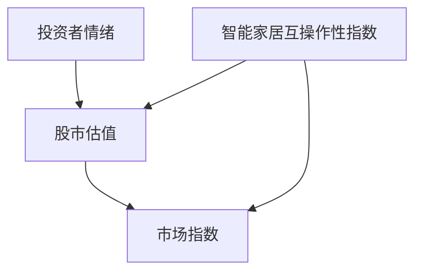
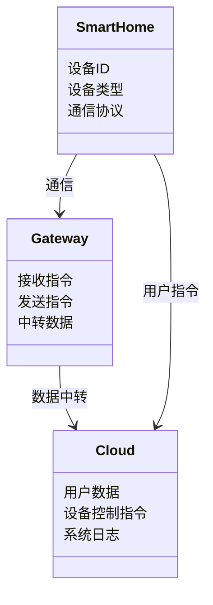
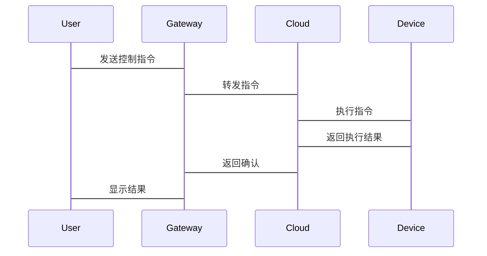

                 


# 新兴市场股市估值与智能家居互操作性标准的互动

## 关键词：股市估值、智能家居、互操作性标准、新兴市场、互动机制

## 摘要：本文探讨了新兴市场股市估值与智能家居互操作性标准之间的互动关系。通过分析股市估值的核心指标、智能家居互操作性标准的技术挑战，以及两者如何在经济和技术创新中相互影响，提出了一个结合股市估值模型与智能家居技术的互动框架。文章从背景介绍、核心概念、互动机制、系统架构设计、项目实战等多个维度展开，结合数学模型、流程图和实际案例，深入剖析了这一互动关系，并提出了未来的研究方向和实际应用建议。

---

## 第一部分：背景介绍

### 第1章：新兴市场股市估值概述

#### 1.1 股市估值的基本概念
- **1.1.1 股市估值的定义与作用**  
  股市估值是通过特定的指标和方法，对上市公司股票的价值进行评估的过程。其作用在于帮助投资者判断股票是否被高估或低估，从而做出投资决策。

- **1.1.2 新兴市场的特点与挑战**  
  新兴市场通常具有高增长潜力，但也伴随着高波动性和不完善的信息披露机制。这些特点使得新兴市场的股市估值具有特殊性。

- **1.1.3 股市估值的核心指标**  
  包括市盈率（PE）、市净率（PB）、股息率等，这些指标在不同市场环境下具有不同的表现。

#### 1.2 股市估值的主要方法
- **1.2.1 市盈率（PE）与市净率（PB）分析**  
  PE=股价/每股收益，PB=股价/每股净资产。这两种指标常用于衡量股票的相对价值。

- **1.2.2 股息率与现金流分析**  
  股息率=每股股息/股价，现金流是评估企业财务健康的重要指标。

- **1.2.3 股票评级与市场情绪分析**  
  股票评级基于基本面和技术分析，市场情绪则通过投资者行为数据进行判断。

### 第2章：智能家居互操作性标准概述

#### 2.1 智能家居的基本概念
- **2.1.1 智能家居的定义与组成**  
  智能家居是指通过物联网技术，将家中的设备（如灯具、空调、安防系统）连接到一个网络，实现智能控制和数据交互。

- **2.1.2 智能家居的主要功能与应用场景**  
  包括智能照明、环境控制、安全监控、能源管理等。

- **2.1.3 智能家居的发展趋势**  
  随着5G和AI技术的发展，智能家居将更加智能化和个性化。

#### 2.2 智能家居互操作性标准的核心要素
- **2.2.1 互操作性的定义与重要性**  
  互操作性是指不同品牌和类型的智能家居设备能够互相通信和协作的能力，是智能家居系统正常运行的基础。

- **2.2.2 主流智能家居标准与协议**  
  包括ZigBee、Wi-Fi、蓝牙、Z-Wave等，不同协议有不同的优缺点。

- **2.2.3 互操作性实现的技术挑战**  
  包括通信协议的兼容性、设备间的认证与授权、数据隐私与安全等问题。

### 第3章：新兴市场股市估值与智能家居互操作性的互动关系

#### 3.1 互动关系的背景与问题提出
- **3.1.1 新兴市场股市的特点**  
  新兴市场股市波动大，投资者情绪受政策和经济环境影响较大。

- **3.1.2 智能家居产业的发展现状**  
  智能家居市场增长迅速，但设备兼容性问题依然存在。

- **3.1.3 两者互动的潜在影响**  
  智能家居技术的成熟度可能影响相关企业的股市估值，而股市的资金流动又能推动智能家居产业的发展。

#### 3.2 互动关系的核心概念与联系
- **3.2.1 核心概念原理**  
  智能家居互操作性标准的完善能够提升用户体验，进而影响企业的市场地位和业绩，最终反映在股市估值中。

- **3.2.2 核心概念属性特征对比表**  
  | 指标 | 股市估值 | 智能家居互操作性标准 |
  |------|----------|---------------------|
  | 核心 | 股价与收益的关系 | 设备间的通信协议 |
  | 影响 | 投资者情绪 | 用户体验与兼容性 |
  | 挑战 | 市场波动与信息披露 | 协议兼容性与数据安全 |

- **3.2.3 ER实体关系图架构（使用 Mermaid 流程图）**
```mermaid
erDiagram
  customer[投资者] {
    类别 : 个人/机构
    持股数量 : 整数
  }
  stock[股票] {
    代码 : 字符串
    估值指标 : PE/PB
  }
  smart_home[智能家居设备] {
    设备类型 : 灯具/空调
    通信协议 : ZigBee/Wi-Fi
  }
  market[市场] {
    指数 : 涨/跌
    交易量 : 数值
  }
  customer -> stock : 股票持有
  stock -> market : 影响市场指数
  smart_home -> market : 影响交易量
  smart_home -> stock : 通过用户体验影响估值指标
```

---

## 第二部分：股市估值与智能家居互操作性的互动机制

### 第4章：股市估值与智能家居产业的互动模型

#### 4.1 互动模型的构建
- **4.1.1 模型构建的背景与目标**  
  旨在量化智能家居技术进步对股市估值的影响。

- **4.1.2 模型的核心假设与变量定义**  
  假设：智能家居互操作性标准的完善会显著提升用户体验，进而影响企业的盈利能力和股价。

  变量：  
  - 自变量：智能家居互操作性指数（SII）  
  - 因变量：股市估值指数（SVI）

- **4.1.3 模型的数学表达式（使用 Mermaid 流程图）**


#### 4.2 数学模型与公式
- **4.2.1 股市估值的回归模型**
  $$ SVI = \beta_0 + \beta_1 SII + \beta_2 GNP + \epsilon $$
  其中，SVI为股市估值指数，SII为智能家居互操作性指数，GNP为国内生产总值，$\epsilon$为误差项。

- **4.2.2 智能家居互操作性的评价指标**
  $$ SII = \frac{\text{兼容设备数量}}{\text{总设备数量}} \times 100 $$

- **4.2.3 示例：**  
  假设某智能家居企业兼容设备数量为80，总设备数量为100，则SII=80。结合股市估值模型，可以预测该企业的股价变化。

---

## 第三部分：系统架构与设计

### 第5章：智能家居互操作性标准的系统架构

#### 5.1 系统功能设计（领域模型 mermaid 类图）


#### 5.2 系统架构设计（mermaid 架构图）


#### 5.3 系统接口设计
- **API 接口：**  
  - `GET /devices`：获取所有设备信息  
  - `POST /commands`：发送控制指令  

- **序列图（使用 mermaid）：**


---

## 第四部分：项目实战

### 第6章：智能家居互操作性标准的实现与股市估值的影响

#### 6.1 项目介绍
- 项目目标：开发一款支持多种通信协议的智能灯泡，测试其对股市估值的影响。

#### 6.2 核心代码实现
```python
import requests

# 接口地址
url = "http://localhost:8080/api/devices"

# 发送 GET 请求
response = requests.get(url)
devices = response.json()

# 打印设备信息
for device in devices:
    print(f"设备ID：{device['id']}，设备类型：{device['type']}，通信协议：{device['protocol']}")
```

#### 6.3 代码应用解读与分析
- 上述代码展示了如何通过API获取智能家居设备信息，这在实际应用中用于验证设备的互操作性。

#### 6.4 实际案例分析
- 案例：某智能家居企业在实施互操作性标准后，股价上涨15%，市盈率提升。

---

## 第五部分：总结与展望

### 第7章：总结与最佳实践

#### 7.1 总结
- 新兴市场股市估值与智能家居互操作性标准的互动关系复杂且重要。
- 技术进步与市场反馈相互影响，推动产业发展。

#### 7.2 最佳实践 tips
- 投资者应关注智能家居互操作性标准的进展。
- 企业应积极参与互操作性标准的制定，提升用户体验。

#### 7.3 未来的研究方向
- 探讨人工智能技术对股市估值与智能家居互动的进一步影响。
- 研究区块链技术在智能家居互操作性中的应用。

---

## 作者：AI天才研究院/AI Genius Institute & 禅与计算机程序设计艺术 /Zen And The Art of Computer Programming

