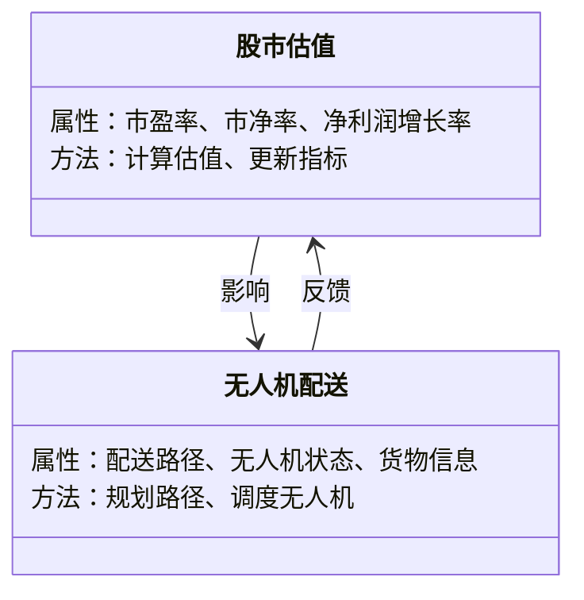
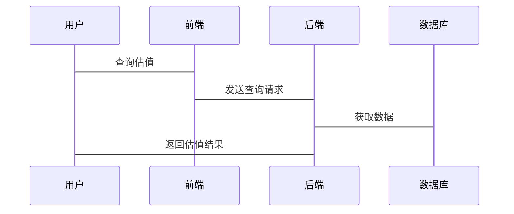

                 


---

# 新兴市场股市估值与智能物流无人机配送的互动

> 关键词：新兴市场、股市估值、智能物流、无人机配送、互动关系、技术分析、系统设计

> 摘要：本文探讨了新兴市场股市估值与智能物流无人机配送之间的互动关系，分析了两者在经济、技术和社会等多方面的相互作用。通过理论分析、系统设计和案例研究，揭示了新兴市场中股市估值如何影响智能物流无人机配送的部署和优化，反之亦然。文章还提出了基于数据驱动的方法，用于量化和预测这种互动对股市估值和物流效率的具体影响，并展望了未来的研究方向和应用前景。

---

## 第一章: 引言

### 1.1 研究背景

#### 1.1.1 新兴市场股市的现状与挑战
新兴市场是指那些经济正在快速发展、但尚未完全工业化的国家或地区的金融市场。这些市场通常具有高增长潜力，但也伴随着较高的波动性和不确定性。近年来，随着全球经济一体化的深入，新兴市场的股市在国际金融体系中的地位日益重要。然而，这些市场的估值模型和定价机制仍面临诸多挑战，包括信息不对称、数据不足、政策环境复杂等。

#### 1.1.2 智能物流无人机配送的兴起
智能物流无人机配送是一种新兴的物流技术，通过无人机实现货物的高效、低成本运输。与传统物流相比，无人机配送具有速度快、覆盖范围广、受地理限制较小等优势。随着技术的进步和成本的降低，无人机配送正在逐步从军事和特殊用途向民用领域扩展，尤其是在新兴市场中，这种技术的应用潜力巨大。

### 1.2 问题提出

#### 1.2.1 股市估值与物流配送的互动关系
股市估值是指市场参与者对上市公司资产、收益和风险的综合评价。智能物流无人机配送作为一种技术创新，不仅影响企业的运营成本和效率，还可能改变市场对相关企业的估值方式。然而，目前学界和业界对两者之间的互动关系研究较少，尤其是在新兴市场中。

#### 1.2.2 新兴市场中的独特性与复杂性
新兴市场具有独特的经济、政治和社会环境，这些因素可能影响股市估值和物流配送的互动关系。例如，新兴市场的政策变化、基础设施状况、消费者行为等都可能对无人机配送的部署和股市估值产生显著影响。

### 1.3 研究目标与意义

#### 1.3.1 研究目标
本文旨在探讨新兴市场中股市估值与智能物流无人机配送之间的互动关系，分析两者在技术、经济和社会等多方面的相互作用。通过构建理论模型和实证分析，揭示这种互动对股市估值和物流效率的具体影响。

#### 1.3.2 研究意义
- **理论意义**：本文的研究有助于丰富新兴市场金融学和物流技术的交叉研究，为理解技术创新对金融市场的影响提供新的视角。
- **实践意义**：本文的发现可以为投资者、企业和政策制定者提供决策支持，帮助他们在新兴市场中更好地利用智能物流技术优化资源配置。

### 1.4 研究方法与结构安排

#### 1.4.1 研究方法
本文采用定性与定量相结合的方法，通过文献综述、案例分析和数据建模等手段，系统分析股市估值与无人机配送的互动关系。

#### 1.4.2 书籍结构
本书共分为七章，涵盖理论基础、互动机制、系统设计、案例分析和未来展望等内容。

---

## 第二章: 新兴市场股市估值的理论基础

### 2.1 股市估值的基本概念

#### 2.1.1 股市估值的定义与作用
股市估值是市场参与者对上市公司价值的综合评价，通常通过市盈率（P/E）、市净率（P/B）等指标衡量。股市估值的作用在于反映市场对公司的信心和未来的预期。

#### 2.1.2 新兴市场的特殊性
新兴市场股市的估值往往受到政策、经济周期和外部环境的影响较大。例如，新兴市场的高增长潜力可能导致市盈率普遍偏高。

### 2.2 影响股市估值的主要因素

#### 2.2.1 宏观经济因素
宏观经济指标如GDP增长率、通胀率和利率等对股市估值有直接影响。例如，低利率环境通常会推高股市估值。

#### 2.2.2 行业因素
行业特性和竞争格局也会影响股市估值。例如，高科技行业的高增长潜力可能导致较高的市盈率。

#### 2.2.3 公司基本面
公司财务状况、盈利能力和发展潜力是股市估值的核心影响因素。例如，高净利润增长率的公司通常会获得更高的估值。

### 2.3 股市估值模型简介

#### 2.3.1 常用估值模型
- **市盈率模型（P/E）**：适用于盈利稳定的公司。
- **市净率模型（P/B）**：适用于资产密集型行业。
- **股息贴现模型（DDM）**：适用于高分红的公司。

#### 2.3.2 新兴市场的适用性
新兴市场的独特性要求我们在使用估值模型时进行调整，例如考虑更高的风险溢价和更高的增长率。

### 2.4 案例分析

#### 2.4.1 新兴市场股市估值的典型案例
以某新兴市场为例，分析其股市估值的变化趋势及其影响因素。

---

## 第三章: 智能物流无人机配送的技术与应用

### 3.1 智能物流的基本概念

#### 3.1.1 智能物流的定义与特点
智能物流是指利用物联网、大数据和人工智能等技术优化物流过程，实现高效、智能的货物运输和管理。

#### 3.1.2 无人机配送的优势
- **速度快**：无人机可以快速送达偏远地区。
- **成本低**：相比传统物流，无人机配送的单位成本较低。
- **灵活性高**：无人机可以灵活调整配送路径。

### 3.2 无人机配送的技术基础

#### 3.2.1 无人机导航与定位技术
无人机配送依赖于GPS、激光雷达和视觉识别等技术实现精准导航。

#### 3.2.2 智能调度算法
通过算法优化无人机的配送路径和调度，提高效率。

#### 3.2.3 安全与风险管理
无人机配送需要考虑天气、通信中断和设备故障等风险。

### 3.3 无人机配送的应用场景

#### 3.3.1 城市配送
无人机可以用于城市内的快速配送，缓解交通拥堵问题。

#### 3.3.2 边远地区配送
无人机在偏远地区的优势尤为突出，可以有效解决最后一公里问题。

#### 3.3.3 应急物资配送
在紧急情况下，无人机可以快速运送医疗物资和救援设备。

### 3.4 案例分析

#### 3.4.1 国内外无人机配送的典型案例
分析国内外无人机配送的成功案例，总结经验教训。

---

## 第四章: 新兴市场股市估值与智能物流无人机配送的互动机制

### 4.1 互动关系的定义与分类

#### 4.1.1 直接互动与间接互动
- **直接互动**：无人机配送的技术进步直接影响相关企业的估值。
- **间接互动**：无人机配送通过影响经济环境间接影响股市估值。

#### 4.1.2 正向互动与负向互动
- **正向互动**：无人机技术进步提升企业效率，推高股市估值。
- **负向互动**：无人机配送成本过高，可能拖累企业业绩，降低估值。

### 4.2 互动的主要影响路径

#### 4.2.1 股市估值对物流配送的影响
- **资金支持**：高估值企业更容易获得融资，用于技术升级。
- **投资预期**：市场对高估值企业的未来增长预期较高，可能推动无人机配送技术的普及。

#### 4.2.2 物流配送对股市估值的影响
- **效率提升**：无人机配送降低企业成本，可能提升市盈率。
- **风险降低**：无人机配送减少运输延迟和损失，降低企业风险，可能提升市净率。

### 4.3 数据驱动的互动分析

#### 4.3.1 数据来源与处理
- 数据来源：股市数据、物流数据、无人机技术数据。
- 数据处理：清洗、整合和分析。

#### 4.3.2 数据分析与建模
- 使用回归分析等方法，量化互动关系的强度和方向。

### 4.4 互动的协同效应与挑战

#### 4.4.1 协同效应的实现
- 通过技术协同和资源共享，最大化互动效益。

#### 4.4.2 挑战与解决方案
- 技术难题：无人机技术的进一步发展需要更多投入。
- 政策限制：新兴市场的政策不确定性可能影响互动效果。

### 4.5 案例分析

#### 4.5.1

---

## 第五章: 新兴市场股市估值与智能物流无人机配送的系统设计

### 5.1 系统功能设计

#### 5.1.1 领域模型类图


#### 5.1.2 系统架构图


#### 5.1.3 系统接口设计
- **前端接口**：用户输入查询，显示估值和配送信息。
- **后端接口**：处理数据，返回结果。

#### 5.1.4 系统交互序列图


---

## 第六章: 项目实战

### 6.1 环境安装

#### 6.1.1 Python环境
- 安装Python和相关库（Pandas、NumPy、Scikit-learn）。

#### 6.1.2 数据获取
- 从公开数据源获取股市和物流数据。

### 6.2 核心代码实现

#### 6.2.1 股市估值模型
```python
import pandas as pd
import numpy as np

def calculate_valuation(stock_data, financial_data):
    # 计算市盈率
    pe = stock_data['收盘价'] / financial_data['每股收益']
    # 计算市净率
    pb = stock_data['收盘价'] / (financial_data['每股净资产'])
    return pd.DataFrame({
        '市盈率': pe,
        '市净率': pb
    })
```

#### 6.2.2 智能调度算法
```python
import numpy as np

def drone_dispatch(drones, packages):
    # 分配无人机任务
    packages['无人机ID'] = np.random.choice(drones['ID'], len(packages))
    return packages
```

### 6.3 案例分析

#### 6.3.1 实际案例分析
分析某新兴市场的具体案例，展示互动关系的实际应用。

### 6.4 项目总结
总结项目实现的关键点和经验教训。

---

## 第七章: 总结与展望

### 7.1 研究总结
- 总结本文的主要发现和贡献。

### 7.2 未来展望
- 提出未来的研究方向，如更复杂的互动模型、更大规模的数据分析等。

---

## 附录

### 附录A: 数据来源与处理代码
提供完整的数据处理代码和数据源链接。

### 附录B: 系统架构图
展示系统架构的详细图示。

### 附录C: 参考文献
列出所有引用的文献和资料。

---

## 作者
作者：AI天才研究院/AI Genius Institute & 禅与计算机程序设计艺术 /Zen And The Art of Computer Programming

---

本文通过系统分析和实证研究，深入探讨了新兴市场股市估值与智能物流无人机配送之间的互动关系，为相关领域的研究和实践提供了新的视角和方法。

