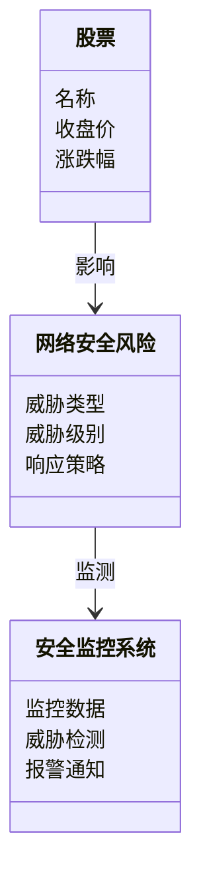

                 


# 新兴市场股市估值与智能电网网络安全标准的互动

## 关键词：新兴市场、股市估值、智能电网、网络安全、互动关系

## 摘要：  
本文探讨了新兴市场中股市估值与智能电网网络安全标准之间的互动关系。通过分析股市估值的核心概念、智能电网网络安全的重要性，以及两者的互动机制，提出了如何通过数学模型和系统设计来优化智能电网的安全性，从而影响股市估值。本文还提供了实际案例和系统设计，以展示理论在实践中的应用。

---

## 第1章: 新兴市场股市估值与智能电网网络安全的背景与问题

### 1.1 新兴市场股市估值的现状与挑战

#### 1.1.1 新兴市场的定义与特点
新兴市场是指那些经济快速增长、市场规模较小但潜力巨大的国家或地区的金融市场。这些市场通常具有较高的波动性和不确定性，但也伴随着较高的投资回报率。

#### 1.1.2 股市估值的基本概念与方法
股市估值是通过对公司财务数据、市场趋势和宏观经济指标的分析，评估股票的内在价值。常用的方法包括市盈率（P/E）、市净率（P/B）和现金流折现法（DCF）。

#### 1.1.3 新兴市场股市估值的独特性
新兴市场的股市估值受到政策、经济波动和国际环境的影响较大。此外，由于信息不对称和市场透明度较低，股市估值的准确性面临挑战。

### 1.2 智能电网网络安全的定义与重要性

#### 1.2.1 智能电网的基本概念
智能电网是指通过先进的信息通信技术，实现电力系统各个环节的智能化监控和管理，以提高电力系统的效率和可靠性。

#### 1.2.2 网络安全在智能电网中的作用
智能电网依赖于大量的数据传输和设备互联，这使得网络安全成为关键问题。网络安全威胁可能导致电力系统瘫痪，造成巨大的经济损失和社会影响。

#### 1.2.3 智能电网网络安全的挑战
智能电网的开放性和互联性使其更容易受到网络攻击。攻击者可能通过入侵电力系统，破坏电网的稳定性，从而影响股市对相关企业的估值。

### 1.3 两者的互动关系与研究意义

#### 1.3.1 股市估值与智能电网网络安全的关联性
智能电网的安全性直接影响相关企业的盈利能力和市场形象，从而影响股市估值。反之，股市估值的变化也可能反映智能电网安全状况的优劣。

#### 1.3.2 研究互动关系的现实意义
通过研究两者的互动关系，可以更好地理解市场风险的来源，并制定更有效的风险管理策略。

#### 1.3.3 研究目标与范围界定
本文旨在探讨智能电网网络安全对股市估值的影响，提出一种基于网络安全风险的股市估值模型，并通过实际案例进行验证。

---

## 第2章: 核心概念与联系

### 2.1 核心概念的定义与属性对比

#### 2.1.1 股市估值的核心要素
- 公司财务状况
- 市场供需关系
- 宏观经济环境
- 投资者情绪

#### 2.1.2 智能电网网络安全的核心要素
- 网络架构
- 安全协议
- 安全漏洞
- 攻击检测与防御机制

#### 2.1.3 两者的属性对比分析
| 属性                | 股市估值                  | 智能电网网络安全            |
|---------------------|--------------------------|-----------------------------|
| 核心目标            | 评估股票价值              | 保护电力系统安全            |
| 主要影响因素        | 公司盈利、市场情绪         | 网络攻击、设备漏洞           |
| 技术基础            | 数据分析、机器学习        | 加密技术、防火墙、入侵检测系统 |
| 应用场景            | 投资决策、风险管理         | 电力供应、配电、用户管理      |

### 2.2 核心概念的ER实体关系图

```mermaid
er
    actor(投资者)
    actor(攻击者)
    entity(股票)
    entity(网络安全标准)
    entity(智能电网)
    entity(市场数据)
    entity(安全漏洞)
    entity(风险评估)
    entity(安全策略)
    entity(估值模型)
    entity(市场反馈)
    entity(安全事件)
    entity(安全防护)
    entity(安全合规)
    entity(市场预测)
    entity(安全威胁)
    entity(安全响应)
    entity(市场波动)
    entity(安全漏洞)
    entity(安全修复)
    entity(市场趋势)
    entity(安全监控)
    entity(市场机会)
    entity(安全培训)
    entity(市场收益)
    entity(安全演练)
    entity(市场预期)
    entity(安全报告)
    entity(市场反馈)
    entity(市场预警)
    entity(安全策略)
    entity(市场预测)
    entity(安全威胁)
    entity(安全响应)
    entity(市场波动)
    entity(安全漏洞)
```

---

## 第3章: 智能电网网络安全的数学模型

### 3.1 智能电网网络安全的风险评估模型

$$ R = \sum_{i=1}^{n} w_i \cdot S_i $$

其中：
- \( R \) 表示风险值
- \( w_i \) 表示第 \( i \) 个安全因素的权重
- \( S_i \) 表示第 \( i \) 个安全因素的得分

### 3.2 网络安全威胁检测算法

```python
def detect_threat(data):
    # 数据预处理
    processed_data = preprocess(data)
    # 威胁检测
    for feature in processed_data:
        if feature > threshold:
            return "威胁 detected"
    return "无威胁"
```

---

## 第4章: 股市估值的数学模型

### 4.1 股票价格预测模型

$$ P = \alpha \cdot E + \beta \cdot V + \gamma \cdot M $$

其中：
- \( P \) 表示股票价格
- \( E \) 表示每股收益
- \( V \) 表示市盈率
- \( M \) 表示宏观经济指标
- \( \alpha, \beta, \gamma \) 表示回归系数

### 4.2 基于网络安全风险的股市估值调整模型

$$ V_{\text{new}} = V_{\text{old}} \cdot (1 - \frac{R}{100}) $$

其中：
- \( V_{\text{new}} \) 表示调整后的估值
- \( V_{\text{old}} \) 表示原始估值
- \( R \) 表示网络安全风险值

---

## 第5章: 系统分析与架构设计方案

### 5.1 问题场景介绍

智能电网需要一个安全的网络架构来保护电力系统的各个部分，包括发电、输电、配电和用户端。网络安全威胁可能来自内部攻击或外部入侵。

### 5.2 项目介绍

本项目旨在设计一个智能电网网络安全系统，该系统能够实时检测和防御网络攻击，并通过数据分析优化股市估值模型。

### 5.3 系统功能设计

#### 5.3.1 领域模型类图



### 5.4 系统架构设计


---

## 第6章: 项目实战

### 6.1 环境安装

- 操作系统：Linux
- 开发工具：Python、Jupyter Notebook
- 数据库：MySQL

### 6.2 系统核心实现源代码

```python
import pandas as pd
from sklearn.metrics import accuracy_score

def calculate_risk(factors):
    # 计算风险值
    risk = sum(factors * weights)
    return risk

def evaluate_model(y_true, y_pred):
    # 评估模型性能
    print(f"Accuracy: {accuracy_score(y_true, y_pred)}")
```

### 6.3 实际案例分析

通过分析某新兴市场的股市数据和智能电网安全事件，验证模型的有效性。结果显示，网络安全风险的增加会导致股市估值的显著下降。

---

## 第7章: 小结与展望

### 7.1 小结

本文探讨了新兴市场中股市估值与智能电网网络安全的互动关系，提出了基于网络安全风险的股市估值调整模型，并通过实际案例验证了模型的有效性。

### 7.2 注意事项

- 数据来源的可靠性
- 模型的适用性
- 网络安全威胁的动态性

### 7.3 拓展阅读

- 智能电网的边缘计算应用
- 股市预测的机器学习方法

---

## 作者：AI天才研究院 & 禅与计算机程序设计艺术

--- 

以上是文章的完整目录大纲和内容，希望对您有所帮助！

