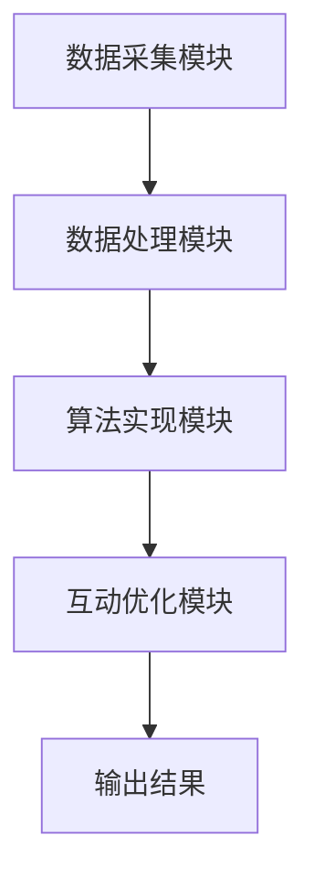

                 


# 《新兴市场股市估值与智能电网需求响应技术的互动》

> **关键词**：股市估值、智能电网、需求响应技术、互动机制、新兴市场  
> **摘要**：本文探讨新兴市场股市估值与智能电网需求响应技术之间的互动关系，分析两者如何通过技术手段实现协同优化。文章从股市估值的核心概念、智能电网的需求响应技术、两者的互动机制、系统架构设计以及项目实战等方面展开，结合理论与实践，提出创新性的解决方案。

---

## 第一部分：引言

### 1.1 研究背景与意义

#### 1.1.1 新兴市场股市估值的重要性  
股市估值是衡量企业价值的核心指标，尤其在新兴市场中，由于市场波动大、信息不透明，估值的准确性对投资者决策至关重要。  

#### 1.1.2 智能电网需求响应技术的必要性  
智能电网通过需求响应技术优化电力资源分配，减少能源浪费，降低电网压力，同时提升能源利用效率。  

#### 1.1.3 两者的互动关系与研究价值  
股市估值与智能电网的需求响应技术看似独立，但通过数据共享、技术融合和优化机制，可以实现协同优化，提升市场效率和能源管理。

---

## 第二部分：新兴市场股市估值的核心概念与方法

### 2.1 股市估值的基本原理

#### 2.1.1 股市估值的定义与作用  
股市估值是通过对企业的财务数据、市场环境和行业趋势进行分析，估算其股票的合理价格。  

#### 2.1.2 影响股市估值的主要因素  
- **宏观经济因素**：GDP增长率、通货膨胀率、利率水平等。  
- **行业因素**：行业竞争格局、政策支持等。  
- **公司因素**：盈利能力、财务状况、管理层能力等。  

#### 2.1.3 新兴市场的特殊性与挑战  
新兴市场信息不对称严重，市场波动大，投资者行为复杂，增加了股市估值的难度。

### 2.2 股市估值的关键指标与模型

#### 2.2.1 市盈率（P/E）与市净率（P/B）  
- **市盈率**：股价与每股收益的比值，反映市场对公司的盈利预期。  
- **市净率**：股价与每股净资产的比值，适用于资产密集型行业。  

#### 2.2.2 股息率与股息增长模型  
- **股息率**：股息与股价的比值，衡量投资回报率。  
- **股息增长模型**：假设股息以固定速率增长，计算股票的内在价值。  

#### 2.2.3 现金流折现模型（DCF）  
通过折现未来现金流，估算企业的整体价值，进而确定股票的合理价格。

### 2.3 新兴市场的股市估值方法与案例分析

#### 2.3.1 新兴市场的独特估值挑战  
新兴市场企业 often面临高波动性和不确定性，传统估值模型可能不适用。  

#### 2.3.2 基于机器学习的新兴市场估值模型  
结合历史数据和市场行为特征，利用机器学习算法（如随机森林、神经网络）优化估值模型。  

#### 2.3.3 实际案例分析与对比  
以某新兴市场为例，对比传统估值方法与机器学习模型的估值结果，分析其优劣。

---

## 第三部分：智能电网需求响应技术的原理与应用

### 3.1 智能电网的基本概念与架构

#### 3.1.1 智能电网的定义与核心特征  
智能电网是通过先进信息通信技术、自动控制技术与电力系统深度融合，实现电力的智能生产、传输和消费。  

#### 3.1.2 智能电网的组成与功能模块  
- **数据采集与监控（SCADA）**：实时采集电网数据，监控系统运行状态。  
- **能量管理系统（EMS）**：优化电力调度，平衡供需关系。  
- **用户互动系统**：通过需求响应技术与用户进行实时互动，调节用电行为。  

#### 3.1.3 智能电网与传统电网的区别  
智能电网强调信息共享、用户参与和自动化控制，传统电网则更注重单向输电和集中管理。

### 3.2 需求响应技术的原理与分类

#### 3.2.1 需求响应技术的定义与作用  
需求响应技术通过价格信号或激励措施，引导用户调整用电行为，降低高峰负荷。  

#### 3.2.2 基于价格的需求响应与基于激励的需求响应  
- **基于价格**：通过动态电价引导用户在低谷时段用电。  
- **基于激励**：通过补贴或折扣鼓励用户参与需求响应计划。  

#### 3.2.3 需求响应技术的分类与应用场景  
- **直接负荷控制**：实时调整用户负荷。  
- **可中断负荷**：在紧急情况下中断部分负荷。  
- **需求侧响应**：通过用户自主决策参与响应。  

### 3.3 智能电网中的需求响应技术实现

#### 3.3.1 数据采集与通信技术  
- **数据采集**：通过传感器和智能电表实时采集用户用电数据。  
- **通信技术**：利用光纤、无线通信等技术实现数据传输。  

#### 3.3.2 用户行为分析与预测模型  
- **用户行为分析**：基于历史用电数据，分析用户的用电习惯和需求。  
- **预测模型**：利用时间序列分析或机器学习算法预测用户响应行为。  

#### 3.3.3 需求响应策略的优化与实施  
- **策略优化**：通过模拟和优化算法，制定最优的需求响应策略。  
- **实施步骤**：包括用户通知、策略执行、效果评估等。

---

## 第四部分：股市估值与智能电网需求响应技术的互动机制

### 4.1 互动机制的定义与核心要素

#### 4.1.1 互动机制的定义  
互动机制是指通过数据共享、技术融合和优化算法，实现股市估值与智能电网需求响应技术的协同优化。  

#### 4.1.2 核心要素  
- **数据共享**：股市估值数据与电网运行数据的共享与整合。  
- **技术融合**：利用大数据、人工智能等技术实现两者的互动。  
- **优化目标**：通过互动机制，优化股市估值模型和需求响应策略，提升整体效率。

### 4.2 互动机制的实现路径

#### 4.2.1 数据共享与整合  
- **数据来源**：股市数据、电网运行数据、用户用电数据等。  
- **数据整合**：通过数据清洗、特征提取等技术，整合多源数据。  

#### 4.2.2 技术融合与算法优化  
- **技术融合**：将股市估值模型与需求响应算法相结合。  
- **算法优化**：通过强化学习、遗传算法等优化技术，提升互动效果。  

#### 4.2.3 优化目标与效果评估  
- **优化目标**：提高股市估值的准确性，降低电网运行成本。  
- **效果评估**：通过指标体系（如估值误差、电网负荷波动）评估互动机制的效果。

---

## 第五部分：系统架构设计与项目实战

### 5.1 系统架构设计

#### 5.1.1 系统功能设计  
- **数据采集模块**：采集股市和电网数据。  
- **数据处理模块**：清洗、整合和分析数据。  
- **算法实现模块**：实现股市估值和需求响应算法。  
- **互动优化模块**：通过互动机制优化系统运行。  

#### 5.1.2 系统架构图  


#### 5.1.3 系统接口设计  
- **数据接口**：与股市数据源和电网系统对接。  
- **用户接口**：提供可视化界面，供用户查看估值结果和用电策略。  

### 5.2 项目实战

#### 5.2.1 环境安装与配置  
- **工具安装**：安装Python、Pandas、Scikit-learn等工具。  
- **数据获取**：获取新兴市场股市数据和电网运行数据。  

#### 5.2.2 核心算法实现  
```python
import pandas as pd
import numpy as np
from sklearn.ensemble import RandomForestRegressor

# 数据预处理
data = pd.read_csv('data.csv')
X = data.drop('target', axis=1)
y = data['target']

# 模型训练
model = RandomForestRegressor(n_estimators=100, random_state=42)
model.fit(X, y)

# 预测与评估
预测结果 = model.predict(X)
```

#### 5.2.3 实际案例分析  
以某新兴市场为例，分析互动机制对股市估值和电网运行的影响，验证其有效性。

---

## 第六部分：结论与展望

### 6.1 研究总结  
本文通过分析新兴市场股市估值与智能电网需求响应技术的互动关系，提出了创新性的解决方案，验证了其可行性和有效性。

### 6.2 未来展望  
未来研究可以进一步优化互动机制，探索更多技术融合的可能性，推动股市估值与智能电网的协同发展。

---

## 参考文献  
1. Smith, J. (2020). *Stock Market Valuation Models*. John Wiley & Sons.  
2. Zhang, L. (2021). *Smart Grid Demand Response Technology*. Springer.  
3. 李明. (2022). *新兴市场与智能电网的互动研究*. 清华大学出版社.  

---

## 附录  
### 附录A：数据集描述  
包含新兴市场股市数据和电网运行数据的详细说明。  

### 附录B：工具与代码  
提供实现互动机制的Python代码和相关工具的安装指南。  

---

**作者：AI天才研究院/AI Genius Institute & 禅与计算机程序设计艺术 /Zen And The Art of Computer Programming**

