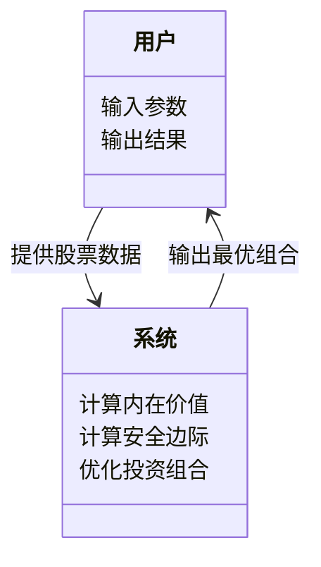
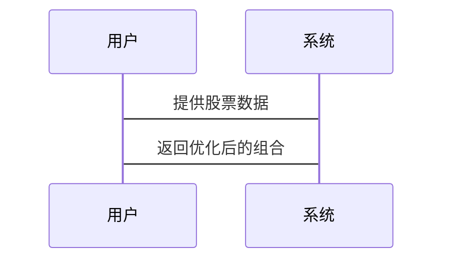

                 


```markdown
# 《格雷厄姆特价股票理论对现代投资组合理论的补充》

> 关键词：格雷厄姆特价股票理论、现代投资组合理论、价值投资、安全边际、数学模型、投资策略

> 摘要：本文探讨了格雷厄姆的价值投资理论，特别是特价股票的概念，以及如何与现代投资组合理论（MPT）相结合。通过分析两种理论的核心概念、数学模型和系统架构，本文展示了如何利用格雷厄姆的安全边际和内在价值理念，优化投资组合，平衡风险与收益。通过案例分析和系统设计，本文为投资者提供了一种结合长期价值投资和现代风险管理的策略。

---

# 第一部分: 背景介绍

## 第1章: 格雷厄姆特价股票理论与现代投资组合理论的背景

### 1.1 价值投资与现代投资组合理论的起源
#### 1.1.1 价值投资的起源与发展
价值投资由本杰明·格雷厄姆在20世纪初提出，强调以低于内在价值的价格买入股票，寻找市场低估的机会。这种投资策略注重安全边际和长期价值，而非短期市场波动。

#### 1.1.2 现代投资组合理论的提出与演变
现代投资组合理论（MPT）由哈里·马科维茨在1952年提出，强调通过分散投资来优化风险与收益的平衡。MPT基于资产的期望收益、方差和协方差矩阵，构建最优投资组合。

#### 1.1.3 格雷厄姆与现代投资组合理论的联系
格雷厄姆的理论关注个股选择，而MPT关注整体组合的风险调整收益。两者在理论上互补，前者提供个股筛选标准，后者提供组合优化框架。

### 1.2 核心概念对比分析
#### 1.2.1 格雷厄姆特价股票理论的核心概念
- **内在价值**：股票的真正价值，基于基本面分析计算。
- **安全边际**：买入价格低于内在价值，以降低风险。
- **价值陷阱**：看似便宜但实际有风险的股票。

#### 1.2.2 现代投资组合理论的核心概念
- **有效前沿**：在给定风险下，收益最高的组合；在给定收益下，风险最小的组合。
- **夏普比率**：衡量投资组合的风险调整后收益。

#### 1.2.3 两种理论的异同点对比
| 对比维度 | 格雷厄姆理论 | 现代投资组合理论 |
|----------|--------------|------------------|
| 核心目标 | 寻找低估股票 | 优化整体组合收益与风险 |
| 方法论   | 基于基本面分析 | 基于统计和优化模型 |
| 时间框架 | 长期持有 | 短期调整优化 |

### 1.3 理论的联系与区别
#### 1.3.1 格雷厄姆理论与MPT的理论联系
格雷厄姆的理论为股票选择提供标准，而MPT提供组合优化方法，两者结合可提升投资效率和风险控制。

#### 1.3.2 两种理论在实际应用中的区别
- 分析维度：格雷厄姆关注个股价值，MPT关注组合风险收益。
- 时间框架：格雷厄姆强调长期，MPT注重动态优化。

#### 1.3.3 理论的互补性与整合的可能性
通过将格雷厄姆的安全边际理念融入MPT的框架，可以在保持组合优化的同时，降低个股选择风险。

---

# 第二部分: 核心概念与联系

## 第2章: 格雷厄姆特价股票理论的核心要素

### 2.1 特价股票的定义与特征
#### 2.1.1 特价股票的定义
特价股票是指市场价格低于其内在价值的股票，通常具有较高的安全边际。

#### 2.1.2 特价股票的特征分析
- 市场低估：价格低于内在价值。
- 高安全边际：买入价格与内在价值的差距越大，安全边际越高。
- 基本面稳定：公司财务健康，具备长期盈利能力。

#### 2.1.3 特价股票的识别方法
1. **计算内在价值**：使用格雷厄姆的估值方法，如净现值法。
2. **比较市场价格**：判断市场价格是否低于内在价值。
3. **评估安全边际**：计算安全边际的宽度。

### 2.2 格雷厄姆投资策略的核心要素
#### 2.2.1 安全边际的概念
安全边际 = 内在价值 - 市场价格，确保在市场波动中仍能获得正收益。

#### 2.2.2 股票内在价值的计算
格雷厄姆的内在价值计算公式：
$$
\text{内在价值} = \frac{\text{收益} \times (1 + \text{增长率})}{\text{资本成本}}
$$

#### 2.2.3 投资组合的构建原则
- 分散投资：降低个股风险。
- 定期再平衡：保持安全边际和目标权重。

## 第3章: 现代投资组合理论的核心原理

### 3.1 现代投资组合理论的基本假设
#### 3.1.1 投资者偏好假设
投资者厌恶风险，追求风险调整后的收益最大化。

#### 3.1.2 资产回报的分布假设
资产回报服从正态分布，协方差矩阵用于衡量风险。

#### 3.1.3 市场有效性的假设
市场有效，理性投资者能够获得市场平均收益。

### 3.2 现代投资组合理论的数学模型
现代投资组合理论的核心是优化投资组合的期望收益和方差：
$$
\min_w \sigma^2 = w^T \Sigma w \\
\text{subject to} \quad E(r) = w^T \mu
$$
其中，Σ为协方差矩阵，μ为收益向量，w为权重向量。

---

# 第三部分: 数学模型与系统架构

## 第4章: 格雷厄姆理论与MPT的数学整合

### 4.1 现代投资组合理论的均值-方差模型
使用以下公式计算最优投资组合：
$$
\mu_p = w^T \mu \\
\sigma_p^2 = w^T \Sigma w
$$

### 4.2 格雷厄姆安全边际的整合
将安全边际作为筛选条件，优化组合中的资产选择。

### 4.3 优化模型
$$
\min_w \sigma_p^2 \\
\text{subject to} \quad \sum w_i = 1 \\
\text{且} \quad \text{安全边际} \geq \text{阈值}
$$

## 第5章: 系统分析与架构设计

### 5.1 系统功能设计
使用领域模型类图（Mermaid）展示系统功能模块：


### 5.2 系统架构设计
使用架构图（Mermaid）展示系统架构：


### 5.3 接口设计
- 输入接口：股票数据、市场参数。
- 输出接口：优化后的投资组合。

### 5.4 交互流程
使用交互序列图（Mermaid）展示交互流程：


---

# 第四部分: 项目实战

## 第6章: 项目实战

### 6.1 环境安装
安装Python和必要的库（如numpy, pandas, matplotlib）。

### 6.2 核心代码实现
```python
import numpy as np
import pandas as pd

def compute_intrinsic_value(fundamental_data):
    # 示例计算内在价值的函数
    return fundamental_data['收益'] * (1 + fundamental_data['增长率']) / fundamental_data['资本成本']

def compute_margin_of_safety(price, intrinsic_value):
    return intrinsic_value - price

# 示例数据
data = {
    '收益': 10,
    '增长率': 0.05,
    '资本成本': 0.1,
    '价格': 50
}

price = data['价格']
intrinsic_value = compute_intrinsic_value(data)
mos = compute_margin_of_safety(price, intrinsic_value)

print(f"内在价值: {intrinsic_value}, 安全边际: {mos}")
```

### 6.3 案例分析
使用上述代码，计算一只股票的安全边际，并将其纳入投资组合优化模型中。

---

# 第五部分: 总结与扩展

## 第7章: 总结与扩展

### 7.1 最佳实践 tips
- 结合基本面分析和量化模型。
- 定期再平衡投资组合。

### 7.2 小结
本文通过整合格雷厄姆的特价股票理论与现代投资组合理论，提出了一种优化的投资策略，兼顾安全边际和风险调整收益。

### 7.3 注意事项
- 理论的有效性依赖于市场假设。
- 需要定期监控和调整投资组合。

### 7.4 拓展阅读
- 马科维茨的《投资组合理论》。
- 格雷厄姆的《聪明的投资者》。

---

作者：AI天才研究院/AI Genius Institute & 禅与计算机程序设计艺术 /Zen And The Art of Computer Programming
```

