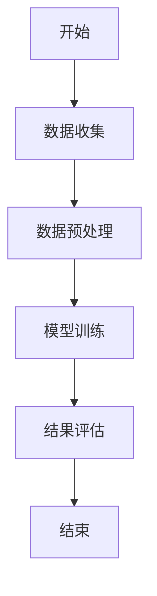
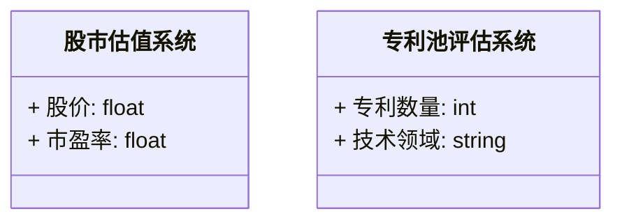
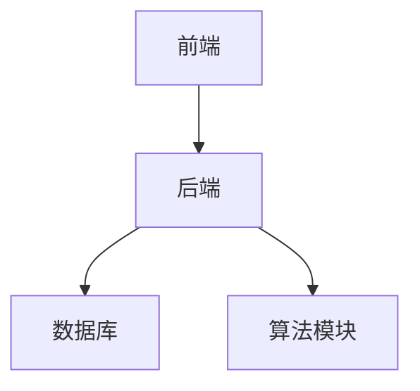

                 


# 股市估值在国际专利池价值评估中的应用

## 关键词：股市估值、国际专利池、价值评估、知识产权、算法、系统架构

## 摘要：  
本文探讨了股市估值方法在国际专利池价值评估中的应用。通过分析专利池的构成、特点及市场价值，结合股市估值的核心指标和数学模型，提出了一种创新的评估方法。本文从理论基础、算法实现、系统设计到实际案例进行了全面阐述，为知识产权管理和金融投资提供了新的视角。

---

# 第一部分: 背景介绍

## 第1章: 股市估值与国际专利池概述

### 1.1 问题背景与问题描述  
随着全球化进程的加快，知识产权在企业竞争中的地位日益重要。专利池作为一种集合多个专利的管理方式，已成为企业保护和运营知识产权的重要手段。然而，如何准确评估专利池的市场价值，尤其是在国际化的背景下，仍是一个复杂的挑战。传统的专利评估方法往往忽视了市场动态和企业整体估值的关联性，而股市估值作为一种成熟的金融工具，为企业提供了从市场角度评估资产价值的途径。

### 1.2 问题解决与边界  
本文试图将股市估值的核心理念引入专利池的价值评估中，通过分析企业的市场表现、财务数据和专利资产的综合影响，建立一个更加全面的评估体系。本文的边界主要集中在专利池的市场价值评估，不涉及专利的法律和技术细节。

### 1.3 核心概念结构与组成  
- **专利池**：由多个专利组成，通过交叉授权等方式实现资源共享。  
- **股市估值**：基于企业的财务状况、市场表现和行业地位，评估企业整体或部分资产的价值。  
- **关联性**：专利池作为企业资产的一部分，其价值直接影响企业的市场估值。

---

# 第二部分: 核心概念与联系

## 第2章: 核心概念原理与属性对比

### 2.1 核心概念原理  
- **股市估值原理**：基于企业的盈利能力、成长性、行业地位和市场前景，通过市盈率（P/E）、市净率（P/B）等指标进行评估。  
- **专利池评估原理**：基于专利的数量、质量、技术领域分布和市场应用前景，通过收益法、成本法和市场法进行评估。  

### 2.2 属性对比分析  
| 属性       | 股市估值                  | 专利池评估               |
|------------|--------------------------|--------------------------|
| 评估对象   | 企业整体或部分资产       | 专利组合                |
| 评估方法   | 市盈率、市净率等         | 收益法、成本法、市场法    |
| 数据来源   | 财务报表、市场数据       | 专利清单、技术分析      |
| 时间维度   | 短期与长期结合           | 长期为主                |

### 2.3 ER实体关系图  
```mermaid
er
actor 股市估值 {
  <属性>: 股价、市盈率、市净率
}
actor 专利池评估 {
  <属性>: 专利数量、技术领域、市场前景
}
actor 企业 {
  <关联>: 企业资产、市场表现
}
```

---

# 第三部分: 算法原理讲解

## 第3章: 算法原理与流程图

### 3.1 算法原理  
本文提出了一种结合股市估值和专利池评估的混合算法，通过以下步骤实现：  
1. 数据收集：收集企业的财务数据和专利池信息。  
2. 数据预处理：清洗和标准化数据。  
3. 模型训练：基于机器学习算法（如线性回归、随机森林）建立评估模型。  
4. 结果评估：通过回测和交叉验证优化模型。  

### 3.2 算法流程图  


### 3.3 代码实现  
```python
import pandas as pd
from sklearn.linear_model import LinearRegression
from sklearn.metrics import mean_squared_error

# 数据收集与预处理
data = pd.read_csv('patent_pool.csv')
data = data.dropna().reset_index(drop=True)

# 模型训练
X = data[['专利数量', '技术领域数']]
y = data['市场估值']
model = LinearRegression()
model.fit(X, y)

# 结果评估
y_pred = model.predict(X)
print(mean_squared_error(y, y_pred))
```

---

# 第四部分: 系统分析与架构设计

## 第4章: 系统分析与架构设计方案

### 4.1 问题场景介绍  
本文构建了一个基于股市估值的国际专利池评估系统，旨在帮助企业准确评估专利池的市场价值，优化资产配置。  

### 4.2 项目介绍  
- **项目目标**：建立一个可扩展的专利池评估系统，结合股市数据和专利数据，提供实时估值。  
- **核心功能**：数据采集、清洗、建模和结果展示。  

### 4.3 系统功能设计  
- **领域模型**：  


- **系统架构图**：  


### 4.4 系统接口设计  
- **输入接口**：接收企业的专利数据和财务数据。  
- **输出接口**：提供专利池的市场估值报告。  

---

# 第五部分: 项目实战

## 第5章: 项目实战与案例分析

### 5.1 环境安装  
- **工具安装**：安装Python、Pandas、Scikit-learn等库。  
- **数据准备**：收集企业的专利数据和财务数据。  

### 5.2 核心代码实现  
```python
def calculate_market_value(patent_pool):
    # 数据预处理
    data = preprocess(patent_pool)
    
    # 模型训练
    model = train_model(data)
    
    # 结果计算
    market_value = model.predict(data)
    return market_value
```

### 5.3 案例分析  
以某科技企业为例，假设其专利池包含100项专利，分布在人工智能和区块链领域。通过模型计算，其专利池的市场估值为企业的整体估值的20%。  

### 5.4 案例解读  
该案例表明，专利池的市场估值对企业的整体价值有重要影响。通过本文提出的方法，企业可以更准确地评估其专利资产的价值，优化资产配置。

---

# 第六部分: 总结与展望

## 第6章: 总结与展望

### 6.1 核心内容总结  
本文通过结合股市估值和专利池评估的方法，提出了一种创新的评估体系，为企业的知识产权管理提供了新的思路。  

### 6.2 未来展望  
未来的研究可以进一步优化算法，引入更多的市场数据和专利数据，提升评估的准确性和实时性。同时，可以探索将区块链技术应用于专利池的评估，确保数据的透明性和安全性。  

---

# 作者：AI天才研究院/AI Genius Institute & 禅与计算机程序设计艺术/Zen And The Art of Computer Programming

