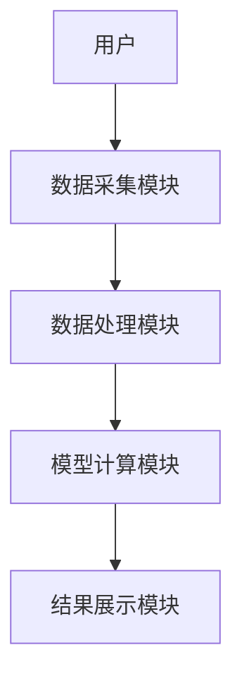
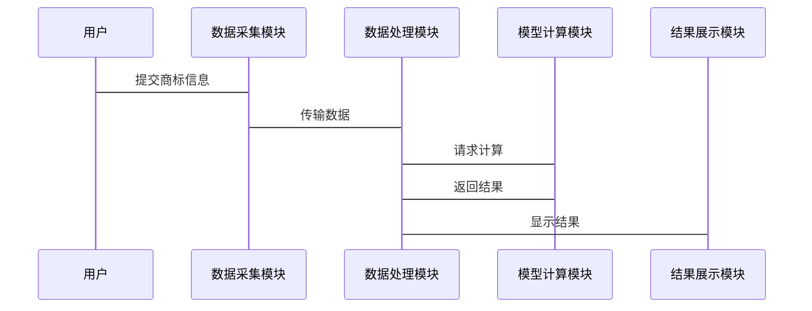

                 


# 股市估值在国际商标许可定价中的应用

> 关键词：股市估值，国际商标，许可定价，无形资产，市场价值

> 摘要：本文探讨了股市估值方法在国际商标许可定价中的应用，通过分析股市估值的核心概念与数学模型，结合商标许可定价的特点，提出了一种基于股市数据的商标价值评估方法，并通过实际案例展示了该方法的应用过程。

---

## 第1章: 股市估值的基本概念与方法

### 1.1 股市估值的定义与核心要素

#### 1.1.1 股市估值的定义
股市估值是指通过对上市公司财务数据、市场表现和行业环境等多方面因素的分析，评估其股票的内在价值或市场价值的过程。股市估值的核心在于通过量化分析，为投资者提供参考依据，以判断股票的合理价格区间。

#### 1.1.2 股市估值的核心要素
- **财务数据**：包括收入、利润、现金流等。
- **市场表现**：包括市盈率（P/E）、市净率（P/B）、股息率等。
- **行业环境**：包括行业竞争状况、政策法规等。

#### 1.1.3 股市估值的基本原理
股市估值的基本原理是通过将公司的财务数据与市场指标相结合，分析其股票的内在价值。常用的方法包括市盈率模型、现金流折现模型等。

### 1.2 国际商标许可的基本概念

#### 1.2.1 商标的基本定义
商标是企业用于区分其商品或服务的标识，包括文字、图形、符号等。商标不仅是企业的品牌象征，也是其市场价值的重要组成部分。

#### 1.2.2 国际商标体系与注册流程
国际商标体系主要通过《马德里协定》等方式进行注册和保护。商标的国际注册流程包括选择注册机构、提交申请、审查和公告等步骤。

#### 1.2.3 商标许可的定义与特点
商标许可是指商标持有人将其商标使用权授权给他人使用，并收取一定的许可费用。商标许可的特点包括使用权的转移、许可期限的明确性、许可费用的可量化性等。

---

## 第2章: 股市估值在商标定价中的应用背景

### 2.1 商标价值评估的重要性

#### 2.1.1 商标作为无形资产的价值
商标是企业的重要无形资产，其价值体现在品牌知名度、客户忠诚度和市场竞争力等方面。

#### 2.1.2 商标在企业经营中的战略地位
商标不仅是企业的品牌象征，也是企业市场拓展和价值创造的核心工具。

#### 2.1.3 商标许可定价的现实需求
随着全球化的发展，商标的跨国许可使用日益频繁，商标许可定价的需求也在不断增加。

### 2.2 股市估值方法在商标定价中的适用性

#### 2.2.1 股市估值方法的多样性
股市估值方法包括市盈率模型、现金流折现模型、股息贴现模型等，这些方法在商标定价中具有一定的借鉴意义。

#### 2.2.2 股市估值方法在商标定价中的优势
股市估值方法具有数据丰富、方法成熟、可操作性强等特点，适合应用于商标价值的量化评估。

#### 2.2.3 股市估值方法的局限性
股市估值方法主要适用于上市公司，而商标许可定价涉及的主体可能包括非上市公司，因此需要结合实际情况进行调整。

---

## 第3章: 股市估值与商标许可定价的核心概念

### 3.1 股市估值的核心模型

#### 3.1.1 市盈率模型
$$ P/E = \frac{P}{E} $$
其中，P为股票价格，E为每股收益。

#### 3.1.2 市净率模型
$$ P/B = \frac{P}{B} $$
其中，P为股票价格，B为每股净资产。

#### 3.1.3 现金流折现模型
$$ V = \sum_{t=1}^{n} \frac{CF_t}{(1+r)^t} $$
其中，CF_t为第t年的现金流，r为折现率。

### 3.2 商标许可定价的核心模型

#### 3.2.1 市场法
$$ V = \alpha \times P + \beta \times Q $$
其中，P为可比交易价格，Q为可比交易数量，α和β为回归系数。

#### 3.2.2 收益法
$$ V = \sum_{t=1}^{n} \frac{R_t}{(1+r)^t} $$
其中，R_t为未来收益，r为折现率。

#### 3.2.3 成本法
$$ V = C + D $$
其中，C为重置成本，D为贬值调整。

### 3.3 股市估值与商标定价的结合点

#### 3.3.1 股市估值指标在商标定价中的应用
通过分析上市公司的市盈率、市净率等指标，可以为商标的市场价值评估提供参考。

#### 3.3.2 商标价值的市场表现与股价波动的关系
商标的市场价值波动与公司的股价波动密切相关，可以通过股价数据来间接反映商标价值的变化。

#### 3.3.3 股市数据对商标价值评估的参考作用
利用上市公司的财务数据和市场数据，可以建立商标价值评估的数学模型。

---

## 第4章: 股市估值在商标许可定价中的数学模型与算法

### 4.1 股市估值的核心数学模型

#### 4.1.1 市盈率模型
$$ P/E = \frac{P}{E} $$
其中，P为股票价格，E为每股收益。

#### 4.1.2 现金流折现模型
$$ V = \sum_{t=1}^{n} \frac{CF_t}{(1+r)^t} $$
其中，CF_t为第t年的现金流，r为折现率。

### 4.2 商标定价的数学模型

#### 4.2.1 市场法
$$ V = \alpha \times P + \beta \times Q $$
其中，P为可比交易价格，Q为可比交易数量，α和β为回归系数。

#### 4.2.2 收益法
$$ V = \sum_{t=1}^{n} \frac{R_t}{(1+r)^t} $$
其中，R_t为未来收益，r为折现率。

### 4.3 股市估值与商标定价结合的数学模型

#### 4.3.1 综合估值模型
$$ V = \lambda_1 \times P/E + \lambda_2 \times R $$
其中，P/E为市盈率，R为预期收益，λ1和λ2为权重系数。

---

## 第5章: 系统分析与架构设计方案

### 5.1 项目介绍
本项目旨在开发一个基于股市估值的国际商标许可定价系统，通过数据采集、模型计算和结果展示，为商标许可定价提供科学依据。

### 5.2 系统功能设计
- **数据采集模块**：采集商标相关信息和股市数据。
- **模型计算模块**：应用数学模型进行商标价值评估。
- **结果展示模块**：以图表形式展示评估结果。

### 5.3 系统架构设计


### 5.4 系统接口设计
- 数据接口：与商标数据库和股市数据库对接。
- 计算接口：与数学模型计算模块对接。
- 展示接口：与前端展示模块对接。

### 5.5 系统交互设计


---

## 第6章: 项目实战

### 6.1 环境安装
- 安装Python和相关库（如Pandas、Scikit-learn）。
- 安装Jupyter Notebook用于数据分析和可视化。

### 6.2 核心实现源代码

```python
import pandas as pd
from sklearn.linear_model import LinearRegression

# 数据加载
data = pd.read_csv('商标数据.csv')

# 特征选择
features = ['市盈率', '市净率', '收入']
target = '商标价值'

# 模型训练
model = LinearRegression()
model.fit(data[features], data[target])

# 预测商标价值
predicted_value = model.predict([[25, 15, 100000000]])
print("预测的商标价值为：", predicted_value)
```

### 6.3 实际案例分析
以某国际商标为例，通过上述代码计算其市场价值，展示如何将理论应用于实际。

---

## 第7章: 最佳实践与小结

### 7.1 小结
通过本文的分析，我们可以看出股市估值方法在国际商标许可定价中的应用具有广阔的前景。结合数学模型和实际案例，我们可以为商标的市场价值评估提供科学依据。

### 7.2 注意事项
- 数据质量是评估结果的关键，需确保数据的准确性和完整性。
- 模型的选择需结合具体场景，避免盲目应用。

### 7.3 拓展阅读
建议读者进一步学习商标法和股市估值的相关知识，以更好地理解其在实际中的应用。

---

## 作者

作者：AI天才研究院/AI Genius Institute & 禅与计算机程序设计艺术 /Zen And The Art of Computer Programming

