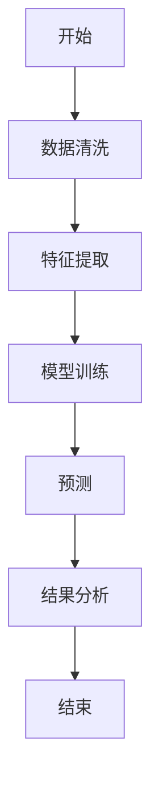

                 


# 股市估值对国际体育赞助数字化的影响

## 关键词：股市估值、国际体育赞助、数字化、经济影响、数据分析

## 摘要：本文探讨股市估值如何影响国际体育赞助的数字化，分析两者之间的关系，结合数学模型和算法，提出系统架构设计和项目实现方案，最后总结最佳实践和未来扩展方向。

---

# 第一部分: 背景介绍

## 第1章: 股市估值与国际体育赞助数字化的背景

### 1.1 问题背景与描述
#### 1.1.1 股市估值的基本概念
股市估值是衡量公司市场价值的重要指标，通常通过市盈率（P/E）、市净率（P/B）等指标计算。这些指标反映了市场的对公司未来收益的预期，影响投资者的决策。

#### 1.1.2 国际体育赞助的数字化趋势
随着科技的发展，体育赞助逐渐从传统模式向数字化转型，通过大数据分析、人工智能等技术优化赞助策略，提升赞助效率。

#### 1.1.3 问题的提出与研究意义
研究股市估值对国际体育赞助数字化的影响，有助于企业优化赞助决策，提高投资回报率，同时为体育产业的数字化转型提供理论支持。

### 1.2 核心概念与问题解决
#### 1.2.1 股市估值的核心要素
包括市盈率、市净率、股息率等，这些指标反映了公司的财务状况和市场表现。

#### 1.2.2 数字化赞助的定义与特征
数字化赞助通过数据分析和智能算法优化赞助策略，具有实时性、精准性和高效性等特点。

#### 1.2.3 问题的解决思路与方法
通过建立数学模型，分析股市估值与赞助效果之间的关系，提出优化建议。

### 1.3 概念结构与核心要素
#### 1.3.1 股市估值与体育赞助的关联性分析
股市估值反映了公司的市场价值，影响赞助商的投资决策。

#### 1.3.2 核心概念的边界与外延
明确股市估值和数字化赞助的定义和范围，避免概念混淆。

#### 1.3.3 核心要素的组成与作用
包括数据采集、模型构建、算法优化等，这些要素共同作用于赞助决策。

---

# 第二部分: 核心概念与联系

## 第2章: 股市估值与体育赞助的数字化关系

### 2.1 核心概念的原理
#### 2.1.1 股市估值的计算方法
市盈率（P/E）= 股价 / 每股收益；
市净率（P/B）= 股价 / 每股净资产。

#### 2.1.2 数字化赞助的实现方式
通过大数据分析和机器学习算法，优化赞助策略，提升赞助效果。

#### 2.1.3 两者关系的数学模型
建立数学模型，分析股市估值对赞助决策的影响，如：
$$ P(t) = \beta_0 + \beta_1 V(t) + \epsilon $$
其中，P(t)表示赞助决策，V(t)表示股市估值，ε为误差项。

### 2.2 核心概念的属性特征对比
| 属性      | 股市估值                | 数字化赞助              |
|-----------|------------------------|--------------------------|
| 定义      | 公司市场价值的评估       | 数字技术优化赞助策略    |
| 方法      | 市盈率、市净率等        | 数据分析、人工智能      |
| 目标      | 评估投资价值            | 提高赞助效率和精准度    |

### 2.3 ER实体关系图
```mermaid
er
actor(投资者, 公司, 赞助商) 
--> company(公司, 股票, 资产)
company(公司) 
<-> 股票(股票代码, 股价, 市值)
actor(投资者) 
--> 股票(购买, 卖出)
actor(赞助商) 
--> 赞助合同(赞助金额, 赞助项目, 赞助周期)
```

---

# 第三部分: 算法原理讲解

## 第3章: 数字化赞助与股市估值预测算法

### 3.1 算法原理
#### 3.1.1 数据预处理
清洗数据，处理缺失值和异常值，提取关键特征如市盈率、市净率等。

#### 3.1.2 模型选择
使用线性回归或机器学习模型，如随机森林或神经网络，预测股市估值对赞助决策的影响。

#### 3.1.3 训练与优化
通过交叉验证优化模型参数，评估模型性能，如准确率、召回率等。

### 3.2 算法流程图


### 3.3 数学模型与公式
#### 3.3.1 股价预测模型
$$ P(t) = \beta_0 + \beta_1 V(t) + \epsilon $$
其中，$$V(t)$$表示股市估值，$$\epsilon$$为误差项。

---

# 第四部分: 系统分析与架构设计

## 第4章: 数字化赞助系统的架构设计

### 4.1 系统功能设计
#### 4.1.1 数据收集模块
收集股市数据和赞助合同信息，进行数据清洗和特征提取。

#### 4.1.2 数据分析模块
使用机器学习算法分析数据，预测股市估值对赞助决策的影响。

#### 4.1.3 可视化模块
展示分析结果，帮助用户优化赞助策略。

### 4.2 系统架构设计


### 4.3 系统接口设计
定义RESTful API接口，如：
- POST /api/train：训练模型。
- GET /api/predict：获取预测结果。

---

# 第五部分: 项目实战

## 第5章: 数字化赞助系统的实现

### 5.1 环境安装
安装Python、Pandas、Scikit-learn等库，配置开发环境。

### 5.2 系统核心实现源代码
```python
import pandas as pd
from sklearn.linear_model import LinearRegression

# 数据加载
data = pd.read_csv('data.csv')

# 特征与目标变量分离
X = data[['市盈率', '市净率']]
y = data['赞助金额']

# 模型训练
model = LinearRegression()
model.fit(X, y)

# 预测
predicted = model.predict(X)
```

### 5.3 代码应用解读与分析
解读代码功能，分析模型训练和预测过程，优化模型参数，提升预测精度。

### 5.4 实际案例分析
以具体公司为例，分析股市估值对赞助决策的影响，验证模型的有效性。

---

# 第六部分: 总结与扩展

## 第6章: 最佳实践与未来方向

### 6.1 最佳实践 tips
- 数据收集要全面，避免偏差。
- 定期更新模型，适应市场变化。
- 注重数据安全，保护隐私。

### 6.2 项目小结
总结项目实现过程，强调股市估值对数字化赞助的影响，提出优化建议。

### 6.3 未来拓展方向
探讨更复杂模型的应用，如深度学习，提升预测精度。

---

# 结语

股市估值对国际体育赞助数字化的影响是一个复杂的系统工程，需要结合金融知识和先进技术。通过本文的分析和实践，读者可以深入理解其内在逻辑，并应用于实际工作中。

---

# 作者：AI天才研究院/AI Genius Institute & 禅与计算机程序设计艺术 /Zen And The Art of Computer Programming

