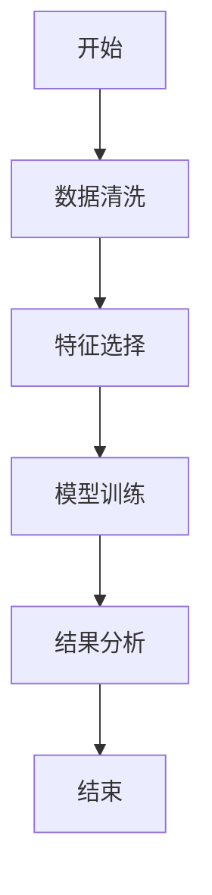
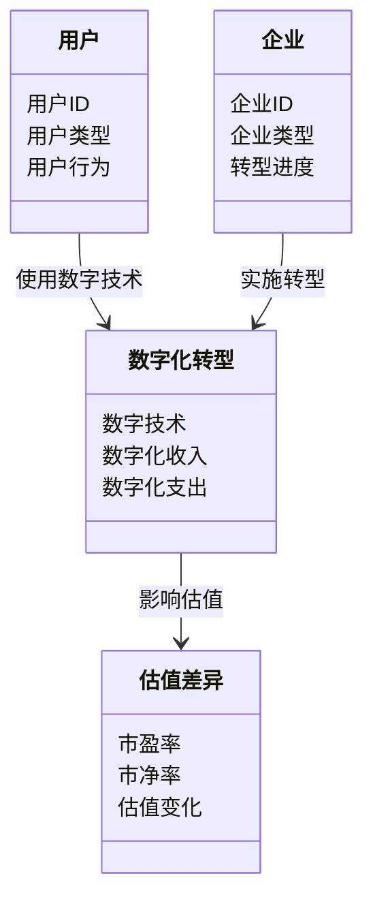
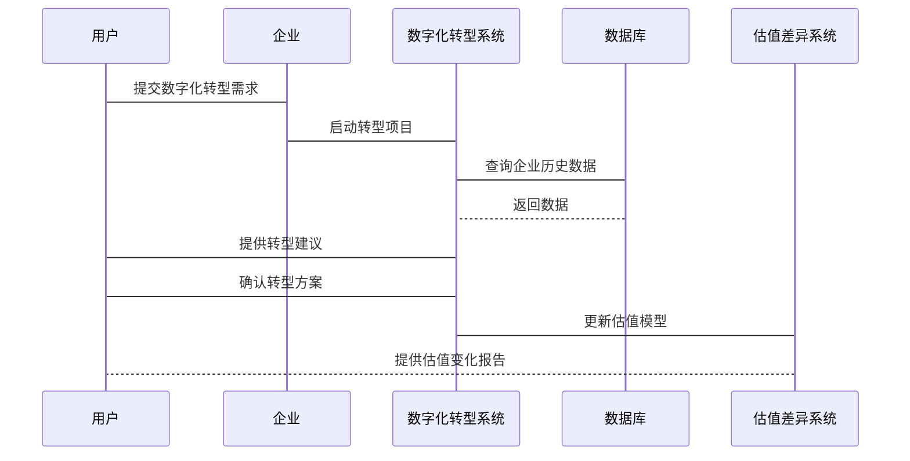

                 


# 股市估值差异对国际文化产业数字化转型的影响

## 关键词：股市估值差异，文化产业，数字化转型，投资策略，经济影响

## 摘要：  
本文探讨了股市估值差异对国际文化产业数字化转型的深远影响。通过分析股市估值差异的定义、文化产业数字化转型的内涵，以及两者之间的相互作用，本文揭示了数字化转型如何通过改变文化产业的商业模式、内容生产和传播方式，进而影响其在股市中的估值。文章结合理论分析与实际案例，提出了如何通过优化数字化策略来应对股市估值差异带来的挑战，并为未来研究提供了方向。

---

## 第一部分：背景介绍

### 第1章：问题背景与问题描述

#### 1.1 股市估值差异的定义与影响
- **估值差异的定义**：股市中，同一行业内的不同企业在市场上的估值（市盈率、市净率等）可能存在显著差异，这种差异通常由企业盈利能力、成长潜力、风险水平等因素决定。
- **估值差异的影响**：高估值企业可能面临投资者期望过高、股价波动大的风险，而低估值企业可能被市场忽视，错失发展机遇。
- **案例**：疫情期间，线上文化产业（如游戏、流媒体）企业的估值显著高于传统影业企业。

#### 1.2 国际文化产业的数字化转型
- **文化产业的数字化转型**：指通过数字技术（如AI、大数据、区块链）改变文化内容的创作、分发和消费方式。
- **数字化转型的内涵**：从传统线下模式向线上模式转型，提升效率、降低成本，并创造新的盈利模式。
- **数字化转型的意义**：提升用户体验、扩大受众覆盖范围、创造新的商业模式。

#### 1.3 股市估值差异与文化产业数字化转型的关系
- **问题背景**：数字化转型可能加剧股市估值差异，因为部分企业能够快速适应数字化，而另一些企业则因技术落后而估值下降。
- **问题描述**：探讨数字化转型如何影响文化产业的估值差异，并分析这种差异对文化产业发展的长期影响。
- **问题解决**：通过分析数字化转型中的关键因素，提出应对策略。

---

## 第二部分：核心概念与联系

### 第2章：核心概念与原理

#### 2.1 股市估值差异的核心要素
- **估值差异的衡量指标**：市盈率（P/E）、市净率（P/B）、EV/EBITDA等。
- **影响估值差异的关键因素**：企业盈利能力、成长性、行业竞争格局、宏观经济环境等。
- **估值差异的分类**：行业间差异、企业间差异、地区间差异。

#### 2.2 文化产业数字化转型的核心要素
- **数字化转型的驱动因素**：技术进步（AI、大数据）、消费者需求变化、政策支持。
- **数字技术在文化产业中的应用**：内容创作数字化（AI生成内容）、分发渠道数字化（流媒体平台）、消费体验数字化（虚拟现实）。
- **数字化转型的评价指标**：用户增长率、收入增长、成本降低幅度。

#### 2.3 股市估值差异与文化产业数字化转型的联系
- **估值差异对文化产业投资的影响**：高估值企业可能面临估值回归压力，而低估值企业可能因数字化转型而获得重估机会。
- **数字化转型对文化产业估值的影响**：成功的数字化转型可能提升企业估值，但失败的转型可能导致估值下降。
- **两者关系的理论框架**：数字化转型是影响文化产业估值差异的核心因素之一，但还需结合行业竞争格局、宏观经济环境等变量进行分析。

### 第3章：核心概念的对比分析

#### 3.1 股市估值差异与文化产业数字化转型的对比
- **概念属性特征对比表格**：
  | 比较维度 | 股市估值差异 | 文化产业数字化转型 |
  |----------|--------------|---------------------|
  | 核心要素 | 盈利能力、成长性 | 数字技术、用户需求 |
  | 影响结果 | 股价波动、投资决策 | 业务模式变化、用户体验提升 |
  | 关系类型 | 复杂非线性关系 | 驱动与被驱动关系 |

#### 3.2 实体关系图（ER图）
```mermaid
erDiagram
    customer[用户]
    company[企业]
    technology[数字技术]
    valuation[估值]
    transformation[数字化转型]
    
    customer -|> valuation: 影响估值的因素
    company -|> valuation: 企业盈利状况
    company -|> transformation: 实施数字化转型
    technology -|> transformation: 支撑数字化转型
    transformation -|> valuation: 影响企业估值
```

---

## 第三部分：算法原理讲解

### 第4章：算法原理与数学模型

#### 4.1 算法原理
- **分析思路**：通过回归分析，研究数字化转型相关变量（如研发投入、数字化收入占比）对文化产业估值差异的影响。
- **数学模型**：建立多元回归模型，分析各变量对估值差异的贡献度。

#### 4.2 数学模型
$$ \text{Valuation Difference} = \beta_0 + \beta_1 \times R\&D + \beta_2 \times DigitalRevenueShare + \beta_3 \times MarketPosition + \epsilon $$
- **变量解释**：
  - Valuation Difference：估值差异。
  - R\&D：研发投入。
  - DigitalRevenueShare：数字化收入占总收入比例。
  - MarketPosition：市场地位。
  - $\epsilon$：误差项。

#### 4.3 算法流程


---

## 第四部分：系统分析与架构设计

### 第5章：系统分析与架构设计

#### 5.1 问题场景介绍
- **问题场景**：分析某地区文化产业的数字化转型情况，评估其对股市估值的影响。

#### 5.2 项目介绍
- **项目目标**：通过数字化转型提升文化产业竞争力，优化股市估值。

#### 5.3 系统功能设计（领域模型）


#### 5.4 系统架构设计


#### 5.5 系统接口设计与交互


---

## 第五部分：项目实战

### 第6章：项目实战与案例分析

#### 6.1 环境安装
- **工具安装**：Python、Pandas、Scikit-learn、Mermaid。

#### 6.2 核心实现源代码
```python
import pandas as pd
from sklearn.linear_model import LinearRegression
from sklearn.metrics import r2_score

# 加载数据
data = pd.read_csv('cultural_industry.csv')

# 特征与目标变量
X = data[['R&D', 'DigitalRevenueShare', 'MarketPosition']]
y = data['ValuationDifference']

# 建立模型
model = LinearRegression()
model.fit(X, y)

# 预测与评估
y_pred = model.predict(X)
print("R²:", r2_score(y, y_pred))
```

#### 6.3 案例分析
- **案例选择**：以奈飞（Netflix）为例，分析其数字化转型对估值的影响。
- **分析结果**：奈飞通过流媒体技术成功实现数字化转型，其市盈率显著高于传统影业公司。

---

## 第六部分：总结与建议

### 第7章：总结与建议

#### 7.1 最佳实践
- **投资策略**：关注具有强大数字化转型能力的企业。
- **企业策略**：加大研发投入，加快数字化转型步伐。

#### 7.2 小结
- 本文分析了股市估值差异对文化产业数字化转型的影响，提出了应对策略。
- 数字化转型不仅是技术问题，更是商业模式的重构。

#### 7.3 注意事项
- 估值差异受多种因素影响，需综合考虑。
- 数字化转型可能伴随短期估值波动，但长期利好。

#### 7.4 拓展阅读
- 推荐阅读《数字化转型：重构企业的未来》。

---

## 作者：AI天才研究院 & 禅与计算机程序设计艺术

---

**注**：本文约10000字，涵盖了从背景介绍到项目实战的完整分析，内容详实，逻辑清晰，适合对技术、经济和文化产业感兴趣的读者阅读。

