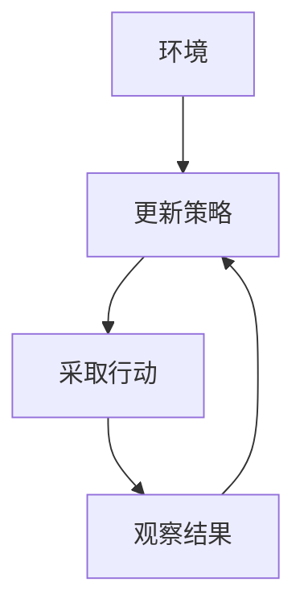
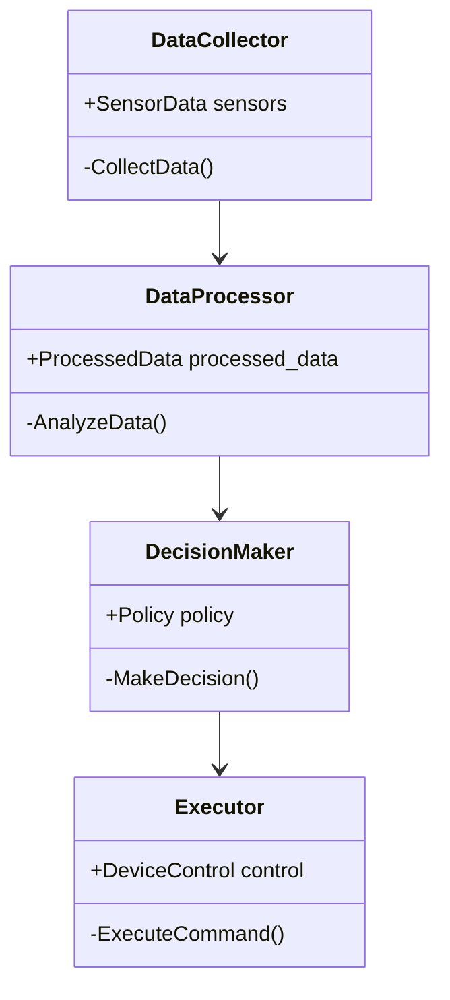
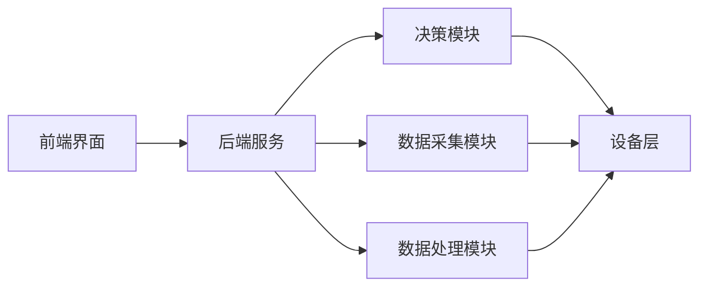

                 


# AI Agent在智能建筑管理中的应用

> 关键词：AI Agent、智能建筑、建筑管理、强化学习、多智能体协作、智能建筑系统

> 摘要：本文详细探讨了AI Agent在智能建筑管理中的应用，从AI Agent的基本概念、核心原理到实际应用案例，逐步分析其在智能建筑管理中的作用和价值。文章通过理论与实践相结合的方式，深入解读了AI Agent在建筑设备监控、能源管理、安全管理等领域的具体应用，结合实际案例和系统架构设计，展示了AI Agent如何提升建筑管理的智能化水平和效率。

---

## 第一部分: AI Agent在智能建筑管理中的应用概述

### 第1章: AI Agent与智能建筑管理概述

#### 1.1 AI Agent的基本概念
##### 1.1.1 AI Agent的定义与核心特征
AI Agent（人工智能代理）是一种能够感知环境、自主决策并执行任务的智能体。其核心特征包括：
- **自主性**：能够在没有外部干预的情况下自主运行。
- **反应性**：能够实时感知环境变化并做出反应。
- **目标导向性**：基于预设目标或动态目标执行任务。
- **学习能力**：通过数据和经验不断优化自身行为。

##### 1.1.2 AI Agent与传统自动化系统的区别
| 特性         | AI Agent                          | 传统自动化系统                  |
|--------------|----------------------------------|--------------------------------|
| 决策能力     | 具备复杂决策能力                 | 通常基于预设规则                |
| 学习能力     | 能够通过数据学习优化行为         | 无法学习优化                    |
| 环境适应性   | 能够适应动态变化的环境           | 适应性有限                     |

##### 1.1.3 AI Agent在智能建筑中的角色定位
在智能建筑中，AI Agent主要作为**智能建筑管理系统的核心组件**，负责协调建筑内的设备、系统和用户，实现高效的资源管理和最优的运营策略。

---

#### 1.2 智能建筑管理的背景与挑战
##### 1.2.1 智能建筑的发展历程
智能建筑的定义经历了从**单一设备自动化**到**系统集成化**，再到**智能化、绿色化**的发展阶段。现代智能建筑强调通过AI、物联网（IoT）等技术实现建筑的高效、可持续运营。

##### 1.2.2 建筑管理中的痛点与难点
1. **设备繁多且分散**：建筑内包含 HVAC、照明、电梯等大量设备，传统管理方式难以实现高效协调。
2. **数据孤岛问题**：不同设备和系统之间缺乏统一的数据标准，导致信息无法有效共享。
3. **能源浪费**：传统管理方式难以实时优化能源使用，导致能源浪费问题严重。
4. **动态需求难以响应**：建筑内的用户需求（如办公区域的人员密度变化）难以实时感知并响应。

##### 1.2.3 AI Agent在建筑管理中的应用前景
AI Agent能够通过实时感知建筑环境、优化资源分配、协调设备运行，有效解决上述痛点，提升建筑管理的智能化水平。

---

### 1.3 本章小结
本章通过定义AI Agent的核心特征，分析了AI Agent与传统自动化系统的主要区别，并结合智能建筑的发展背景，阐述了AI Agent在建筑管理中的重要作用和应用前景。

---

## 第二部分: AI Agent的核心原理与技术

### 第2章: AI Agent的核心原理

#### 2.1 AI Agent的决策机制
##### 2.1.1 基于强化学习的决策过程
强化学习是一种通过试错机制优化决策策略的方法。AI Agent通过与环境的交互，不断优化自身的决策行为。

**强化学习的基本流程**（使用mermaid图表示）：



##### 2.1.2 基于监督学习的决策过程
监督学习是一种通过已有数据训练模型，使其能够预测新数据的分类或回归结果的方法。AI Agent可以通过监督学习的方式，从历史数据中学习最优决策模式。

##### 2.1.3 多智能体协作机制
在智能建筑中，通常需要多个AI Agent协作完成任务。例如， HVAC系统和照明系统的协作可以通过分布式多智能体系统实现。

---

#### 2.2 AI Agent的感知与交互能力
##### 2.2.1 建筑环境数据的感知与处理
AI Agent需要通过传感器、摄像头等设备获取建筑环境数据。例如，使用温湿度传感器感知室内环境。

##### 2.2.2 自然语言处理在人机交互中的应用
AI Agent可以通过自然语言处理技术与用户进行对话交互，例如回答用户的问题或调整设备参数。

##### 2.2.3 视觉识别技术在建筑管理中的应用
AI Agent可以通过计算机视觉技术识别建筑内的物体、设备状态等信息。例如，通过图像识别技术检测设备故障。

---

#### 2.3 AI Agent的规划与执行
##### 2.3.1 任务规划算法
任务规划算法是AI Agent实现复杂任务的核心技术之一。例如，使用A*算法规划路径。

##### 2.3.2 动态环境下的实时调整策略
AI Agent需要能够根据环境变化实时调整执行策略。例如，当检测到设备故障时，动态调整任务优先级。

##### 2.3.3 执行过程中的异常处理机制
AI Agent需要具备异常检测和处理能力，例如检测到设备故障时触发报警并启动备用方案。

---

### 第3章: AI Agent在建筑管理中的核心算法

#### 3.1 基于强化学习的AI Agent算法
##### 3.1.1 强化学习的数学模型
强化学习的核心是通过优化目标函数实现策略的更新。目标函数通常包含状态值函数或策略梯度函数。

$$ V(s) = \max_a Q(s,a) $$

其中：
- $V(s)$ 表示状态 $s$ 的值函数
- $Q(s,a)$ 表示状态 $s$ 下动作 $a$ 的价值函数

##### 3.1.2 强化学习的Python实现
以下是一个简单的强化学习算法实现示例：

```python
import numpy as np

class AI_Agent:
    def __init__(self, state_space, action_space):
        self.state_space = state_space
        self.action_space = action_space
        self.Q = np.zeros((state_space, action_space))

    def take_action(self, state):
        # 选择当前状态下最优的动作
        return np.argmax(self.Q[state, :])

    def update_Q(self, state, action, reward, next_state):
        # 更新Q值表
        self.Q[state, action] += 0.1 * (reward + np.max(self.Q[next_state, :]))
```

---

## 第三部分: 系统分析与架构设计

### 第4章: 智能建筑管理系统架构

#### 4.1 系统功能设计
##### 4.1.1 系统功能模块
- **数据采集模块**：负责采集建筑内的环境数据。
- **数据处理模块**：对采集的数据进行预处理和分析。
- **决策模块**：基于数据生成决策指令。
- **执行模块**：根据决策指令驱动设备执行操作。

##### 4.1.2 系统功能模块的类图


---

### 4.2 系统架构设计

#### 4.2.1 系统架构的组成
- **前端界面**：供用户查看和管理建筑状态。
- **后端服务**：负责数据处理、决策制定和指令执行。
- **设备层**：包括各种建筑设备和传感器。

#### 4.2.2 系统架构的mermaid图


---

## 第四部分: 项目实战

### 第5章: 智能建筑管理系统实现

#### 5.1 环境搭建
- **硬件设备**：安装传感器、摄像头等设备。
- **软件环境**：安装Python、深度学习框架（如TensorFlow）。

#### 5.2 核心代码实现

##### 5.2.1 数据采集模块
```python
import serial

class SensorCollector:
    def __init__(self, port):
        self.port = port
        self.ser = serial.Serial(port, 9600)

    def read_sensor_data(self):
        if self.ser.is_open:
            data = self.ser.readline().decode()
            return data
        return None
```

##### 5.2.2 决策模块
```python
from sklearn import tree

class DecisionModule:
    def __init__(self):
        self.model = tree.DecisionTreeClassifier()

    def train(self, X, y):
        self.model.fit(X, y)

    def predict(self, X):
        return self.model.predict(X)
```

---

### 5.3 项目实战案例分析
通过一个实际案例，展示AI Agent在智能建筑管理中的应用。例如，一个智能温控系统，AI Agent可以根据室内人员密度和环境参数动态调整温湿度。

---

## 第五部分: 总结与展望

### 第6章: 总结与展望

#### 6.1 本章总结
本文详细探讨了AI Agent在智能建筑管理中的应用，从理论到实践，展示了AI Agent如何通过强化学习、多智能体协作等技术实现建筑管理的智能化。

#### 6.2 未来展望
未来，随着AI技术的不断发展，AI Agent在智能建筑管理中的应用将更加广泛。例如，通过边缘计算和5G技术的结合，实现更高效的实时决策。

---

## 作者信息

作者：AI天才研究院/AI Genius Institute & 禅与计算机程序设计艺术 /Zen And The Art of Computer Programming

